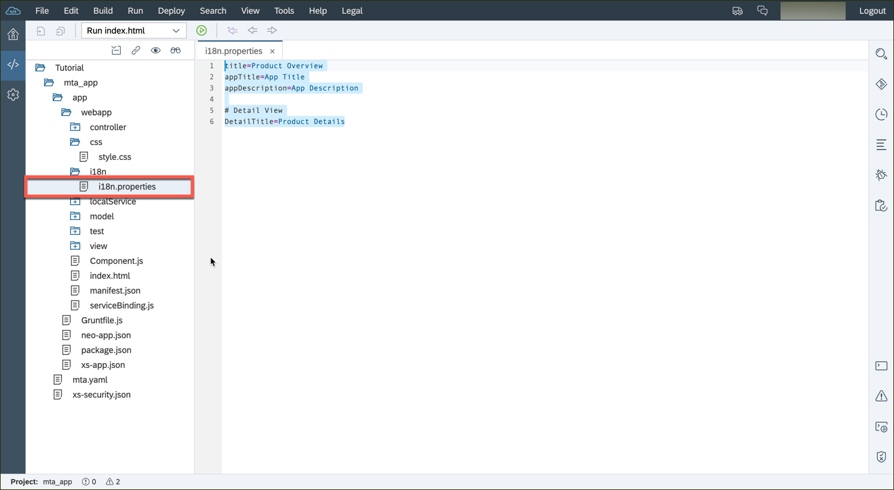
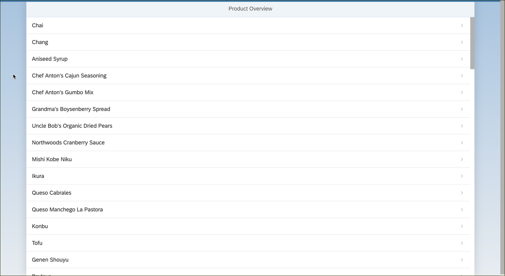
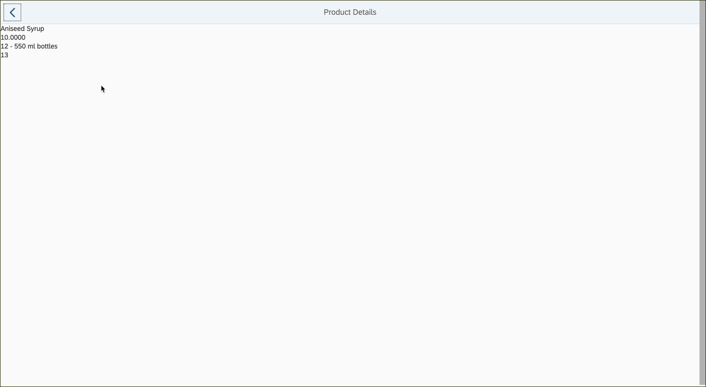

## Prerequisites  
 - **Proficiency:** Beginner 

 - **Web IDE** If you don't have the Web IDE open, follow these steps: [Enable and open the HANA Cloud Platform Web IDE](https://go.sap.com/developer/tutorials/sapui5-webide-open-webide.html)

 - **Tutorials:** This tutorial is part of a series.  The previous tutorial is part 6: [Display List Details](https://go.sap.com/developer/tutorials/sapui5-webide-display-list-details.html)

## Next Steps
 - The next tutorial is Step 8: [Improve the list and detail view](https://go.sap.com/developer/tutorials/sapui5-webide-upgrade-detail-view.html)

## Details
### You will learn  
Set proper titles to `View1` and `Detail` page by updating the resource model (aka i18n model).  

### Time to Complete
**5 Minutes**.

---

1.  Open the `webapp/i18n/i18n.properties` file, and update the entire with the following lines.

    ```
    title=Product Overview
    appTitle=App Title
    appDescription=App Description
    
    # Detail View
    DetailTitle=Product Details
    ```

	 

2.  Run your application.  The title on both the list screen and the detail screen should match the i18n file.

	 

	 


## Next Steps
 - The next tutorial is Step 8: [Improve the list and detail view](https://go.sap.com/developer/tutorials/sapui5-webide-upgrade-detail-view.html)

##Additional Information
- [Data-binding](http://help.sap.de/saphelp_uiaddon10/helpdata/en/91/f0f3cd6f4d1014b6dd926db0e91070/content.htm)
- [Internationalization (i18n)](http://help.sap.com/saphelp_hanaplatform/helpdata/en/b6/d1a9511f994b3a86e2f34a32e40a34/content.htm)

