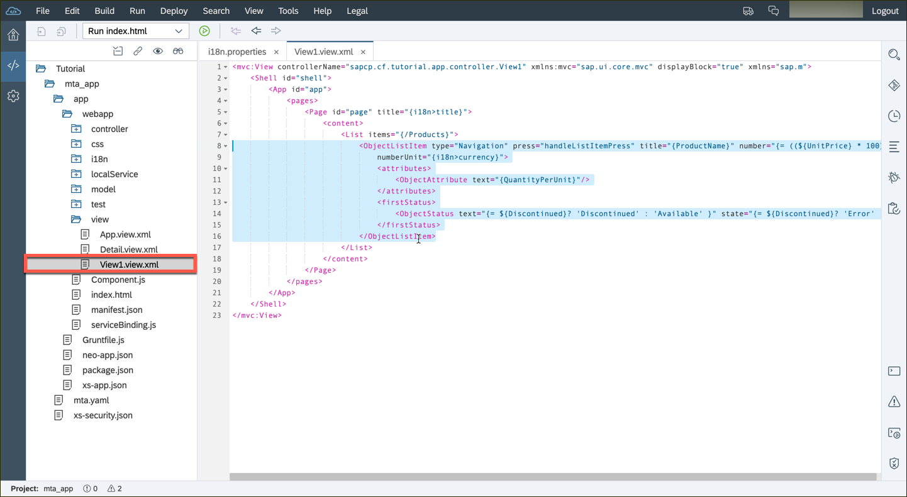
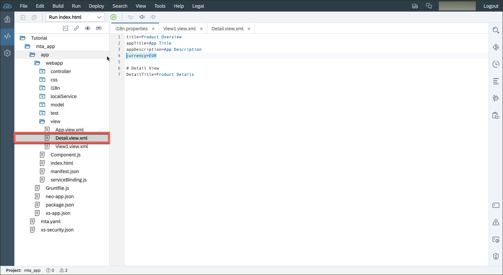
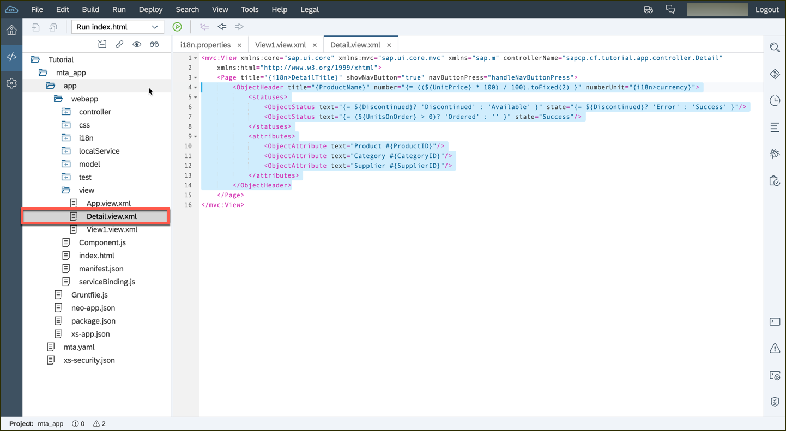
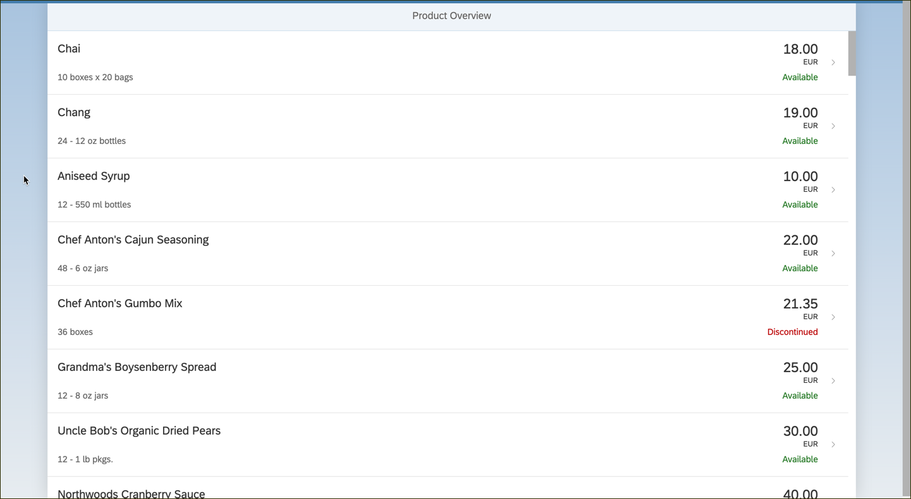
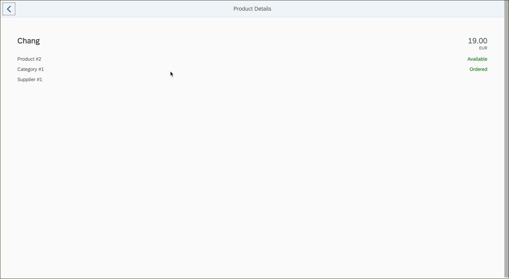

## Prerequisites  
 - **Proficiency:** Beginner 
 - **Tutorials:** This tutorial is part of a series.  The previous tutorial is Part 7 [Update Internationalization](https://go.sap.com/developer/tutorials/sapui5-webide-update-internationalization.html)

## Next Steps
 - The next tutorial is Part 9: [Add a search field](https://go.sap.com/developer/tutorials/sapui5-webide-add-search.html)

## Details
### You will learn  
In this exercise you will replace a couple of controls; one in the `View1` and the other in the `Detail` view. In the Master view, rather than the simple flat list item style presented by the `<StandardListItem>` control that is in use currently, you will present the overview of the products in a more appealing way by using the `<ObjectListItem>` control.

In the Detail view, you will make a similar change, replacing the simple layout (currently afforded by the `<VBox>` control) with a more readable display thanks to the `<ObjectHeader>` control. Along the way you will add one more property to the i18n model (“currency”).

### Time to Complete
**10 Minutes**.

---

1.  Open the `webapp/view/View1.view.xml` file, and replace the `<StandardListItem>` control with the following code:

    ```xml
    <ObjectListItem type="Navigation"
                    press="handleListItemPress"
                    title="{ProductName}"
                    number="{= ((${UnitPrice} * 100) / 100).toFixed(2) }"
                    numberUnit="{i18n>currency}" >
    	<attributes>
    		<ObjectAttribute text="{QuantityPerUnit}" />
    	</attributes>
    	<firstStatus>
    		<ObjectStatus text="{= ${Discontinued}? 'Discontinued' : 'Available' }"
                          state="{= ${Discontinued}? 'Error' : 'Success' }" />
    	</firstStatus>
    </ObjectListItem>
    ```
    
    
  
2.  Open the file `webapp/i18n/i18n.properties`, and add a placeholder for the EURO currency:

    ```
    currency=EUR
    ```
    
    
  
3.  Open the `webapp/view/Detail.view.xml`, and replace the `<VBox>` element with this code:

    ```xml
    <ObjectHeader title="{ProductName}"
	              number="{= ((${UnitPrice} * 100) / 100).toFixed(2) }"
	              numberUnit="{i18n>currency}" >
		<statuses>
			<ObjectStatus text="{= ${Discontinued}? 'Discontinued' : 'Available' }"
		                  state="{= ${Discontinued}? 'Error' : 'Success' }" />
			<ObjectStatus text="{= (${UnitsOnOrder} > 0)? 'Ordered' : '' }"
		                 state="Success" />
		</statuses>
		<attributes>
			<ObjectAttribute text="Product #{ProductID}" />
			<ObjectAttribute text="Category #{CategoryID}" />
			<ObjectAttribute text="Supplier #{SupplierID}" />
		</attributes>
	</ObjectHeader>
	```

    

4.  Run your application.  The master list will now have a multi-line view:

	 

    The detail list will also have a new layout, with more information and better design:
    
	 


## Next Steps
 - The next tutorial is Part 9: [Add a search field](https://go.sap.com/developer/tutorials/sapui5-webide-add-search.html)

## Additional Information
- [Expression Binding](http://anz.mygraebe.de/new-ui5/#7)
- [`<List>` element](https://sapui5.hana.ondemand.com/explored.html#/entity/sap.m.List/samples)
- [`<ObjectHeader>` element](https://sapui5.hana.ondemand.com/explored.html#/entity/sap.m.ObjectHeader/samples)
- [`<ObjectListItem>` element](https://sapui5.hana.ondemand.com/explored.html#/entity/sap.m.ObjectListItem/samples)

