## Prerequisites  
 - **Tutorials:** [Installing and Configuring the Streaming Studio Plugin](https://developers.sap.com/tutorials/hxe-ua-streaming-plugin.html)

## Details
### You will learn
 - How to create a new streaming project
 - How to define an input stream to receive incoming events, including the field structure (schema) for the incoming events
 - How to add a filter to apply to the event stream

 In this tutorial series you will build a project using a simple Internet of Things (IoT) scenario.  The project will be designed to monitor a set of freezer units that are equipped with sensors to report temperature, power on/off events, and door open/close events. You will apply various operators to analyze and transform this data, generate alerts, and capture information in the HANA database.

---

[ACCORDION-BEGIN [Step 1: ](Create a new streaming project)]

Go to **File** > **New** > **Project...**.

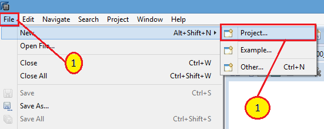

Expand **SAP HANA streaming analytics** and select **New Streaming Project**, then **Next**.

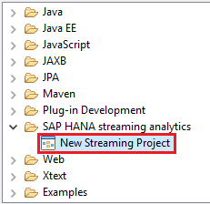

Enter `freezer_monitor` in the **Name** field (be sure to only use lowercase) and accept the default **Directory** location.

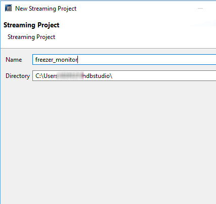

Select **Finish**.

[VALIDATE_1]

[ACCORDION-END]

[ACCORDION-BEGIN [Step 2: ](Create an Input Stream)]

All events enter a streaming project via an input stream or input window. When you create the project, it creates a default input stream called "NEWSTREAM".

Use this stream and just rename it.  Alternatively, add another input stream (or window) by dragging it from the **Palette** and dropping it onto the project diagram.
Click the icon to the left of the stream's name and change it to **MACHINEDATA**, then press **Enter**.

> Note that stream names are case-sensitive

[DONE]

[ACCORDION-END]

[ACCORDION-BEGIN [Step 3: ](Define columns for each field in the incoming events)]

Streams and windows all have a fixed set of typed columns (schema). Events arriving on a particular input stream must contain a set of fields that is compatible (number and type of fields) with the input stream.  Events with different field sets are typically processed by different input streams.

Click on the **+** to the left of **Schema** to expand it.

Select the **MACHINEDATA** element so that the toolbar appears. Choose the **Add Column** option.

Click **Add Column** three more times, so there are a total of 5 columns.

Double-click on the column name **`Column1`** and change it to **MACHINEID**.

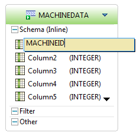

Double-click on **(INTEGER)** to the right of **MACHINEID** to change the data type for this column to string (after double-clicking, select the dropdown arrow, and choose **string**).

Change the rest of the column names and data types as follows:

> Note that column names are case-sensitive

Column Name         | Type
:----------------   | :----------------
`MACHINEID`         | `string`
`EVENT_TIME`        | `msdate`
`EVENT_NAME`        | `string`
`EVENT_DESCRIPTION` | `string`
`EVENT_VALUE`       | `string`

Your stream should look like this:

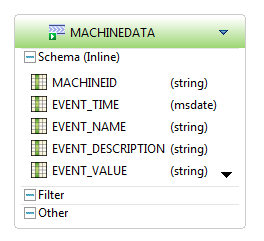

Click the **-** button to collapse the element.

> Note that you can just drag the element to a new position to organize your diagram.

[DONE]

[ACCORDION-END]

[ACCORDION-BEGIN [Step 4: ](Add a filter)]

Drag and drop the **Filter** element from the **Streams and Windows** drawer of the **Palette** onto the canvas.

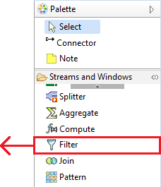

Rename the stream, `Filter1`, to **`ACTIVITY_HIST`** by clicking on the filter icon.

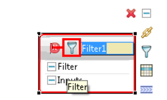

[DONE]

[ACCORDION-END]

[ACCORDION-BEGIN [Step 5: ](Connect it to an event stream)]

Select **Connector** from the **Palette**.

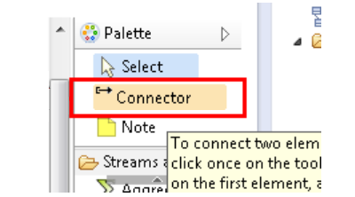

Click on the **`MACHINEDATA`** element and then on the **`ACTIVITY_HIST`** element in the visual editor to connect them. This directs the data flow from the input stream to the filter.

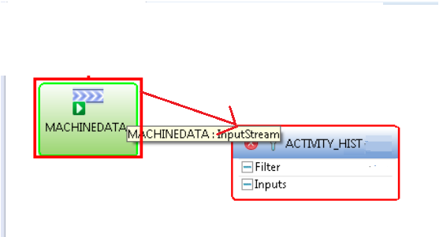

[DONE]

[ACCORDION-END]

[ACCORDION-BEGIN [Step 6: ](Define the filter criteria)]

Double-click on the **1** under **`ACTIVITY_HIST`** > **Filter** to edit the filter expression.

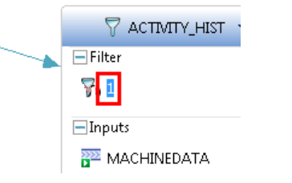

Enter `MACHINEDATA.EVENT_NAME='DOOR'` in the text field to define the filter expression.

> Note that you can use **Ctrl+Space** for content assist. Confirm your entry by pressing **Enter**.

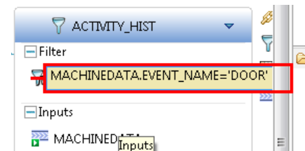

Select the **All Iconic** option (icon shown below) to collapse all the items.

[DONE]

[ACCORDION-END]
