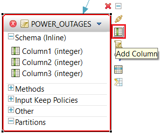
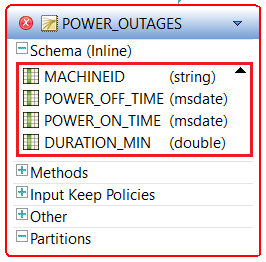
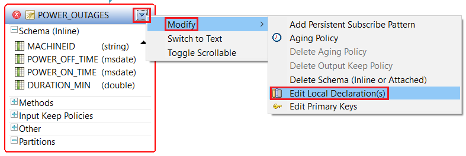
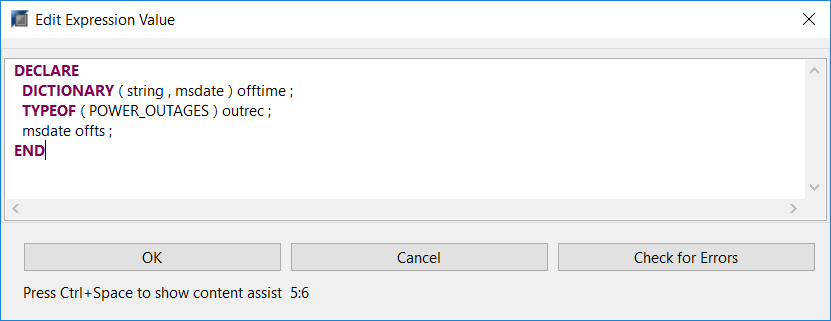
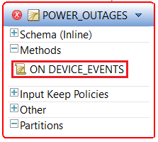
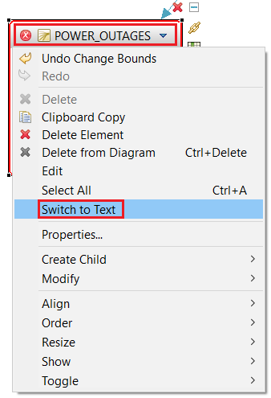

## Prerequisites
- **Tutorials:** [Watch for Patterns of Events and Generate Alerts](https://developers.sap.com/tutorials/sds-event-stream-pattern-detection.html)

## Next Steps
- **Tutorial:** [Publish events to SDS via the REST interface](https://developers.sap.com/tutorials/sds-rest-publish.html)

## Details
### You will learn  
 - How to use the Flex Operator and incoming events to update status information
 - How to match and correlate multiple events to produce a single output event
 - How to use CCL Script to write an event handler
 - How to use a DECLARE block to define data structures

---
In this tutorial you will add two Flex operators to your streaming project. Flex operators are custom operators written in CCL Script that give you the ability to do things that you couldn't do using standard relational SQL operators.  

- The first flex operator will be used to record power outages in the SAP HANA database, but the trick is that we don't want to record individual "power on" and "power off" events in the database. Instead, we prefer to have a single database record for each power outage, with the power-off time, the power-on time, and the duration.  So you will use the flex operator to match "power on" events with the earlier "power off" event for the same machine, and then create a single output event with all the information about the power outage.
- The second flex operator will update a window that shows the current status of every machine.

[ACCORDION-BEGIN [Step 1: ](Add a flex operator to your project)]

In the **SAP HANA Streaming Development** perspective, with your project open in the visual editor, drag and drop a **Flex** operator from the **Palette** to the canvas.


[DONE]

[ACCORDION-END]

[ACCORDION-BEGIN [Step 2: ](Connect the Flex operator to the event stream)]

Connect the **`DEVICE_EVENTS`** stream to the new Flex operator.


[DONE]

[ACCORDION-END]

[ACCORDION-BEGIN [Step 3: ](Rename it)]

Click the **Edit** button on the Flex operator, and rename it `POWER_OUTAGES`.


[DONE]

[ACCORDION-END]

[ACCORDION-BEGIN [Step 4: ](Add columns to define the schema)]

Click the **Add Column** button shown below four times to add four columns.



Change the column names and data types to match the screenshot provided. Double-click on a column name to edit it. To change the data type, click on the type and then select the dropdown arrow to choose the desired type.



[DONE]

[ACCORDION-END]

[ACCORDION-BEGIN [Step 5: ](Add a local declaration block)]

Via the dropdown arrow of the **`POWER_OUTAGES`** element, click **Modify** > **Edit Local Declaration(s)**. You can also press **e**.



Copy the CCL Script below.

```sql
DECLARE
  DICTIONARY ( string , msdate ) offtime ;
  TYPEOF ( POWER_OUTAGES ) outrec ;
  msdate offts ;
END
```

Paste it into the Edit Expression Value console, as seen below.



[DONE]

[ACCORDION-END]

[ACCORDION-BEGIN [Step 6: ](Add the event handler script)]

Now it's time to add the block of CCL Script that will function as an event handler:  it will be invoked on every event received on the **`DEVICE_EVENTS`** stream.

> Note that a single flex operator can have any number of input streams and input windows, and must have an "ON" clause for each input.

In the **`POWER_OUTAGES`** Flex operator, expand the **Methods** compartment and double-click on **`ON DEVICE_EVENTS`**.



Copy the CCL Script shown here and paste it into the editor.

```sql

ON DEVICE_EVENTS {
  if (DEVICE_EVENTS.EVENT_VALUE = 'Power off') {
    offtime[DEVICE_EVENTS.MACHINEID] := DEVICE_EVENTS.EVENT_TIME;
  }
  if (DEVICE_EVENTS.EVENT_VALUE = 'Power on' AND not isnull(offtime[DEVICE_EVENTS.MACHINEID])) {
    offts := offtime[DEVICE_EVENTS.MACHINEID];
    output [
      MACHINEID = DEVICE_EVENTS.MACHINEID;
      POWER_OFF_TIME = offts;
      POWER_ON_TIME = DEVICE_EVENTS.EVENT_TIME;
      DURATION_MIN = cast(double,DEVICE_EVENTS.EVENT_TIME - offts)/60000000;];
  }
 };
```
> Note: The `msdate` variable type is a timestamp with millisecond precision. The default format is `YYYY-MMDDTHH:MM:SS:SSS`. When an `msdate` is subtracted from another `msdate`, the resulting value is of type interval. The interval data type is in microseconds, hence the division by 60000000.

[VALIDATE_6]

[ACCORDION-END]

[ACCORDION-BEGIN [Step 7: ](Change the Flex operator to produce an output stream instead of a window)]

The visual editor creates this Flex operator as a window by default, but we want this to be a stream. This change isn't something you can do from the visual editor, so you need to open the CCL editor.

Right-click on the **`POWER_OUTAGES`** Flex operator and select **Switch to Text** or **F6** to switch to the CCL editor. Click **Yes** if you are asked to save your changes.



Change the **`CREATE FLEX POWER_OUTAGES`** statement to produce an **`OUTPUT STREAM`** instead of an **`OUTPUT WINDOW`**.


Here are some notes on the CCL Script used here:

1. The DECLARE block is local to this Flex operator. Global `DECLARE` blocks are also supported and would be put at the top of the CCL file; outside of any `CREATE` statement.
    - "`offtime`" is a dictionary that saves the time of the last "`POWER_OFF`" event for each machine. It will be indexed by `MACHINEID`, which is a string. Dictionaries are key/value pairs, where both the key and the value can be a simple type (a primitive such as an integer, string, or character) or a complex type (an object which may house many simple or complex data types).
    - "`outrec`" is a temporary data record structure that matches the schema of the output stream being created by this Flex operator.
2. The `ON DEVICE_EVENTS` method is executed every time an event is received from the `DEVICE_EVENTS` stream.
    - First, check the "`EVENT_VALUE`" field of the incoming event to see if it's a "`POWER_OFF`" event. If it is, then save the time of the "`POWER_OFF`" event for this MACHINEID in the dictionary.
    - Next, check to see if the incoming event is a "`POWER_ON`" event. If it is, and if there is a "`POWER_OFF`" event for this machine in the dictionary, then construct and publish an output event.
    - Anytime you publish an event from a Flex operator you have to explicitly set the "`OpCode`" of the event being produced – thus, the use of the "`setOpcode`" function.

[DONE]

[ACCORDION-END]

[ACCORDION-BEGIN [Step 8: ](Add another Flex operator - this one to track the status of all machines)]

In this step you are going to do something a bit different. You're going to add another Flex operator - but for a very different purpose. This Flex operator produces what you'll call the "Dashboard" which has current status information for each machine. Now this is just a table - there's no visualization - but it could easily be used to drive a dashboard.

The challenge is that your event stream contains different types of events on the same stream, with different uses of the "value" field. This is a common problem. But it prevents you from doing a simple aggregation or update, since one event can have a temperature reading in the value field and another event on the same stream can have "`POWER_OFF`" in the value field. So use CCL Script to create a new window called `DASHBOARD` that holds a single summary row for each machine. With each incoming event, the script examines the event and updates the relevant summary row.

- The local declare block creates a dictionary that holds the most recently received information for each machine. This dictionary starts out empty, but information is added/updated as events are received.
- The `ON DEVICE_EVENTS` method is invoked for each incoming event from the `DEVICE_EVENTS` stream. The method gets the previous set of information for the specific machine from the dictionary (if an entry for this machine exists in the dictionary). It then updates the information for this machine using the data contained in the event. Finally, it publishes an updated summary row for this machine and updates the dictionary with the current information.

With your project open in the CCL editor, copy the following CCL Script and paste it into your project (at the end).

```sql

CREATE FLEX DASHBOARD
IN DEVICE_EVENTS
OUT OUTPUT WINDOW DASHBOARD
  SCHEMA (
	MACHINEID string ,
	POWER_STATUS integer,
	CURR_TEMP float,
	MAX_TEMP float )
  PRIMARY KEY (MACHINEID)
  KEEP ALL
BEGIN
	DECLARE
	  typeof(DASHBOARD) outrec;
	  dictionary(string, typeof(DASHBOARD)) prev;
	END;
	ON DEVICE_EVENTS {
		if (not isnull(prev[DEVICE_EVENTS.MACHINEID])){
			outrec := prev[DEVICE_EVENTS.MACHINEID];
		}
		outrec.MACHINEID := DEVICE_EVENTS.MACHINEID;
		if(DEVICE_EVENTS.EVENT_NAME = 'POWER') {
			if (DEVICE_EVENTS.EVENT_VALUE = 'Power on') {
			outrec.POWER_STATUS := 0;}
			else {outrec.POWER_STATUS := 10;}
		}
		if (DEVICE_EVENTS.EVENT_NAME = 'TEMP') {
			outrec.CURR_TEMP := to_float(DEVICE_EVENTS.EVENT_VALUE);
			outrec.MAX_TEMP := to_float(DEVICE_EVENTS.MAX_TEMP);
		}
		output setOpcode(outrec,upsert);
		prev[DEVICE_EVENTS.MACHINEID] := outrec;
    } ;
END;

```
It should look like this:


[DONE]

[ACCORDION-END]

[ACCORDION-BEGIN [Step 9:](View the complete project in CCL Script)]

View the complete project in the CCL editor. You should see something like this:

```SQL

CREATE INPUT STREAM MACHINEDATA
SCHEMA (
	MACHINEID string ,
	EVENT_TIME msdate ,
	EVENT_NAME string ,
	EVENT_DESCRIPTION string ,
	EVENT_VALUE string ) ;

CREATE REFERENCE MACHINE_REF
    SCHEMA (
	MACHINEID string ,
	MACHINETYPE string ,
	MAX_TEMP decimal(4,2) ,
	MIN_TEMP decimal(4,2) ,
	LOCATION string ,
	TEMP_UNIT string )
	PRIMARY KEY ( MACHINEID )
	PROPERTIES service = 'hanadb' ,
	source = 'MACHINE_REF' ,
	sourceSchema = 'STREAMING' ;

/**@SIMPLEQUERY=FILTER*/
CREATE OUTPUT STREAM ACTIVITY_HIST
AS SELECT *
FROM MACHINEDATA
WHERE MACHINEDATA.EVENT_NAME = 'DOOR' ;

/**@SIMPLEQUERY=JOIN*/
CREATE OUTPUT STREAM DEVICE_EVENTS
AS SELECT
    MACHINEDATA.MACHINEID MACHINEID ,
	MACHINEDATA.EVENT_TIME EVENT_TIME ,
	MACHINEDATA.EVENT_NAME EVENT_NAME ,
	MACHINEDATA.EVENT_DESCRIPTION EVENT_DESCRIPTION ,
	MACHINEDATA.EVENT_VALUE EVENT_VALUE ,
	MACHINE_REF.MACHINETYPE MACHINETYPE ,
	MACHINE_REF.MAX_TEMP MAX_TEMP ,
	MACHINE_REF.MIN_TEMP MIN_TEMP ,
	MACHINE_REF.LOCATION LOCATION ,
	MACHINE_REF.TEMP_UNIT TEMP_UNIT
FROM MACHINEDATA INNER JOIN MACHINE_REF
ON MACHINEDATA.MACHINEID = MACHINE_REF.MACHINEID ;

/**@SIMPLEQUERY=AGGREGATE*/
CREATE OUTPUT WINDOW AVG_TEMP
PRIMARY KEY DEDUCED
KEEP ALL
AS SELECT
    DEVICE_EVENTS.MACHINEID MACHINEID ,
	LAST ( DEVICE_EVENTS.EVENT_TIME ) EVENT_TIME ,
	avg ( to_decimal(DEVICE_EVENTS.EVENT_VALUE, 4, 2) ) AVG_TEMP ,
	DEVICE_EVENTS.MAX_TEMP MAX_TEMP ,
	DEVICE_EVENTS.MIN_TEMP MIN_TEMP ,
	DEVICE_EVENTS.LOCATION LOCATION ,
	DEVICE_EVENTS.TEMP_UNIT TEMP_UNIT
FROM DEVICE_EVENTS KEEP 30 SEC
GROUP FILTER DEVICE_EVENTS.EVENT_NAME = 'TEMP'
GROUP BY DEVICE_EVENTS.MACHINEID ;

/**@SIMPLEQUERY=PATTERN*/
CREATE OUTPUT STREAM ALARM_POWER
AS SELECT
  A.MACHINEID MACHINEID ,
  A.EVENT_TIME EVENT_TIME ,
  A.LOCATION LOCATION ,
  'POWER' ALARM_TYPE ,
  'POWER Out for more than 20 seconds' ALARM_DESC
 FROM DEVICE_EVENTS A, DEVICE_EVENTS B
 MATCHING [ 20 SEC : A , ! B ]
 ON A.MACHINEID = B.MACHINEID
   AND 	A.EVENT_VALUE = 'Power off'
   AND B.EVENT_VALUE = 'Power on' ;

CREATE FLEX POWER_OUTAGES
IN DEVICE_EVENTS
OUT OUTPUT STREAM POWER_OUTAGES
SCHEMA (
	MACHINEID string ,
	POWER_OFF_TIME msdate ,
	POWER_ON_TIME msdate ,
	DURATION_MIN double )
BEGIN
  DECLARE
    dictionary(string, msdate) offtime;
    msdate offts;
  END;
  ON DEVICE_EVENTS {
  	if (DEVICE_EVENTS.EVENT_VALUE = 'Power off') {
  		offtime[DEVICE_EVENTS.MACHINEID] := DEVICE_EVENTS.EVENT_TIME;
  	}
  	if (DEVICE_EVENTS.EVENT_VALUE = 'Power on' AND not isnull(offtime[DEVICE_EVENTS.MACHINEID])) {
  		offts := offtime[DEVICE_EVENTS.MACHINEID];
  		output [
  			MACHINEID = DEVICE_EVENTS.MACHINEID;
  			POWER_OFF_TIME = offts;
  			POWER_ON_TIME = DEVICE_EVENTS.EVENT_TIME;
  			DURATION_MIN = cast(double,DEVICE_EVENTS.EVENT_TIME - offts)/60000000;];
  	}
  } ;
END;

/* Dashboard */
CREATE FLEX DASHBOARD
IN DEVICE_EVENTS
OUT OUTPUT WINDOW DASHBOARD
  SCHEMA (
	MACHINEID string ,
	POWER_STATUS integer,
	CURR_TEMP float,
	MAX_TEMP float )
  PRIMARY KEY (MACHINEID)
  KEEP ALL
BEGIN
	DECLARE
	  typeof(DASHBOARD) outrec;
	  dictionary(string, typeof(DASHBOARD)) prev;
	END;
	ON DEVICE_EVENTS {
		if (not isnull(prev[DEVICE_EVENTS.MACHINEID])){
			outrec := prev[DEVICE_EVENTS.MACHINEID];
		}
		outrec.MACHINEID := DEVICE_EVENTS.MACHINEID;
		if(DEVICE_EVENTS.EVENT_NAME = 'POWER') {
			if (DEVICE_EVENTS.EVENT_VALUE = 'Power on') {
			outrec.POWER_STATUS := 0;}
			else {outrec.POWER_STATUS := 10;}
		}
		if (DEVICE_EVENTS.EVENT_NAME = 'TEMP') {
			outrec.CURR_TEMP := to_float(DEVICE_EVENTS.EVENT_VALUE);
			outrec.MAX_TEMP := to_float(DEVICE_EVENTS.MAX_TEMP);
		}
		output setOpcode(outrec,upsert);
		prev[DEVICE_EVENTS.MACHINEID] := outrec;
    } ;
END;

CREATE OUTPUT WINDOW ALARM_TEMP
PRIMARY KEY DEDUCED
KEEP ALL
AS SELECT AVG_TEMP.MACHINEID MACHINEID ,
	AVG_TEMP.EVENT_TIME EVENT_TIME ,
	AVG_TEMP.LOCATION LOCATION ,
	'TEMP' ALARM_TYPE ,
	'Machine not maintaining temperature' ALARM_DESC
FROM AVG_TEMP
WHERE AVG_TEMP.AVG_TEMP > AVG_TEMP.MAX_TEMP ;

ATTACH OUTPUT ADAPTER HANA_Output1 TYPE hana_out TO ACTIVITY_HIST
PROPERTIES
	service = 'hanadb' ,
	sourceSchema = 'STREAMING' ,
	table = 'ACTIVITY_HIST' ;

```

[DONE]

[ACCORDION-END]
