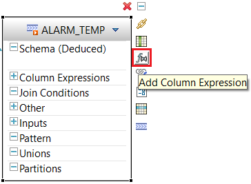
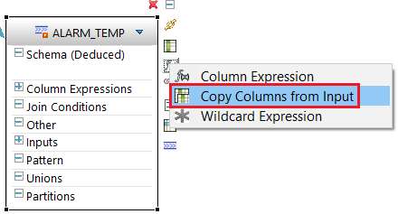
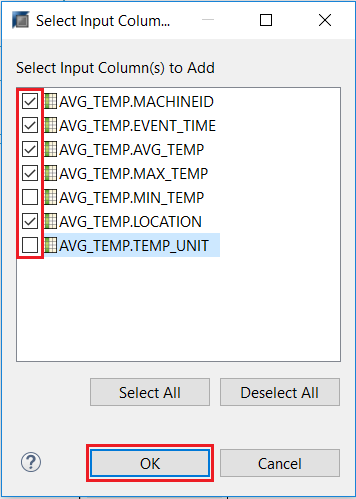
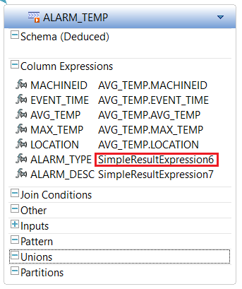
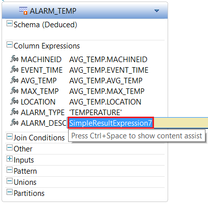
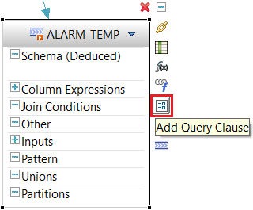
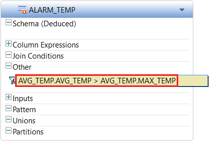
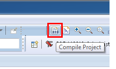

## Prerequisites
 - **Tutorials:** [Create a Moving Average on an Event Stream using an Aggregation Window](https://developers.sap.com/tutorials/sds-event-stream-moving-average.html)

## Next Steps
- **Tutorials:** [Using the Streaming Playback tool to Test a Streaming Project](https://developers.sap.com/tutorials/sds-event-stream-playback.html)

## Details
### You will learn  
 - How to use a derived window to apply a filter to watch for events that should generate an alert

---

In this tutorial, you will add and configure a derived stream that will watch for events that need to generate an alert - by applying a filter.

However, rather than just using the standard **Filter** element, you will use the **Derived Window** element from the **Palette** since it gives you more flexibility. With this, you can apply the filter and also change the structure of the output event.

At this point in the tutorial series, if you don't want to go through the process of creating this window using the visual editor, then you can simply switch to the CCL editor ( **F6** ) and paste the CCL below into your project. From there, you can then skip to the last step to compile and test your project.

```SQL

CREATE OUTPUT WINDOW ALARM_TEMP
PRIMARY KEY DEDUCED
KEEP ALL
AS SELECT
  AVG_TEMP.MACHINEID MACHINEID ,
  AVG_TEMP.EVENT_TIME EVENT_TIME ,
  AVG_TEMP.AVG_TEMP AVG_TEMP ,
  AVG_TEMP.MAX_TEMP MAX_TEMP ,
  AVG_TEMP.LOCATION LOCATION ,
  'TEMPERATURE' ALARM_TYPE ,
  'Machine not maintaining' ALARM_DESC
FROM AVG_TEMP
WHERE AVG_TEMP.AVG_TEMP > AVG_TEMP.MAX_TEMP ;

```

[ACCORDION-BEGIN [Step 1: ](Add a derived window to generate alerts)]

Click on **Derived Window** in the **Palette** and drop it onto the canvas.


[DONE]

[ACCORDION-END]

[ACCORDION-BEGIN [Step 2: ](Connect the new window to the event stream)]

Add a connector from **`AVG_TEMP`** to the new window.


[VALIDATE_2]

[ACCORDION-END]

[ACCORDION-BEGIN [Step 3: ](Change the window name)]

Change the new window name to `ALARM_TEMP`, then press **Enter**.


[DONE]

[ACCORDION-END]

[ACCORDION-BEGIN [Step 4: ](Add columns to the window)]

Click the **Add Column Expression** ( **f(x)** ) option shown below.



Choose **Copy Columns from Input** from the menu to open the column selection dialog.



Select all except for **`MIN_TEMP`** and **`TEMP_UNIT`**, then click **OK**.



Select the **Add Column Expression** ( **f(x)** ) option, then **Column Expression** to add a column to this window.


Repeat this step to add a second column.

[DONE]

[ACCORDION-END]

[ACCORDION-BEGIN [Step 5: ](Edit the column names and expressions)]

Rename the first new column to `ALARM_TYPE`, then press **Enter**.


Rename the second new column to `ALARM_DESC`.


Double-click on **`simpleResultExpression6`** to edit the expression.



Enter `'TEMPERATURE'` in the expression edit box for the **`ALARM_TYPE`** column. This will set the "type" of all alarms emitted by this window to the string "TEMPERATURE". Press **Enter** to confirm your entry.


> Note that it's important to enclose string values in single quotes in expressions.

Enter `'Machine not maintaining temperature'` in the expression edit box for the **`ALARM_DESC`** column. Press **Enter** to confirm your entry.



[DONE]

[ACCORDION-END]

[ACCORDION-BEGIN [Step 6: ](Add a filter expression)]

Now click the **Add Query Clause** button.



Choose **Filter** from the menu or press **f**.


You want to add a filter so that this window only contains rows for machines that have a current average temperature above the max specified for the machine.

Double-click on **1** under **Other** to edit the filter expression.


Change the filter expression to: `AVG_TEMP.AVG_TEMP > AVG_TEMP.MAX_TEMP`. Use **Ctrl+Space** for completion assist.



[DONE]

[ACCORDION-END]

[ACCORDION-BEGIN [Step 7: ](Compile and check for errors)]

Click the **Compile Streaming Project (F7)** button to check for errors.



> Note: You will get a compiler warning about the lack of a retention policy on the aggregate stream.  You can ignore this warning. The reason for the warning is that windows default to KEEP ALL. If you explicitly state KEEP ALL, then the compiler accepts that you meant it. If you omit an explicit KEEP policy, the compiler warns you in case it's not what you intended. Here, this is an aggregation where you are grouping by Machine ID - and you do indeed want to keep the aggregate value for every machine ID.

[DONE]

[ACCORDION-END]
