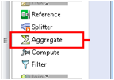
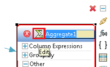
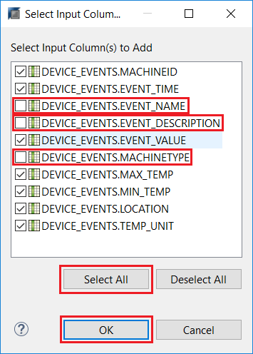
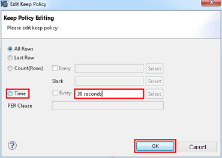
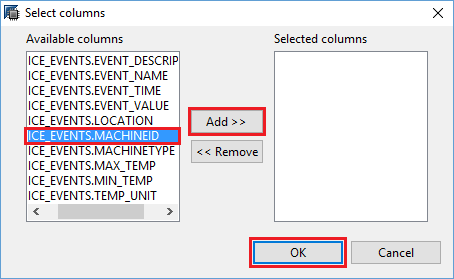
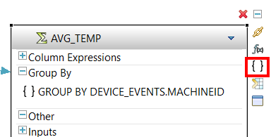
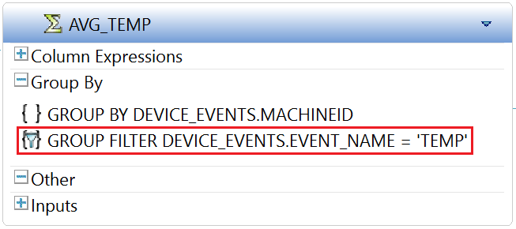
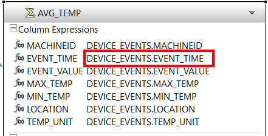
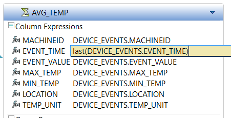
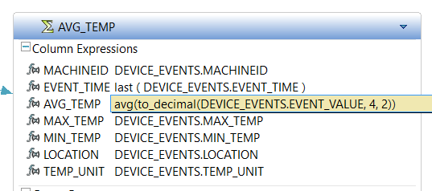

## Prerequisites  
 - **Proficiency:** Beginner
 - **Tutorials:** [Join an Event Stream to a HANA Table](http://www.sap.com)

## Next Steps
- **Tutorials:** [Generating Alerts Using a Derived Window in SAP HANA Streaming Analytics](http://www.sap.com)


## Details
### You will learn  
 - Adding aggregate window to hold multiple data entry and observe patterns.
 - Using time-based sliding event window to compute metrics and monitor trends.

### Time to Complete
**20 Min**.

---
Unlike **Streams**, which are stateless, **Windows** are like tables, holding information from one event to the next. Here we will add a aggregate window that is keyed by **`MACHINEID`**, holding a set of aggregate values for each machine.

If you want to skip the steps to add this window using the visual editor you can skip to step 8 to view the CCL and copy it into your project.


[ACCORDION-BEGIN [Step 1: ](Add an Aggregate Window to the Project)]


Click on **Aggregate** in **Streams and Windows** drawer of the **Palette** and drop it onto the canvas.



Rename the stream to `AVG_TEMP` by clicking on Aggregate symbol. Then press the **Enter** key.



[DONE]
[ACCORDION-END]

[ACCORDION-BEGIN [Step 2: ](Connect the Aggregate Window to the Event Stream)]

Select the **Connector** in the **Palette** and the click first on **`DEVICE_EVENTS`** and then on **`AVG_TEMP`** to connect them and direct the data flow.


[DONE]
[ACCORDION-END]

[ACCORDION-BEGIN [Step 3: ](Add columns to the window)]

Click Add Column Expression **f(x)** by clicking on the icon shown below.


Click the **Copy Columns from Input** menu item to execute it.


Click **Select All**. Uncheck **`DEVICE_EVENTS.EVENT_NAME`**, **`DEVICE_EVENTS.EVENT_DESCRIPTION`** and **`DEVICE_EVENTS.MACHINETYPE`**. Click **OK**.



[DONE]
[ACCORDION-END]

[ACCORDION-BEGIN [Step 4: ](Set a retention policy on the input)]

Now we will set a retention policy on the input to this aggregation. This determines the set of events we are aggregating over. In this case we'll define it by time.

Expand the **Inputs** tab and right click on **`DEVICE_EVENTS`**  and select **Keep Policy** to open a dialog box to configure the policy.


Click **Time** and enter `30 seconds` in the entry box. Click **OK**.



[DONE]
[ACCORDION-END]

[ACCORDION-BEGIN [Step 5: ](Edit the GROUP BY clause)]

To define the **GROUP BY** clause, expand the **Group By** compartment in the **`AVG_TEMP`** shape by clicking on **+**.

Double-click on **`GROUP BY unassigned_group_by`**.


Select the entry **`DEVICE_EVENTS.MACHINEID`** by clicking on it. Click **Add >>** and then click **OK**.



[DONE]
[ACCORDION-END]

[ACCORDION-BEGIN [Step 6: ](Add a GROUP FILTER)]

Now we need to add a GROUP filter, since we only want to aggregate temperature readings. This will filter out the Door open/close events and the Power on/off events before we aggregate.

Click Add Group Clause **{ }** icon shown below.



Click the **Group Filter Clause** menu item to add the group filter expression.


Double-click on **Group Filter 1**.


Enter `DEVICE_EVENTS.EVENT_NAME='TEMP'` as the filter expression in the text box. You can use **Ctrl+Space** for content assist. Confirm your entry by pressing **Enter**.



[DONE]
[ACCORDION-END]

[ACCORDION-BEGIN [Step 7: ](Edit the Column Expressions)]

Expand the **Column Expressions** tab to edit expressions.


Double-click on **`DEVICE_EVENTS.EVENT_TIME`**.



Edit the expression for **`EVENT_TIME`**. Change it to: `last(DEVICE_EVENTS.EVENT_TIME)`. This will cause the aggregate values for the group to show the event time of the last event received in the group. Confirm your entry by pressing **Enter**.



Double click the name **`EVENT_VALUE`** and rename this column to **`AVG_TEMP`** by typing in the text field. Confirm your entry by pressing **Enter**.


Double-click on the expression for **`AVG_TEMP`**, which is currently set to **`DEVICE_EVENTS.EVENT_VALUE`**.

We are now going to edit this expression to compute an average. Also, since the value field is a string, before we can compute an average, we need to convert it to a number. Change the expression to: `avg(to_decimal(DEVICE_EVENTS.EVENT_VALUE, 4, 2))`. Confirm your entry by pressing **Enter**.



[DONE]
[ACCORDION-END]

[ACCORDION-BEGIN [Step 8: ](Check your work)]

At this point you can compile to check for errors. If you switch to the CCL editor (F6 or click the **Switch to Text** button in the Eclipse toolbar), your code should look like this:

```SQL

/**@SIMPLEQUERY=AGGREGATE*/
CREATE OUTPUT WINDOW AVG_TEMP
PRIMARY KEY DEDUCED
KEEP ALL
AS SELECT
    DEVICE_EVENTS.MACHINEID MACHINEID ,
	LAST ( DEVICE_EVENTS.EVENT_TIME ) EVENT_TIME ,
	avg ( to_decimal(DEVICE_EVENTS.EVENT_VALUE, 4, 2) ) AVG_TEMP ,
	DEVICE_EVENTS.MAX_TEMP MAX_TEMP ,
	DEVICE_EVENTS.MIN_TEMP MIN_TEMP ,
	DEVICE_EVENTS.LOCATION LOCATION ,
	DEVICE_EVENTS.TEMP_UNIT TEMP_UNIT
FROM DEVICE_EVENTS KEEP 30 SEC
GROUP FILTER DEVICE_EVENTS.EVENT_NAME = 'TEMP'
GROUP BY DEVICE_EVENTS.MACHINEID ;

```

[DONE]
[ACCORDION-END]
