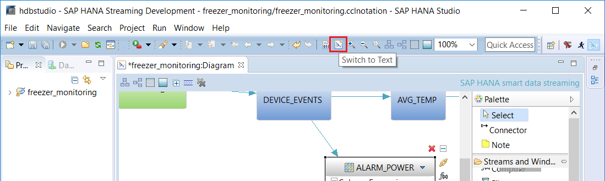

## Prerequisites  
 - **Proficiency:** Intermediate
 - **Tutorials:** [Using the Streaming Playback tool to Test a Streaming Project](https://developers.sap.com/tutorials/sds-event-stream-playback.html)

## Next Steps
 - **Tutorials:** [Build Custom Flex Operators to Analyze Event Streams](https://developers.sap.com/tutorials/sds-custom-flex-operators.html)

## Details
### You will learn  
- Use the CCL Pattern Matching operator to detect specific patterns of events
- Define the alert event that will be generated whenever the pattern is detected

### Time to Complete
**15 Min**.

---
In this example we are going to use the pattern matching operator to watch for a power outage on any machine that last for more than 20 seconds.  The machines only send simple **"Power off"** and **"Power On"** events.  So we'll use the pattern matching operator to watch for a **"Power off"** event that is **NOT** followed by a **"Power on"** event for the same machine within 20 seconds.

[ACCORDION-BEGIN [Step 1: ](Open your project in the CCL editor)]

In this tutorial we are going to work in the CCL editor. While you can create a Pattern Matching stream from the visual editor it's a bit tedious and we're guessing at this point you're probably more likely to just want to see the CCL.

If your project is open in the visual editor, click on Switch to Text button to switch to CCL Editor. You can also press **F6**.



Click **Yes** if there is a prompt to save the file.

> If your project wasn't open in any editor at this point, you can simply double-click on the `.ccl` file in the project (in the SDS Project Explorer) to open it in the `CCL` editor


[ACCORDION-END]

[ACCORDION-BEGIN [Step 2: ](Add the pattern matching stream to your project)]

Scroll down to the bottom of the CCL file and paste in the following CCL:

```sql

/**@SIMPLEQUERY=PATTERN*/
CREATE OUTPUT STREAM ALARM_POWER
AS SELECT
  A.MACHINEID MACHINEID ,
  A.EVENT_TIME EVENT_TIME ,
  A.LOCATION LOCATION ,
  'POWER' ALARM_TYPE ,
  'POWER Out for more than 20 seconds' ALARM_DESC
 FROM DEVICE_EVENTS A, DEVICE_EVENTS B
 MATCHING [ 20 SEC : A , ! B ]
 ON A.MACHINEID = B.MACHINEID
   AND 	A.EVENT_VALUE = 'Power off'
   AND B.EVENT_VALUE = 'Power on' ;
```

Now let's take a look at the CCL above to understand it:

- There's nothing unusual about the SELECT clause:  we're simply defining the structure and content of the events that will be output by this stream whenever the pattern is detected
-- note that the alias assigned in the FROM clause is used to reference the input event
-- this is important
- In this particular example, we are watching for a pattern of events on a single stream. To do this, we list the input stream multiple times in the FROM clause, assigning multiple aliases (one for each event in the pattern)
- The MATCHING clause defines the pattern of events we are watching for
-- it always starts with a time interval; every pattern must have a finite time boundary
-- in this example, we are watching for an "A" event that is **not** followed by a "B" event within 20 seconds
-- the **","** means "followed by";  we could also use "AND" or "OR" - see the CCL reference for full details
- The ON clause is used to qualify what incoming events qualify as an A event or a B event.  Events that don't qualify as an event in the pattern will be ignored
-- in this example,  any "Power off" event will qualify as an "A" event
-- and any "Power on" event will qualify as a "B" event
-- but since we are watching for the **absence** of a "Power on" event,  then in this example, if we get a "B" event with the same MACHINEID as an "A" event, within 20 seconds of the "A" event, then the "A" event will be dropped

Again, see the [SAP HANA streaming analytics,  CCL Reference guide](https://help.sap.com/viewer/608c361a786e4ec485224c890cbf1617/2.0.02/en-US/e7965d0d6f0f10149842b86fff8f915b.html) for more information on using the MATCHING clause.


[ACCORDION-END]

[ACCORDION-BEGIN [Step 3: ](Compile and check for errors)]

Click Compile Project button to check for errors.


If you want to see this new operator in action, you run the playback tool to stream the simulated data file in again (see previous tutorial).


[ACCORDION-END]
