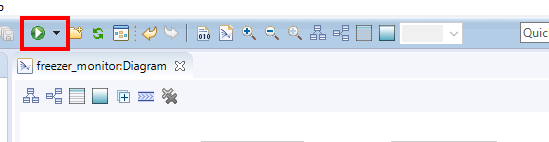
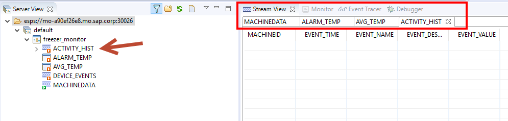
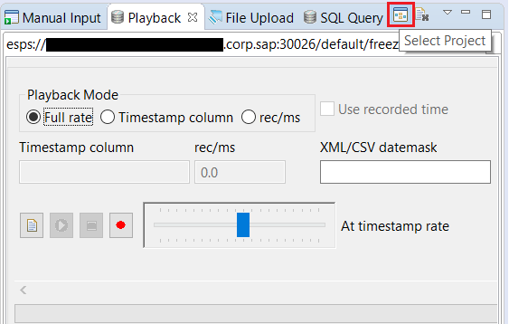
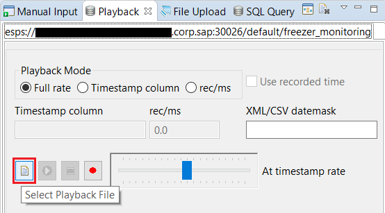
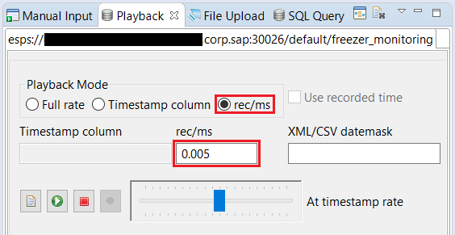
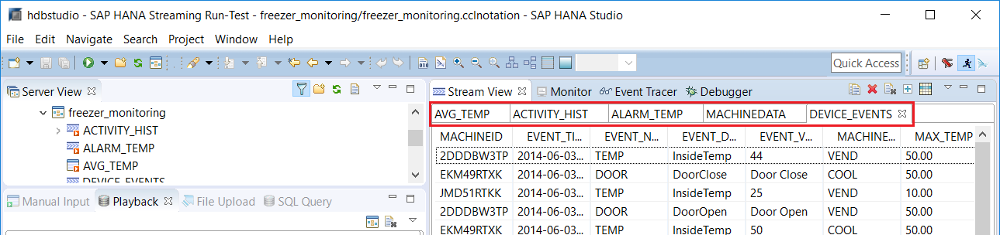

## Prerequisites
 - **Tutorials:** [Generate Alerts using a Derived Window in SAP HANA smart data streaming](https://developers.sap.com/tutorials/sds-event-stream-alerts.html)

## Next Steps
- **Tutorials:** [Watch for Patterns of Events and Generate Alerts](https://developers.sap.com/tutorials/sds-event-stream-pattern-detection.html)

## Details
### You will learn  
- How to use the Playback tool to stream captured or simulated data from a file to test your project

---
In this tutorial you will use the Playback tool to stream in simulated data from a file to test your project.  You can also use the tool to record actual data as it arrives, producing a test file for later use.

[ACCORDION-BEGIN [Step 1: ](Run the project)]

Go to the **SAP HANA Streaming Development** perspective.

From the dropdown arrow next to the **Run** button, select the streaming server to run this project.

You are switched into the **SAP HANA Streaming Run-Test** perspective if the project deploys successfully.

[DONE]

[ACCORDION-END]

[ACCORDION-BEGIN [Step 2: ](Open streams in the Stream View)]

Double-click on each of the streams in the **Server View** to open them in the **Stream View**.

[DONE]

[ACCORDION-END]

[ACCORDION-BEGIN [Step 3: ](Connect the playback tool to the project)]

Open the **Playback** tab.

Click the **Select Project** button to connect the playback tool to the current project (if you have multiple projects running, then it will ask you to choose).

[DONE]

[ACCORDION-END]

[ACCORDION-BEGIN [Step 4: ](Select the file containing the simulated data to play back)]

Download the sample data file as follows: right-click on the following link and select **Save link/target as...** [`machinedata.csv`](https://raw.githubusercontent.com/SAPDocuments/Tutorials/master/tutorials/sds-event-stream-playback/machinedata.csv).

Click the **Select Playback File** button shown below to select the data file to use.

- In the Open dialogue window, change the file type to **`.csv`**.
- Navigate to the location where you saved the sample data file that you just downloaded.
- Choose **`machinedata.csv`**,  then select **Open**.

[DONE]

[ACCORDION-END]

[ACCORDION-BEGIN [Step 5: ](Set the playback speed)]

Click the **rec/ms** radio button. You want to control the playback speed so that you can watch things happen at a reasonable pace. Once running, you can increase or decrease the playback speed using the slider tool. For now, enter `0.005` in the **rec/ms** field.

[DONE]

[ACCORDION-END]

[ACCORDION-BEGIN [Step 6: ](Start the playback and view the results)]

Next, click the **Start Playback** button, as shown below.

Navigate the **Stream View** tabs to view the output from each stream/window.

[VALIDATE_6]

[ACCORDION-END]
