## Prerequisites  
 - **Tutorials:** [Create a Streaming project with SAP HANA Streaming Analytics](https://developers.sap.com/tutorials/sds-create-streaming-project.html)


## Next Steps
 - [Run and Test a Streaming Project](https://developers.sap.com/tutorials/sds-run-test.html)

## Details
### You will learn  
How to create a table in the HANA database to store events and how to connect an output stream in your project to the database table

---

[ACCORDION-BEGIN [Step 1: ](Create a HANA Database Schema to hold the tables for your project)]

First, you need to execute a SQL statement on HANA to create a database schema where you will store your event data. In the database schema, you will also create some tables that you will use later in this tutorial.

Go to the **SAP HANA Administration Console** perspective, then the **Systems** view.

Right-click on the tenant database that you are working with, and select **Open SQL Console** to open a console that automatically connects to your system.

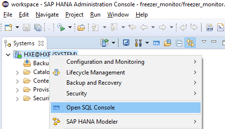

>Note: If you are following the HANA Express tutorial series to this point, the tenant database is called **HXE** by default. Don't select the System database.

Copy the code below and paste it into the newly created SQL console tab.

    ```SQL
    CREATE SCHEMA STREAMING;

    CREATE COLUMN TABLE "STREAMING"."DASHBOARD"
    (	"MACHINEID" 	VARCHAR(15) NOT NULL ,
    	"POWER_STATUS" VARCHAR(30),
    	"CURR_TEMP" 	DECIMAL(4,2),
    	PRIMARY KEY ("MACHINEID")
     );

    CREATE COLUMN TABLE "STREAMING"."MACHINE_REF"
    (	"MACHINEID" 	VARCHAR(15) NOT NULL ,
    	 "MACHINETYPE" 	VARCHAR(15),
    	 "MAX_TEMP" 	DECIMAL(4,2),
    	 "MIN_TEMP" 	DECIMAL(4,2),
    	 "LOCATION" 	VARCHAR(25),
    	 "TEMP_UNIT" 	VARCHAR(2),
    	 PRIMARY KEY ("MACHINEID")
    );

    CREATE COLUMN TABLE "STREAMING"."POWER_OUTAGES"
    (	"MACHINEID" 		VARCHAR(15),
    	"POWER_OFF_TIME" 	LONGDATE,
    	"POWER_ON_TIME" 	LONGDATE,
    	"DURATION_MIN" 	DOUBLE CS_DOUBLE
    );

    CREATE COLUMN TABLE "STREAMING"."ACTIVITY_HIST"
    (	"MACHINEID" 	VARCHAR(15),
    	 "EVENT_TIME" 	LONGDATE CS_LONGDATE,
    	 "EVENT_NAME" 	VARCHAR(15),
    	 "EVENT_DESCRIPTION" 	VARCHAR(100),
    	 "EVENT_VALUE" 	VARCHAR(25)
    );

    INSERT INTO "STREAMING"."MACHINE_REF"("MACHINEID", "MACHINETYPE", "MAX_TEMP", "MIN_TEMP", "LOCATION", "TEMP_UNIT") VALUES
    ( '2B','VEND',50,35,'WALG31','F');
    INSERT INTO "STREAMING"."MACHINE_REF"("MACHINEID", "MACHINETYPE", "MAX_TEMP", "MIN_TEMP", "LOCATION", "TEMP_UNIT") VALUES
    ( '1A','COOL',50,35,'FRI7','F');
    INSERT INTO "STREAMING"."MACHINE_REF"("MACHINEID", "MACHINETYPE", "MAX_TEMP", "MIN_TEMP", "LOCATION", "TEMP_UNIT") VALUES
    ( '4D','VEND',50,35,'JRB235','F');
    INSERT INTO "STREAMING"."MACHINE_REF"("MACHINEID", "MACHINETYPE", "MAX_TEMP", "MIN_TEMP", "LOCATION", "TEMP_UNIT") VALUES
    ( '5E','COOL',50,35,'WALG33','F');
    INSERT INTO "STREAMING"."MACHINE_REF"("MACHINEID", "MACHINETYPE", "MAX_TEMP", "MIN_TEMP", "LOCATION", "TEMP_UNIT") VALUES
    ( '3C','VEND',10,2,'BP762','C');
    INSERT INTO "STREAMING"."MACHINE_REF"("MACHINEID", "MACHINETYPE", "MAX_TEMP", "MIN_TEMP", "LOCATION", "TEMP_UNIT") VALUES
    ( '6F','FREEZE',32,0,'HIN88','F');
    INSERT INTO "STREAMING"."MACHINE_REF"("MACHINEID", "MACHINETYPE", "MAX_TEMP", "MIN_TEMP", "LOCATION", "TEMP_UNIT") VALUES
    ( '7G','VEND',50,35,'ORD311','F');
    ```
Execute the SQL script by pressing the **Execute** button (in the toolbar of the SQL console).

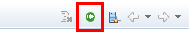

Check the HANA database catalog in the **SAP HANA Administration Console** to confirm that the schema has been created and contains the following tables:

- `DASHBOARD`
- `MACHINE_REF`
- `POWER_OUTAGES`
- `ACTIVITY_HIST`

The table **`MACHINE_REF`** should have 7 rows of data.

[VALIDATE_1]

[ACCORDION-END]

[ACCORDION-BEGIN [Step 2: ](Connect the output stream to the database table)]
Next, you are going to capture `DOOR_OPEN` and `DOOR_CLOSE` events in the `ACTIVITY_HIST` HANA database table to track the activity for each of your freezer units.  You already have a filter in your project that isolates the door events from all other events.  Now you just need to connect the output stream to the database table.  You do this by adding a HANA output adapter to your project.

First, switch to the **SAP HANA Streaming Development** perspective.

Select **HANA Output** from the **Output Adapters** drawer in the **Palette** and drag it onto the canvas.  Use the small scroll bar at the bottom of the **Palette** drawer if you need to scroll down (see screenshot below).

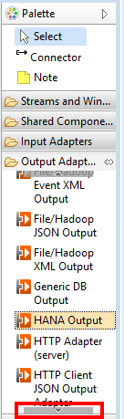

Select the **Edit Properties** option next to the new `HANA_Output1` element to edit the adapter properties.

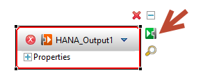

To set the schema property, select the value field beside "Target Database Schema Name", then hit the discovery button:


Set the target schema to STREAMING and select **OK**.

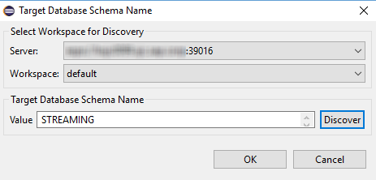

Set the Target Database Table Name to **`ACTIVITY_HIST`**.

Now the adapter properties should all be set as follows:

Property                    | Value
:------------------------ | :----------------
Database Service Name       | `hanadb`
Target Database Schema Name | `STREAMING`
Target Database Table Name  | `ACTIVITY_HIST`
>Note that your database service name is unique to your environment.

Now select the **Connector** tool, as seen below.

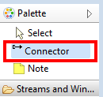

Connect the adapter to the **`ACTIVITY_HIST`** stream by clicking the **`ACTIIVTY_HIST`** stream, then the **`HANA_Output1`** adapter.

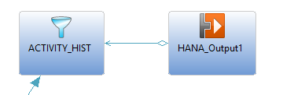

[DONE]

[ACCORDION-END]

[ACCORDION-BEGIN [Step 3: ](Compile and check for errors)]

In the **SAP HANA Streaming Development** perspective, click the **Compile Streaming Project (F7)** button shown below.

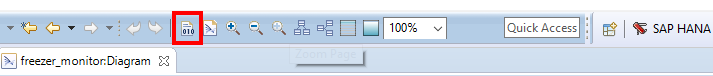

Check the **Problems** view to see if the project compiled without errors.

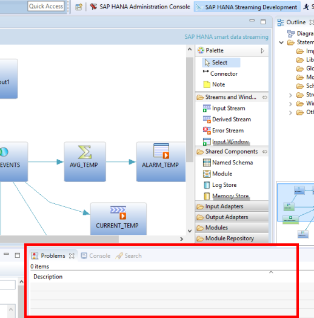

If you can spot the compile error in the **Problems** view, go ahead and fix it.  Sometimes it's easier to find and fix an error in the CCL editor.  You can view the underlying CCL for the project by switching to the CCL editor (see the step below for details).

[DONE]

[ACCORDION-END]

[ACCORDION-BEGIN [Step 4: ](Check your project in the CCL editor)]

All streaming projects are defined in a variation of SQL called **CCL**.  So far you've been working entirely in the visual editor.  However, you can also create, edit, and view projects in the CCL editor.  

To switch to the CCL editor, either click on the **Switch to Text** button in the Eclipse toolbar, or press **F6**.

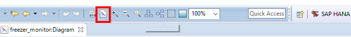

Compile your project.


Any line with an error is flagged. If there are errors, then hover over an error flag to read the error message (or read it in the **Problems** view).

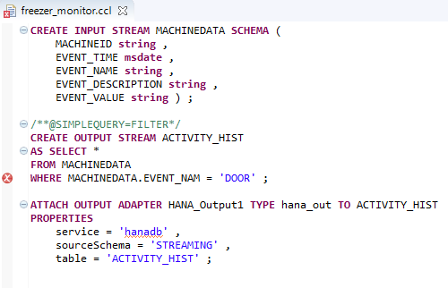

At this point, your CCL code should look like this:

```SQL
CREATE INPUT STREAM MACHINEDATA
SCHEMA (
	MACHINEID string ,
	EVENT_TIME msdate ,
	EVENT_NAME string ,
	EVENT_DESCRIPTION string ,
	EVENT_VALUE string ) ;

/**@SIMPLEQUERY=FILTER*/
CREATE OUTPUT STREAM ACTIVITY_HIST
AS SELECT *
FROM MACHINEDATA
WHERE MACHINEDATA.EVENT_NAME = 'DOOR' ;

ATTACH OUTPUT ADAPTER HANA_Output1 TYPE hana_out TO ACTIVITY_HIST
PROPERTIES
	service = 'hanadb' ,
	sourceSchema = 'STREAMING' ,
	table = 'ACTIVITY_HIST' ;
```

[DONE]

[ACCORDION-END]
