## Prerequisites  
 - **System:** You must have an SAP HANA SPS10 system or higher with smart data streaming installed that you can connect to and use.
 - **Integrated Development Environment:** You must have SAP HANA Studio 2 installed with the streaming plug-in installed and configured.
 - This tutorial assumes you will be using the HANA SYSTEM user to connect to your HANA system and will refer to it as "SYSTEM".

## Details
### You will learn
 - Connecting to a SAP HANA system.
 - Setting up the SAP HANA Streaming Development and Run perspective.
 - Connecting to a streaming server in SAP HANA Studio.
 - Adding and configuring a SAP HANA data service.

---

[ACCORDION-BEGIN [Step 1: ](Connect to a SAP HANA System)]    

1. Open HANA Studio. In the **SAP HANA Administration Console** perspective, right click in the white space within the **Systems** view. Next select the **Add System...** menu item to execute it. You can also press **s**.

    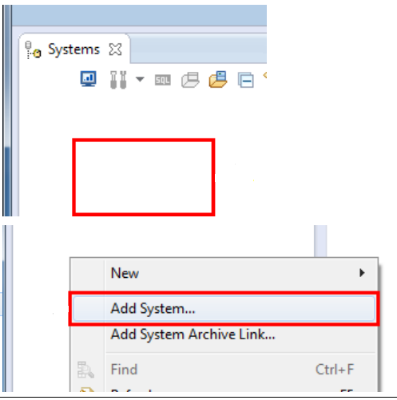

2. Enter the Host Name and the Instance Number of the HANA server you will connect to.

    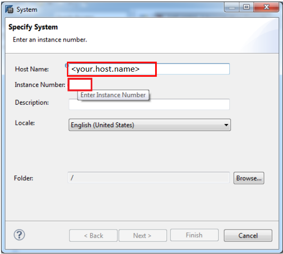

3. Click **Next**. You can also press **Alt+n**.

    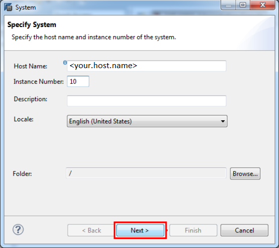

4. Enter `SYSTEM` as the **User Name** and enter your password.

    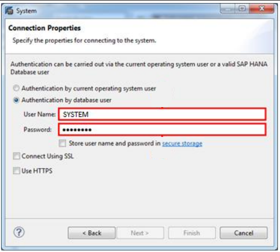

5. Click the **Store user name and password in secure storage** checkbox so you won't have to re-enter
your credentials when re-connecting to the system. Next click **Finish** or press **Alt+f**.

    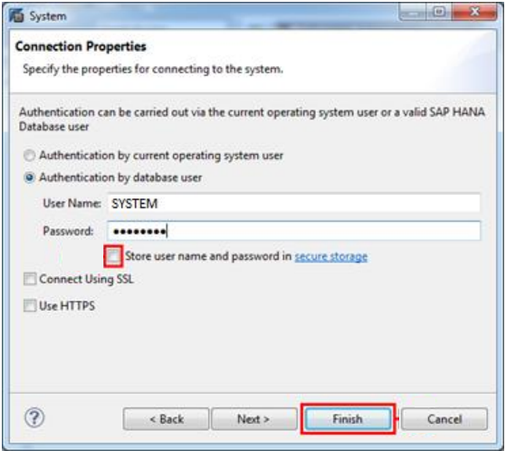

[DONE]

[ACCORDION-END]

[ACCORDION-BEGIN [Step 2: ](Open Streaming Perspective)]    

1. Go to **Windows** > **Perspective** > **Open Perspective** and click the **Other...** menu item to execute it. You can also press **o**.

    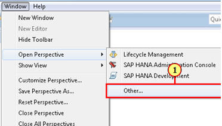

2. Select the **SAP HANA Streaming Development** entry by clicking it.

    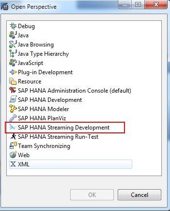

3. Click **OK**.

4. Repeat for the **SAP HANA Streaming Run-Test** perspective entry.

    

[VALIDATE_1]

[ACCORDION-END]

[ACCORDION-BEGIN [Step 3: ](Create Server Connection in SAP HANA Streaming Development Perspective)]    

1. Go to the **SAP HANA Streaming Run-Test** perspective.

    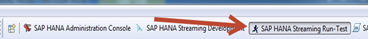

2. In the **Server** view, select the **New Server URL** tool.

    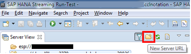

3. Now you will connect to the streaming server (Not the HANA database server). Enter the host name in the **Host Name** field. The **Port** number has the format `3XX26` (XX = Instance Number. e.g. If your Instance Number is "10" then you would enter "31026" for port). Obtain these from your system administrator.

    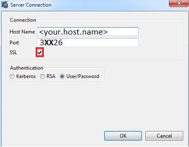

    NOTE: This is the host name and port for the streaming server, not the HANA database server.
    Make sure to check the **SSL** checkbox as the server uses SSL for encryption.

4. You should now see the streaming server listed in the **Server** view. Right click it and select **Change User Name and Password**.

    

5. Enter the streaming server's credentials and check **Use Secure Storage for Streaming Credentials**. Press **OK** to continue.

    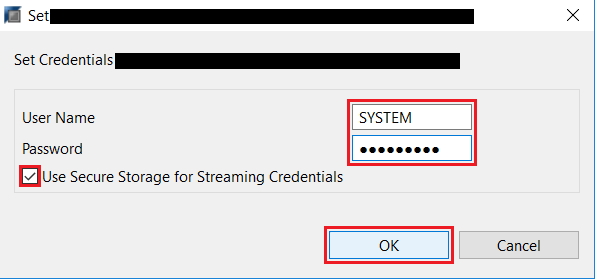

6. Right click your streaming server listed in the **Server** view again. Then select **Connect Server**.

    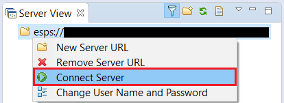

7. Now go to HANA Studio's **Preferences** under the **Windows** menu. Then go to the **SAP HANA Smart Data Streaming** tab.

    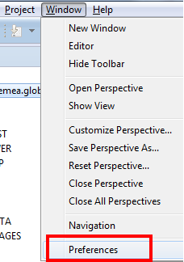

8. Set the **Default Server URL** to your server `<server.address>:<port>`. The server address is the Smart Data Streaming server node, not the HANA server node. The port number should be in the format of "3XX26", where XX is the Instance Number.

    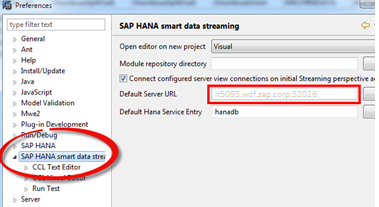

[DONE]

[ACCORDION-END]

[ACCORDION-BEGIN [Step 4: ](Configure HANA Data Service)]    

1. Click **SAP HANA Streaming Development** tab to open this perspective.

    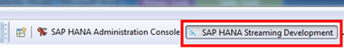

2. Click the **Data Services** tab to open this view. This is normally tucked behind the **Projects** view.

    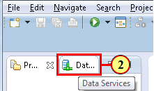

3. Go to your connected streaming host by double clicking it and right click on your **Server-wide** folder.

    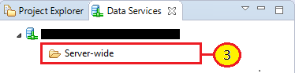

4. Click the **Add HANA Service** menu item to execute it.

    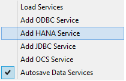

5. Click on **`newservice1`** to select it.

    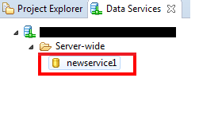

6. Go to the **Properties** view, which should be located on the bottom half of the studio by default. Enter the username and password corresponding to the HANA database you wish to connect to and check **Use Default HANA Server**.

    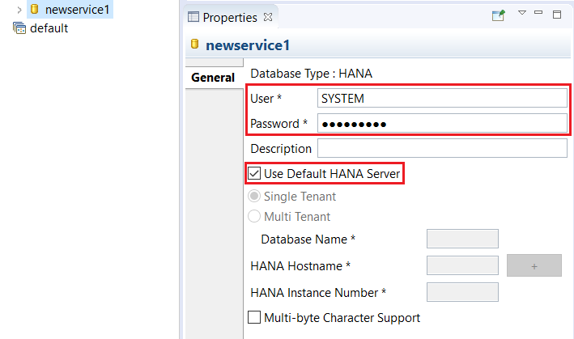

7. Rename the service. Right click on **`newservice1`** in the **Data Services** view and select **Rename Service**. Change the name to `freezermon_service`.

    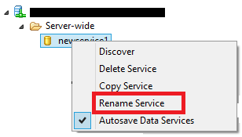

8. To verify that the service is properly configured, right click again on the **`freezermon_service`** service, and select **Discover**. When the service is correctly configured, executing the **Discover** operation will display the database schema that is accessible through the service.

    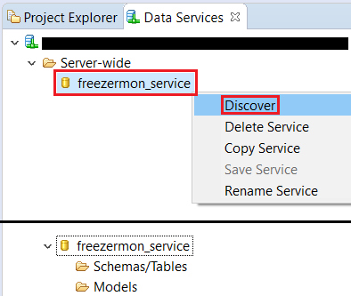

[DONE]

[ACCORDION-END]
