## Prerequisites  
 - **Tutorials:** [Configure SAP HANA Smart Data Streaming Server Connection](https://developers.sap.com/tutorials/sds-part1-configure-streaming-server.html)

## Details
### You will learn  
 - Creating a new streaming project: a project contains one or more input streams/windows and then directs the flow of data through continuous queries and/or custom operators, publishing output events via adapters.
 - Defining an input stream to receive incoming events: All incoming events enter a project via an input stream or input window. The schema of the input stream (or window) defines the fields that events on that stream will (or may) contain.


---

[ACCORDION-BEGIN [Step 1: ](Create a New Streaming Project)]    

1. Click the **File** menu. You can also press **Alt+f**. Then click the **New** > **Project...**. You can also press **r**.

    

2. Click **New Streaming Project**, then click **Next**.

    

3. Enter `freezer_monitoring` in the **Name** box (be sure and only use lower case) and accept the default **Directory** location.

    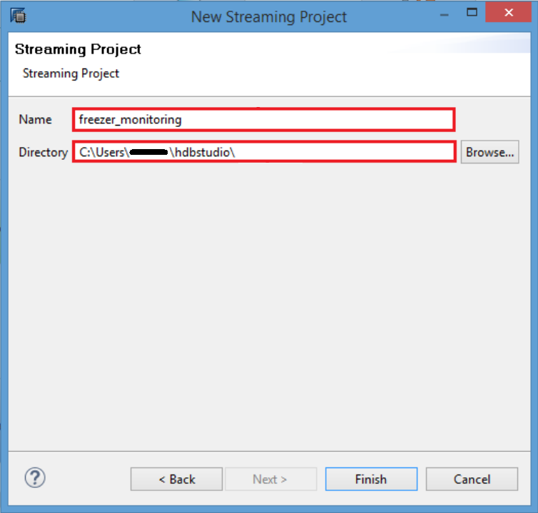

4. Click **Finish**. You can also press **Alt+f**.

    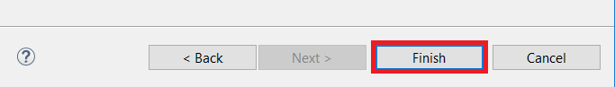

[DONE]

[ACCORDION-END]

[ACCORDION-BEGIN [Step 2: ](Create the Required SAP HANA Tables)]    

1. Go to **SAP HANA Administration Console** perspective, then **Systems** view. Right click the system you are working with.

    

2. Select **Open SQL Console** menu item to open a console that will automatically connect to your system.

    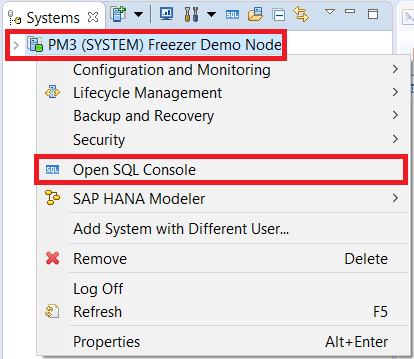

3. Select the newly created SQL console tab. The tab window will have the title in the format of **`<Your System Name> - SQL Console <Window Number>`**

    

4. Copy the code below into the SQL window.

    ```sql
    --These are the SQL commands to set up the back-end tables for the Freezer Monitoring hands-on exercise.

    CREATE COLUMN TABLE "SYSTEM"."ACTIVITY_HIST"
    (	"MACHINEID"			VARCHAR(15),
    	"EVENT_TIME"		TIMESTAMP,
    	"EVENT_NAME"		VARCHAR(20),
    	"EVENT_DESCRIPTION"	VARCHAR(30),
    	"EVENT_VALUE"		VARCHAR(30)
    );

    CREATE COLUMN TABLE "SYSTEM"."DASHBOARD"
    (	"MACHINEID" 	VARCHAR(15) NOT NULL ,
    	"POWER_STATUS" VARCHAR(30),
    	"CURR_TEMP" 	DECIMAL(4,2),
    	PRIMARY KEY ("MACHINEID")
     );

    CREATE COLUMN TABLE "SYSTEM"."MACHINE_REF"
    (	"MACHINEID" 	VARCHAR(15) NOT NULL ,
    	 "MACHINETYPE" 	VARCHAR(15),
    	 "MAX_TEMP" 	DECIMAL(4,2),
    	 "MIN_TEMP" 	DECIMAL(4,2),
    	 "LOCATION" 	VARCHAR(25),
    	 "TEMP_UNIT" 	VARCHAR(2),
    	 PRIMARY KEY ("MACHINEID")
    );

    CREATE COLUMN TABLE "SYSTEM"."POWER_OUTAGES"
    (	"MACHINEID" 		VARCHAR(15),
    	"POWER_OFF_TIME" 	LONGDATE,
    	"POWER_ON_TIME" 	LONGDATE,
    	"DURATION_MIN" 	DOUBLE CS_DOUBLE
    );

    INSERT INTO "SYSTEM"."MACHINE_REF"("MACHINEID", "MACHINETYPE", "MAX_TEMP", "MIN_TEMP", "LOCATION", "TEMP_UNIT") VALUES
    ( '2DDDBW3TP','VEND',50,35,'WALG31','F');
    INSERT INTO "SYSTEM"."MACHINE_REF"("MACHINEID", "MACHINETYPE", "MAX_TEMP", "MIN_TEMP", "LOCATION", "TEMP_UNIT") VALUES
    ( 'EKM49RTXK','COOL',50,35,'FRI7','F');
    INSERT INTO "SYSTEM"."MACHINE_REF"("MACHINEID", "MACHINETYPE", "MAX_TEMP", "MIN_TEMP", "LOCATION", "TEMP_UNIT") VALUES
    ( 'RB82KMY3S','VEND',50,35,'JRB235','F');
    INSERT INTO "SYSTEM"."MACHINE_REF"("MACHINEID", "MACHINETYPE", "MAX_TEMP", "MIN_TEMP", "LOCATION", "TEMP_UNIT") VALUES
    ( '4CBH7792RN','COOL',50,35,'WALG33','F');
    INSERT INTO "SYSTEM"."MACHINE_REF"("MACHINEID", "MACHINETYPE", "MAX_TEMP", "MIN_TEMP", "LOCATION", "TEMP_UNIT") VALUES
    ( 'JMD51RTKK','VEND',10,2,'BP762','C');
    INSERT INTO "SYSTEM"."MACHINE_REF"("MACHINEID", "MACHINETYPE", "MAX_TEMP", "MIN_TEMP", "LOCATION", "TEMP_UNIT") VALUES
    ( 'GGR23RTXK','FREEZE',32,0,'HIN88','F');
    INSERT INTO "SYSTEM"."MACHINE_REF"("MACHINEID", "MACHINETYPE", "MAX_TEMP", "MIN_TEMP", "LOCATION", "TEMP_UNIT") VALUES
    ( '8HRT4WX2','VEND',50,35,'ORD311','F');

    ```

5. Execute the SQL script by pressing the **Execute** button.

    

6. Confirm that they executed correctly. You should have these tables.

    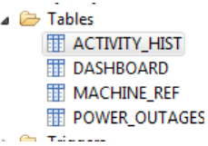

7. Check to see that all tables created are empty except for **`MACHINE_REF`** which will have 7 rows of data.

    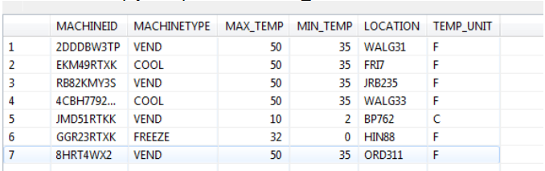

[VALIDATE_1]

[ACCORDION-END]

[ACCORDION-BEGIN [Step 3: ](Create an Input Stream)]    

1. When you created the project, it created an input stream called "NEWSTREAM" by default.

    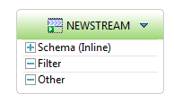

2. Click the icon to the left of the name **NEWSTREAM** and change the name of this stream to **MACHINEDATA**, then press **Enter** key.

    

3. Click on the **+** to the left of Schema to expand it.

    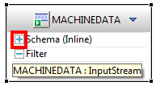

4. Now hover the cursor over the right edge of the **MACHINEDATA** shape so that the toolbar appears. Click on the **Add Column** tool.

    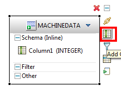

5. Repeat step 5 three more times, so there are a total of 5 columns.

    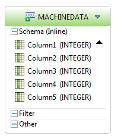

6. Double click on the name **`Column1`** and change the name of this column to **MACHINEID**.

    

7. Double click on **(INTEGER)** to the right of **MACHINEID** to change the datatype for this column to string. (after double clicking, click the drop down arrow, and select **string**)

    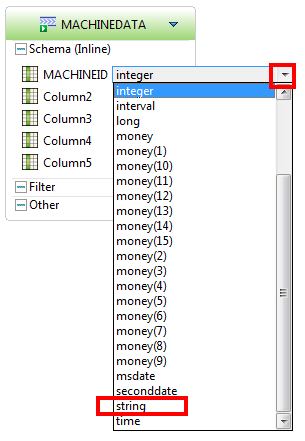

8. Change the rest of the column names and data types as shown:

    

9. Click here **-**  to collapse the shape.

    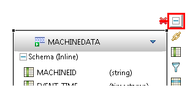

    Note: You can just drag the shape to a new position to organize our diagram.

    

[DONE]

[ACCORDION-END]
