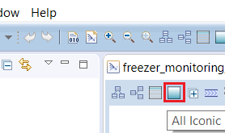
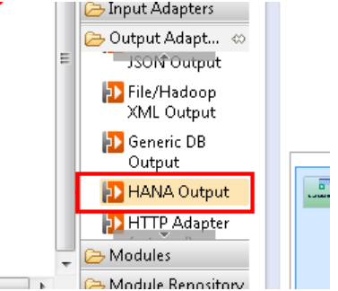
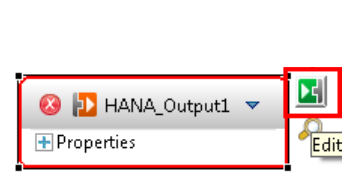
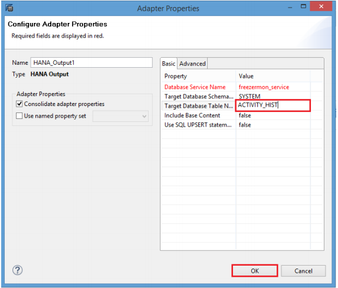
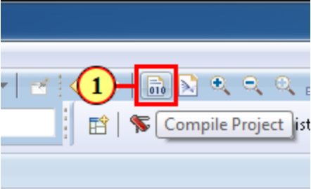

## Details
### You will learn  
 - Applying a filter to only capture events of interest. Filters match each event against the defined criteria, only passing those that match.
 - Adding a HANA Output adapter to connect the filtered stream to a HANA table, capturing the events in the HANA database.
 - Compiling the streaming project and check for errors.

---

[ACCORDION-BEGIN [Step 1: ](Add a Filter)]    

1. Drag and drop the **Filter** item in the **Streams and Windows** drawer of the **Palette** into the canvas.

    

2. Rename the stream, **`Filter1`**, to `ACTIVITY_HIST` by clicking on the filter icon.

    

3. Select **Connector** from the **Palette**.

    

4. Drag the Connector from **`MACHINEDATA`** to **`ACTIVITY_HIST`** in order to connect them.

    

5. Double-click on the **1** under **`ACTIVITY_HIST`** > **Filter** to edit the filter expression.

    

6. Enter `MACHINEDATA.EVENT_NAME='DOOR'` in the text box to define the filter expression. User **Ctrl+Space** for content assist. Confirm your entry by pressing the **Enter** key.

    

7. Click on the All Iconic button (icon shown below) to collapse all the items.

    

[VALIDATE_1]

[ACCORDION-END]

[ACCORDION-BEGIN [Step 2: ](Capture Events in HANA Table)]    

1. Select **HANA Output** from the **Palette** and drag it to the canvas.

    

2. Click on the Edit icon to edit the Adapter Properties.

    

3. Select the **`freezermon_service`** data service for **Database Service Name**. Select the entry **Target Database Schema Name** by clicking it and click on **...**.

    

4. Enter the name of the HANA database schema you will be using in the **Value** box. We have created our tables in `SYSTEM`, so use that. Then click **OK**.

    

5. Enter `ACTIVITY_HIST` in the **Target Database Table Name** text box and press **Enter** key. Then click **OK**.

    

6. Now use the **Connector** tool to connect the adapter to the **`ACTIVITY_HIST`** stream. Select the connector tool, click on the **`ACTIIVTY_HIST`** stream, then click on the **`HANA_Output1`** adapter.

    

[DONE]

[ACCORDION-END]

[ACCORDION-BEGIN [Step 3: ](Compile and Check for Errors)]    

1. Click the Compile Project icon shown below.

    

2. Check the **Problems** view to see if the project compiled without errors.

    

[DONE]

[ACCORDION-END]
