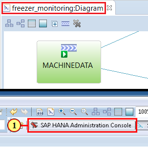
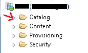
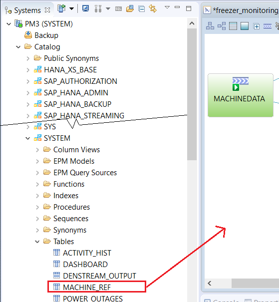
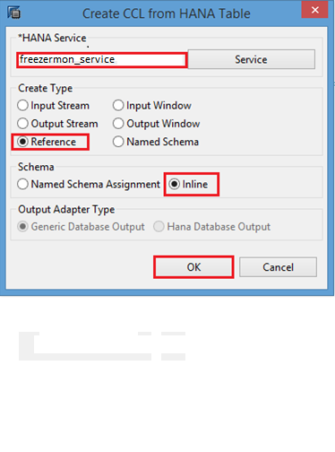
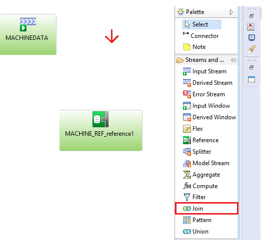
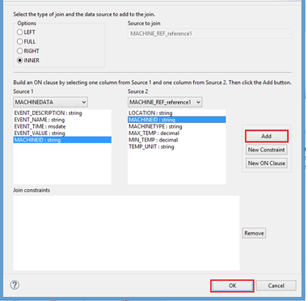

## Details
### You will learn  
 - How to add a HANA Reference element to the project
 - How to join event streams to SAP HANA tables in order to enrich raw event data
 - How to filter and analyzing data based on context or historical information from HANA

---

[ACCORDION-BEGIN [Step 1: ](Add HANA Reference Element)]    

1. This is a continuation from part 3 of this tutorial group. Before proceeding, please make sure that `"freezer_monitoring"` project is opened and the project diagram is the active tab in HANA Studio. If not, go to **File** > **Open File...** to open the project. Navigate to the **SAP HANA Administration Console** perspective.

    

2. Open the **Catalog** for the HANA system in the HANA **Systems** view.

    

3. Open the "SYSTEM" schema and drag then drop the table **`MACHINE_REF`** onto the canvas.

    

    Note: if you don't see the tables you have created, try right clicking the schema and selecting **Refresh**. Make sure to use the same schema you create the table with before. In this case, you are using SYSTEM.

4. Select **Reference**, **Inline** and then click **OK**.

    

5. Change the name of the reference element to `MACHINE_REF` by clicking on the icon shown below.

    

[VALIDATE_1]

[ACCORDION-END]

[ACCORDION-BEGIN [Step 2: ](Join Event Stream To The HANA Table)]    

1. Click **Join** in the **Palette** and drop it onto the canvas.

    

2. Select the **Connector** tool. (Tip: press **Shift** key while performing the action. This will keep it selected for adding multiple connections)

    

3. First click on **`MACHINEDATA`** and then **`Join1`** to connect them.

    

4. Now add a connection from **`MACHINE_REF`** to **`Join1`**.

    

5. Click **Select** in the **Palette** to release the Connector tool (or press **ESC**).

    

6. Rename **`Join1`** to `DEVICE_EVENTS` and press **Enter** key.

    

7. Hover over the **`DEVICE_EVENTS`** shape so that the toolbar appears and then click the **f(x)** (Add Column Expression) icon shown below.

    

8. Click the **Copy Columns from Input** menu item to execute it. You can also press **c**.

    

9. Click **Select All** or you can also press **Alt+s**. Uncheck the 2nd MACHINEID field that is named **`MACHINE_REF.MACHINEID`** (we don't want it twice) and then click **OK**.

    

10. Now set the join condition. Double-click on **`, MACHINE_REF`**.

    

11. When it prompts you to save the project, click **Yes**.

    

12. We want to join on MACHINEID. Select **MACHINEID : string** in each source column and then click **Add**. Once its been added click **OK**.

    

[DONE]

[ACCORDION-END]
