## Prerequisites  
 - **Proficiency:** Beginner
 - **Tutorials:** [Using a HANA Reference Element in a Smart Data Streaming project](https://developers.sap.com/tutorials/sds-part4-hana-table-event-streaming.html)

## Details
### You will learn  
 - How to add aggregate window to hold multiple data entry and observe patterns
 - How to use time-based sliding event window to compute metrics and monitor trends

---

[ACCORDION-BEGIN [Step 1: ](Add an Aggregate Window)]    

1. Click on **Aggregate** in the **Palette** and drop onto canvas.

    

2. Rename the stream to `AVG_TEMP` by clicking on Aggregate symbol. Then press the **Enter** key.

    

3. Select the **Connector** in the **Palette**. Drag the connector from **`DEVICE_EVENTS`** Join to **`AVG_TEMP`**.

    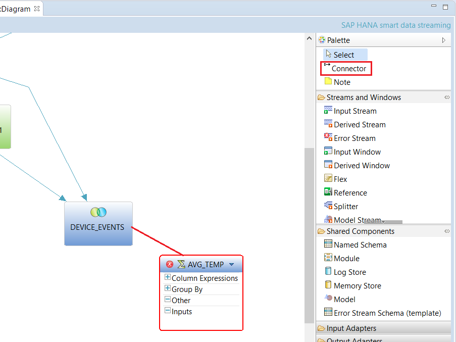

4. Click Add Column Expression **f(x)** by clicking on the icon shown below.

    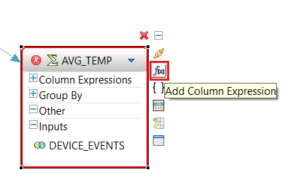

5. Click the **Copy Columns from Input** menu item to execute it. You can also press **c**.

    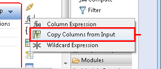

6. Click **Select All** or you can press **Alt+s**. Uncheck **`DEVICE_EVENTS.EVENT_NAME`**, **`DEVICE_EVENTS.EVENT_DESCRIPTION`** and **`DEVICE_EVENTS.MACHINETYPE`**. Click **OK**.

    

[VALIDATE_1]

[ACCORDION-END]

[ACCORDION-BEGIN [Step 2: ](Configure the Aggregate Window)]

1. Now we will create a window on the input to this aggregation. Expand the **Inputs** tab and right click on **`DEVICE_EVENTS`**.

    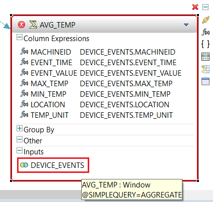

2. Click the **Keep Policy** menu item to execute it. You can also press **k**.

    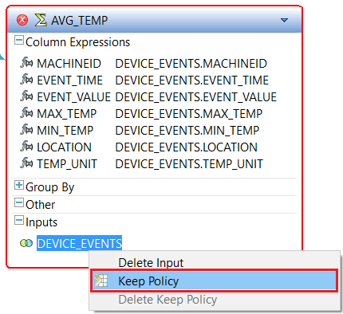

3. Click **Time** and enter `30 seconds` in the entry box. Click **OK**.

    

4. To define the **GROUP BY** clause, expand the tab by clicking on **+**.

    

5. Double-click on **`GROUP BY unassigned_group_by`**.

    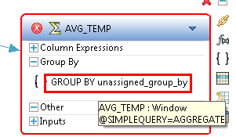

6. Select the entry **`DEVICE_EVENTS.MACHINEID`** by clicking on it. Click **Add >>** and then click **OK**.

    

7.  Now we need to add a GROUP filter, since we only want to aggregate temperature readings. Click Add Group Clause **{ }** icon shown below.

    

    Note that a GROUP FILTER filters the incoming events before aggregation. In this case, the filter will filter out "DOOR" and "POWER" events so that this element only process "TEMP" events.

8. Click the **Group Filter Clause** menu item to execute it. You can also press **g**.

    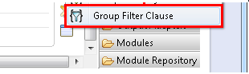

9. Double-click on **Group Filter 1**.

    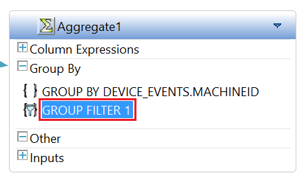

10. Enter `DEVICE_EVENTS.EVENT_NAME='TEMP'` as the filter expression in the text box. You can use **Ctrl+Space** for content assist. Confirm your entry by pressing **Enter**.

    

[DONE]

[ACCORDION-END]

[ACCORDION-BEGIN [Step 3: ](Edit Column Expressions)]

1. Expand the **Column Expressions** tab to edit expressions.

    

2. Double-click on **`DEVICE_EVENTS.EVENT_TIME`**.

    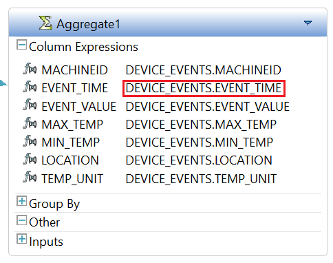

3. Edit the expression for **`EVENT_TIME`**. Change it to: `last(DEVICE_EVENTS.EVENT_TIME)`. This will cause the aggregate values for the group to show the event time of the last event received in the group. Confirm your entry by pressing **Enter**.

    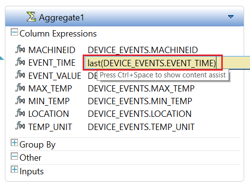

4. Double click the name **`EVENT_VALUE`** and rename this column to **`AVG_TEMP`** by typing in the text field. Confirm your entry by pressing **Enter**.

    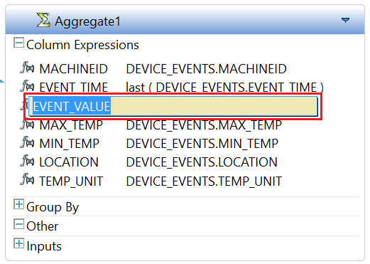

5. Double-click on the expression for **`AVG_TEMP`**, which is currently set to **`DEVICE_EVENTS.EVENT_VALUE`**.

    

6. Edit this expression to compute an average. Also, since the value field is a string, before we can compute an average, we need to convert it to a number. Change the expression to: `avg(to_decimal(DEVICE_EVENTS.EVENT_VALUE, 4, 2))`. Confirm your entry by pressing **Enter**.

    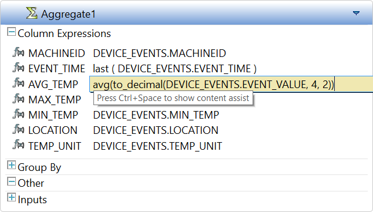

[DONE]

[ACCORDION-END]
