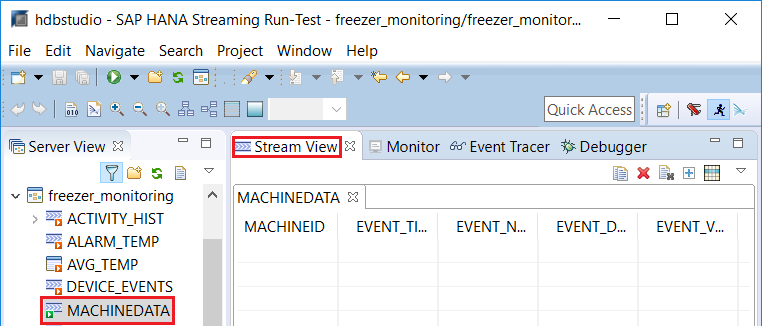
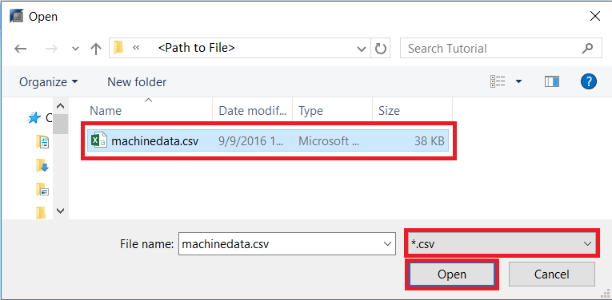
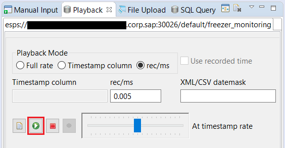
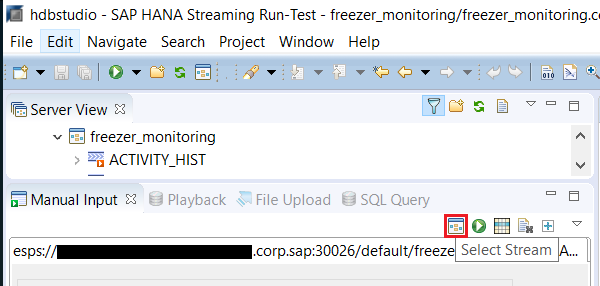
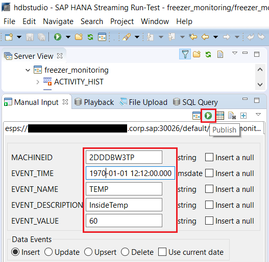
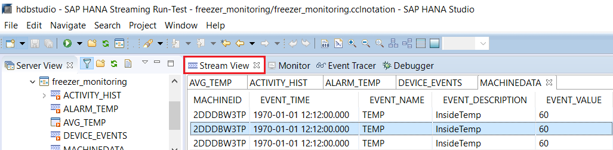
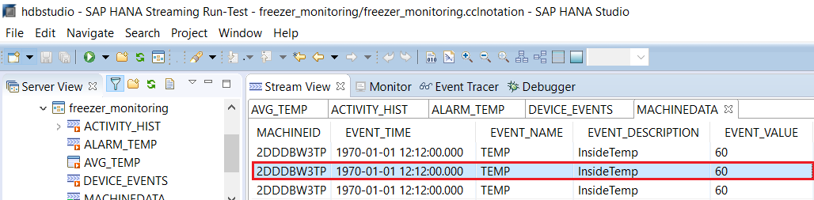

## Prerequisites  
- **Files:** Download the [**`machinedata.csv`**](https://raw.githubusercontent.com/SAPDocuments/Tutorials/master/tutorials/sds-event-stream-playback/machinedata.csv) file, which will be use later for playback during testing.

## Details
### You will learn  
- Running the project that you built in the previous exercises.
- Using the Playback tool to simulate a live source and stream in data from a file at a controlled rate.
- Using the Stream Viewer to view the output from each stream/window in your project.
- Using the Manual Input tool to manually generate test events and send them into your project one at a time.
- Using the Event Tracer tool to see how an event flows through the directed graph within the project.

---

[ACCORDION-BEGIN [Step 1: ](Running the project)]

In the next steps you will run the project, play some data and view the results.

Go to **SAP HANA Streaming Development** perspective. Click the drop down arrow next to the **Run** button and select the streaming server to run this project. You will be switched into the **SAP HANA Streaming Run-Test** perspective after you have deployed and ran the project.

[DONE]

[ACCORDION-END]

[ACCORDION-BEGIN [Step 2: ](Open the streams)]

Double-click on **`MACHINEDATA`** to open it in the **Stream View**.

Note: You won't see any data, because we haven't loaded any data yet.

Now double-click on each of the other streams/windows to open them in the **Stream View** tool.

[DONE]

[ACCORDION-END]

[ACCORDION-BEGIN [Step 3: ](Use the playback tool)]

Click the **Playback** tab.

Click Select Project icon in the top right corner of the **Playback** window to connect the playback tool to the current project (if you had multiple projects running it would ask you to choose).

Click Select Playback File icon shown below to select the data file to use.

If you have not downloaded the playback data already, please download the **`machinedata.csv`** file included in the prerequisites. In the Open dialogue window, change the file type to **`.csv`**. Choose **`machinedata.csv`** included in this tutorial and then click **Open**. You can also press **Alt+o**.

Click **rec/ms**. You want to control the playback speed so that you can watch things happen at a reasonable pace. Once it's running you can speed it up or slow it down using the slider tool. Enter `0.005` in the **rec/ms** box.

Then click the Start Playback button with icon shown below.

Click each viewer tab to view the output from each stream/window.

[DONE]

[ACCORDION-END]

[ACCORDION-BEGIN [Step 4: ](Using manual input and the event tracer tools)]

In the next eight steps you will use manual input and event tracer tools.

Click the **Event Tracer** tab to select it. Click on the Select Running Project button to connect to a running project. if you have multiple projects running, it would prompt you to choose one.

Click the **Manual Input** tab.

Click **Select Stream** to connect the manual input tool to the project.

Click on **MACHINEDATA** and then click **OK**.

Fill out input fields as shown in the picture. Use one of the following as the **`MACHINEID`** since these are the existing values in the `"MACHINE_REF"` table that you are using: `2DDDBW3TP`, `EKM49RTXK`, `RB82KMY3S`, `4CBH7792RN`, `JMD51RTKK`, `GGR23RTXK`, or `8HRT4WX2`. You can alter the other values. Then click Publish button to send the event.

The colors in the **Event Tracer** (at the top  of studio) diagram shows how each stream/window in the project is affected by the event you just sent. Double-click on each node to view the output generated by that node in response to the event in the Console.

Click the **Stream View** tab.

Find the entry that you submitted through Manual Input.

[VALIDATE_1]

[ACCORDION-END]
