## Prerequisites  
 - **Proficiency:** Beginner
 - **Tutorials:** [Run and Test a Project in SAP HANA Smart Data Streaming](http://www.sap.com/developer/tutorials/sds-part7-testing.html)

## Next Steps
 - **Tutorials:** [Custom Flex Operators with Advanced CCL in SAP HANA Smart Data Streaming](http://www.sap.com/developer/tutorials/sds-part9-flex-operators.html)

## Details
### You will learn  
 - Defining a pattern to watch for.
 - Defining contents of the event to produce when a pattern has been detected.
 - Using the CCL Editor to modify the project.

### Time to Complete
**15 Min**.

---

#### Watch For Patterns of Events; Use the CCL Editor

1. Click **SAP HANA Streaming Development** to switch to the perspective.

    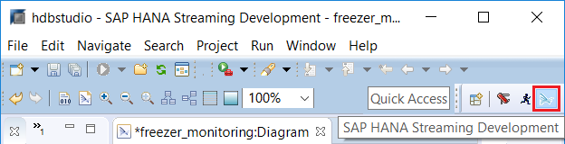

2. Drag and drop the **Pattern** item from the palette into the canvas.

    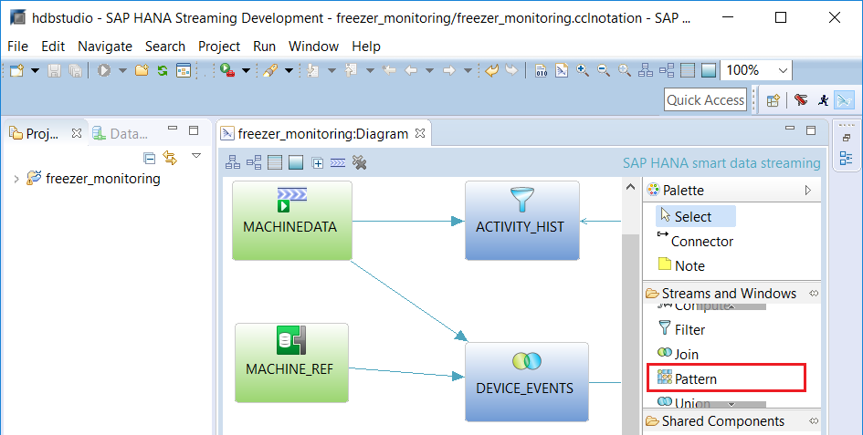

3. Connect **`DEVICE_EVENTS`** to **`Pattern1`** using the connector item.

    

4. Rename the **`Pattern1`** to `ALARM_POWER`.

    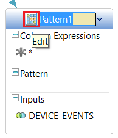

5. Select the **`ALARM_POWER`** item by clicking on it.

    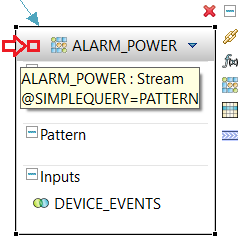

6. Click on Switch to Text button to switch to CCL Editor. You can also press **F6**.

    

7. Click **Yes** if there is a prompt to save the file. You can also press **Alt+y**.

    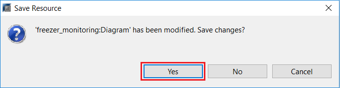

8. Click **Outline** to open the view. If you cannot find the button, you can also go to **Window** > **Show View** > **Other...** and type in `outline` in the search box to find the desired view.

    

9. Select **`ALARM_TEMP`**. The CCL Editor will jump to the corresponding code section.

    

10. Click Minimize icon on the top right of the **Outline** view to hide it.

    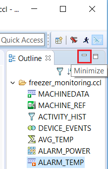

11. Select the column expressions from the **`ALARM_TEMP`** window and copy them. You will use these code to speed up the writing of `"ALARM_POWER"` functionality.

    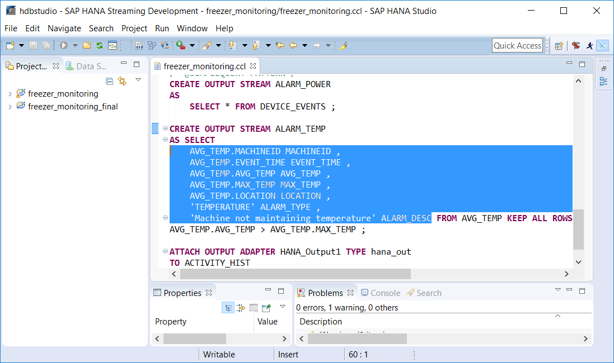

12. Now paste the column expressions into the **`ALARM_POWER`** stream, replacing the **`*`**.

    

13. Edit the **FROM** clause to read `DEVICE_EVENTS A, DEVICE_EVENTS B`. Since you want to watch for a pattern of 2 events from the same stream, you need define two different aliases for the stream.

    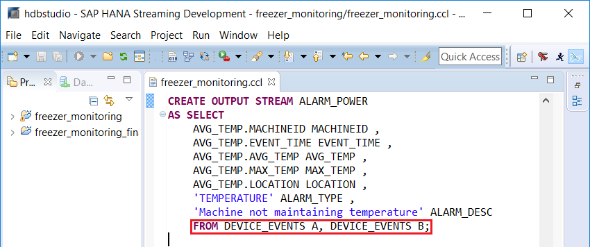

14. Now edit the column expressions to the following shown in the picture.
    - Change the source of each column value coming from the input stream to `A`.
    - Delete the **`AVG_TEMP`** and **`MAX_TEMP`** columns.
    - Edit the text for the **`ALARM_TYPE`** and **`ALARM_DESC`** columns.

    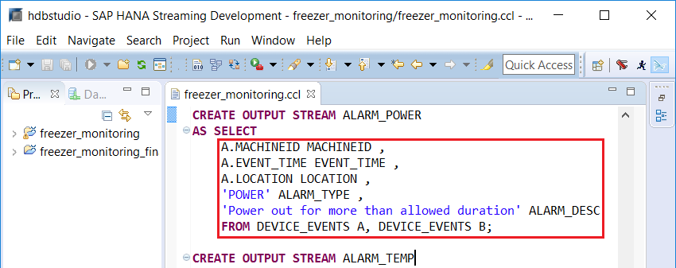

    The final code should be:
    ```sql
    CREATE OUTPUT STREAM ALARM_POWER
    AS SELECT
      A.MACHINEID MACHINEID ,
      A.EVENT_TIME EVENT_TIME ,
      A.LOCATION LOCATION ,
      'POWER' ALARM_TYPE ,
      'Power out for more than allowed duration' ALARM_DESC
    FROM DEVICE_EVENTS A, DEVICE_EVENTS B;
    ```

15. When finished editing, click Switch to Visual button to switch back to visual editor mode. You can also press **F6**.

    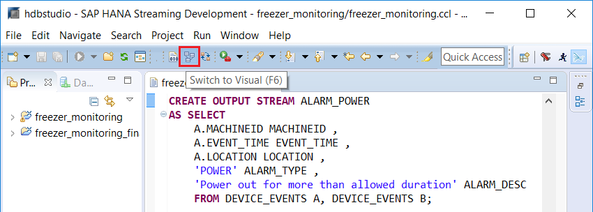

16. Click Add Pattern icon shown below to define the pattern to watch for.

    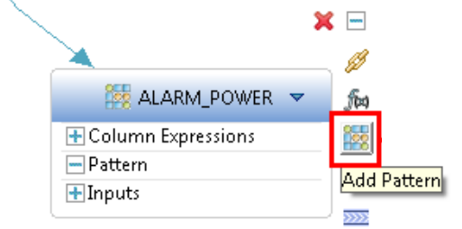

17. Enter `20 sec` in the Interval box.

    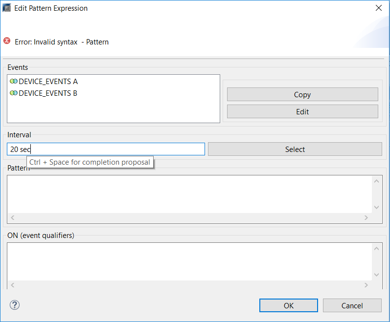

18. Enter the pattern we want to watch for: `A, !B`. The "," means "followed by" and "!" means not. The expression means to watch for event A that is NOT followed by event B within 20 seconds. ("AND" and "OR" operators are also available in the pattern)

    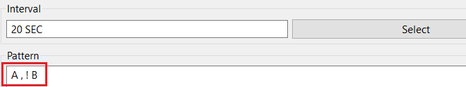

19. Now we need to define our ON clause. This filters the incoming events to determine which events qualify as an "A" event and a "B" event. Enter the following expression and click **OK** when done:
  `A.MACHINEID = B.MACHINEID AND A.EVENT_VALUE = 'Power off' AND B.EVENT_VALUE = 'Power on'`

    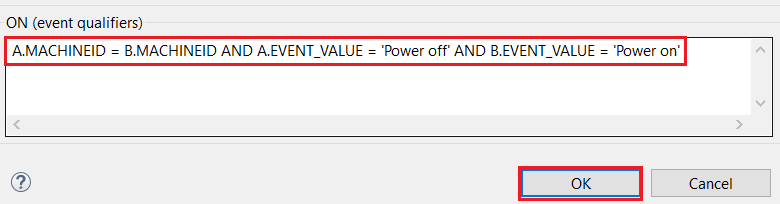

    Tip: you can use **Ctrl+Space** for completion assist.

20. Click Compile Project button to check for errors. Please refer to part 7 of this tutorial group on how to run and re-test the updated project.

    


## Next Steps
 - **Tutorials:** [Custom Flex Operators with Advanced CCL in SAP HANA Smart Data Streaming](http://www.sap.com/developer/tutorials/sds-part9-flex-operators.html)
