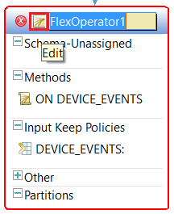
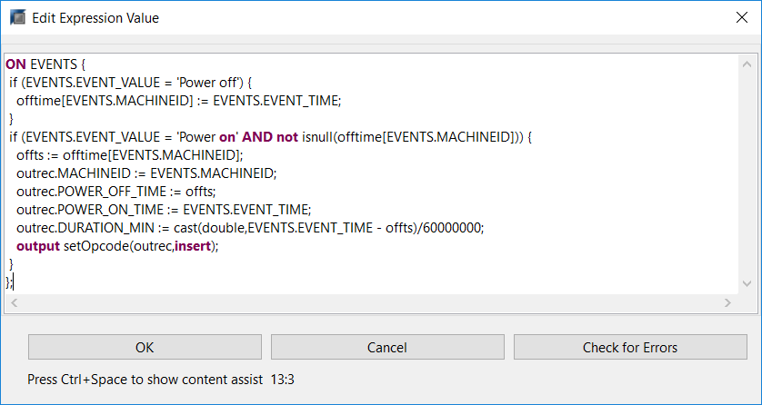
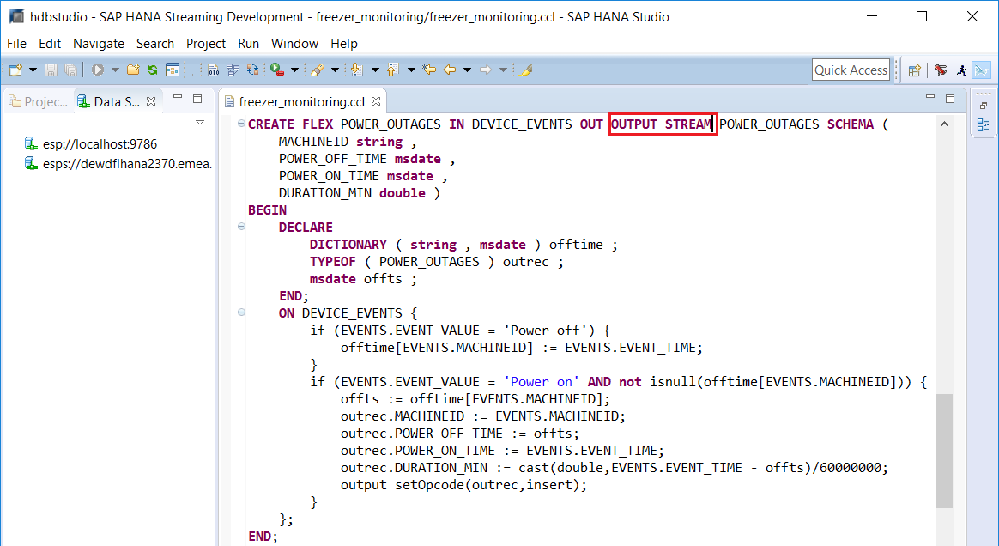
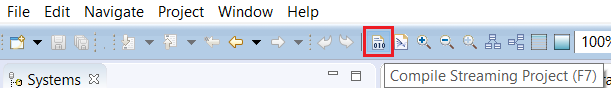

## Details
### You will learn  
 - Using Flex Operator and incoming events to update status information.
 - Matching and correlating multiple events to produce a single output event.
 - Using CCL script to write an event handler.
 - Using a DECLARE block to define data structures.

### Time to Complete
**20 Min**.

---

[ACCORDION-BEGIN [Step 1: ](Power Outage Flex)]    

1. In the **SAP HANA Streaming Development** perspective. Drag and drop a **Flex** element from the **Palette** to the canvas.

    

2. Connect the **`DEVICE_EVENTS`** stream to the new Flex operator.

    

3. Rename the new Flex operator to `POWER_OUTAGES`.

    

4. Click Add Column icon shown below 4 times to add 4 columns.

    

5. Change the column names and data types to match the screenshot provided. Double click on a column name to edit it. To change the data type, click on the type and then the drop down arrow to select the desired type.

    

6. Click **Modify** > **Edit Local Declaration(s)** under the drop down. You can also press **e**.

    

7. Enter the declarations as shown in the screenshot and click **OK**:

    CCL Script:
    ```sql
  DECLARE
    DICTIONARY ( string , msdate ) offtime ;
    TYPEOF ( POWER_OUTAGES ) outrec ;
    msdate offts ;
  END
    ```

    

8. Double-click on **ON EVENTS**.

    

9. Enter the CCL Script shown here and click **OK**.

    CCL Script:
    ```sql
  ON EVENTS {
    if (EVENTS.EVENT_VALUE = 'Power off') {
      offtime[EVENTS.MACHINEID] := EVENTS.EVENT_TIME;
    }
    if (EVENTS.EVENT_VALUE = 'Power on' AND not isnull(offtime[EVENTS.MACHINEID])) {
      offts := offtime[EVENTS.MACHINEID];
      outrec.MACHINEID := EVENTS.MACHINEID;
      outrec.POWER_OFF_TIME := offts;
      outrec.POWER_ON_TIME := EVENTS.EVENT_TIME;
      outrec.DURATION_MIN := cast(double,EVENTS.EVENT_TIME - offts)/60000000;
      output setOpcode(outrec,insert);
    }
  };
    ```

    Note: The "msdate" variable type is a timestamp with millisecond precision. The default format is YYYY-MMDDTHH:MM:SS:SSS. When an "msdate" is subtracted from another "msdate", the resulting value is of type interval. The interval data type is in microseconds, hence the division by 60000000.

    

10. Right click on the **`POWER_OUTAGES`** stream and select **Switch to Text** menu item to switch to CCL Editor. You can also press **F6**. Click **Yes** if you are asked to save changes.

    

11. Change the **`CREATE FLEX POWER_OUTAGES`** statement to produce an **`OUTPUT STREAM`** instead of an **`OUTPUT WINDOW`**.

    

12. Click Compile Project button to check for errors. Please refer to part 7 of this tutorial group on how to run and re-test the updated project.

    

[VALIDATE_1]

[ACCORDION-END]

[ACCORDION-BEGIN [Step 2: ](Notes on the CCL Script on the Power Outage Flex)]    

1. The DECLARE block is local to this Flex operator. Global DECLARE blocks are also supported and would be put at the top of the CCL file; outside of any CREATE... statement.
    - "`offtime`" is a dictionary that saves the time of the last Power Off event for each machine. It will be indexed by MACHINEID, which is a string. Dictionaries are key/value pairs, where both the key and the value can be a simple type (a primitive such as an integer, string or character) or a complex type (an object which may house many simple or complex data types).
    - "`outrec`" is a temporary data record structure that matches the schema of the output stream being created by this Flex operator.

2. The ON EVENTS method is executed every time an event is received from the EVENTS stream
    - First, check the "`EVENT_VALUE`" field of the incoming event to see if it's a "`POWER_OFF`" event. If it is, then save the time of the Power Off event for this MACHINEID in the dictionary.
    - Next check to see if the incoming event is a Power On event. If it is, and if there is a Power Off time for this machine in the dictionary, then construct and publish an output event.
    - Anytime you publish an event from a Flex you have to explicitly set the "`OpCode`" of the event being produced – thus, the use of the "`setOpcode`" function.

[DONE]

[ACCORDION-END]

[ACCORDION-BEGIN [Step 3: ](Dashboard Flex)]    

Now you are doing something a bit different. You are going to build another Flex operator. This flex produces what you are calling the "Dashboard" which has current status information for each Machine. The challenge is that you are receiving different types of events on the same stream, with different uses of the "value" field. This is a common problem. But it prevents us from doing a simple aggregation or update, since one event can have a temperature reading in the value field and another event on the same stream can have "Power off" in the value field. So use CCL Script to create a new window called DASHBOARD that holds a single summary row for each machine. With each incoming event, the script examines the event and updates the relevant summary row.
 - The local declare block creates a dictionary that holds the most recently received information for each machine. This dictionary starts out empty, but information is added/updated as events are received.
 - The ON EVENTS method is invoked for each incoming event from the EVENTS stream.
    - The method gets the previous set of information for the specific machine from the dictionary (if an entry for this machine exists in the dictionary).
    - It then updates the information for this machine using the data contained in the event.
    - Finally, it publishes an updated summary row for this machine and updates the dictionary with the current information.

1. Click **Switch to Text** or press **F6**.

    

2. Copy the following CCL Script at the end of the script.

    CCL Script:
    ```sql
  CREATE FLEX DASHBOARD
  IN DEVICE_EVENTS
  OUT OUTPUT WINDOW DASHBOARD
    SCHEMA(MACHINEID string, POWER_STATUS string, CURR_TEMP double )
    PRIMARY KEY (MACHINEID)
  BEGIN
    DECLARE
    typeof(DASHBOARD) outrec;
    dictionary(string, typeof (DASHBOARD)) prev;
  END;
  ON DEVICE_EVENTS{
    if (not isnull(prev[EVENTS.MACHINEID])){
      outrec := prev[EVENTS.MACHINEID];
    }
    outrec.MACHINEID := EVENTS.MACHINEID;
    if(EVENTS.EVENT_NAME = 'POWER') {
      outrec.POWER_STATUS := EVENTS.EVENT_VALUE;
    }
    if (EVENTS.EVENT_NAME = 'TEMP') {
      outrec.CURR_TEMP := to_decimal(EVENTS.EVENT_VALUE, 4, 2);
    }
    output setOpcode(outrec,upsert);
    prev[EVENTS.MACHINEID] := outrec;
  };
  END;
    ```
    

3. Compile and check for errors in the **Problems** view.

    

4. In the **SAP HANA Streaming Development** perspective, click the Run button to start the project. Please refer to part 7 of this tutorial group on how to run and re-test the updated project.

    

[DONE]

[ACCORDION-END]
