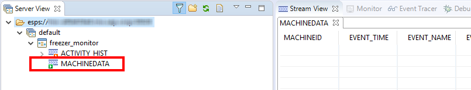
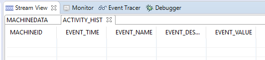
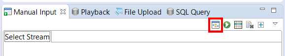
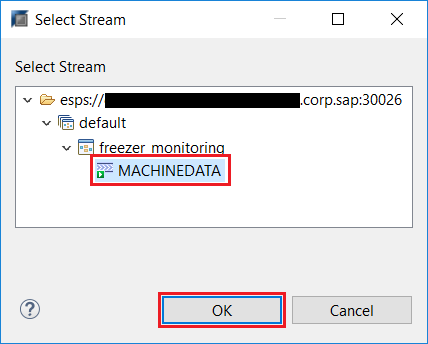
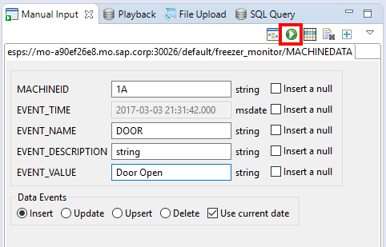

## Prerequisites  
 - **Tutorials:** [Capture Streaming Output in the HANA Database](https://developers.sap.com/tutorials/sds-event-stream-tables.html)

## Next Steps
**Tutorial:** [Join an Event Stream to a HANA Table](https://developers.sap.com/tutorials/sds-stream-table-join.html)

## Details
### You will learn  
 - How to run a streaming project
 - How to use some of the streaming test tools in studio. Specifically:  how to view the output from streams and how to use the manual input tool to generate an input event

---

[ACCORDION-BEGIN [Step 1: ](Run the Project)]

Go to the **SAP HANA Streaming Development** perspective.

From the dropdown arrow next to the **Run** button, select the streaming server to run this project.

You are switched into the **SAP HANA Streaming Run-Test** perspective if the project deploys successfully.

> If you get an error message saying that the project didn't start, first check for compile errors.  If it's compiling without errors but still won't start, see the Streaming Analytics Troubleshooting Guide on the SAP Help Portal.

[DONE]

[ACCORDION-END]

[ACCORDION-BEGIN [Step 2: ](Open streams in the Stream View)]

In the **Server View**, double-click on **`MACHINEDATA`** to open it in the **Stream View**.

> Note: You won't see any data, because you haven't loaded any data yet.

Open the `ACTIVITY_HIST` stream in the **Stream View** as well.

[DONE]

[ACCORDION-END]

[ACCORDION-BEGIN [Step 3: ](Use the manual input tool to generate input events)]

In the **Manual Input** tab (the lower left tile in the default perspective layout), click the **Select Stream** button to connect the manual input tool to your `freezer_monitor` project, as shown below.

Click on **`MACHINEDATA`**, then hit **OK**.

Fill in some values to create an input event.

- Enter any value for `MACHINEID`.
- If the "Use Current Date" checkbox is selected, it will fill in the `EVENT_TIME` automatically using the current time.
- If you set the `EVENT_NAME` to `DOOR`, it will pass through the filter and appear in `ACTIVITY_HIST`; any other value will not.
- The `EVENT_DESCRIPTION` field can be anything you like.
- Set the `EVENT_VALUE` to either `Door Open` or `Door Close`.

Click the **Publish** button to send the event.

View your event in the **Stream View** tabs. Keep in mind that all input events appear in the input stream, but only events where `EVENT_NAME=DOOR` appear in the `ACTIVITY_HIST` stream.

You can also view the `ACTIVITY_HIST` table in the HANA database to see that any events that appear in the `ACTIVITY_HIST` stream get recorded in the connected database table.

[VALIDATE_3]

[ACCORDION-END]
