## Prerequisites
 - **Tutorials:** [Run and Test a Streaming Project](https://developers.sap.com/tutorials/sds-run-test.html)

## Next Steps
   **Tutorials:** [Create a Moving Average on an Event Stream using an Aggregation Window](https://developers.sap.com/tutorials/sds-event-stream-moving-average.html)

## Details
### You will learn  
 - How to reference a HANA database table in your streaming project using a HANA Reference element.  In streaming projects, a Reference element points at a HANA database table and pulls data in from the table as needed
 - How to join a live event stream to a HANA table to enrich raw event data with reference data from the HANA database

---

[ACCORDION-BEGIN [Step 1: ](Add a HANA database table to your project)]

After completing the previous tutorial in this series, you should still have your project open, but you are likely in the Streaming Run-Test perspective.  Go back to the Streaming Development perspective.  If the project isn't still open in the visual editor, open it now.

- If the project is open in the CCL editor, use the **Switch to Visual** tool in the toolbar, or press **F6**.
- If the project was closed, from the **Project Explorer** view double-click on the `freezer_monitor.cclnotation` file in the project folder.

>Note: If you prefer to use the CCL editor, then go straight to the final step.  

In the Streaming Development perspective, go to the **Data Services** view. Double-click on your HXE host and then double-click on the **Server-wide** folder to load the defined data services.

Expand the database service and the **STREAMING** schema.

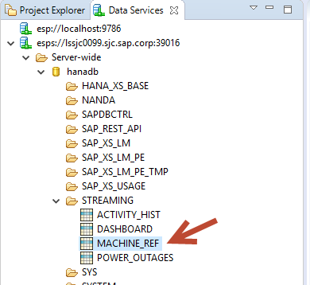

In the **STREAMING** schema, grab the table **`MACHINE_REF`** and drag it onto the canvas. When you drop it onto the canvas, a dialog box opens that lets you choose what to create.


> Note that you can also create a REFERENCE element from the **Palette**, but then you have to manually configure it, including the schema (column names and types).  This is a much easier way. Alternatively, you can add it in the CCL editor as described in step 4 of this tutorial.

In the dialog box:

- set the Service to **`hanadb`** or whatever database service you're using,
- select **Reference** as the type, and **Inline** as the schema,
- then click **OK**.

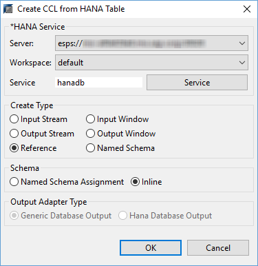

Change the name of the reference element to `MACHINE_REF` by clicking on the icon shown below and editing the name.

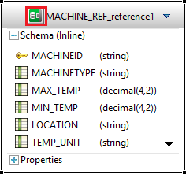

[VALIDATE_1]


[ACCORDION-END]

[ACCORDION-BEGIN [Step 2: ](Join the event stream to the reference table)]

Click **Join** in the **Streams and Windows** drawer of the **Palette** and drag and drop it onto the canvas.

> Tip: Click the small arrow bar at the bottom of the **Palette** drawer to scroll down.

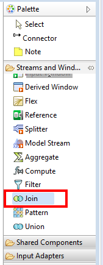

Select the **Connector** tool.


Click on `MACHINEDATA` first, then `Join1` to connect them.

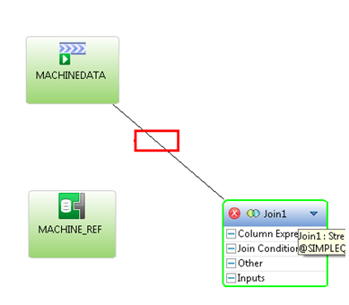

Select the **Connector** tool again and now add a connection from `MACHINE_REF` to `Join1`.

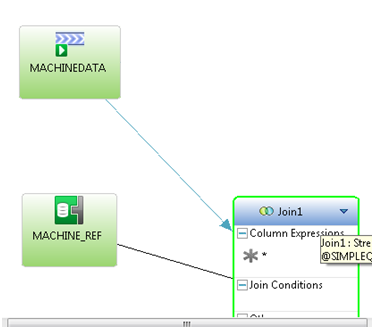

[DONE]

[ACCORDION-END]

[ACCORDION-BEGIN [Step 3: ](Configure the Join operator)]

Rename `Join1` to `DEVICE_EVENTS` and press **Enter**.

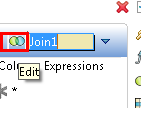

Click on **`DEVICE_EVENTS`** to select it.  The element's toolbar appears.

Click the **Add Column Expression** ( **f(x)** ) button shown below.

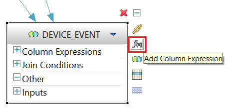

Choose **Copy Columns from Input** from the menu to open the column selection dialog.

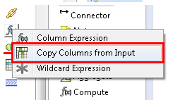

Select every option by clicking **Select All** or pressing **Alt+s**. Uncheck the second MACHINEID field that is named **`MACHINE_REF.MACHINEID`** (you don't want it twice) and then click **OK**.

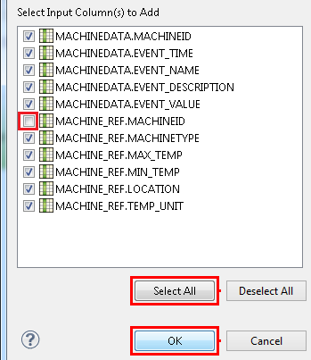

Now set the join condition. Double-click on **`, MACHINE_REF`**.

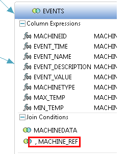

When prompted to save the project, choose **Yes**.


Set the join condition on MACHINEID: select **MACHINEID : string** in each source column and then click **Add**. Once added, hit **OK**.


[DONE]

[ACCORDION-END]


[ACCORDION-BEGIN [Step 4:](Edit project in the CCL editor)]

To open the project in the CCL editor, in the Streaming Development perspective do one of the following:

- If the project is still open in the visual editor, use the **Switch to Text** tool in the Eclipse toolbar.
- If the project is not open in any editor, double-click on `freezer_monitor.ccl` in the project folder.

If you decided you want to add `REFERENCE` and `JOIN` elements using the CCL editor rather than the visual editor, then you can copy the code below.

Here's the CCL for these elements:

```SQL

CREATE REFERENCE MACHINE_REF
    SCHEMA (
	MACHINEID string ,
	MACHINETYPE string ,
	MAX_TEMP decimal(4,2) ,
	MIN_TEMP decimal(4,2) ,
	LOCATION string ,
	TEMP_UNIT string )
	PRIMARY KEY ( MACHINEID )
	PROPERTIES service = 'hanadb' ,
	source = 'MACHINE_REF' ,
	sourceSchema = 'STREAMING' ;

  /**@SIMPLEQUERY=JOIN*/
  CREATE OUTPUT STREAM DEVICE_EVENTS
  AS SELECT
      MACHINEDATA.MACHINEID MACHINEID ,
  	MACHINEDATA.EVENT_TIME EVENT_TIME ,
  	MACHINEDATA.EVENT_NAME EVENT_NAME ,
  	MACHINEDATA.EVENT_DESCRIPTION EVENT_DESCRIPTION ,
  	MACHINEDATA.EVENT_VALUE EVENT_VALUE ,
  	MACHINE_REF.MACHINETYPE MACHINETYPE ,
  	MACHINE_REF.MAX_TEMP MAX_TEMP ,
  	MACHINE_REF.MIN_TEMP MIN_TEMP ,
  	MACHINE_REF.LOCATION LOCATION ,
  	MACHINE_REF.TEMP_UNIT TEMP_UNIT
  FROM MACHINEDATA INNER JOIN MACHINE_REF
  ON MACHINEDATA.MACHINEID = MACHINE_REF.MACHINEID ;


```

[DONE]

[ACCORDION-END]
