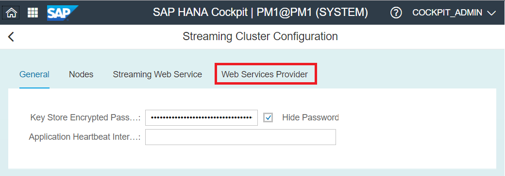
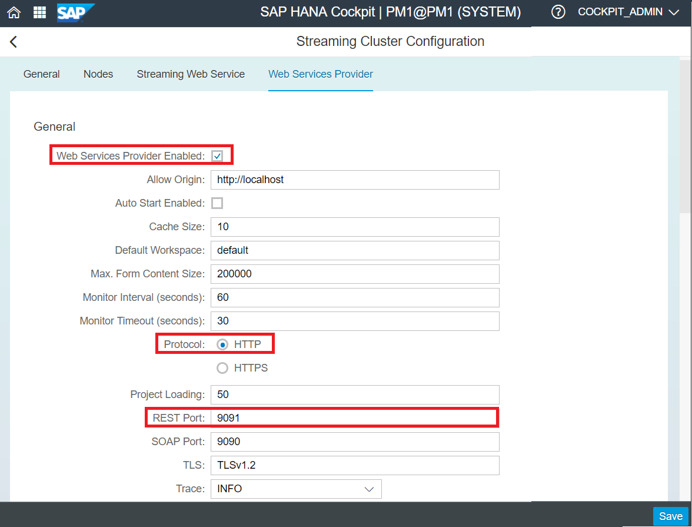
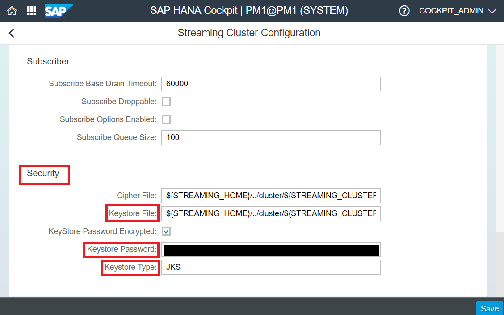
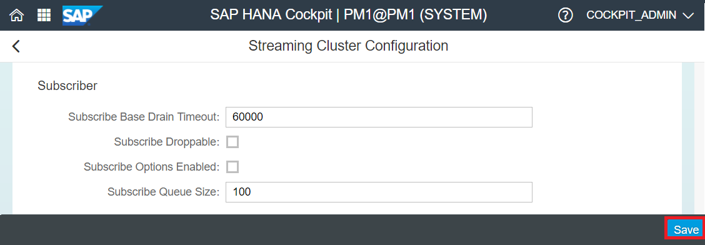
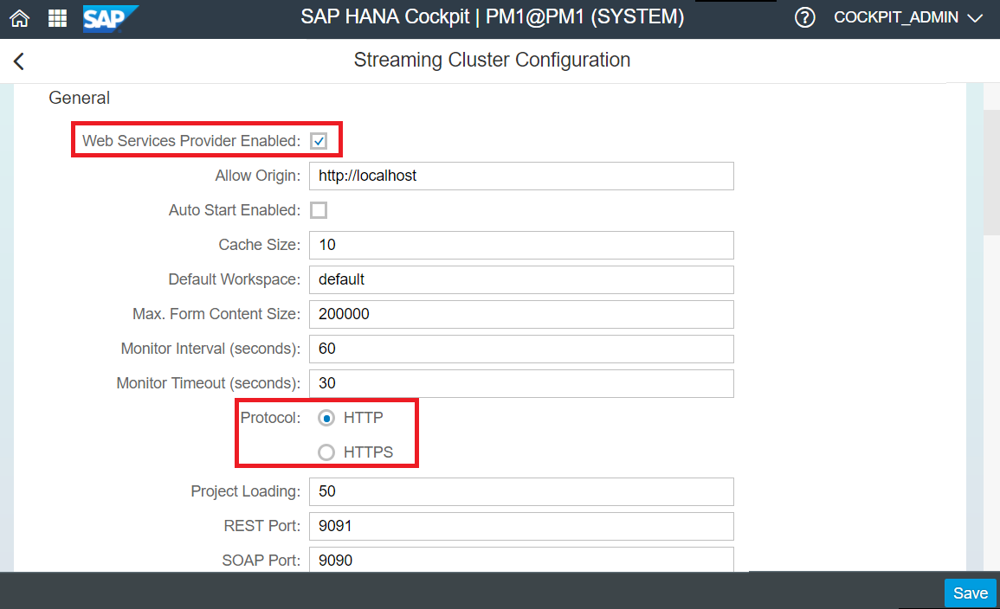
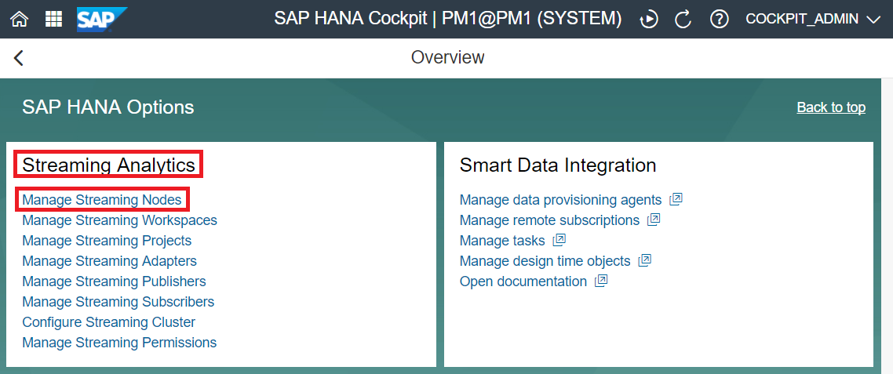
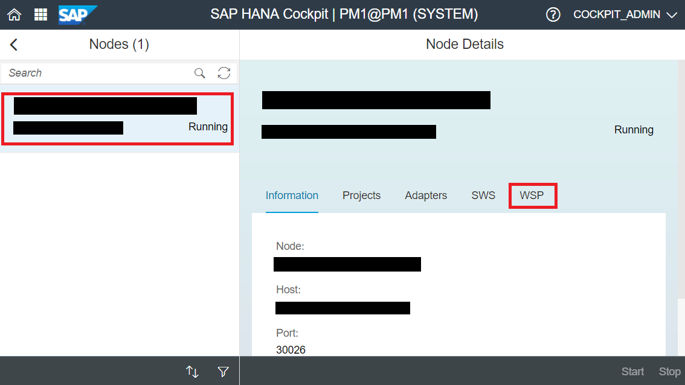
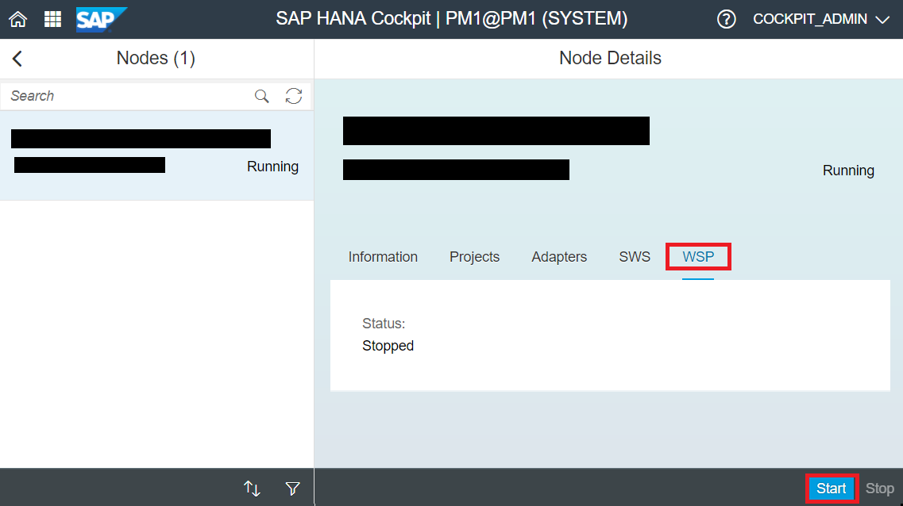

## Prerequisites
 - **Proficiency:** Beginner
 - **System:** Ensure you have access to a HANA System with the Smart Data Streaming option installed and configured.
 - **Web Application:** Access to SAP HANA Cockpit
 - **Tutorial:**
 - [Using the Streaming Web Service](https://developers.sap.com/tutorials/sds-streaming-web-service.html)

## Next Steps
- **Tutorials** : [Publish Events to SDS via the REST Interface](https://developers.sap.com/tutorials/sds-rest-publish.html)

## Details

### You will learn
 - How to configure the Web Service Provider (WSP) to use REST Posts
 - How to configure the WSP to use `WebSockets`
 - How to start and stop the WSP

### Time to Complete
**15 Min**
---

[ACCORDION-BEGIN [Step 1: ](Configuring the Web Service Provider to Use REST Posts)]
The Web Services Provider (WSP) exposes an HTTP interface that grants client applications access to and several capabilities in smart data streaming and its projects. The provider supports `REST`, `SOAP`, and `WebSocket` connections.

For higher performance and better scalability, it is recommended that you use the Streaming Web Service.

First, access HANA Cockpit using the URL given during installation, in the form `https://<hostname>:<port>.`

Navigate to the SAP HANA System overview, and scroll down to the **Streaming Analytics** tile, and select **Configure Streaming Cluster**.

Select the **Web Services Provider** tab.

Set the properties for the Web Services Provider. For specific information regarding each property, visit the appendix section of this tutorial.

To configure WSP to use `REST` Posts,
**a.** Set the *enable* attribute of **Web Services Provider Enabled** to be true (i.e. check the box).

**b.** Set the value of **Protocol** to be `HTTP` or `HTTPS`.

**c.** Set the value of the `REST` Port of ne `9091`

**d.** If you selected `HTTPS` for **Protocol**, specify the **keystore type**, **file** and **password** in the **Security** section.

Click **Save** in the bottom right corner. We will need to restart all running nodes for any changes to take effect.

[DONE]

[ACCORDION-END]
[ACCORDION-BEGIN [Step 2: ](Configuring the Web Service Provider to Use WebSockets)]

Open up HANA Cockpit, similar to Step 1, and navigate to **Streaming Analytics** > **Configure Streaming Cluster** > **Web Services Provider**.

To configure the Web Service Provider to user `WebSockets`,
**a.** Similar to Step 1, set **Web Services Provider Enabled** to be true.

**b.** Set the value of **Protocol** to be `HTTP` or `HTTPS`.

**c.** Enable the smart data streaming `WebSocket` Provider by setting **`WebSocket` Enabled:** to be true.

**d.** Set properties for the `WebSocket` Provider in its section (This is optional. The default values will work fine):

|Property|	Description|
|---|---|
|`Websocket` Enabled| Enables `WebSocket` connections. Default is checked.|
|`Websocket` Port|The port number that the Web Services Provider uses for `WebSocket` connections.|
|Publish Socket Loading| The maximum number of remote connections that can publish data over a single connection to smart data streaming. If the limit is exceeded, then a new publisher connection is created.|
|`Websocket` Secured| Specifies whether to use HTTP or HTTPS as the protocol. If set to true, the protocol is HTTPS.|
|Subscribe Socket Loading|The maximum number of remote connections that can subscribe to data over a single connection from smart data streaming. If the limit is exceeded, then a new subscriber connection is created.|
|`Websocket` TLS|Sets one or more TLS versions for `WebSocket` connections. Accepted values are `TLSv1.0`, `TLSv1.1`, and `TLSv1.2`. To specify multiple `TLS` versions, use semicolons to separate each element. For example: `TLSv1;TLSv1.1;TLSv1.2`. If not set, the value defaults to `TLSv1.2.`|

**e.** If you are using HTTPS, specify the keystore type, file, and password in the Security section. If you are using HTTP, this section is ignored.

Click **Save** in the bottom right corner. We will need to restart all running nodes for any changes to take effect.

[DONE]

[ACCORDION-END]

[ACCORDION-BEGIN [Step 3: ](Starting and Stopping the WSP)]
Previous to running the WSP, ensure you have one of the following:
- The `execute service service wsp` permission.
- The `start service service wsp` permission.

Navigate to the SAP HANA System overview, and scroll down to the **Streaming Analytics** tile, and select **Manage Streaming Nodes**.

Select your node in the left navigation pane, and choose the **WSP** tab.

In the bottom right corner of the page, select Start or Stop.

[DONE]

[ACCORDION-END]

[ACCORDION-BEGIN [Optional: ](Appendix)]

The general properties section contains properties for `REST`, `SOAP`, and `WebSocket` connections:

|Property|	Description|
|---|---|
|Web Services Provider Enabled| Enables the Web Services Provider. Default is checked.|
|Allow Origin|Contains a URL pointing to the default host, which stops the resource from being shared with other requesters from other origins. This restricts the response header of Access-Control--Allow-Origin for REST APIs. Specifying a value of * allows all origins. Only one URL can be specified, a list is not permitted.|
|`Autostart` Enabled | If enabled, starts the Web Services Provider automatically with the cluster. Default is unchecked.|
|Default Workspace|The default workspace associated with the cluster.|
|Max. Form Content Size|The maximum allowable size, in bytes, for a REST request. This value should be a positive integer. If you specify a negative number, the `Jetty` default value of 200,000 bytes is used instead. Any invalid values result in an integer parsing exception.|
|Monitor Interval (seconds)|The interval, in seconds, between heartbeat checks from the cluster to the Web Services Provider.|
|Monitor Timeout (seconds)|The time, in seconds, for the cluster to wait for a response to a heartbeat check before timing out.|
|Protocol|If SSL is enabled, set the protocol to HTTPS. If SSL is disabled, set the protocol to HTTP.|
|Project Loading|The maximum number of socket connections (either publish or subscribe) to smart data streaming to create for each project instance.|
|REST Port|The port number that the Web Services Provider uses for REST connections.|
|SOAP Port|The port number that the Web Services Provider uses for SOAP connections.|
|TLS|Sets one or more TLS versions for SOAP connections. Accepted values are `TLSv1.0`, T`LSv1.1`, and `TLSv1.2`. To specify multiple TLS versions, use semicolons to separate each element.   For example: `TLSv1;TLSv1.1;TLSv1.2.` If not set, the value defaults to `TLSv1.2`.|
|Cache Size|Specifies the number of published rows the Web Services Provider caches internally before sending them on to smart data streaming in a batch. The default value is 10.|
|Trace	|Specifies the logging level for the Web Services Provider. The logging levels in increasing order of severity are: `TRACE, DEBUG, INFO`, and `WARNING`. The default value is `INFO`.|

The `WebSocket` section contains properties for `WebSocket` connections:

|Property|	Description|
|---|---|
|`Websocket` Enabled| Enables `WebSocket` connections. Default is checked.|
|`Websocket` Port|The port number that the Web Services Provider uses for `WebSocket` connections.|
|Publish Socket Loading| The maximum number of remote connections that can publish data over a single connection to smart data streaming. If the limit is exceeded, then a new publisher connection is created.|
|`Websocket` Secured| Specifies whether to use HTTP or HTTPS as the protocol. If set to true, the protocol is HTTPS.|
|Subscribe Socket Loading|The maximum number of remote connections that can subscribe to data over a single connection from smart data streaming. If the limit is exceeded, then a new subscriber connection is created.|
|`Websocket` TLS|Sets one or more TLS versions for `WebSocket` connections. Accepted values are `TLSv1.0`, `TLSv1.1`, and `TLSv1.2`. To specify multiple `TLS` versions, use semicolons to separate each element. For example: `TLSv1;TLSv1.1;TLSv1.2`. If not set, the value defaults to `TLSv1.2.`|

The Thread Pool section sets properties for `Jetty`, used for `REST`, `SOAP`, and `WebSocket` connections:

|Property	|Description|
|---|---|
|Thread Pool Idle Timeout|The amount of time, in milliseconds, that a thread needs to idle before becoming eligible for stopping. The default value is 30000.|
|Max. Number of Threads|The maximum number of threads that `Jetty` may spawn to service incoming connections. The default value is 500.|
|Min. Number of Threads| The minimum number of threads you want `Jetty` to spawn. The default value is 20.|

The Publisher section sets optional publishing properties for `WebSocket` connections:

|Property	|Description|
|---|---|
|Publish Block Mode|(Required if **Publish Options Enabled** is checked)  When publishing is buffered, use this property to specify the publishing block mode. Valid values are `none`, `explicit`, and `auto`. Explicit lets you control the batches by using start transaction and end block calls, and auto ignores these calls and batches rows internally. The default mode is auto (auto-blocking).|
|Publish Block Size|(Required if **Publish Options Enabled** is checked)    The provider only uses this value if the publish block mode is explicit. Specifies the number of rows inside a message block. Recommended values are 64 to 1024.|
|Publish Buffer Size|(Required if **Publish Options Enabled** is checked)    Specify a positive number to enable buffered publishing. When publishing is buffered, the data is first written to an internal queue. This is picked up by a publishing thread and then written to the smart data streaming project. This is the default operating mode.|
|Publish Options Enabled|Check to enable these advanced publisher options for `WebSocket` connections.|
|Publish Use Transactions|(Required if **Publish Options Enabled** is checked)    If set to true, the provider uses transaction blocks instead of envelopes. The default value is false.|

The Subscriber section sets optional subscribing properties for `WebSocket` connections:

|Property|Description|
|---|---|
|Subscribe Base Drain Timeout|(Required if **Subscribe Options Enabled** is checked)    Specify how long, in milliseconds, smart data streaming waits for a subscriber to read all base data. If there are multiple client connections sharing a subscription to smart data streaming, all connections are dropped if the Web service client is slow.|
|Subscribe Droppable|(Required if **Subscribe Options Enabled** is checked)  Specify a positive number to enable buffered publishing. When publishing is buffered, the data is first written to an internal queue. This is picked up by a publishing thread and then written to the smart data streaming project. This is the default operating mode.|
|Subscribe Options Enabled|Check to enable these advanced publisher options for `WebSocket` connections.|
|Subscribe Queue Size|(Required if **Subscribe Options Enabled is checked**)  Specify a positive number to enable buffered publishing. When publishing is buffered, the data is first written to an internal queue. This is picked up by a publishing thread and then written to the smart data streaming project. This is the default operating mode.|

If you are using HTTPS, fill out the properties in the Security section. If you are using HTTP, this section is ignored. You can set security options for `REST`, `SOAP`, and `WebSocket` connections:

|Property	|Description|
|---|---|
|Cipher File|Path to a cipher file for encrypting keystore passwords.|
|Keystore File|Path to a keystore file containing a private key, typically a `Java Keystore` (JKS).|
|Keystore Password Encrypted|Indicates whether the keystore password is encrypted.|
|Keystore Password|The password for the keystore file, which can be encrypted. If encrypted, provide a symmetric cipher to decrypt the password in the Cipher File field.|
|Keystore Type|The type of keystore being used.|

[DONE]

[ACCORDION-END]
