## Prerequisites  
**Tutorials:**
  - [Installing SAP HANA Streaming Analytics for SAP HANA, Express Edition](https://www.sap.com/developer/tutorials/hxe-ua-installing-streaming.html)

## Details
### You will learn  
  - How to add a database to the Database Explorer in Web IDE
  - How to enable plug-ins for SAP HANA Streaming Analytics for Web IDE
  - How to create a Multi-Target Application

---

[ACCORDION-BEGIN [Step 1: ](Open Web IDE)]

Enter:

```
xs apps
```

Copy the URL beside the `webide` app.

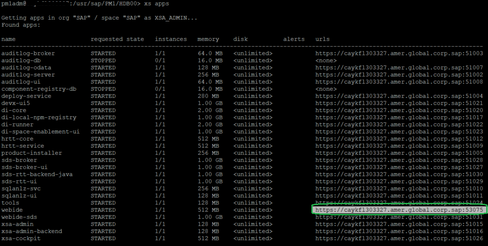

Paste the URL into a web browser and enter.

[DONE]

[ACCORDION-END]

[ACCORDION-BEGIN [Step 2: ](Add database to the Database Explorer)]

Select the __Database Explorer__ in the left navigation bar and click __Add a database to the Database__ Explorer.

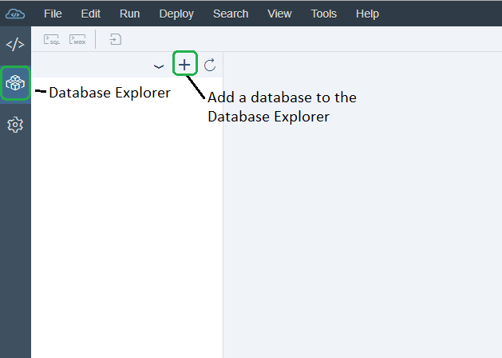

Fill out the information for the database.

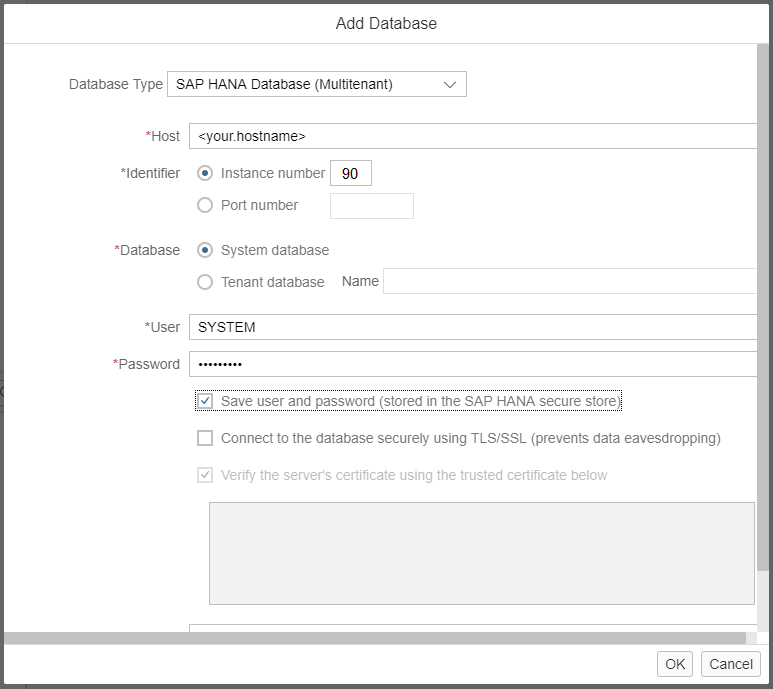
* Database Type: select __SAP HANA Database (Multitenant)__
* Host: enter the host name
* Identifier: select __Instance number__ and enter the instance number given to HANA (90 for SAP HANA Express)
* Database: select __System database__ or select __Tenant database__ and enter the name of the tenant database (HXE for SAP HANA Express)
* User: enter SYSTEM
* Password: enter SYSTEM user password
* Check the __Save user and password (stored in the SAP HANA secure store)__ box

Click OK to finish adding a database.

This is what it will look like if added successfully:

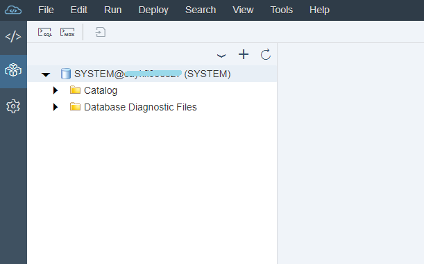

[VALIDATE_1]

[ACCORDION-END]


[ACCORDION-BEGIN [Step 3: ](Enable the Streaming Analytics Plugins)]

Go to __Preferences__ and select __Features__ in the left navigation bar.


Enable the __SAP Streaming Analytics__ and __SAP HANA Streaming Analytics Runtime Tool__.

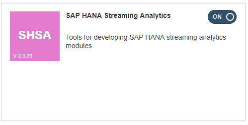
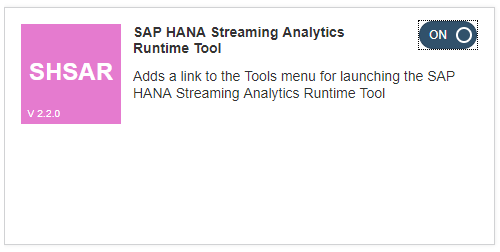

Click SAVE to refresh and enable features.

[DONE]

[ACCORDION-END]

[ACCORDION-BEGIN [Step 4: ](Create a Multi-Target Application Project)]

Go to __Development__, right-click __Workspace__ and select __New > Project from Template__

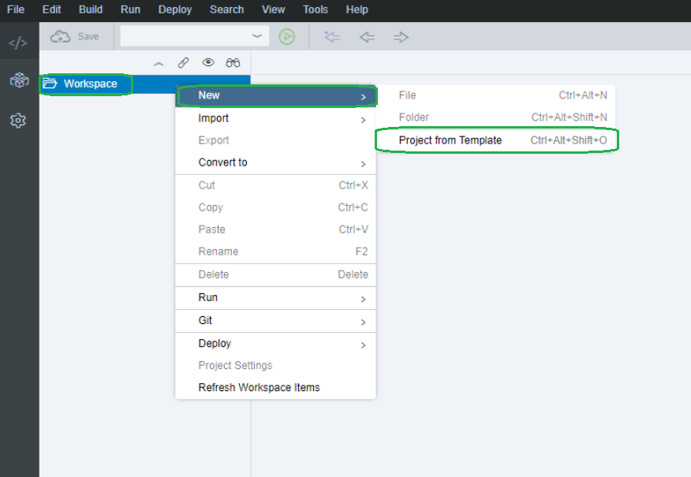

Select __Multi-Target Application Project__ and click Next.

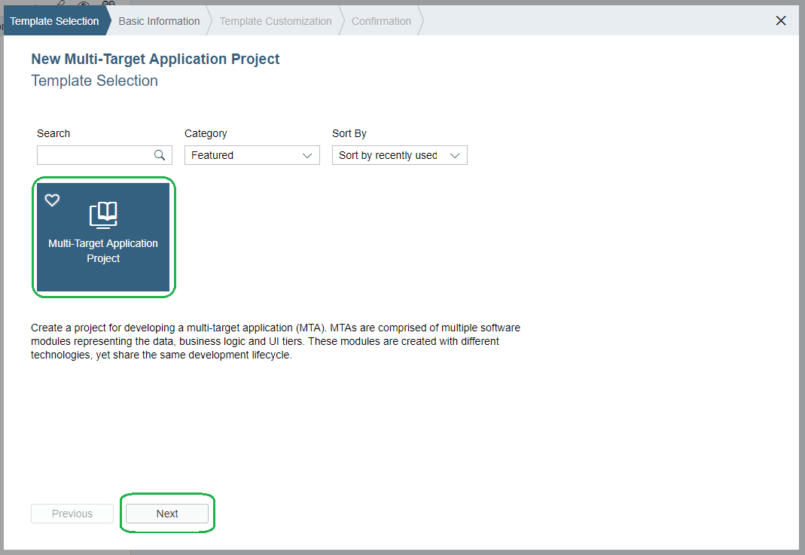

Enter a name for the MTA project and click Next.

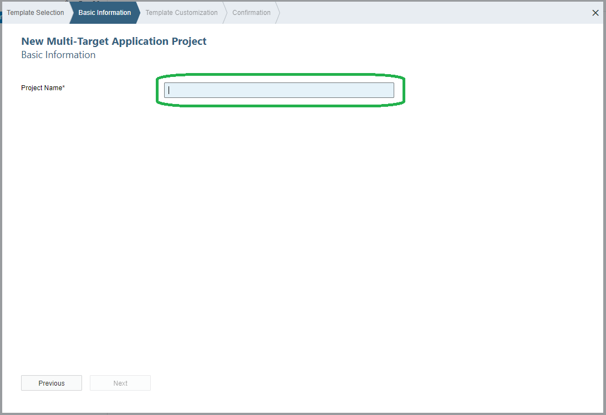

Select a Space from the drop-down menu and click Finish.

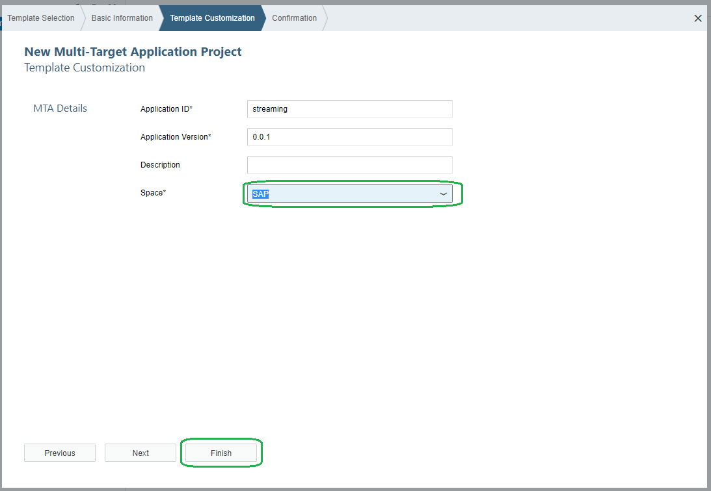

This is what it will look like if added successfully.

 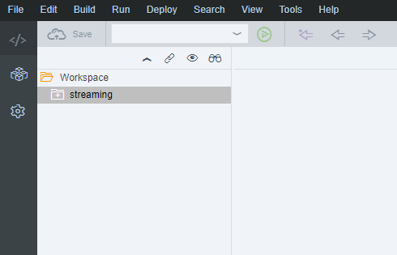

[DONE]

[ACCORDION-END]

---
