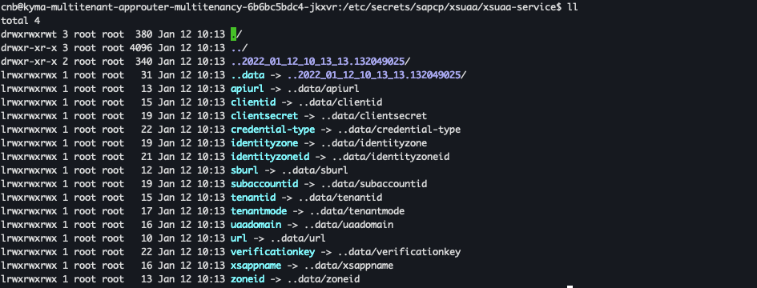

# Secure a Multitenant Application with the Authorization and Trust Management Service (XSUAA)
<!-- description --> Bind your multitenant application and the approuter application to the xsuaa service instance in the Kyma Runtime, which acts as an OAuth 2.0 client to your application.

## Prerequisites
- You have finished the tutorial [Create and Configure the Approuter Application for a Multitenant Application](create-configure-approuter-multitenant-application)

## You will learn
- How to create XSUAA instance for multitenancy in the Kyma runtime
- How to consume XSUAA instance credential from applications
- How to implement authentication and authorization logic in Node.js applications
- How to configure approuter application for multitenancy


---

### Get to know SAP Authorization and Trust Management Service


Each multitenant application has to deploy its own application router, and the application router handles requests of all tenants to the application. The application router is able to determine the tenant identifier out of the URL and then forwards the authentication request to the tenant User Account and Authentication (UAA) service and the related identity zone.

To use a multitenant application router, you must have a shared UAA service: [SAP Authorization and Trust Management Service (also known as XSUAA)](https://help.sap.com/viewer/product/CP_AUTHORIZ_TRUST_MNG/Cloud/en-US)


### Create XSUAA Instance and Credential with ServiceInstance and ServiceBinding


In Kubernetes, you can create and bind to a service instance using the Service Catalog. Create a new deployment file `k8s-deployment-services.yaml` to define objects for XSUAA instance and binding:

```YAML
################### XSUAA ###################
---
apiVersion: services.cloud.sap.com/v1alpha1
kind: ServiceInstance
metadata:
  name: xsuaa-service
spec:
  serviceOfferingName: xsuaa
  servicePlanName: application
  parameters:
    xsappname: multitenant-kyma-demo
    tenant-mode: shared  # define the application provider tenant as a shared tenant
    description: Security profile of called application
    scopes:
    - name: $XSAPPNAME.Callback
      description: With this scope set, the callbacks for subscribe, unsubscribe and getDependencies can be called.
      grant-as-authority-to-apps:
      - $XSAPPNAME(application,sap-provisioning,tenant-onboarding)  # provide access to the SAP SaaS Provisioning service SAP Authorization and Trust Management service (technical name: saas-registry) for calling callbacks and getting the dependencies API by granting scopes:  
    oauth2-configuration:
      redirect-uris:
      - https://*.<cluster-domain>/**

---
apiVersion: services.cloud.sap.com/v1alpha1
kind: ServiceBinding
metadata:
  name: xsuaa-service-binding
spec:
  serviceInstanceName: xsuaa-service
  secretName: xsuaa-service-binding
```

> Upon creation of the binding, the Service Catalog will create a Kubernetes Secret (by default with the same name as the binding) containing credentials, configurations and certificates.


### Access Instance Credential from Approuter and Backend Application


SAP's [approuter](https://www.npmjs.com/package/@sap/approuter) uses [`@sap/xsenv` package](https://www.npmjs.com/package/@sap/xsenv) internally to parse and load service keys and secrets bound to the application, this makes the process to load secrets easy.

Kubernetes offers several ways of handling application configurations for bound services and certificates. `@sap/xsenv` expects that such configurations are handled as Kubernetes Secrets and mounted as files to the pod at a specific path. This path can be provided by the application developer, but the default is `/etc/secrets/sapcp`. From there, `@sap/xsenv` assumes that the directory structure is the following `/etc/secrets/sapcp/<service-name>/<instance-name>`. Here `<service-name>` and `<instance-name>` are both directories and the latter contains the credentials/configurations for the service instance as files, where the file name is the name of the configuration/credential and the content is respectively the value.

For example, the following folder structure:

```Shell / Bash
/etc/
    /secrets/
            /sapcp/
                 /hana/
                 |    /hanaInst1/
                 |    |          /user1
                 |    |          /pass1
                 |    /hanaInst2/
                 |               /user2
                 |               /pass2
                 /xsuaa/
                       /xsuaaInst/
                                  /user
                                  /pass
```

> For more details, please visit [`@sap/xsenv` package page](https://www.npmjs.com/package/@sap/xsenv).

Now, mount the Secret just generated to the pods of both approuter and node application as a volume in the `k8s-deployment-backend.yaml` and `k8s-deployment-approuter.yaml`:

```YAML[2-4,12-14]
        volumeMounts:
        - name: xsuaa-volume
          mountPath: "/etc/secrets/sapcp/xsuaa/xsuaa-service"
          readOnly: true
        - mountPath: /tmp
          name: tmp
      securityContext:
        runAsNonRoot: true
      volumes:
      - emptyDir: {}
        name: tmp
      - name: xsuaa-volume
        secret:
          secretName: xsuaa-service-binding
```

> Secrets can be found in the directory `/etc/secrets/sapcp/<service-name>/<instance-name>`:
>
> 


### Add Authentication and Authorization Logic into Backend Application


**1.** Add libraries for enabling authentication in the `kyma-multitenant-node/app.js` file:

```JavaScript[3-7]
var app = express();

//**************************** Libraries for enabling authentication *****************************
var passport = require('passport');
var xsenv = require('@sap/xsenv');
var JWTStrategy = require('@sap/xssec').JWTStrategy;
//************************************************************************************************
```

**2.** Enable authorization in the `kyma-multitenant-node/app.js` file:

```JavaScript[4-9]
app.set('views', path.join(__dirname, 'views'));
app.set('view engine', 'jade');

//*********************************** Enabling authorization  ***********************************
var services = xsenv.getServices({ uaa: { tag: 'xsuaa' } }); //Get the XSUAA service
passport.use(new JWTStrategy(services.uaa));
app.use(passport.initialize());
app.use(passport.authenticate('JWT', { session: false })); //Authenticate using JWT strategy
//************************************************************************************************
```

**3.** Add dependency `"@kubernetes/client-node"` in the `kyma-multitenant-node/package.js` file, for example:

```JSON[2-4]
    "dependencies": {
        "@sap/xsenv": "^3",
        "@sap/xssec": "^3",
        "passport": "^0.4.0",
        ...
    }
}
```


### Enable Authentication for Approuter Application


Update the `xs-app.json` file:

```JSON[2,7]
{
    "authenticationMethod": "route",
    "routes": [{
        "source": "/",
        "target": "/",
        "destination": "dest_kyma_multitenant_node",
        "authenticationType": "xsuaa"
    }]
}
```


### Configure TENANT_HOST_PATTERN to Determine Identity Zone for Authentication


The application router must determine the tenant-specific subdomain for the UAA that in turn determines the identity zone, used for authentication. This determination is done by using a regular expression defined in the environment variable **`TENANT_HOST_PATTERN`**.

**`TENANT_HOST_PATTERN`** is a string containing a regular expression with a capturing group. The request host is matched against this regular expression. The value of the first capturing group is used as the tenant subdomain. For more details, please visit: [Multitenancy](https://help.sap.com/products/BTP/65de2977205c403bbc107264b8eccf4b/5310fc31caad4707be9126377e144627.html?locale=en-US).

**1.** Add a new `ConfigMap` to provide your Kyma cluster domain in the `k8s-deployment-approuter.yaml` file:

```YAML
---
apiVersion: v1
kind: ConfigMap
metadata:
  name: cluster-domain
data:
  cluster-domain: <cluster-domain>  ## adapt to your Kyma cluster
```

**2.** Refer to the `ConfigMap` and add environment variable **`TENANT_HOST_PATTERN`** in the `k8s-deployment-approuter.yaml` file:

```YAML[3-9]
      containers:
      - env:
        - name: CLUSTER_DOMAIN
          valueFrom:
            configMapKeyRef:
              key: cluster-domain
              name: cluster-domain
        - name: TENANT_HOST_PATTERN
          value: "^(.*)-approuter.$(CLUSTER_DOMAIN)"  
```


---
