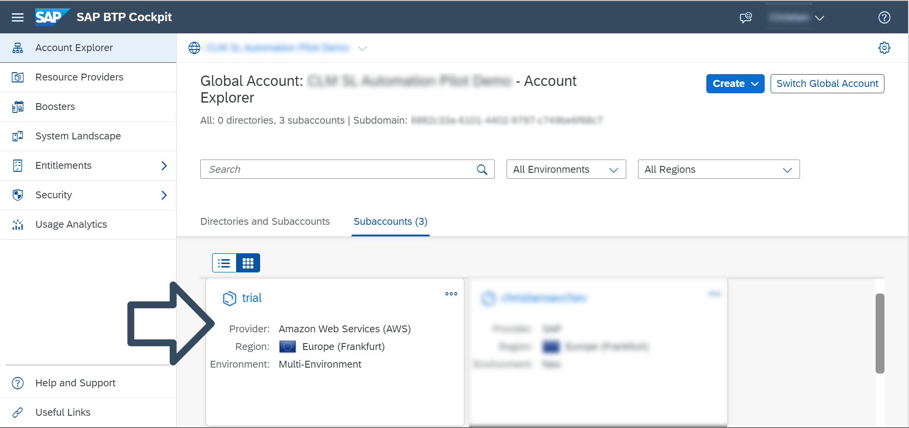
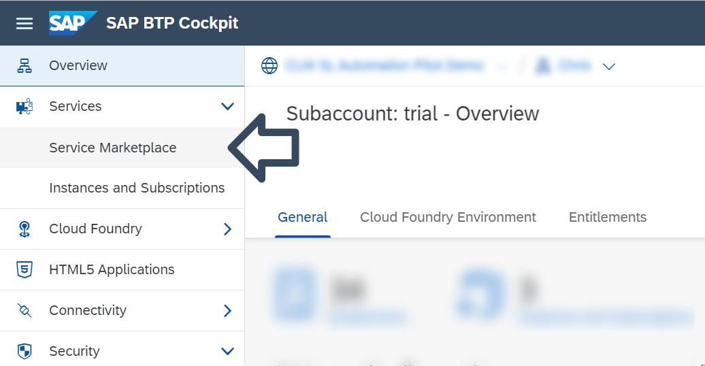
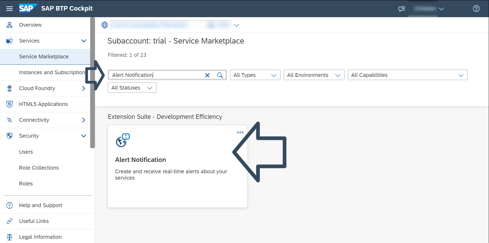
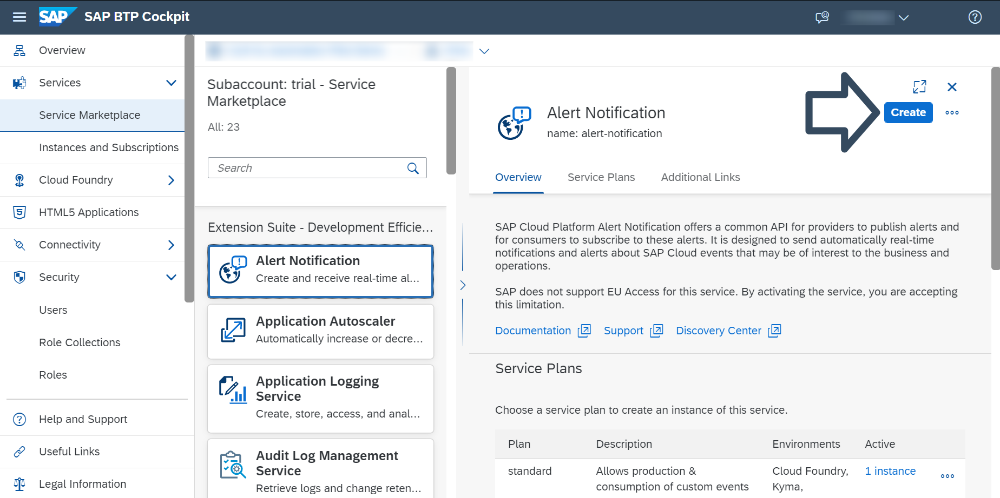
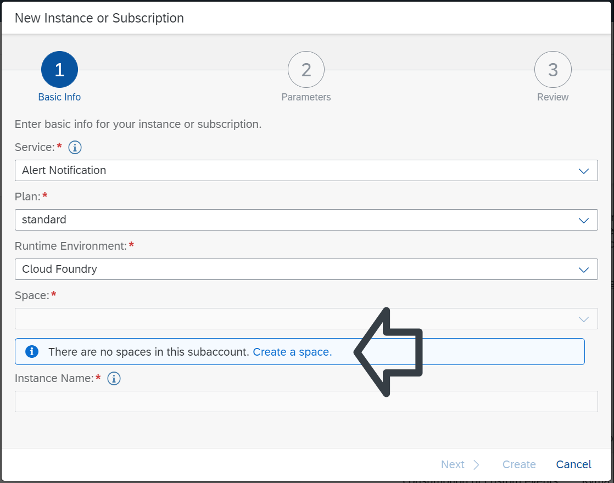
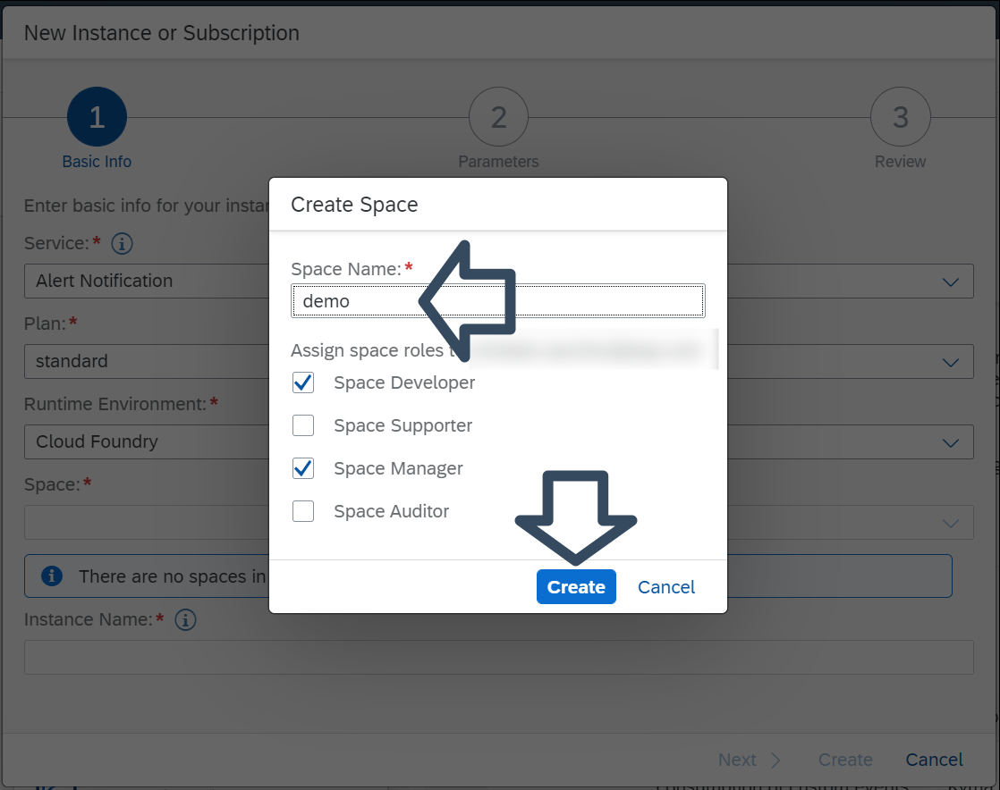
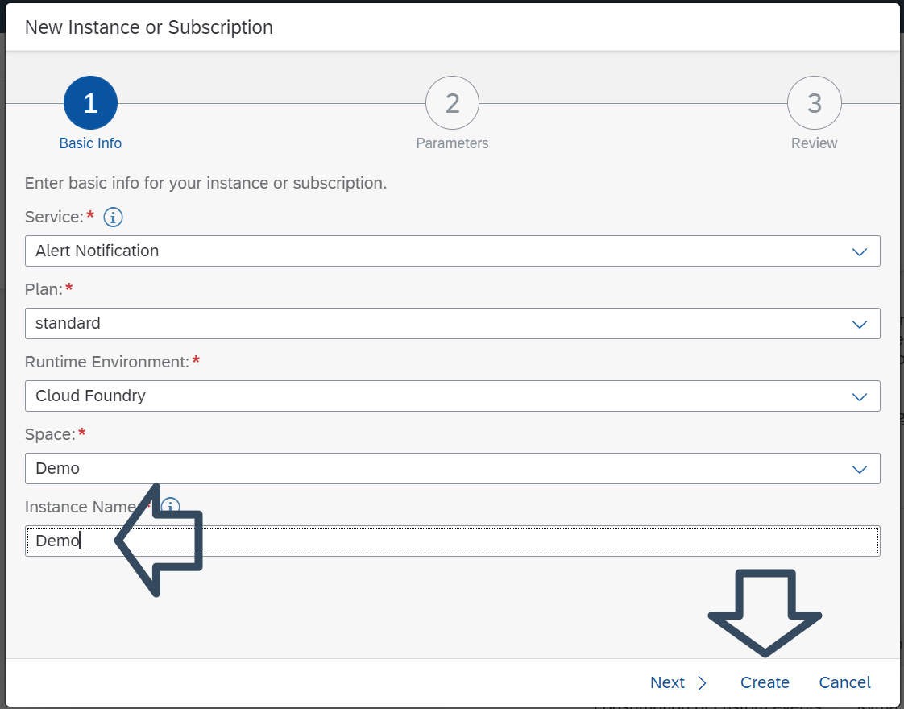
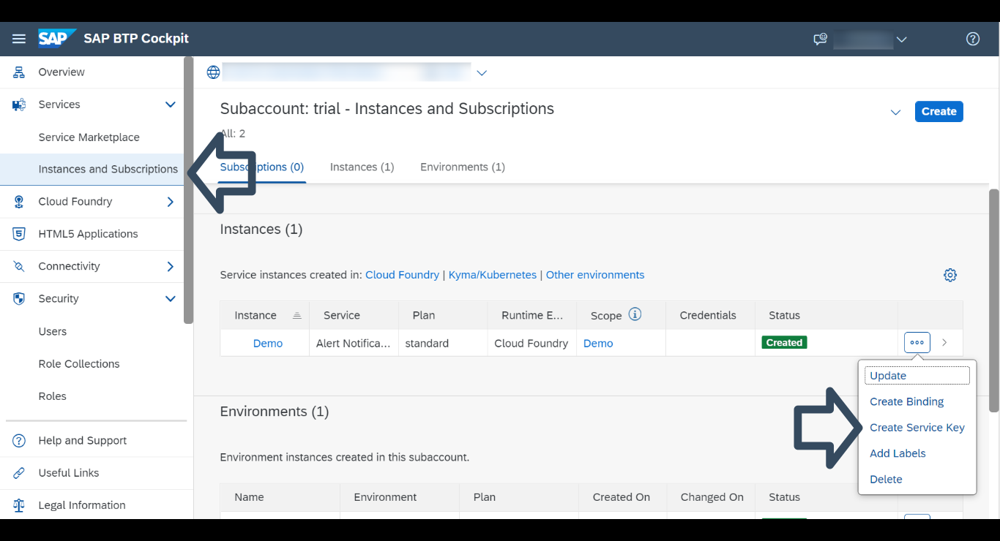
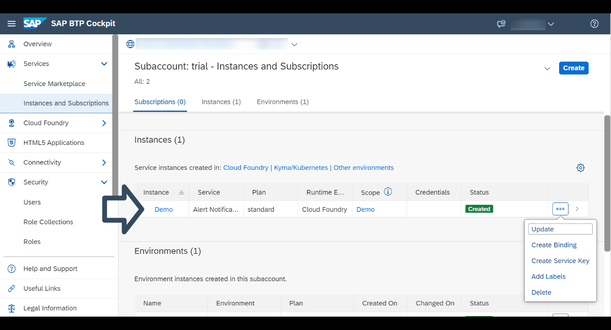
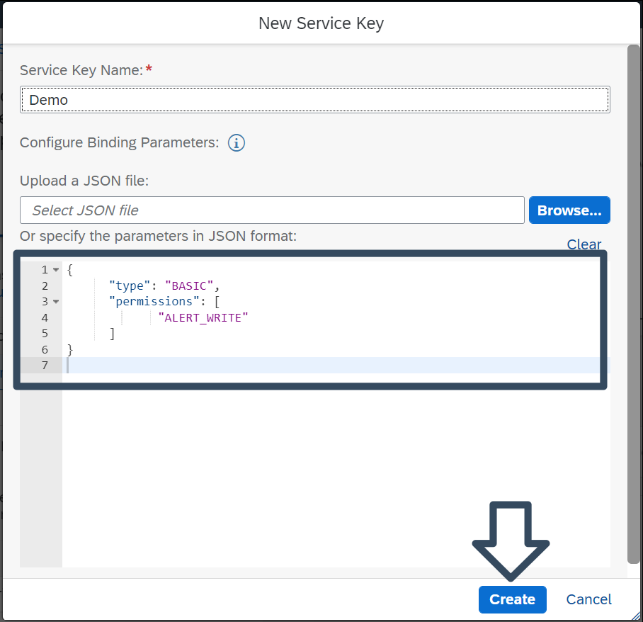

# Set Up SAP Alert Notification service for SAP BTP for Initial Use
<!-- description --> Learning how to enable SAP Alert Notification in your SAP BTP trial account.

## Prerequisites
 - If you are new to SAP BTP, follow the tutorial [View the SAP BTP from 10,000 Meters](cp-explore-cloud-platform).
 - If you do not have an SAP BTP account, follow the tutorial [Get a Free Account on SAP BTP Trial](hcp-create-trial-account).

## You will learn
   - How to enable SAP Alert Notification service in your SAP BTP trial account, so that you can use its features to create subscriptions and receive notifications about SAP BTP events to your preferred communication channel or monitoring tool.

## Intro

### Open the SAP BTP cockpit

1. Go to your [SAP BTP cockpit landing page](https://cockpit.hanatrial.ondemand.com/). Click the **Enter Your Trial Account** button to see your global account.

    >The name of the **Enter Your Trial Account** button may vary.


2. The global trial account contains subaccounts. Navigate to your subaccount by clicking on the tile named 'trial'

    >The name of the subaccount may vary if you created it manually.

    

3. In the left panel, choose **Services > Service Marketplace**.

    The **Service Marketplace** is where you can find services to attach to any of your applications. These services are provided by **SAP BTP** to create and produce applications quickly and easily. Once a service has been created, it is known as a `service instance`.

    

4. Search for **Alert Notification**, and click on the **Alert Notification** tile.

    


---

### Create an Instance and Open the Alert Notification Cockpit Page.

1. Click on the **Create** button to open the **New Instance** dialog.

    

2. Before creating an **Instance** you will need to create a **Space**. You can skip this step if you already have created a **Space** in your subaccount.

    

    Choose a name for your **Space** and click on the **Create** button.  

    


3. Enter a name for the instance and click on the **Create** button. No other configurations are needed.

    

4. To access your newly created **Instance**, choose **Instances and Subscriptions** from the left panel. Click on the **Actions** button, resembling three dots, to see your options for this particular **Instance**.

    To see the details of your **Instance** click on the arrow next to the **Actions** button.

    

5. To open the cockpit page of **Alert Notification** just click on the name of your **Instance**.

    


### Creating A Service Key

1. To create a **Service Key** choose the option **Create Service Key** from the **Actions** list and paste the following:


    ``` JSON
    {
      "type": "BASIC",
      "permissions": [
             "ALERT_WRITE"
      ]
    }
    ```

    
