# AI-driven Process Optimization: Run Machine Learning use cases in SAP Signavio leveraging SAP Build
<!-- description --> Extend your process mining event log by applying machine learning algorithms to boost your analysis and derive smarter decisions.

## You will learn
   - How to activate the OData and Ingestion API in SAP Signavio Process Intelligence
   - Read event log data using the OData API of SAP Signavio Process Intelligence 
   - Enrich the event log with machine learning algorithms with the python capabilities in SAP Build Code - Business Application Studio
   - Push the enriched event log back into SAP Signavio Process Intelligence

## Intro
In this tutorial, I want to take you on a journey into the world of SAP Signavio Process Intelligence. We'll explore how you can extend your event log, enrich it with machine learning algorithms, and seamlessly push back the updated event log into SAP Signavio Process Intelligence. The goal? To create a smarter, more proactive process management system.

Imagine this: You have a wealth of process mining data at your fingertips, but it's static. What if you could **predict outcomes and consume these predictions** into your event log, transforming it into a **dynamic, intelligent asset**? That's exactly what we're going to do using SAP Build Code with its Python and Jupyter capabilities.

**Example 1: Predicting Sales Order Delivery Times**

One of the most powerful applications of this approach is predicting when a sales order will be delivered. By analyzing historical event logs, we can **uncover patterns and trends** that influence delivery times. Using machine learning algorithms, we can predict future delivery times based on various factors such as order size, product type, and current workload. These predictions are then fed back into the event log, providing real-time insights into expected delivery times. This not only helps in better planning but also **improves customer satisfaction** by setting accurate delivery expectations.

**Example 2: Customer Satisfaction Prediction**

Another fascinating example is **predicting customer satisfaction** with support tickets. By examining event logs, we can identify factors that impact satisfaction, such as cycle times, resolution speed, and communication quality. Machine learning models can then predict the likelihood of a customer being satisfied based on these factors. This predictive data is reintegrated into the event log, enabling support teams to proactively address potential dissatisfaction and improve the overall customer experience.

**Why Is This Important?**

The essence of leveraging machine learning algorithms on event log data lies in the **proactive insights** it generates. Static event logs offer valuable historical data, but by applying machine learning, we transform this data into a **predictive powerhouse**. This empowers businesses to anticipate challenges, optimize processes, and deliver superior outcomes. The ability to consume these predictions into the event logs ensures that the process intelligence is always **up-to-date and actionable**.
In conclusion, extending your event log in SAP Signavio Process Intelligence with machine learning algorithms and reintegrating the predictions creates a smarter, more responsive process management system. Whether it's predicting delivery times, customer satisfaction, or identifying bottlenecks, the possibilities are limited only by your imagination. So, let's dive in and unlock the true potential of your process mining data with SAP Build Code and its Python and Jupyter capabilities.

An overview of the tutorial steps performed can be found below.
<!-- border; size:1200px -->
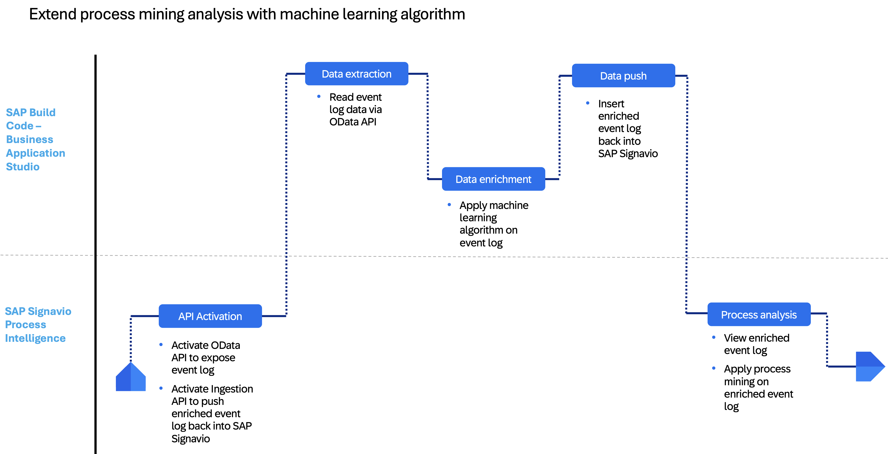

### Activate OData API and Ingestion API in SAP Signavio Process Intelligence

1. Firstly we need to activate the **OData API** and **Ingestion API** that allows us to retrieve and push data in and out of the system. We start with activating the Ingestion API.
2. This step can be easily performed in the system and should only take a few clicks. More information on how to activate the ingestion API and retrieve URL endpoint and API token can be found in the official [Signavio documentation](https://help.sap.com/docs/signavio-process-intelligence/user-guide/source-data-setup). 
    
    <!-- border; size:1200px -->
    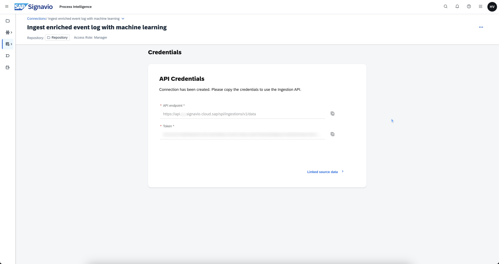

3. Then we activate an **OData API** in SAP Signavio Process Intelligence that allows us to extract data from the system. We can follow [this blog post here](https://community.sap.com/t5/technology-blogs-by-sap/report-on-sap-signavio-process-intelligence-data-using-the-new-odata-api/ba-p/13780759) on **how to activate a OData API** in SAP Signavio Process Intelligence. 

    <!-- border; size:1200px -->
    

4. We create an API token and a respective OData view that defines which data from the event log we want to expose.

    <!-- border; size:1200px -->
    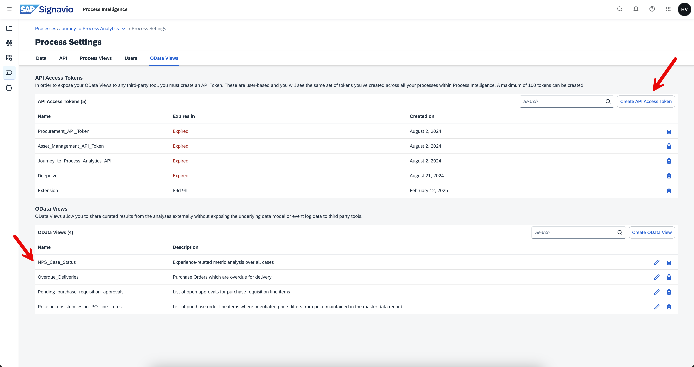


4. When we call the API endpoint using Postman, we can see the data and how the payload is structured. We see that there is a node called **value** and underneath it multiple records of the actual data of the event log.

    <!-- border; size:1200px -->
    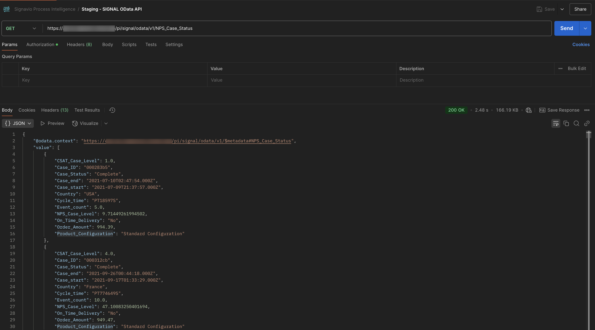 

### Read event log data via OData API in SAP Build Code

1. Before we can read data from the OData API, we need to establish a SAP Build Code environment and install the Python and Jupyter capabilities on it. We can follow [this blog post here](https://community.sap.com/t5/technology-blogs-by-sap/running-a-jupyter-notebook-in-sap-business-application-studio/ba-p/13565630) on **how to activate Python and Jupyter in SAP Build Code - Business Application Studio**. Once it is properly setup, you can run your first simple print command to check whether everything works correctly.

    <!-- border; size:1200px -->
    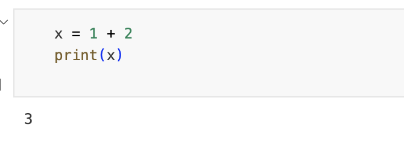

2. Now instead of using Postman, we can also use Python in SAP Build Code to call our OData API. For that we can follow [this blog post here](https://community.sap.com/t5/technology-blogs-by-members/consuming-odata-service-based-on-odp-extractor-in-python/ba-p/13476294) on **how to call an OData API in Python**.

3. We then need to adapt the code to our API, that means changing the URL, providing the API token and also selecting the specific columns that we want to retrieve. **A sample python code** of how to call the OData API can be found below. 
4. Once we receive the JSON response, we need to loop through the response and select the data we are interested in. In this example we are interested in `Case_ID`, `Country`, `Order_Amount` and `Product_Configuration`. 
5. This basically filters the payload for only these fields and then saves it into a `csv` attachment. We also added a print command at the end so we can see what the actual data looks like that is being retrieved.

    ```Python
    import requests 
    import pyodata
    import pandas as pd
    import io
    import json
    from datetime import datetime

    # Assign absolute URL to variable SERVICE_URL and call the get request with authentication details with header Prefer: odata.maxpagesize=500,odata.track-changes
    # Header Prefer: odata.track-changes only for delta capable extractors

    SERVICE_URL = 'https://api.<region>.signavio.cloud.sap/pi/signal/odata/v1/NPS_Case_Status?$format=json'
    response = requests.get(SERVICE_URL,auth = ("<not-applicable>", "<odata-api-token>"), headers = {"Prefer": "odata.maxpagesize=500","Prefer": "odata.track-changes"})


    # load JSON response Python dictionary object 
    init_json = json.loads(response.content)


    # Determine the length of Python dictionary 
    length = len(init_json['value'])


    # Declare two list l_record to capture individual record & l_output to capture complete output.
    l_output = []
    l_record = []


    # Create & append header row
    l_record = ('Case_ID', 'Country', 'Order_Amount', 'Product_Configuration')
    l_output.append(l_record)


    # loop through dictionary to read each record and append it to output list l_output
    i = 0
    while i < length:
        l_record = (init_json['value'][i]['Case_ID'], init_json['value'][i]['Country'],init_json['value'][i]['Order_Amount'],init_json['value'][i]['Product_Configuration'])
        l_output.append(l_record)
        i += 1


    # Create a dynamic file name: result_YYYY_MM_DD_HH_MM_SS.csv
    file_name = 'result_' + str(datetime.now().strftime('%Y_%m_%d_%H_%M_%S')) + '.csv'


    # Copy data from output list l_output into data frame df_file and write to file 
    df_file = pd.DataFrame(l_output)
    df_file.to_csv(file_name, index = False, header = False)


    print(l_output)
    ```

4. Once the data has been extracted successfully, we can see a preview of the dataset.

    <!-- border; size:1200px -->
    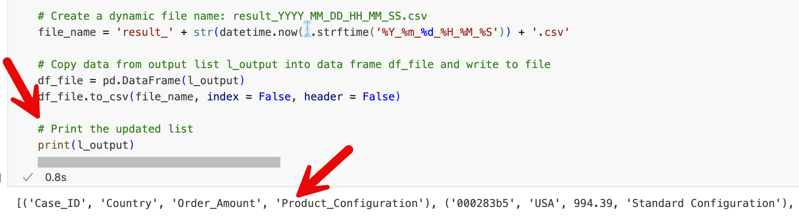

### Enrich event log with machine learning algorithm in SAP Build Code

1. Now that we have successfully retrieved the event log data, we can apply any python algorithm on it. In this example we split the event log data into a training (70%) and test (30%) dataset and apply the random forest algorithm to predict a specific column for us, in this case `Product_Configuration`. 
2. We start of by creating a data frame from the selected JSON payload we saved from the OData API call and check for consistencies within the data, such as whether the first row of the data excludes column names and whether `Order_Amount` is a numeric field. As we also do not need the `Case_ID` to training the machine learning model, we can also remove it from the data set for the time being. 
3. The column `Country` and `Product_Configuration` are string fields, with which the machine learning algorithm can't work with. Hence we need to apply an encoder, which breaks the string outputs into numbers. 
4. Once we have defined the matrix of input columns of the model, which is `Country` and `Order_Amount`, and our to be predicted column, which is `Product_Configuration`, we can train this model using the training dataset and test its accuracy using the test dataset. We can also then add a validation column that checks whether the model predicted correctly or wrongly. 
5. Once we have trained the model, we also add back the `Case_ID` column. A sample code on how to enrich the event log by applying a random forest model can be found below:

    ```Python
    import pandas as pd
    from sklearn.ensemble import RandomForestClassifier
    from sklearn.model_selection import train_test_split
    from sklearn.preprocessing import LabelEncoder
    from sklearn.metrics import accuracy_score

    # Create DataFrame from l_output
    data = pd.DataFrame(l_output, columns=["Case_ID", "Country", "Order_Amount", "Product_Configuration"])

    # Check if the first row mistakenly contains column names
    if data.iloc[0].equals(pd.Series(["Case_ID", "Country", "Order_Amount", "Product_Configuration"], index=data.columns)):
        data = data.iloc[1:].reset_index(drop=True)  # Drop the first row and reset index

    # Retain Case_ID for later use
    data_case_id = data['Case_ID']

    # Drop Case_ID from the data for model training
    data = data.drop(columns=["Case_ID"])

    # Ensure 'Order_Amount' is numeric
    data["Order_Amount"] = pd.to_numeric(data["Order_Amount"], errors='coerce')

    # Encode "Country"
    encoder = LabelEncoder()
    data["Country"] = encoder.fit_transform(data["Country"])

    # Encode "Product_Configuration"
    label_encoder = LabelEncoder()
    data["Product_Configuration"] = label_encoder.fit_transform(data["Product_Configuration"])

    # Prepare the feature matrix (X) and target vector (y)
    X = data[['Country', 'Order_Amount']]
    y = data['Product_Configuration']

    # Split the data into training and test sets
    X_train, X_test, y_train, y_test = train_test_split(X, y, test_size=0.3, random_state=42)

    # Train Random Forest model
    rf = RandomForestClassifier(n_estimators=10, max_depth=5, min_samples_split=10, min_samples_leaf=10, random_state=42)
    rf.fit(X_train, y_train)

    # Make predictions
    y_pred = rf.predict(X_test)

    # Convert predictions and actual values back to original labels
    y_pred_labels = label_encoder.inverse_transform(y_pred)
    y_true_labels = label_encoder.inverse_transform(y_test)

    # Convert encoded 'Country' back to original names
    X_test['Country'] = encoder.inverse_transform(X_test['Country'])

    # Calculate accuracy
    accuracy = accuracy_score(y_true_labels, y_pred_labels)
    print(f"Model Accuracy: {accuracy * 100:.2f}%")

    # Create test results DataFrame
    test_results = X_test.copy()
    test_results.insert(0, 'Case_ID', data_case_id.loc[test_results.index])  # Ensure Case_ID is first column
    test_results['Actual_Configuration'] = y_true_labels
    test_results['Predicted_Configuration'] = y_pred_labels

    # Add a column to mark correct predictions ("Yes") and incorrect ones ("No")
    test_results["Correct_Prediction"] = (test_results["Actual_Configuration"] == test_results["Predicted_Configuration"]).map({True: "Yes", False: "No"})

    # Print test results
    print(test_results)
    ```

6. If our conversion is successful, we will see a preview of the data frame including a percentage of the model accuracy.
       <!-- border; size:1200px -->
    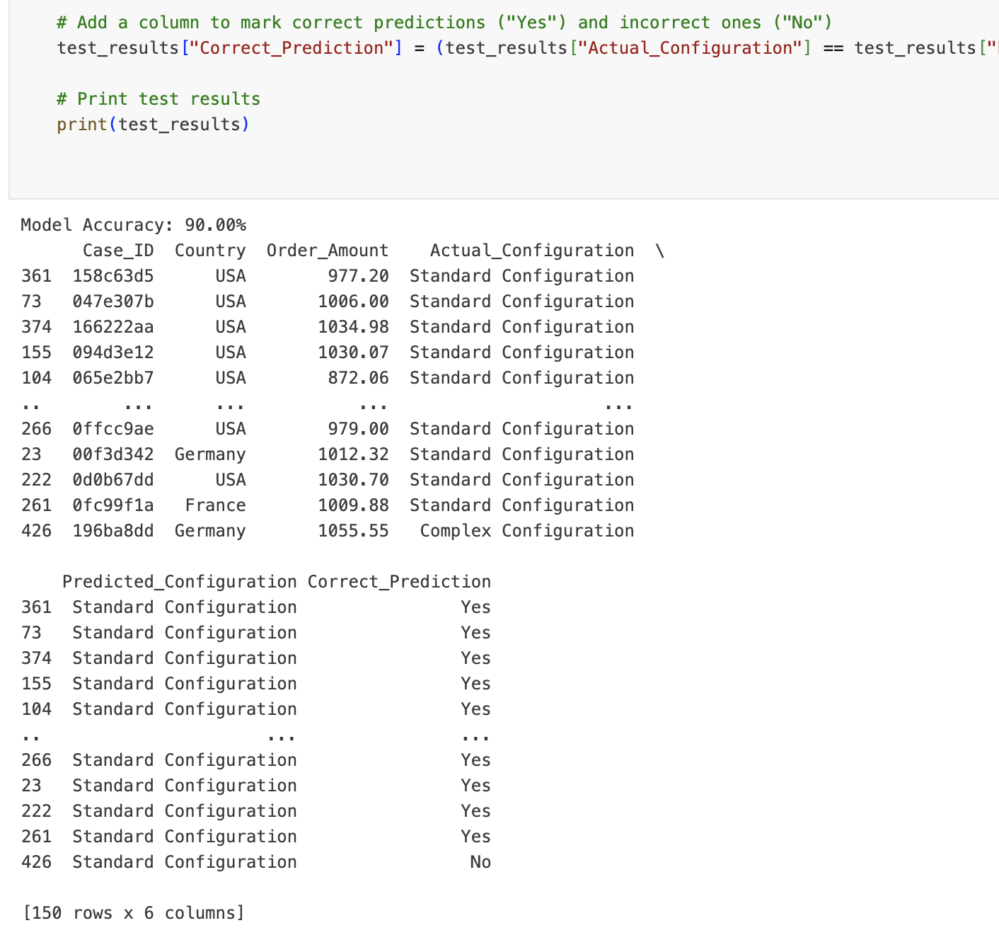

7. Once we have trained and tested our model, we need to convert the data frame into a `csv` format so that we can push the updated data back into SAP Signavio Process Intelligence. 
8. We also need to add the column names in the first row of the `csv` file. A sample python code can be found below:

    ```Python
    [# Convert the results to CSV format with the column names as the first row
    csv_data = test_results.to_csv(index=False, sep=',', header=True)
    print(csv_data)

    # Optionally, save to a CSV file without the first row as it is already handled:
    test_results.to_csv('test_results_with_predictions.csv', index=False)]
    ```

9. If our `csv` conversion is successful, we can see our data in `csv` format with the column name in the first row.
    <!-- border; size:1200px -->
    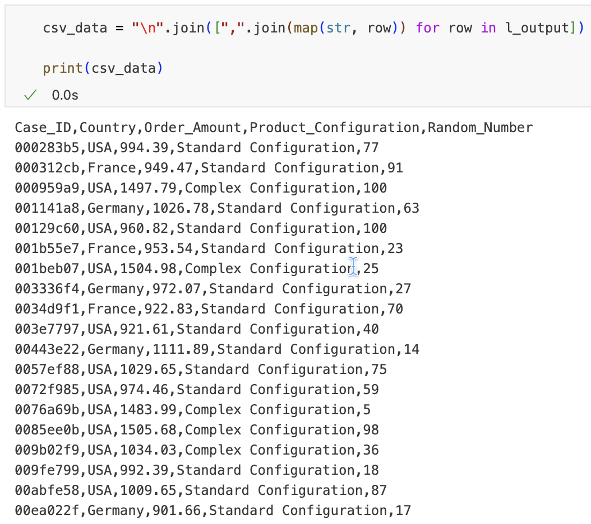


### Push enriched event log into SAP Signavio Process Intelligence from SAP Build Code

1. Now that we have activated the Ingestion API and enriched the event log, we can perform the data push into SAP Signavio Process Intelligence. 
2. For that we leverage the official [API specification](https://api.sap.com/api/ingestion_api) of the Ingestion API in combination with the transformation logic we used in our [developer tutorial](https://developers.sap.com/tutorials/setup-upload-ci-signavio-pi.html) using SAP Integration Suite. 
3. As a result we get a python code that can perform the data push. A sample python code can be found below:  

    ```Python
    import requests
    import json

    # Define API endpoint (Choose correct region)
    url = "https://api.<region>.signavio.cloud.sap/spi/ingestions/v1/data"  # Change region if needed

    # Access token for authentication
    access_token = "<api-token>"

    # Define schema as JSON (adjust fields based on your data structure)
    schema = json.dumps({
        "type": "record",
        "name": "RandomForrestPrediction",
        "fields": [
        {"name": "Case_ID", "type": ["null", "string"]},
        {"name": "Country", "type": ["null", "string"]},
        {"name": "Order_Amount", "type": ["null", "double"]},
        {"name": "Actual_Configuration", "type": ["null", "string"]},
        {"name": "Predicted_Configuration", "type": ["null", "string"]},
        {"name": "Correct_Prediction", "type": ["null", "string"]}
    ]

    })

    # Define primary keys
    primary_keys = "Case_ID"  # Adjust based on your needs

    csv_data = test_results.to_csv(index=False, sep=',', header=True)

    # Construct the multipart request body manually
    boundary = "cpi"
    body = (
        f"--{boundary}\r\n"
        f'Content-Disposition: form-data; name="schema"\r\n\r\n'
        f"{schema}\r\n"
        f"--{boundary}\r\n"
        f'Content-Disposition: form-data; name="files"; filename="RandomForrestPrediction.csv"\r\n'
        f"Content-Type: text/csv\r\n\r\n"
        f"{csv_data}\r\n"
        f"--{boundary}\r\n"
        f'Content-Disposition: form-data; name="primaryKeys"\r\n\r\n'
        f"{primary_keys}\r\n"
        f"--{boundary}--\r\n"
    )

    # Define headers
    headers = {
        "Authorization": f"Bearer {access_token}",
        "Content-Type": f"multipart/form-data; boundary={boundary}"
    }

    # Make the request
    response = requests.post(url, headers=headers, data=body)

    # Print the response
    print(response.status_code, response.text)
    ```

4. If the API call is successful, we should receive a HTTP 200 response.
    <!-- border; size:1200px -->
    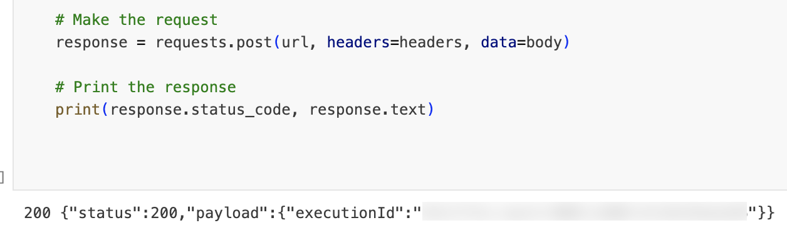

### Viewing and analyzing enriched event log in SAP Signavio Process Intelligence

1. Once the data push of the enriched event log was successful, we can view the new data model in our source data.
    
    <!-- border; size:1200px -->
    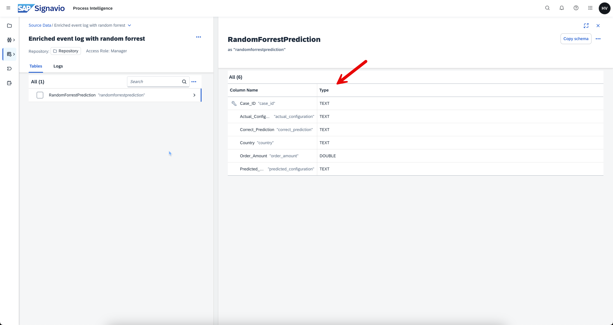

2.  We can also view the underlying values by previewing a dedicated data view.
    <!-- border; size:1200px -->
    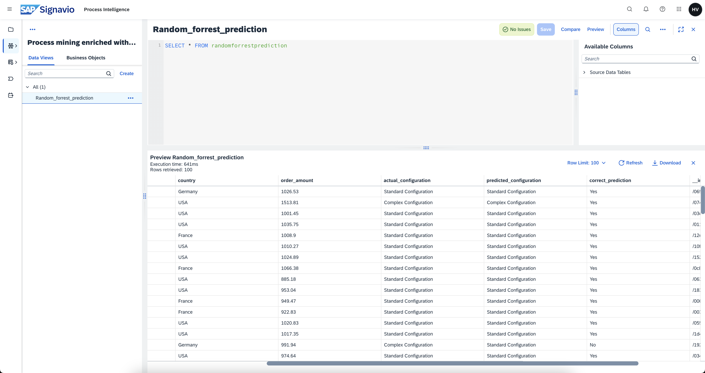

### Conclusion

With that we have successfully implemented a machine learning scenario using SAP Build Code - Business Application Studio by enriching the event log in SAP Signavio Process Intelligence.
We were able to:

1. Enriched our dataset that can now enhance our process mining analysis for many use cases
2. We setup the technical connectivity, data transformation and applied machine learning algorithm 

Below some useful links relating our API documentation. If you have any questions feel free to reach out to me

[SAP Signavio Process Intelligence APIs](https://help.sap.com/docs/signavio-process-intelligence/api-guide/intro)

[Ingestion API - Help documentation](https://help.sap.com/docs/signavio-process-intelligence/api-guide/ingestion-api)

[Ingestion API - Postman collection](https://github.com/SAP-samples/signavio-api/tree/main/SAP%20Signavio%20Process%20Intelligence/Ingestion%20API)


[Ingestion API - Business Accelerator Hub](https://api.sap.com/api/ingestion_api/overview)


[OData API - Help documentation](https://help.sap.com/docs/signavio-process-intelligence/api-guide/signal-odata-api)


[OData API - Postman collection](https://github.com/SAP-samples/signavio-api/tree/main/SAP%20Signavio%20Process%20Intelligence/SIGNAL%20OData%20API)


[OData API - Business Accelerator Hub](https://api.sap.com/api/signal_odata/overview)


