# Setup a scheduled data upload from SAP S/4HANA Cloud via SAP Cloud Integration to SAP Signavio Process Intelligence
<!-- description --> Learn how to setup a scheduled upload of data from S/4HANA Cloud to SAP Signavio Process Intelligence using its ingestion API via SAP Cloud Integration.

## Prerequisites
 - You will need access to a SAP S/4HANA Cloud system.
 - You will need access to a SAP Cloud Integration tenant.
 - You will need access to a SAP Signavio Process Intelligence workspace.

## You will learn
   - how to activate all relevant APIs in SAP S/4HANA Cloud and SAP Signavio Process Intelligence and build the integration flow in SAP Cloud Integration to setup the scheduled data upload

## Intro

### Activate API in SAP S/4HANA Cloud

1. Lets log on to our S/4HANA Cloud system and activate the API. In this scenario I am leveraging the [Commercial Project Read API](https://api.sap.com/api/_CPD_SC_EXTERNAL_SERVICES_SRV/overview). We go to the app **maintain communication user** to create a new technical user that handles the basic authentication for the API.

    >The communication user will be used for the technical authentication.

    <!-- border; size:1200px -->
    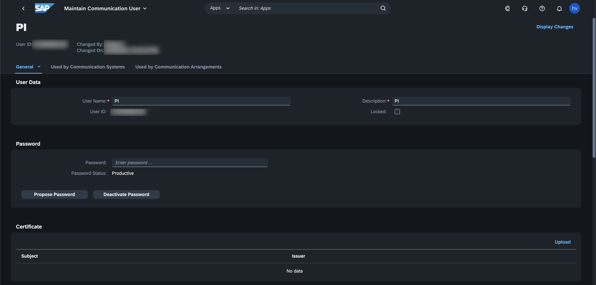


2. Then we create a communication system in the app **maintain communication system** and assign our communication user to it. Here you can maintain any host name, as we are only interested in reading data from S/4HANA Cloud.

    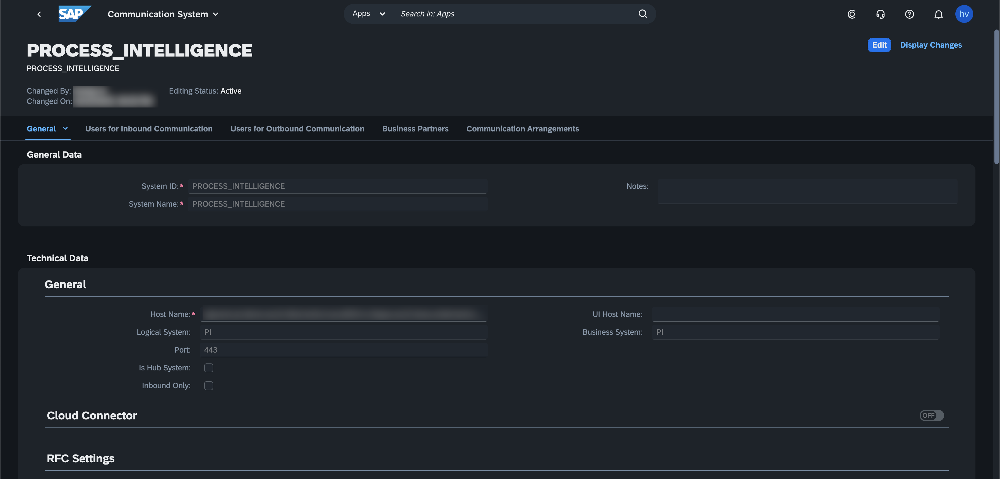

3. Now we activate the respective API. For that we go the app **maintain communication arrangement** and create the arrangement SAP_COM_0054. Once we saved the arrangement our API is ready to be used. We can also see the URL of our API.

    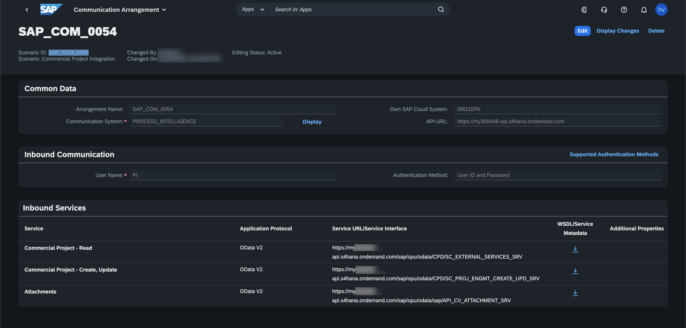

### Activate API in SAP Signavio Process Intelligence

4. We logon to Signavio and on the top right corner we access the product Process Intelligence.

   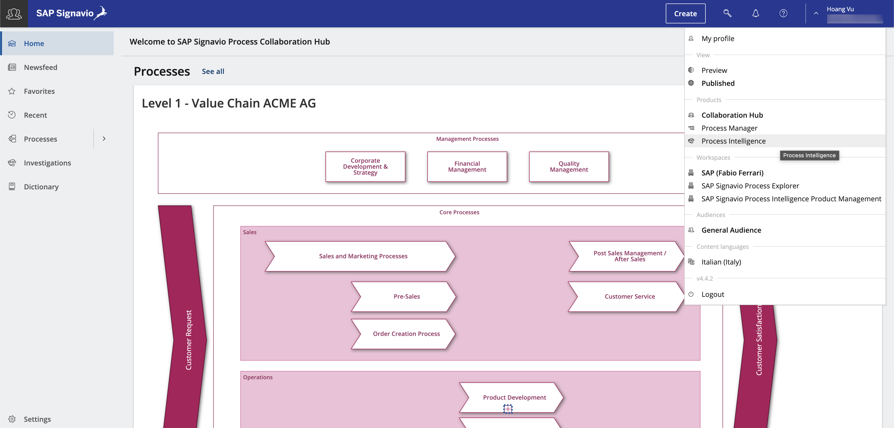

5. Once we access Process Intelligence we can click on the top right corner on **Manage Data**.

   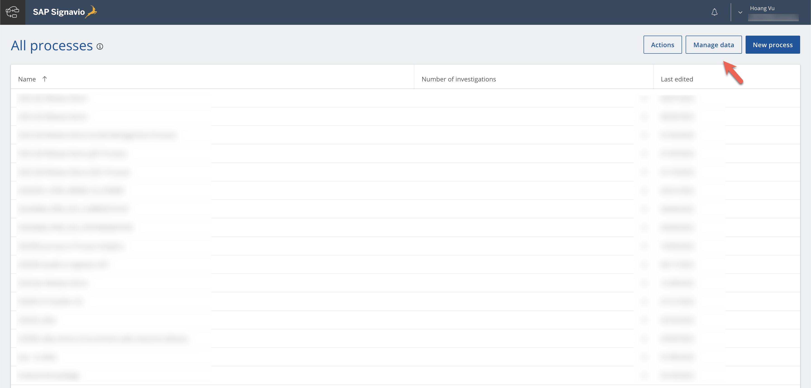

6. Then we see our process data pipelines. On the left side click on **Connections**.

   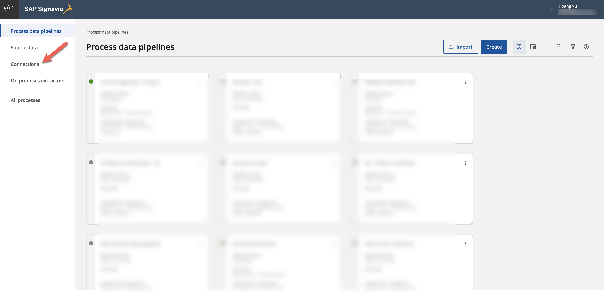
   
7. Here we create a new connection.

   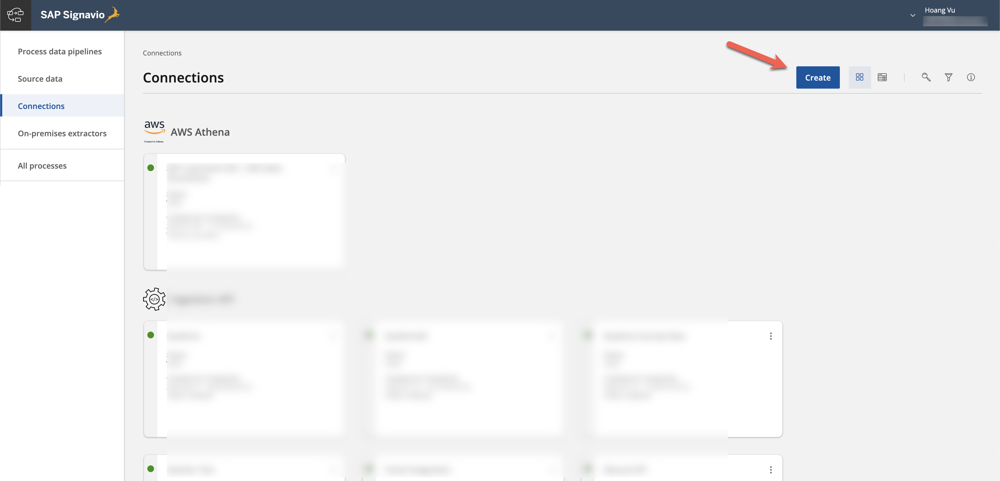

8. Under "Other" we select Ingestion API and give the connection a name. Once we save the connection, we get the URL endpoint and a token to call the API.

   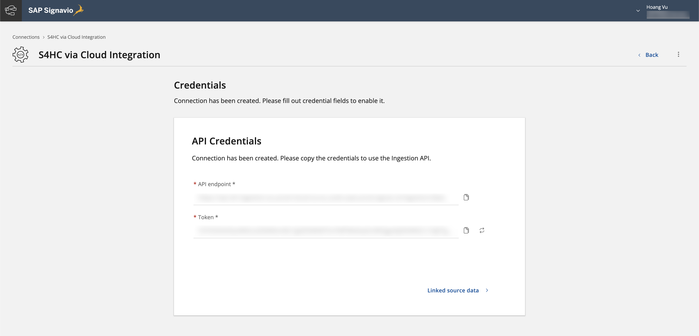

---

### Configure Integration Flow.

1. All APIs that we want to use are ready. Now we log on to Cloud Integration and create an integration flow that looks like this:

    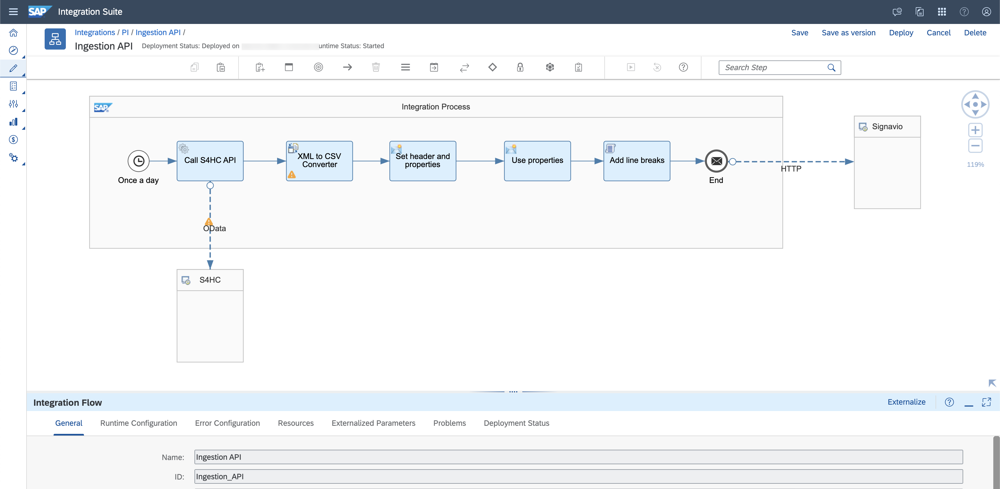

2. Lets go through each element here. The integration flow starts with a timer event, that we schedule to run every hour between a specific time interval.

    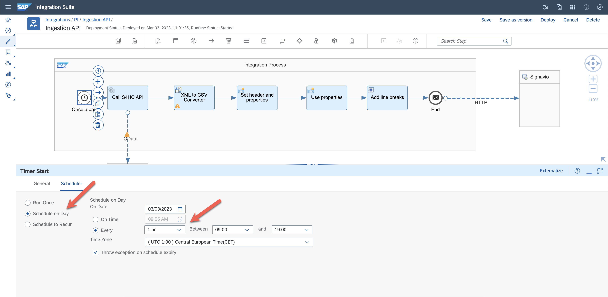


3. In the next step we add a Request Reply as we are calling a synchronous OData API. In the OData channel we insert the URL we received from the communication arrangement and the credential name from the communication user in S/4HANA Cloud. Note that the credential name needs to be maintained in the monitoring tab under **Security Materials**.

    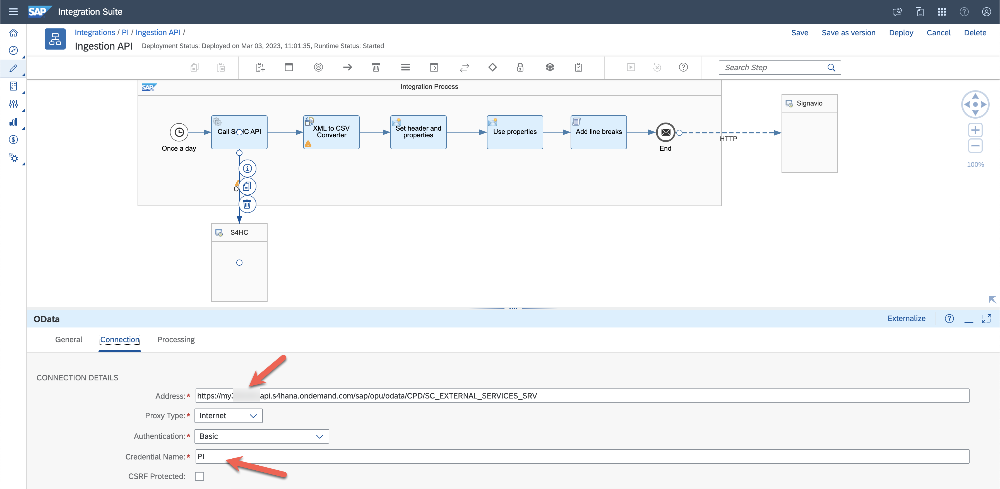

4. In the processing tab of the OData channel, we also select the fields we want to retrieve from the API. In my scenario I selected following fields for demo purposes.


    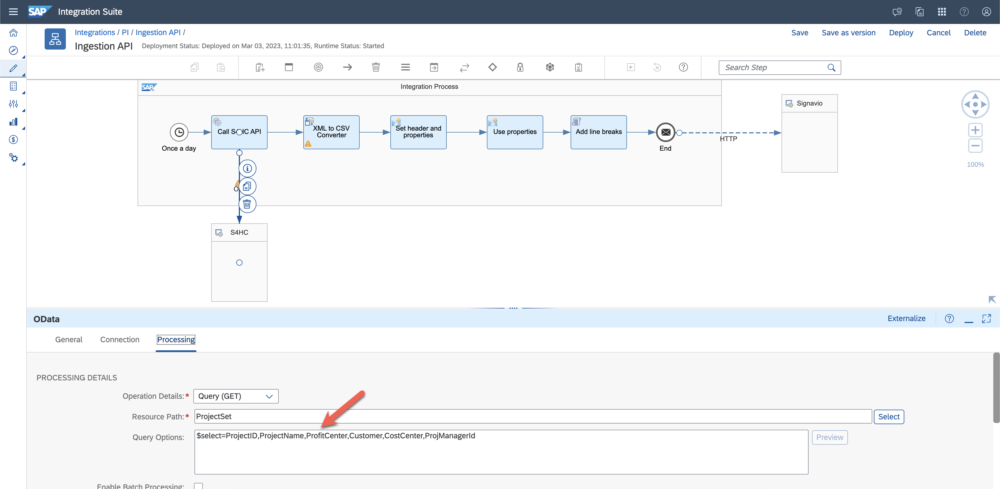

5. Now that we have retrieved the data in XML format, we convert it to CSV as this is the format that the ingestion API expects. For the we use the module XML to CSV converter.We select the field separator to be comma and include the field names as headers.

    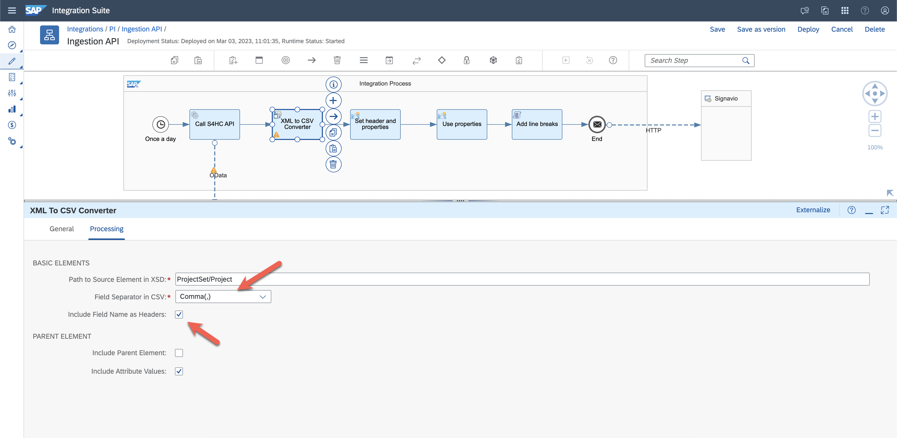

6. In the next step I created a content modifier and set the message header **Accept** to **`application/json`**.

    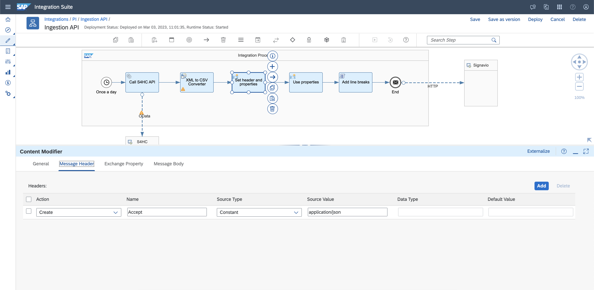

7. I also set the properties required by the API. **Primary key**: I use the mandatory field ProjectID. **Schema**: Here we insert the schema of our extracted data. As we are using it in our exchange property, it has to be in one row without spaces.
   
    ```JSON 
        {
            "type":"record",
            "name":"Projects",
            "fields":[
                {
                    "name":"ProfitCenter",
                    "type":[
                        "null",
                        "string"
                    ]
                },
                {
                    "name":"CostCenter",
                    "type":[
                        "null",
                        "string"
                    ]
                },
                {
                    "name":"ProjectName",
                    "type":[
                        "null",
                        "string"
                    ]
                },
                {
                    "name":"Customer",
                    "type":[
                        "null",
                        "string"
                    ]
                },
                {
                    "name":"ProjectID",
                    "type":[
                        "null",
                        "string"
                    ]
                },
                {
                    "name":"ProjManagerId",
                    "type":[
                        "null",
                        "string"
                    ]
                }
            ]
        }
    ```

**Content type**: **`multipart/form-data; boundary=cpi`** The boundary separates the different values in the payload later. **Token**: **`Bearer <token from Process Intelligence>`** Here we insert the token we received from activating the ingestion API in Process Intelligence. 

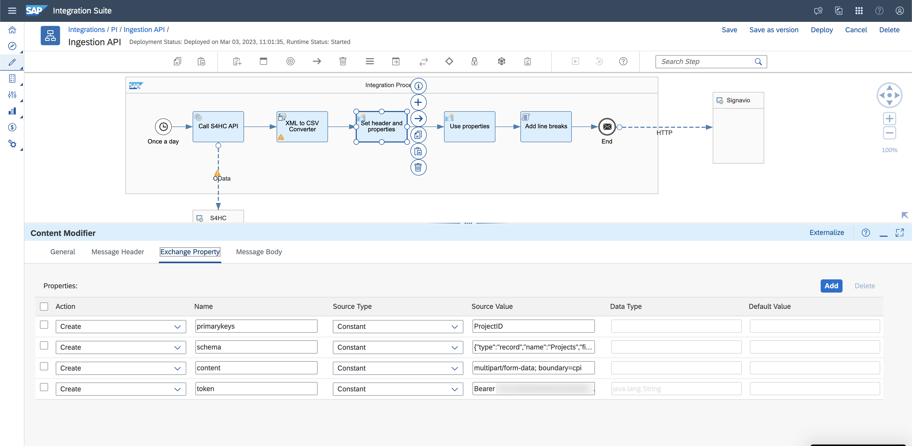

8. In the next step I created an additional content modifier and insert the property content type and token into the header. The reason why I did not do it directly is that I encountered some issues when the message header had a blank space in between, which mine did. If anyone knows a nicer way to handle this, please let me know!

    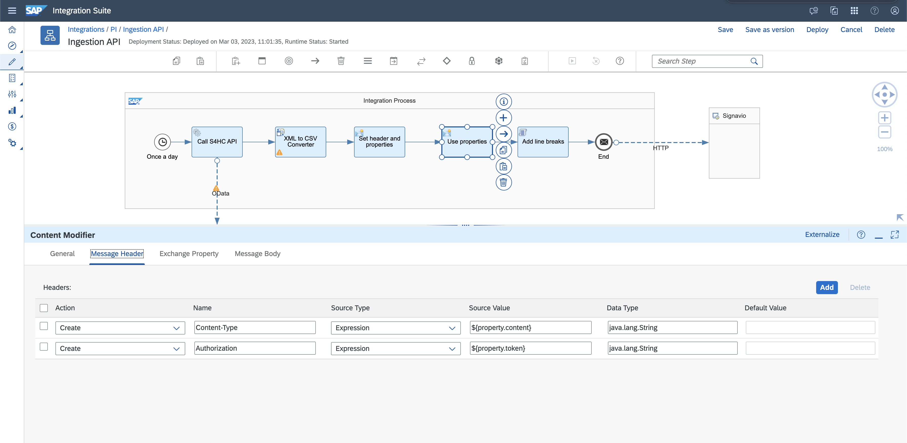

9.  Now I added a groovy script to overcome the line ending issues mentioned in this [blog](https://blogs.sap.com/2019/11/14/what-is-form-data-and-how-to-send-it-from-sap-cloud-platform-integration-cpi/). My groovy script looks like this: 
   
    ```JavaScript
    [import com.sap.gateway.ip.core.customdev.util.Message;
    import java.util.HashMap;
    def Message processData(Message message) {
    //Body 
       map = message.getProperties();
	   schema = map.get("schema");
	   primarykeys = map.get("primarykeys");
    //Body 
       def body = message.getBody(String);
       body = body.replaceAll("\n", "\r\n");
       body = """--cpi\r\nContent-Disposition: form-data; name="schema"\r\n\r\n\r\n""" + schema + """\r\n--cpi\r\n""" + """Content-Disposition: form-data; name="files"; filename="S4.csv"\r\nContent-Type: text/csv\r\n\r\n\r\n""" + body +"""--cpi\r\nContent-Disposition: form-data; name="primaryKeys"\r\n\r\n""" + primarykeys + """\r\n--cpi--"""

       message.setBody(body);
       return message;
       }]
    ```

10. In the final step we need to configure a http channel to the ingestion API in Process Intelligence. As we already provided the authorization directly in the message header with the content modifier, we select no authorization here and just insert the endpoint URL.
    
    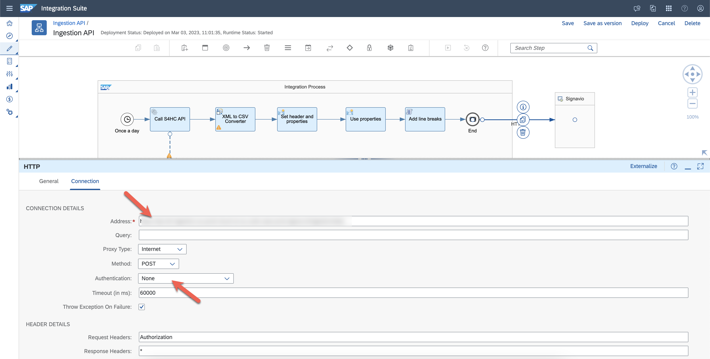

### Results

1. Once you run the integration flow successfully, you can logon the Process Intelligence where you setup the ingestion API and click on "Linked source data". There you can see all the fields that have been replicated from Cloud Integration to Process Intelligence

    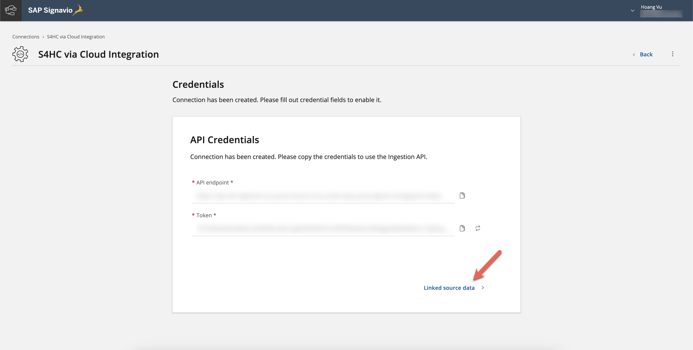

2. You can also see that we set ProjectID as our primary key with this indicator:

    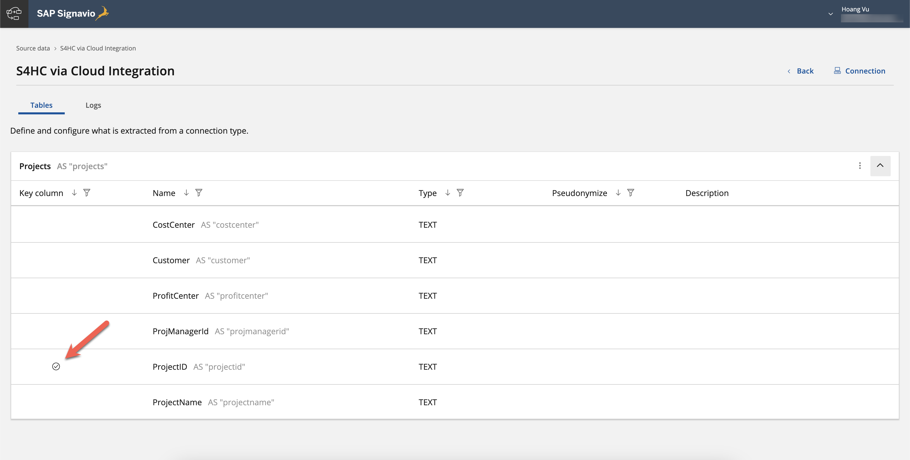

3. And that sums up the configuration steps to setup your first simple scenario to upload data into Signavio Process Intelligence using Cloud Integration. However, this is only the start! We will invest more in bringing Cloud Integration and Signavio Process Intelligence together for API-based integration scenarios. If you have any specific requirement to upload data into Signavio Process Intelligence where you are evaluating different connectivity options, feel free to reach out to me.

