# Acquire a Template Project from the Store
<!-- description --> Acquire Orders Management package from the SAP Process Automation store and reuse the package in the Application Development.

## Prerequisites
 - [Subscribe to SAP Process Automation Using Booster in SAP BTP Free Tier](spa-subscribe-booster)

## You will learn
  - How to explore content in the SAP Process Automation Bot Store.
  - How to acquire the **Orders Management using UI5 application** package from SAP Process Automation's Store.
  - How to reuse a package from the Store in the Application Development.

---
### Explore the store

The Store offers predefined content for your automation. Packages are categorized by catalog which let you choose between Business Content, Learning Content and SAP Intelligent RPA SDK.

1. Navigate to the store in your SPA Tenant.

<!-- border -->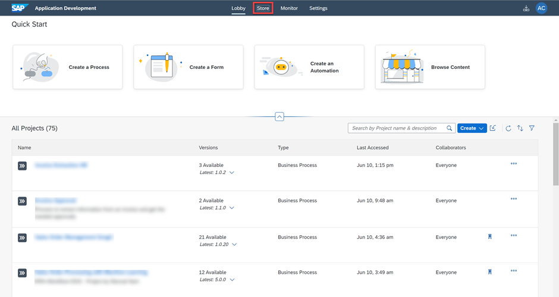

**Learning Content** offers learning packages to get started with the Application Development tool. These packages allow you to learn best practices by reusing the most common flows to design your first projects.

**Business Content** provides pre-built automations for concrete business problems.

**SAP Intelligent RPA SDK** provides all the Software Developments Kits that can be acquired from the store.

Select one or more filters on the left to filter the available Store projects by Project Type (for example Live Process and Process Automation), Format Type (for example, Ready to use and Template), Catalog (for example, Business Content), Product (for example, SAP S/4HANA Cloud), Publisher, Line of Business, and Industry.

<!-- border -->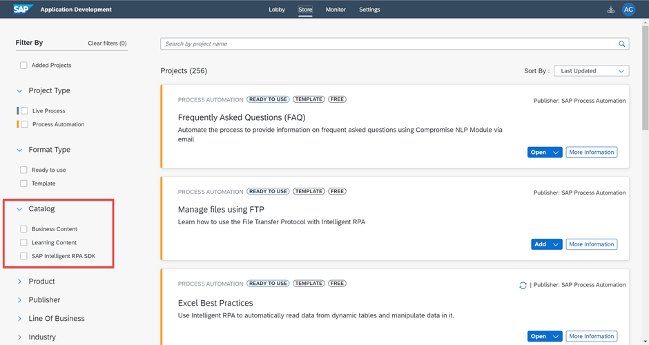

### Acquire the Orders Management using SAPUI5 application package

1. You will acquire the package titled **Orders Management using UI5 application**. Set the following parameters: under **Catalog**, check **Learning Content**.

    <!-- border -->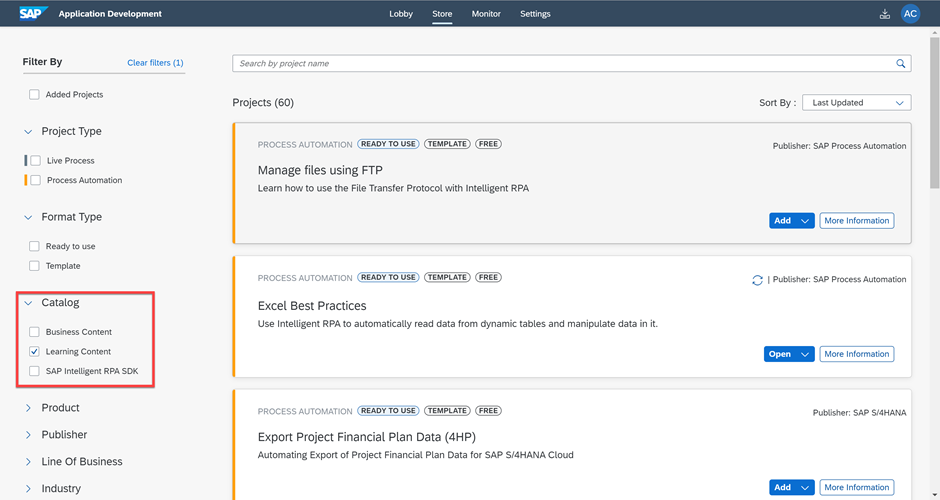

2. In the search bar, type Orders Management, hit enter and choose **More Information**.

    <!-- border -->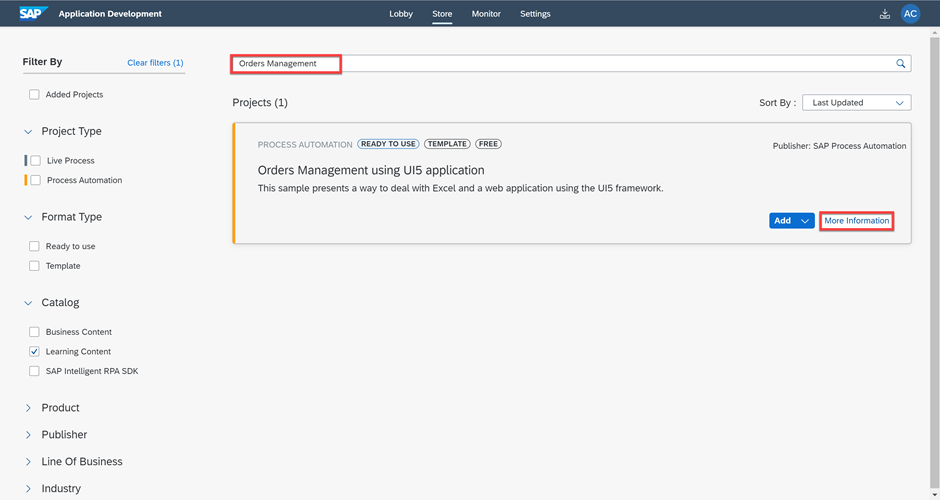

    This sample package presents a way to deal with Excel and a web application using the SAPUI5 framework. Each sample package comes with a description, documents about the sample, and artifacts.

    <!-- border -->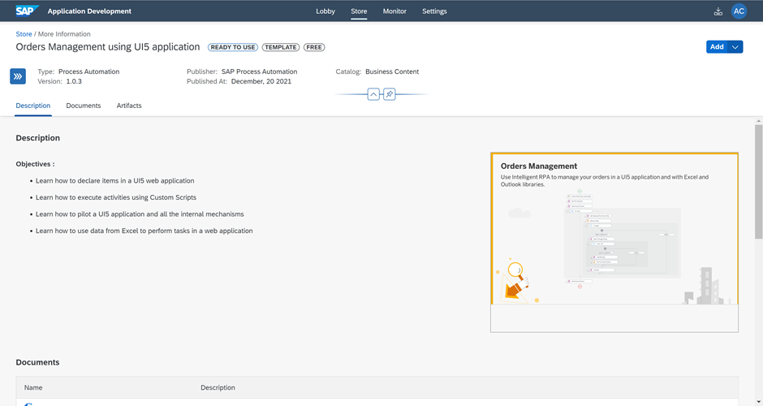

3. To add the package, you have two options:

    - From the **More Information** section, choose **Add** and select **Create from Template**.

    <!-- border -->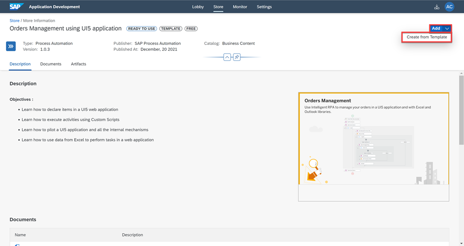

    - From the project list, choose **Add** and select **Create from Template**.

    <!-- border -->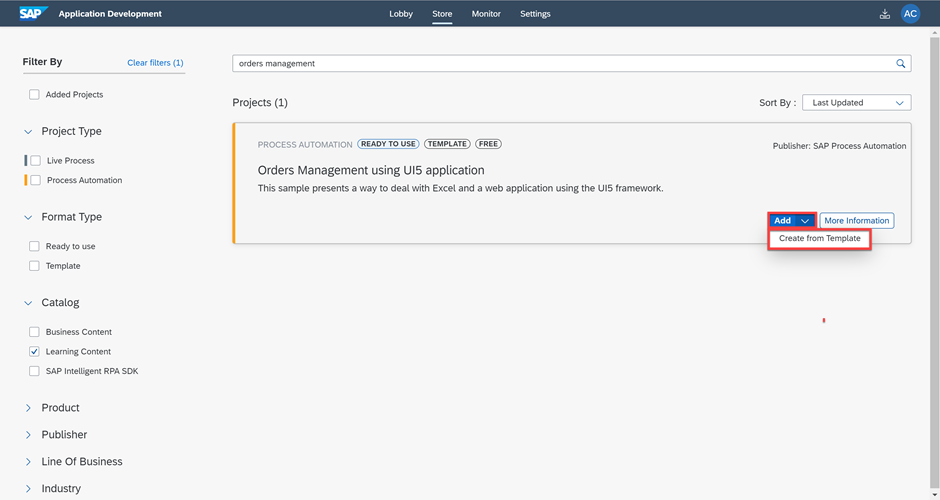

    You will now create a Business Process Project from this template.

5. Name the project **Orders Management Dev Tutorial** and choose **Create**.

    <!-- border -->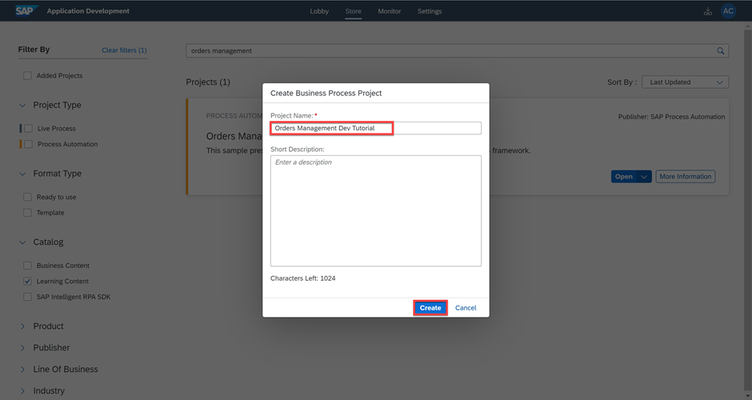

6. To see the newly created project, navigate back to **Lobby** from the top menu.

    <!-- border -->

### Add an automation to the process

1. Choose the project. You will see all the artifacts that are part of the project. The project is **Editable** which means you can modify it.

2. The project can now be edited in the **Application Development**.

    <!-- border -->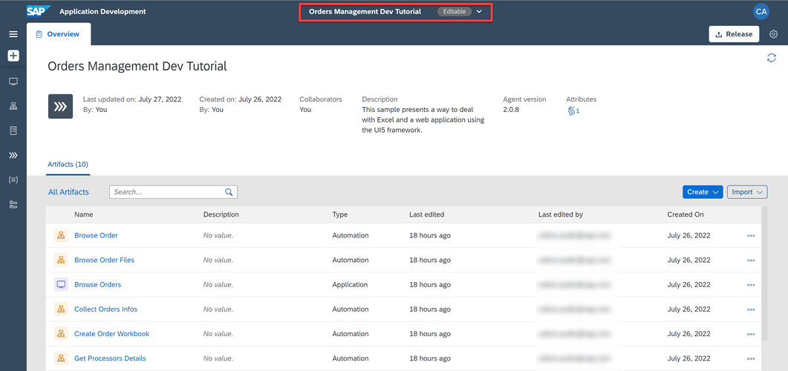

    For instance, you can create a process artifact and add an automation to the Business Process.

3. Select the +, choose **Create** and then **Process**.

    <!-- border -->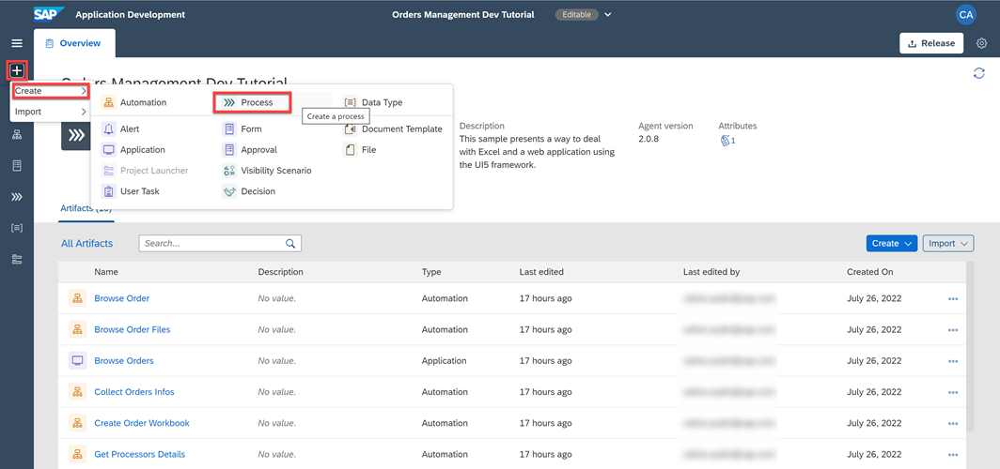

4. In the **Create Process** window, fill in the fields as shown in the screenshot:

    <!-- border -->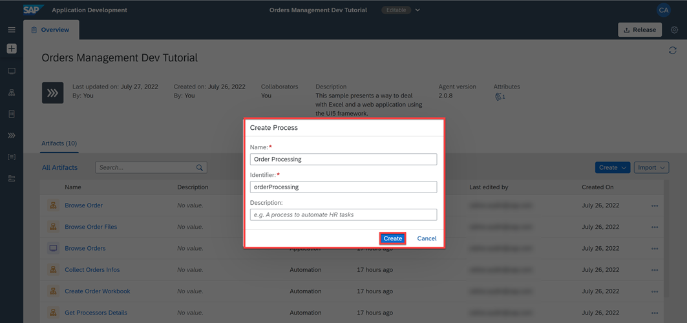

    The **Application Development** with the just created process opens.

5. Now right click on the + icon and select **Automation**.

    You have a list of all the automations available in the bot you just acquired. For this tutorial, you will use the **Get Processors Details** automation.

    <!-- border -->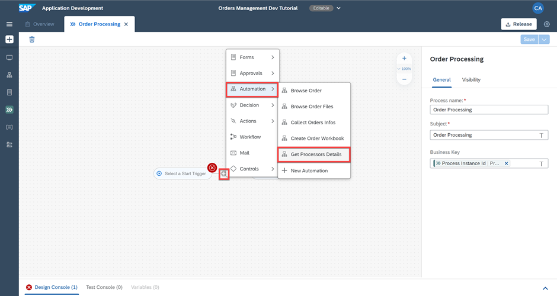

    Now your automation is successfully added to the process. You can further continue modifying your process to get rid of the errors by adding a trigger to the start event and filling in the missing mandatory inputs.

6. Choose **Select a Start Trigger**, in **Trigger Settings**, select **+ New Form**.

    <!-- border -->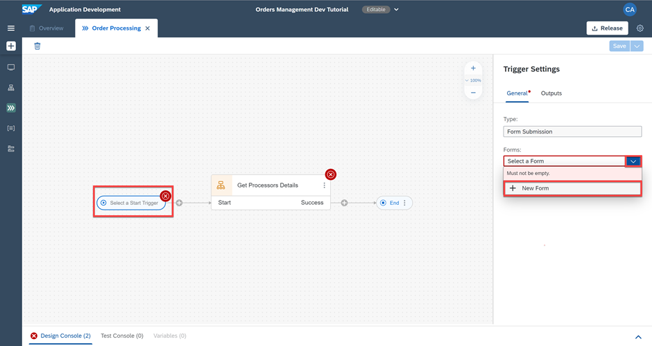

7. In the **Create Form** pop-up, choose **Order Processing Form** for **Name**.

8. Choose **Create**.

    <!-- border -->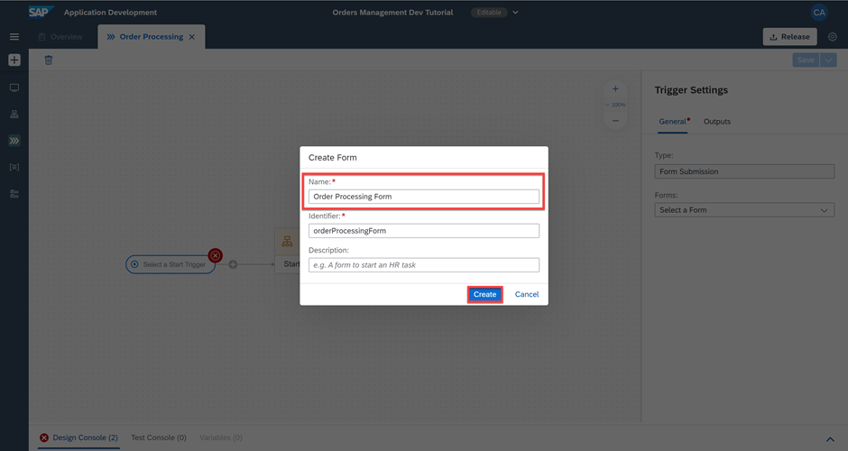

9. Double click on **Order Processing Form is submitted**.

    <!-- border -->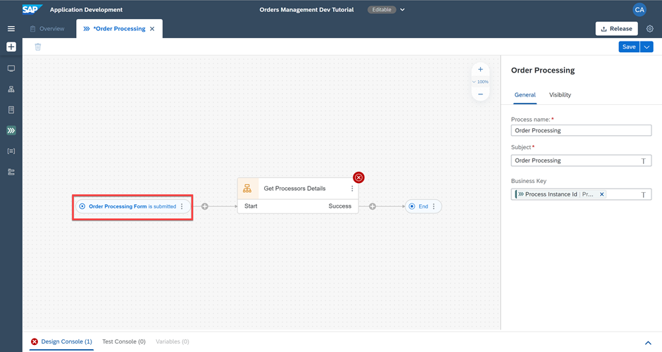

    You will be navigated to the Order Processing Form.

10. Drag and drop the **Text** input. Enter **Order Number** as name and check **Required**.

11. Choose **Save**.

    <!-- border -->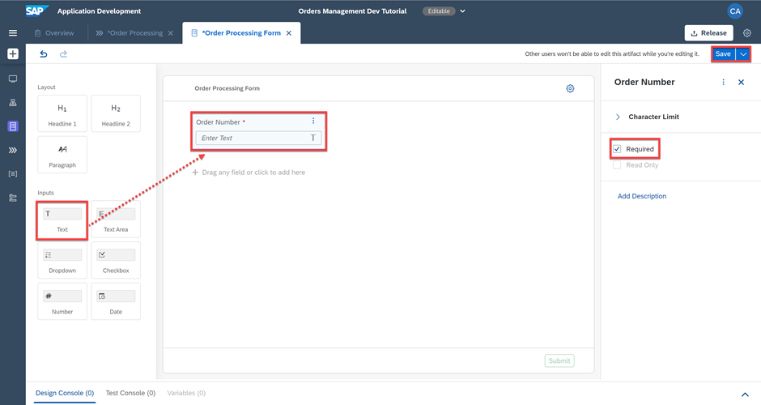

    You will now map the Inputs of the **Get Processors Details** automation.

11. Navigate back to the Order Processing process.

12. Select the **Get Processors Details** automation. Choose `orderReference` input and select **Order Number > Order Processing Form**.

    <!-- border -->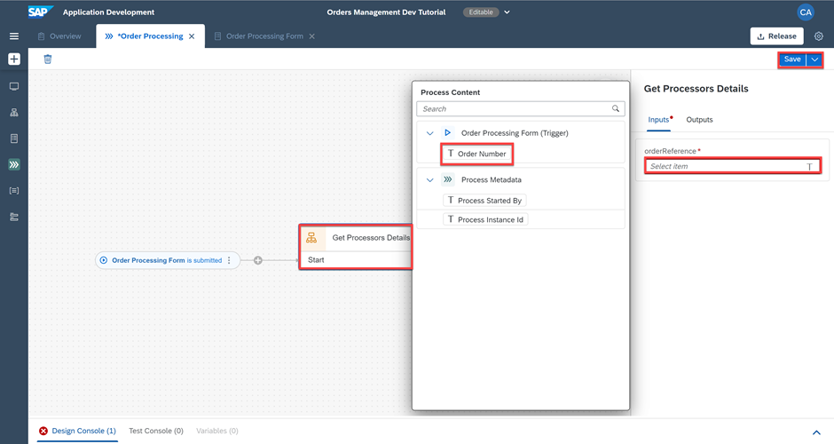

13. Choose **Save**.

14. You may now add forms, approvals, decisions, conditions, etc... to design your process based on your needs.

    <!-- border -->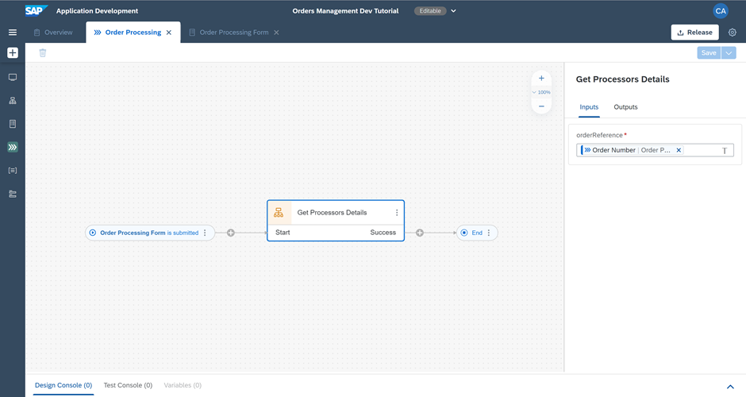

    Lets test the automation.

15. Double click on **Get Processors Details** automation.

16. The automation opens in a new tab.

17. Select the test icon.

    <!-- border -->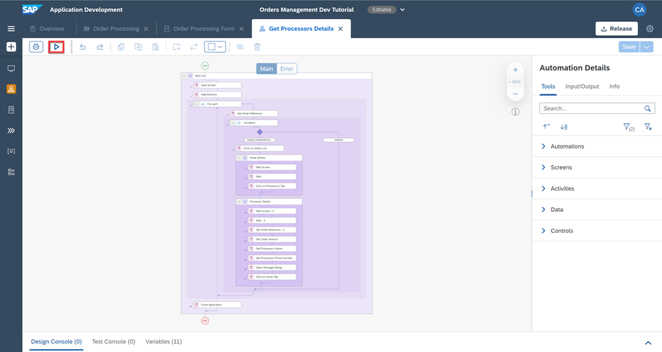

18. In the **Test Automation** window, enter **order 7991** as `orderReference`. No need to fill the Environment Variables.

    <!-- border -->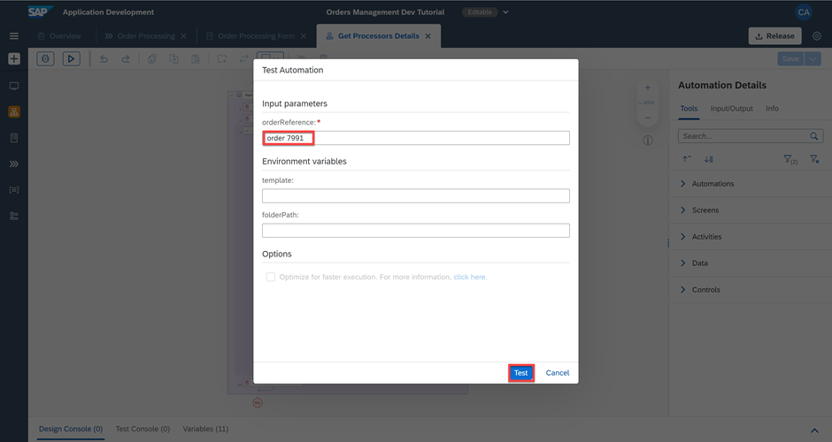

19. This is the final result. To end the testing of the automation, you will have to select **OK**.

    <!-- border -->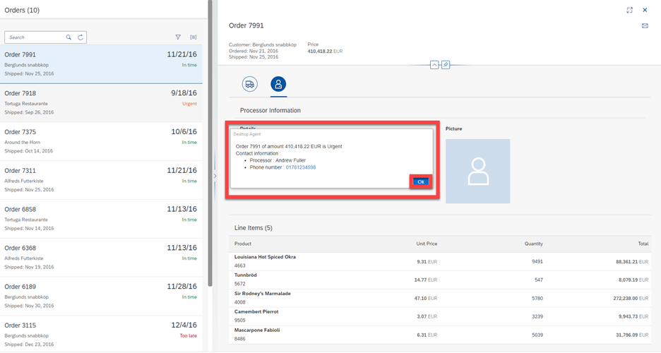

    Once you are done designing your process, you may release and deploy your project. Please make sure to run the project in attended mode as the automation **Get Processors Details** has a dialog that needs to be closed by the user and may put on hold the rest of the automation if the **OK** button is not clicked.

### Execute the automation in attended mode

Since the automation requires a human intervention, with a popup dialog, the automation has to be executed in **attended mode**. This means that the user must be present for the automation to run.

You will trigger the automation using the project launcher.

>The project launcher allows you to launch your automation in attended mode in two different ways:
- You can launch your automations manually in attended mode from the agent using the Launch manually from the agent section.
- You can configure events to trigger and launch your automations automatically using the Launch automatically by events section.

In this tutorial, you will manually launch your automation from the agent by adding it in the Launch manually from the agent section of the project launcher.

1. Navigate back to the **Application Development** lobby, choose the project.

2. In the **Application Development** overview page, you can see all the artifacts that are part of the project. The project is **Editable** which means you can modify it.

3. Select the **Get Processors Details** automation.

    <!-- border -->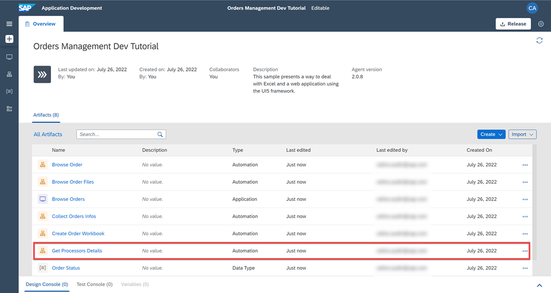

4. In the **Automation Details** panel, select **Info** and uncheck **Can only be started from another automation**.

5. Choose **Save**.

    <!-- border -->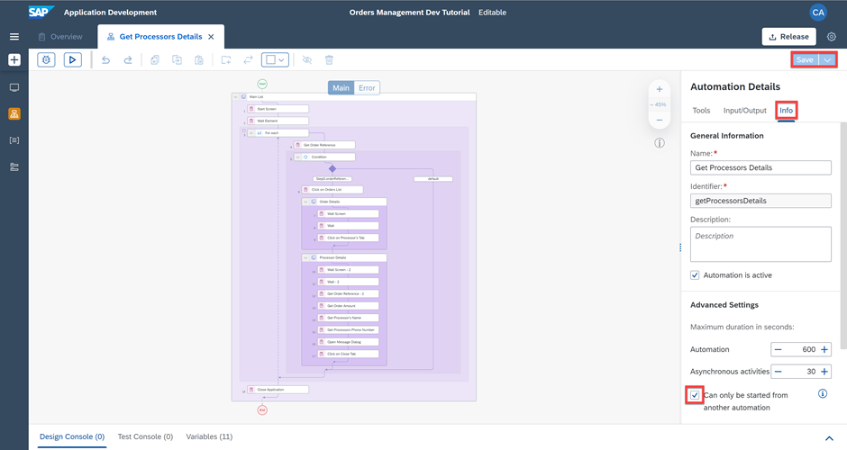

6. Now go back to the **Application Development** overview page, and select **p** which is the already created **Project Launcher**.

    <!-- border -->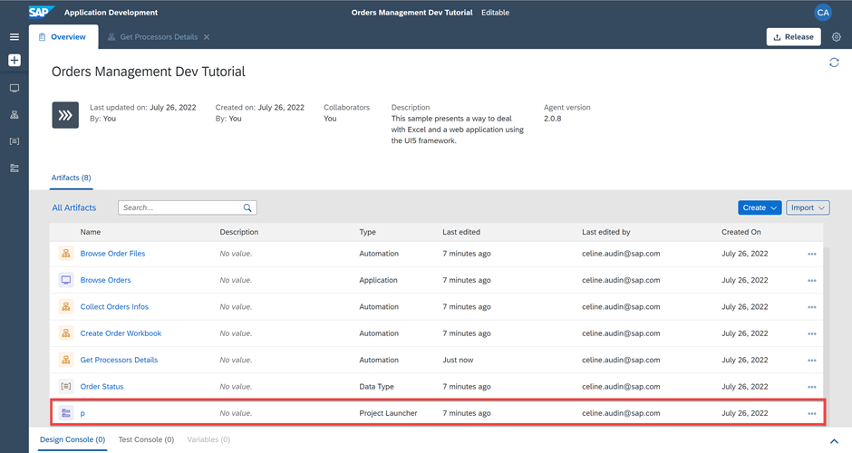

    The project launcher **p** editor opens in the main panel of the Application Development.

7. Select the three automations that are in the **Launch manually from the agent** section and choose the delete icon.

    <!-- border -->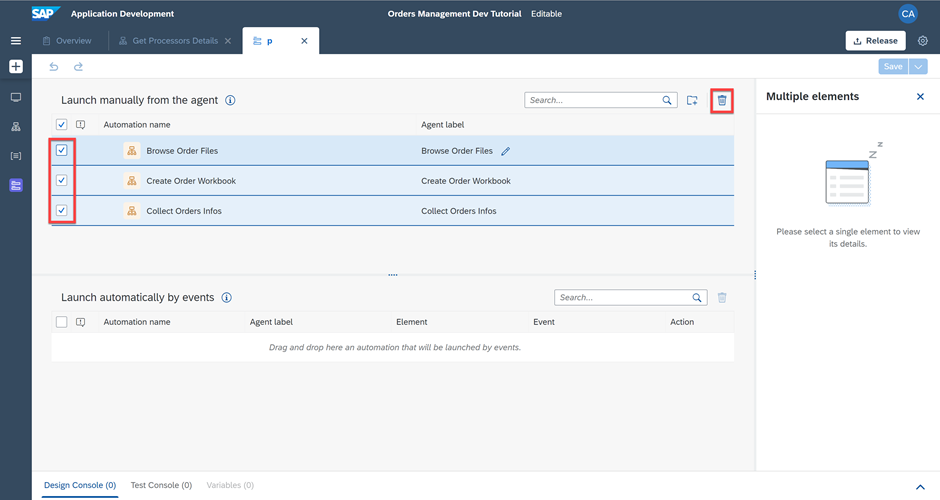

    On the **Project Launcher details** information right-hand side panel, you can see the automations available in your project.

    >In order to execute the automation in attended mode you will need to add the automation to the project launcher

7. In the **Project Launcher Details**, drag the automation **Get Processors Details** and drop it in the **Launch manually from the agent** section of the project launcher.

8. Choose **Save**.

    <!-- border -->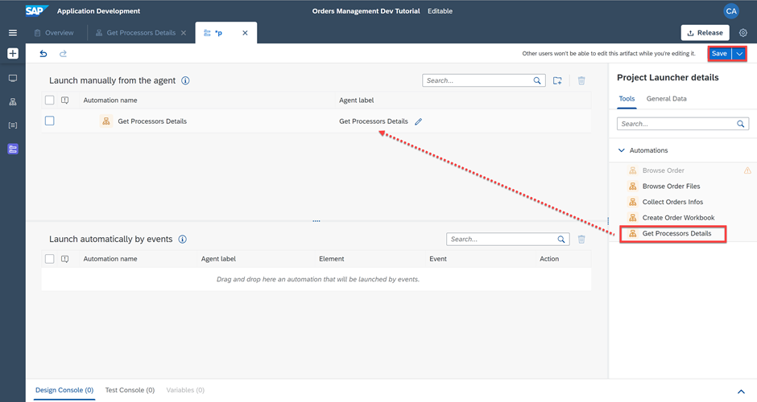

### Release and deploy the business process project

Now you may release and deploy it in attended mode. You need to select this trigger type since the user needs to click on **OK**.

1. Choose **Release** and again **Release**.

    <!-- border -->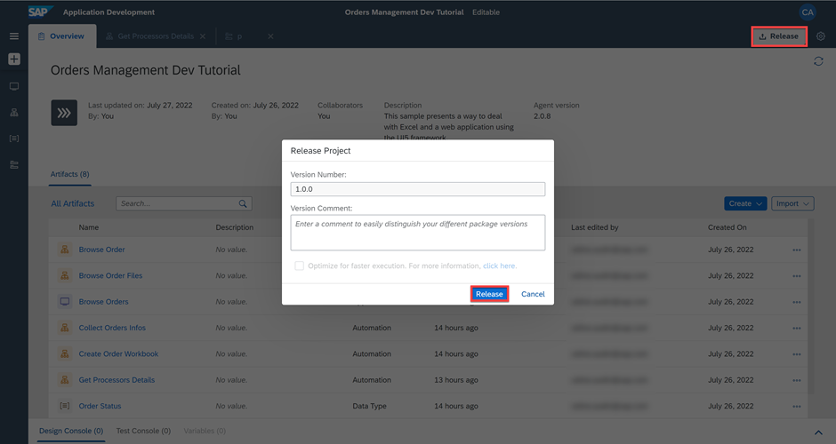

2. Now your project is released and you can deploy it. You can choose **Deploy**.

    <!-- border -->

    >Since this automation has to be executed in attended mode, you need to create a Trigger.

3. Select **Create a Trigger** and then **Next**.

    <!-- border -->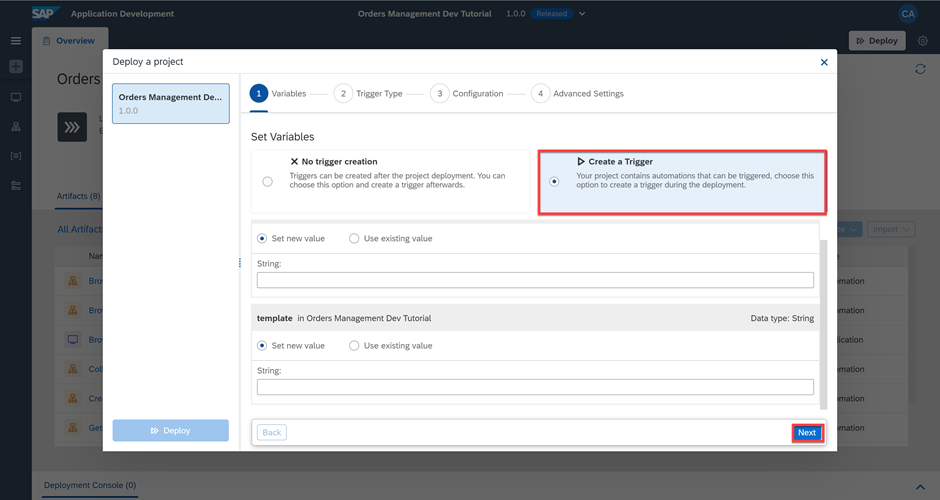

4. Select **Attended** as a trigger type and **Next**.

    <!-- border -->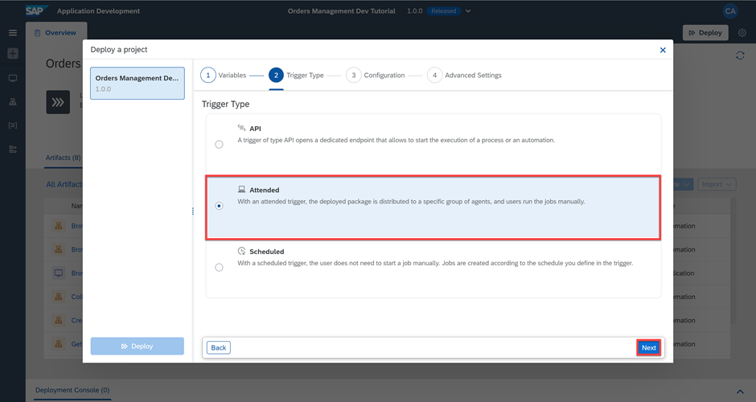

5. Enter the configuration details and choose **Next**.

    <!-- border -->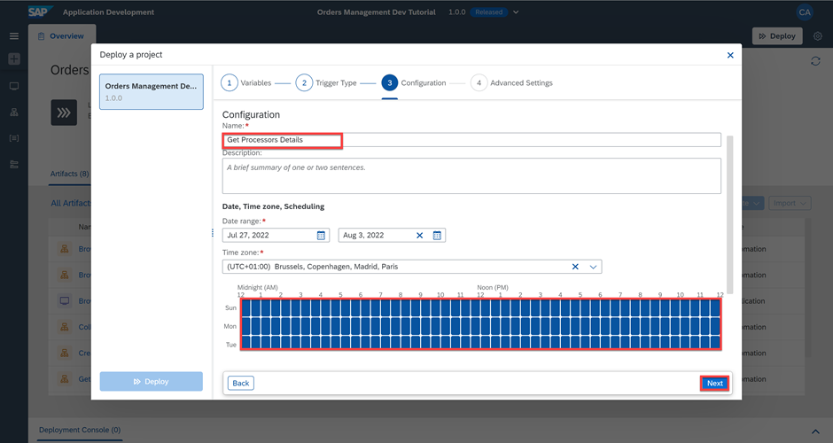

6. You may add an attribute, choose **Confirm** and then **Deploy**.

    <!-- border -->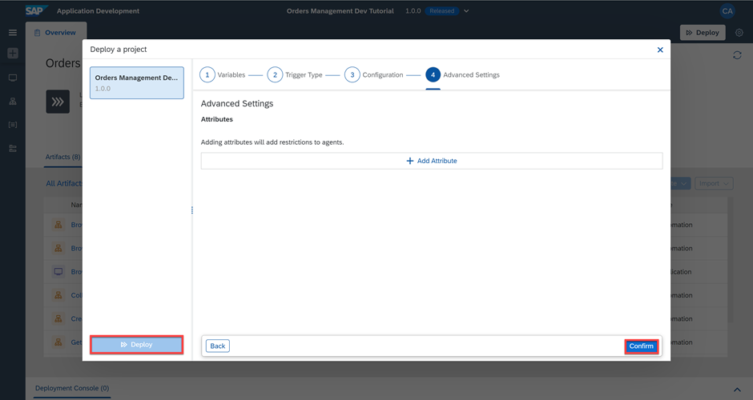

    To Deploy will take a couple of seconds/minutes depending upon how big your project is and how many different skills it has. Any errors during the deployment will be shown in the Design Console.

7. The project deployed successfully and is now ready to be executed.

    <!-- border -->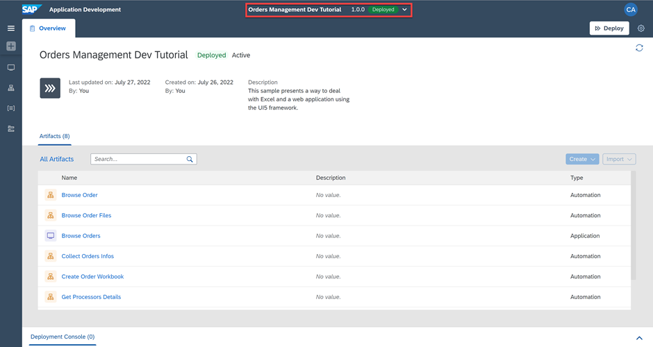

    > You cannot edit released or deployed projects. To continue working on your project, you need to select the Editable option from the list of released versions.

### Set the agent in attended mode

You need to create a matching agent attribute at this step. Please follow these steps to create an agent attribute in the tenant to add it to your agent and project: [Agent Management Settings to Execute the Process with an Automation](spa-run-agent-settings)

1. Go to your System Tray and choose **Projects**.

    <!-- border -->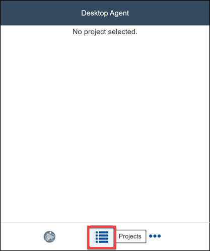

2. Set the agent in attended mode.

    Now your project is ready to be launched in attended mode.

    <!-- border -->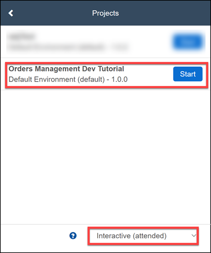

### Run the business process

1. Navigate back to the **Application Development** overview page and select the **Order Processing** process.

    >Make sure you select the deployed version of the project.

    <!-- border -->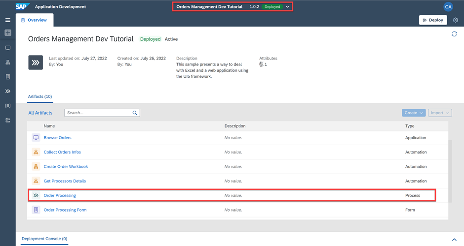

2. Select the **Order Processing Form** and copy the link.

    <!-- border -->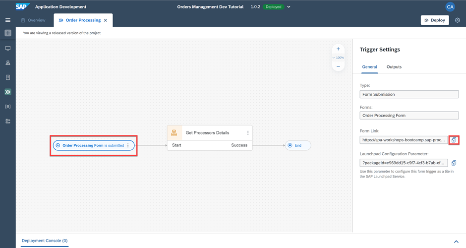

3. Paste the link in your browser.

4. Enter **order 7991** in the Order Number field.

5. Choose **Submit**.

    <!-- border -->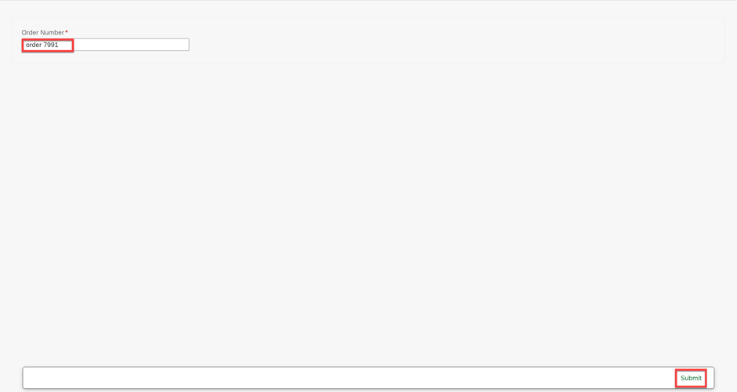

6. The form has been successfully submitted.

    <!-- border -->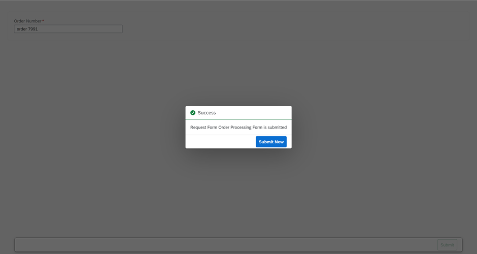

7. Go back to your Desktop Agent, choose your project and **Start**.

    <!-- border -->

8. Now choose **Get Processors Details**.

    <!-- border -->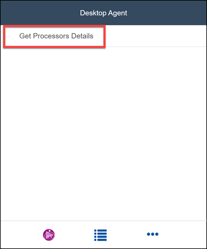

9. In the dialog popup window, enter **order 7991** as Order Reference.

    <!-- border -->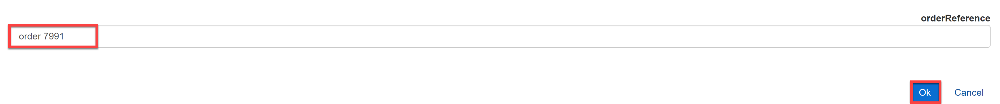

    The process has successfully ended.

---
