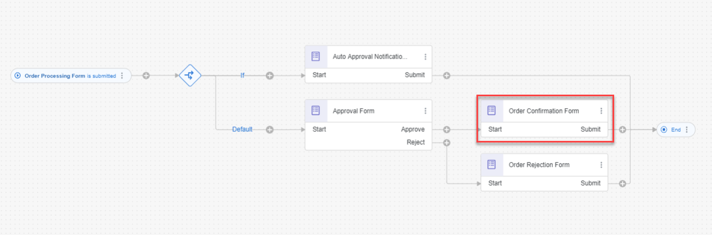
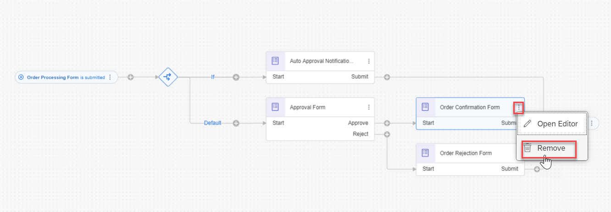
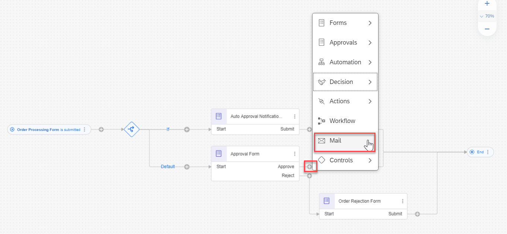
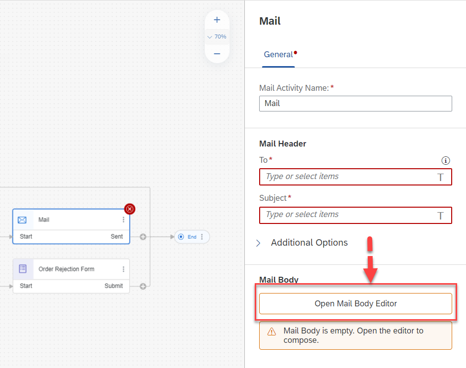
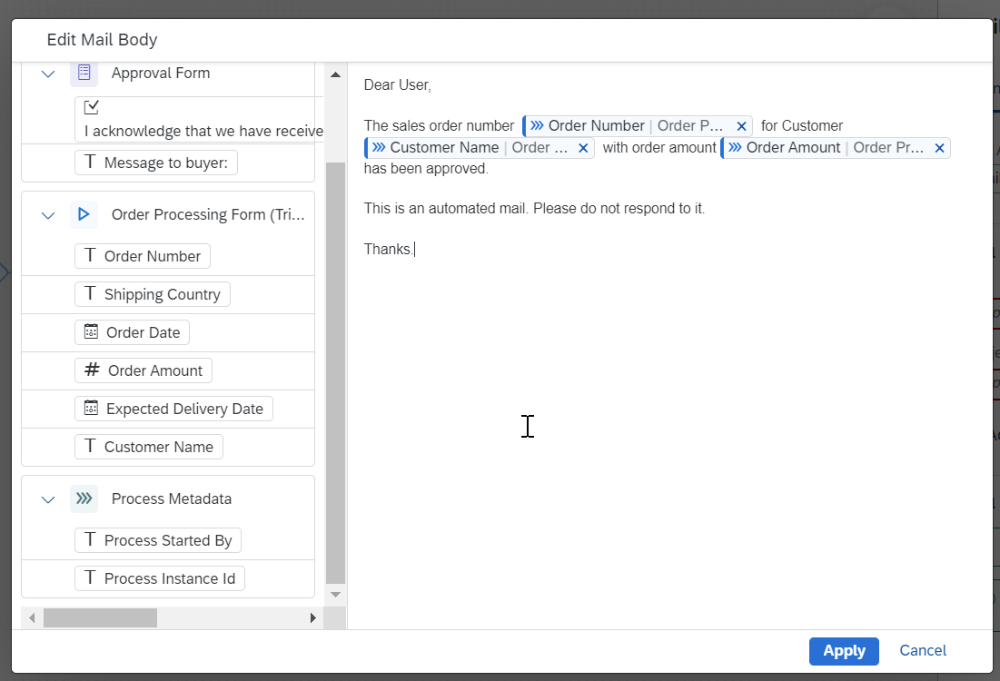
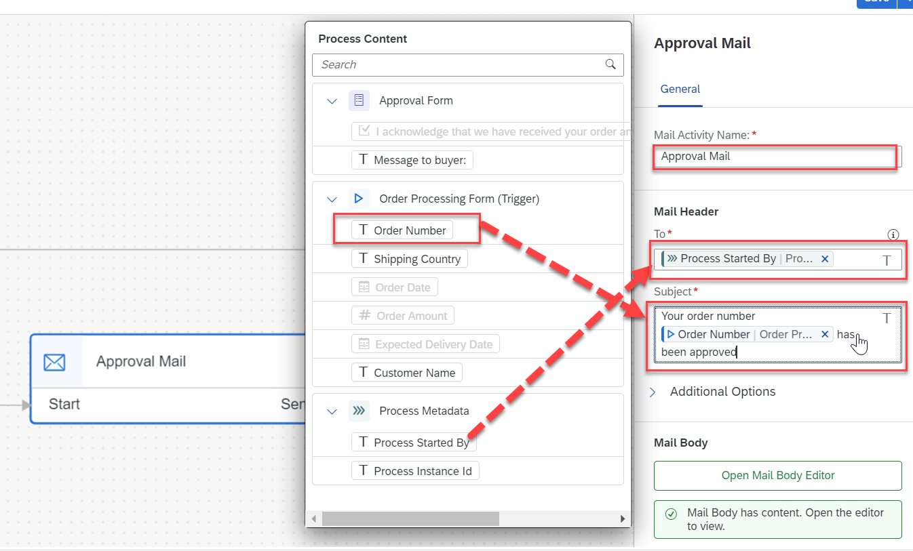
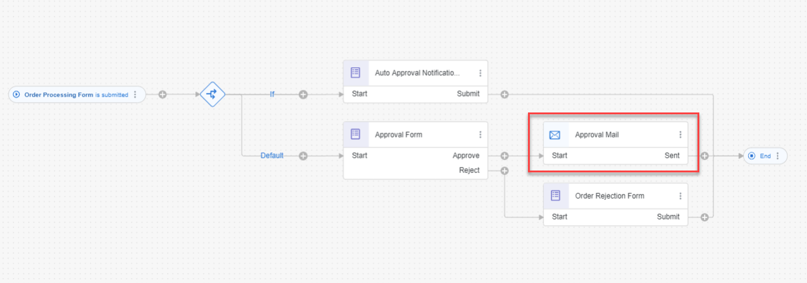
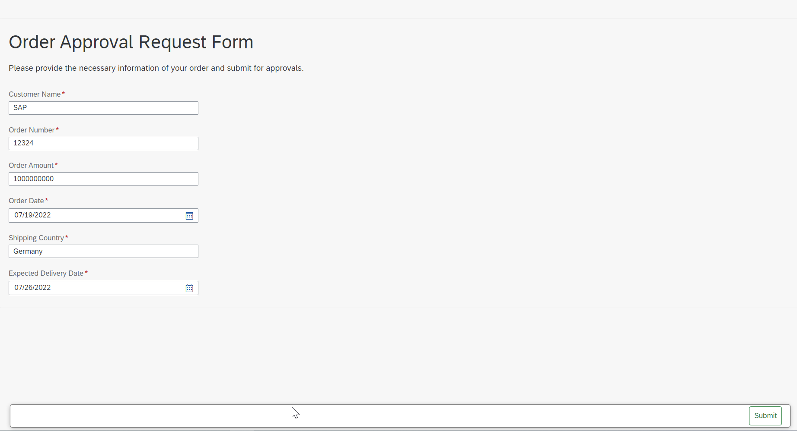
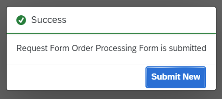
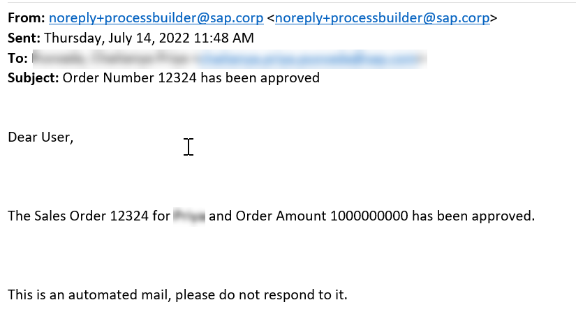

# Add Mail Notifications to a Process
<!-- description --> Add mail notifications to your business process via the process builder

## Prerequisites
 - Complete the mission: [Build Your First Business Process with SAP Process Automation](mission.sap-process-automation)
 - [Configure SMTP Destination](https://help.sap.com/docs/PROCESS_AUTOMATION/a331c4ef0a9d48a89c779fd449c022e7/4f2d36db614241c9850b9ec80f9e0c1b.html)

## You will learn
 - How to create and send Mail notification

---
**Mail** feature allows you to add mail notifications to your business process via the process builder, allowing you to send preconfigured emails to recipients while a process is running.

## Intro
In this tutorial, you will learn how to use **Mail** in a business process to inform the user when the sales order is approved manually.

### Create and configure mail notification

Now that you have designed the process with forms, you can define the mail notifications to send when the sales order is approved manually. We intend to replace the existing **Order Confirmation Form** with the **Mail**.

1. The current process looks like the following:

    <!-- border -->

2. First, remove the  **Order Confirmation Form**.

    - Open the **Process Builder**.
    - Select **Order Confirmation Form**.
    - Choose **Remove**.

    <!-- border -->

3. Now add Mail for approval flow. To add a **Mail** do the following:

    - Select **+** corresponding to **Approve** of the **Approval Form**.
    - Choose **Mail**.

    <!-- border -->

    The mail notification is added to the process and the settings are displayed in the side panel.

    <!-- border -->

4. Click **Open Mail Body Editor** and configure the mail body.

    <!-- border -->

    The mail body can include the following:

    - Text
    - Process context information (such as the Form fields in the example)
    - Process metadata (such as the 'Process Started By' information)

    <!-- border -->

    - Click **Apply**

5. Configure the Mail Header fields

    - **To** : The recipient of the mail notifications. Either add specific mail addresses or use  information taken from process metadata or context.
    - **Subject** :The subject of the mail itself. Either add specific text here or use information taken from process metadata or context.
    - **CC**	: The copied recipient of the mail notifications. Either add specific mail addresses or use information taken from process metadata or context.
    - **BCC** : The blind copied recipient of the mail notifications. Either add specific mail addresses or use information taken from process metadata or context.

    <!-- border -->

    > The mail notification is added to the process, with mails sent to recipients when a process is running. You might need to drag the components after the artifacts are deleted in the process builder

6. Save your work.

    The process should now look like the following:

    <!-- border -->

### Release, deploy and run the business process

1. Run the business process.

    Release, deploy and run the business process with the **Order Processing Form** details as below:

    <!-- border -->

2. Fill the form and choose **Submit**.

3. After you select the submit button, you will receive a notification that the form has been successfully submitted. This means that the workflow has been triggered and the approval process has been started.

    <!-- border -->

### Test Results

  You will receive the below mail in your inbox after the workflow is successfully approved by the approver:

  <!-- border -->

  This completes the Mail notification addition to the business process for manual approval flow.

---
