## Prerequisites
- A Business Process Project saved and with no errors.

## Details
### You will learn
  - How to release, deploy and run a process

---

[ACCORDION-BEGIN [Step 1: ](Release Business Process Project)]

    Before you run the process, ensure that the process is saved and that there are no errors showing in the Design Console.
    To run the process, you must first release and then deploy the Business Process project. Releasing a project creates a version or snapshot of the changes.

1. In the Process Builder, choose **Release**.

    !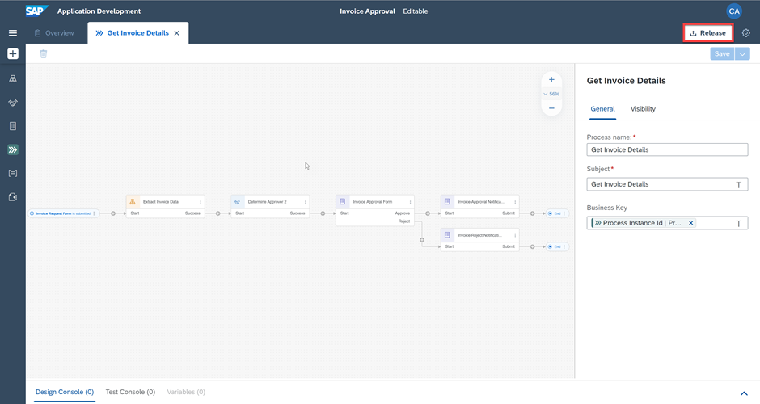

2. Add a **Version Comment** if needed and choose **Release**.

    !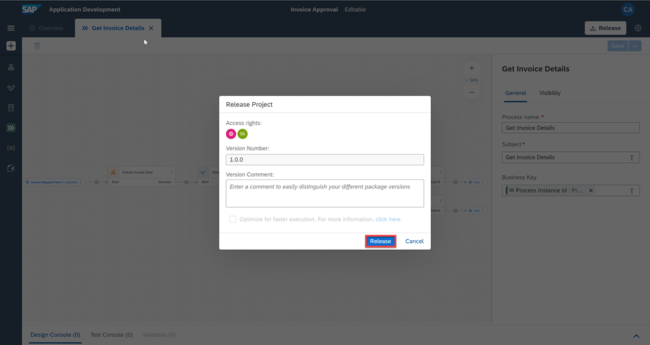

3. If it is an additional version, choose the type of version, add a **Version Comment** if needed and choose **Release**.

    !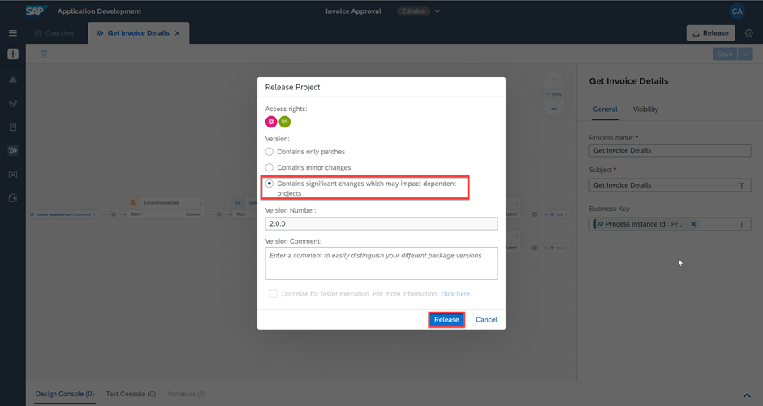

    > ## What's going on?
    > Every time you release, a new version will be created. Versions are incremented automatically based on how you want to store the changes in the repository (that is as major or minor updates or as a patch). Versions use an x.y.z format where x is a major version number, y is minor, and z is the patch number. For instance, if you are releasing your process project for the first time, then the version will start with 1.0.0. The next time you release there will be options to choose from – that is, if the new version is a major, minor, or patch update; version numbers will be automatically updated.

4. The project released successfully and is ready to be deployed.

    > If needed, you can refer to the [Documentation](https://help.sap.com/docs/PROCESS_AUTOMATION/a331c4ef0a9d48a89c779fd449c022e7/5ec3714e12ce487da35c009505eaf3a5.html?version=Cloud).

    !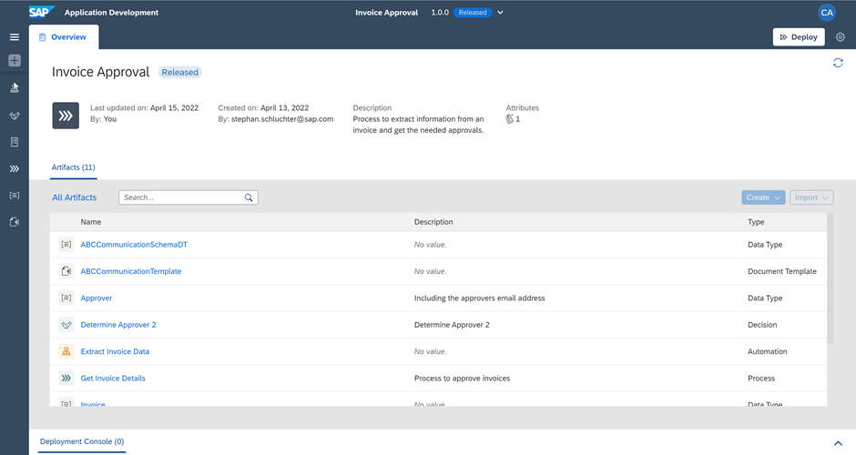

[DONE]
[ACCORDION-END]

[ACCORDION-BEGIN [Step 2: ](Deploy the Released Process)]

    You can deploy Business Process projects from each released version of the project in the Process Builder or through the Lobby. Deploying the project makes it available for others to use it. Bare in mind that you can only deploy a released version of the project.

1. From the released version of the Business Process project in the Process Builder, choose **Deploy**.

    !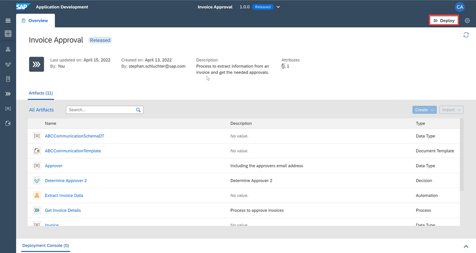

2. In this case there are no **Variables** to set.

    > ## What's going on?
    > Variables allow you to reuse certain information for a given Business Process project deployment. You use variables to pass parameters to automations. You can create variables in the Process Builder for which you can later set values when deploying the Business Process project.

3. Choose **Confirm**.

    !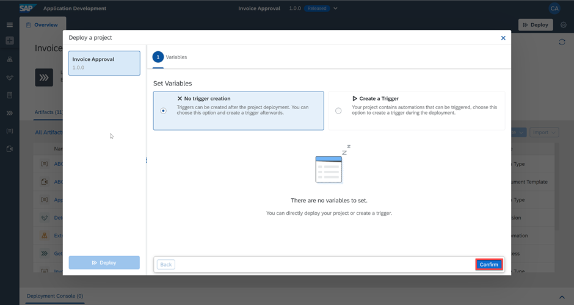

3. Choose **Deploy**.

    !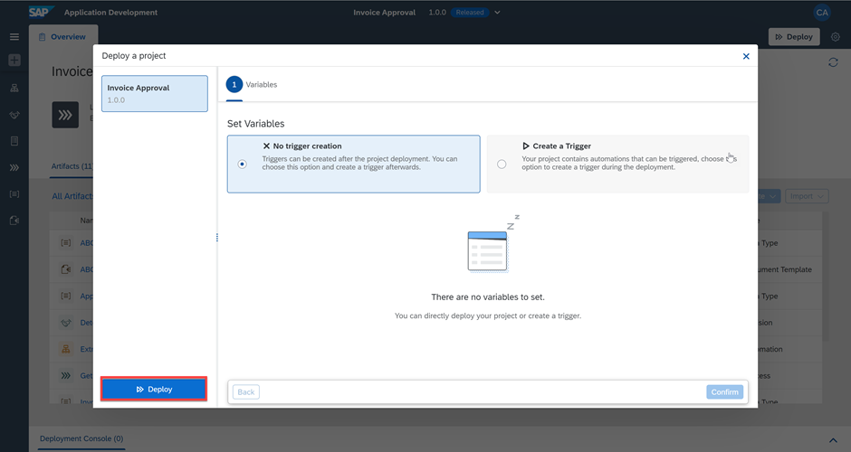

    To Deploy will take a couple of seconds/minutes depending upon how big your project is and how many different skills it has. Any errors during the deployment will be shown in the Design Console.

4. The project deployed successfully and is now ready for running and monitoring.

    !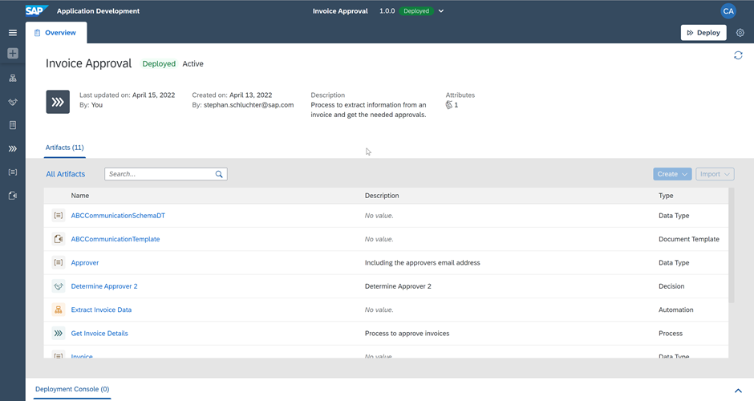

    Once the deployment is successful, you will see a changed status. You can also see all your deployed and/or released project versions from the project status list next to the project name.

    !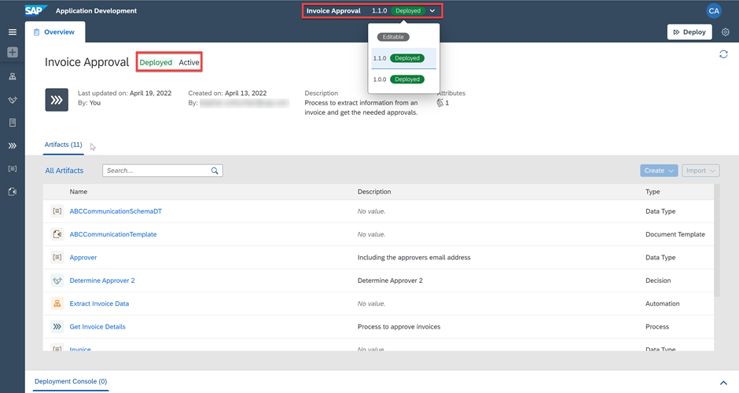

    > You cannot edit released or deployed projects. To continue working on your project, you need to select the Editable option from the list of released versions.

[VALIDATE_1]
[ACCORDION-END]

[ACCORDION-BEGIN [Step 3: ](Run the Business Process)]

   Now that you have successfully deployed your project, it is time to run the process and see the results.

1. From the deployed version of the Business Process project in the Process Builder, open the process **Get Invoice Details**.

    !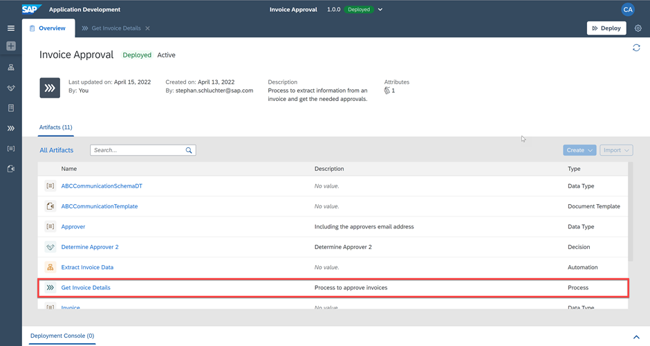

2. Select **Invoice Request Form**.

3. Choose the **Copy** icon aside the **Form Link** in the **Trigger Settings**.

    !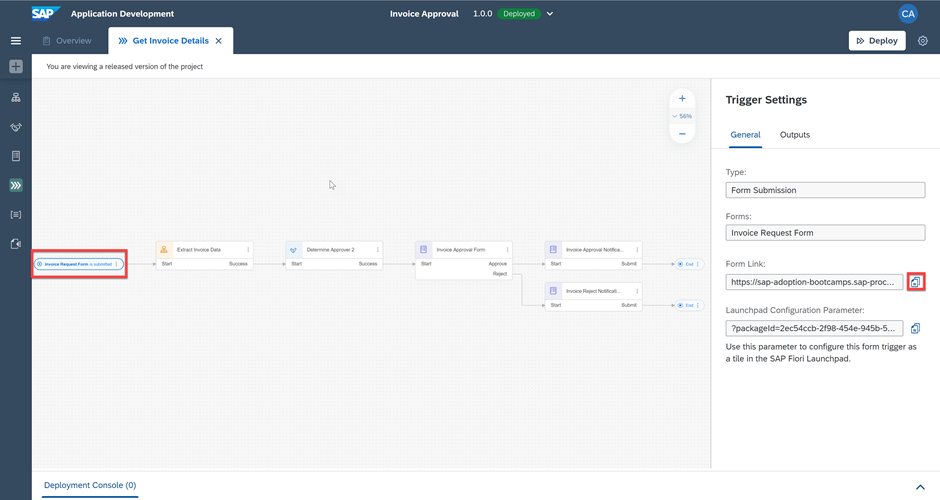

3. Open the Form pasting the **Form Link** in a browser window.

    !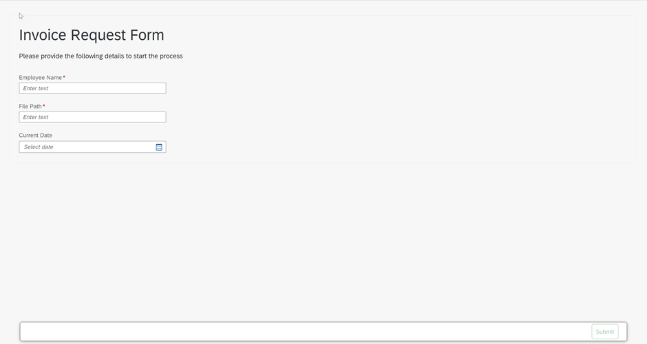

4. Fill the **Invoice Request Form** and choose **Submit**.

    > Do not enter any random value or else the Automation will not give any results.

    !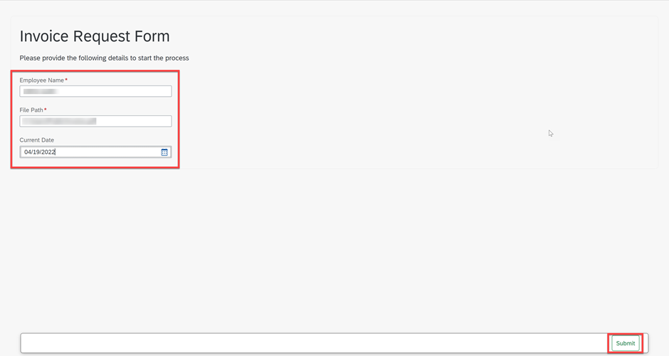

5. The process is triggered. You can now work on the tasks and monitor the process.

    !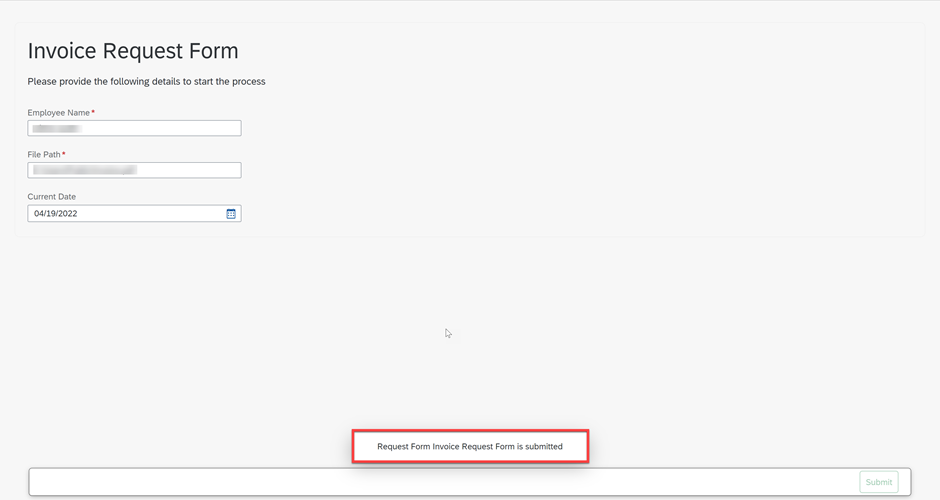

[DONE]
[ACCORDION-END]

---
