# Integrate Chatbot with SAP Process Automation
<!-- description --> Integrate SAP Process Automation with SAP Conversational AI using API Triggers and Notifiers

## Prerequisites
 - [Install and Setup the Desktop Agent](spa-setup-desktop-3-0-agent)
 - [Agent Management Settings to Execute the Process with an Automation](spa-run-agent-settings)
 - [SAP Process Automation Application Capture](spa-create-automation-application-capture) Completed

## You will learn
  - How to add API Trigger and Notifiers to an automation
  - How to send data from a chatbot and trigger an automation in *Unattended* mode

---

## Intro
In this tutorial you will retrieve the specific **Sales Order** details through a chatbot ( **SAP Conversational AI** ) that interacts with your **SAP Process Automation** project.

### Release and deploy the project


1.  Open the project you created in [SAP Process Automation Application Capture](spa-create-automation-application-capture).

2.  Add **Agent Attribute**. (Complete [Agent Management Settings](spa-run-agent-settings))

    <!-- border -->

3.  Release the project.

    <!-- border -->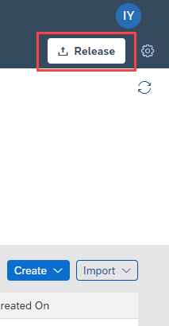

4.  Deploy the project:
    - Click **Deploy**.

    <!-- border -->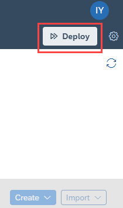

    - Select **Create a Trigger** and click **Next**.

    <!-- border -->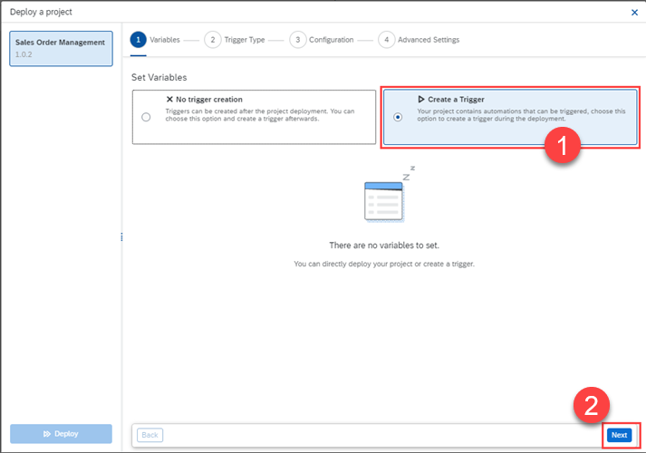

    - Select **API** and click **Next**.

    <!-- border -->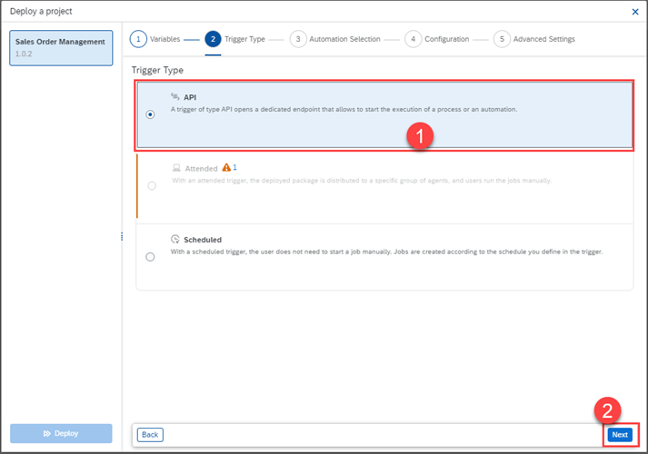

    - Select **Get Order Details From Application** automation and click **Next**.

    <!-- border -->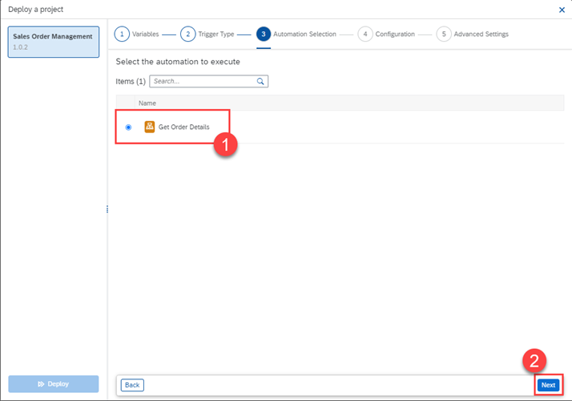

    - Set **Name** to **Get Order Trigger** and click **Next**.

    <!-- border -->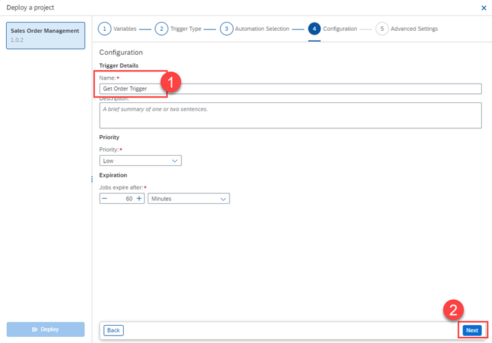

    - Click **Confirm** then hit **Deploy**.

    <!-- border -->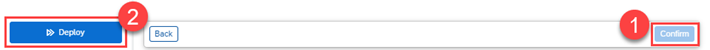

The project is now deployed.


### Create API key


1.  Go to lobby landing page of **SAP Process Automation**.

    <!-- border -->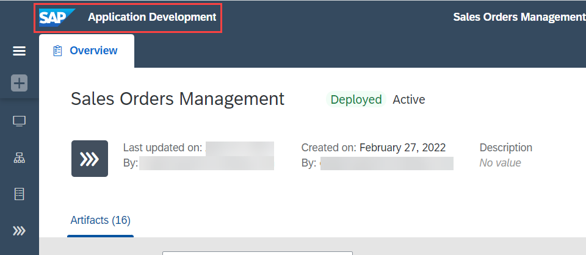

1.  Go to **Settings > API Keys**.

    <!-- border -->

2.  To create your API Key:
    - Click **Add API Key**.

      <!-- border -->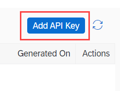

    - Set **Name** to `myAPIKey` and click **Next**.
    - Select both options `trigger_read` and `trigger_execute` and click **Next**.

      <!-- border -->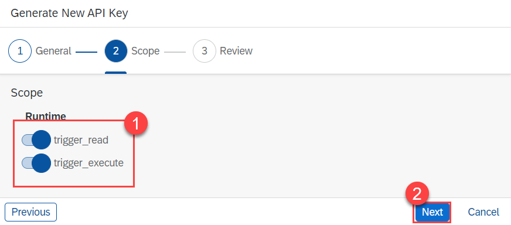

    - Click **Add**.

      <!-- border -->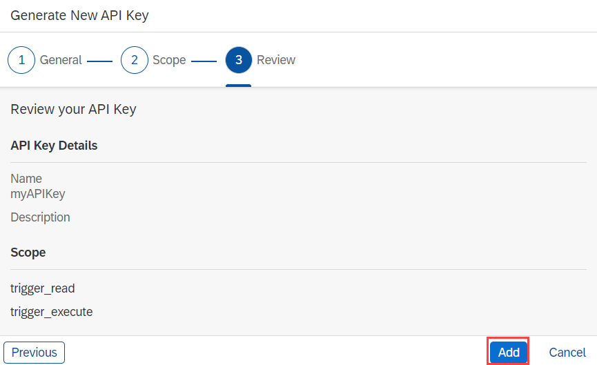

    - Click **Copy** and note down what was just copied to your clipboard.

      <!-- border -->

    > It's important to save your API Key, since it can only be read once from the Setting.

Your **API Key** is now created and ready to be used.


### Create instance and service binding

1.  Navigate to **SAP BTP Cockpit** subaccount > **Services** > **Instances and subscriptions**.

2.  Choose **Create**.

    <!-- border -->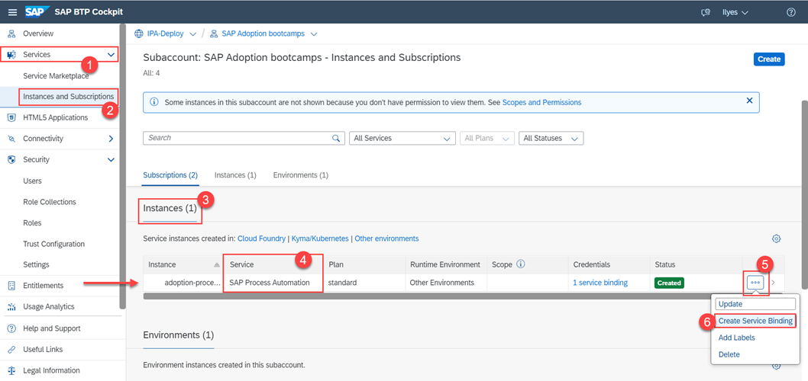

3.  For the new instance:
    -  Select **SAP Process Automation** as **Service**.
    -  Select **Standard Instance** plan from the **Plan** list.
    -  Select **Other** as **Runtime Environment**.
    -  Set **Instance Name** as **SPA-instance**.
    -  Choose **Create**.

    <!-- border -->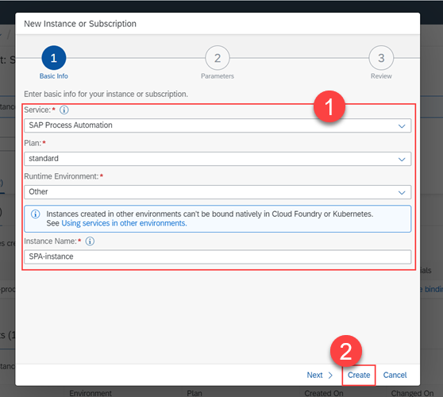

The instance is now added.

4.  Create a new **Service Binding** by selecting your **SPA-instance** instance > Select **...** to expand > **Create Service Binding**.

    <!-- border -->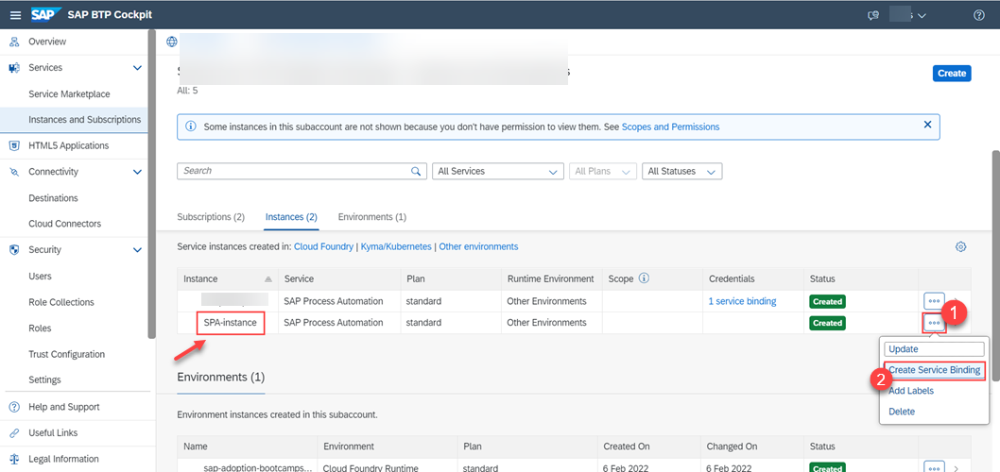

5.  Put the name as `myServiceBinding` and click **Create**.

    <!-- border -->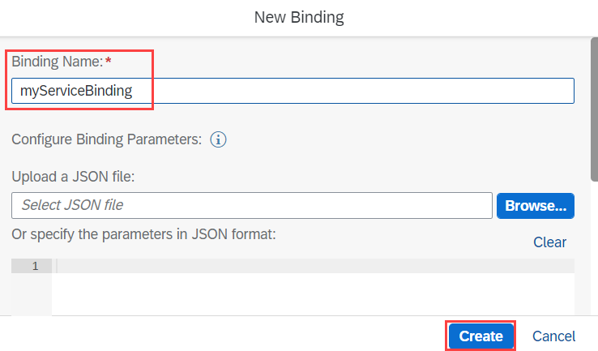

6.  Click **...** and then click **View** to view the Service Binding created.

    <!-- border -->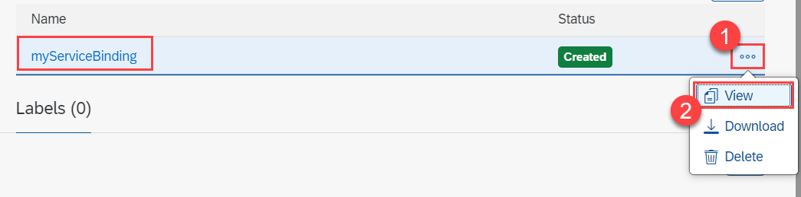

7.  Click **Form** and copy the `clientid`, `clientsecret` and **URL** under the `uaa` section. You will need it in the next steps.

    <!-- border -->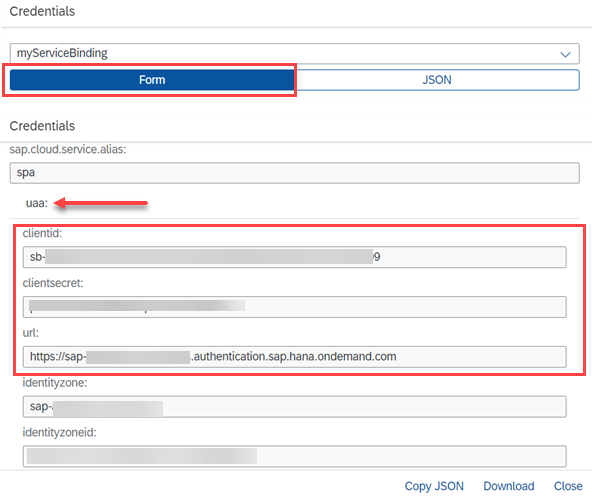


### Get API trigger URL


1.  Navigate to **SAP Process Automation > Monitor > Manage > Automations**.
2.  From the shown triggers:
    - Find your trigger (Created in Step **1.4** during deployment).
    - Click on **Actions** and select **Edit**.

      <!-- border -->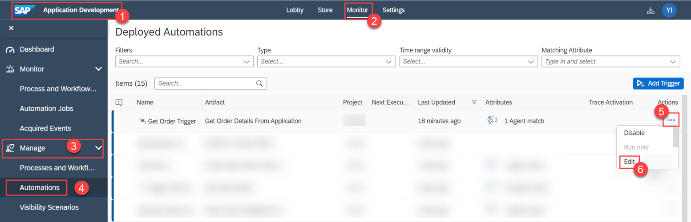

    - Copy **URL** and **Payload**.

    <!-- border -->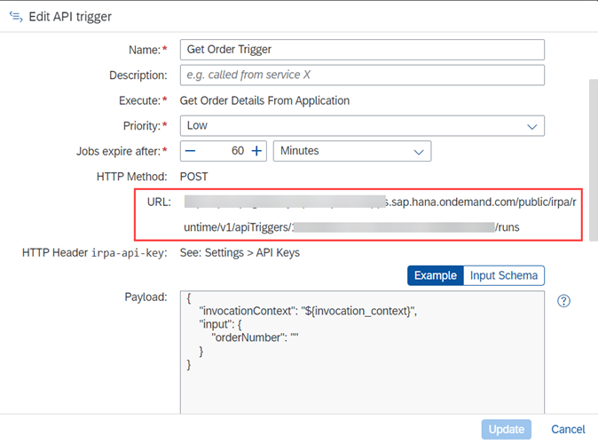

    > You can notice that the inputs of the automation are specified in the request body also called as the **Payload**.


### Configure CAI bot API call

A ready CAI bot is used here.
This bot has a goal of emitting an API Call to **SAP Process Automation** using **API Trigger**, **API Key** and **Service Binding** we created previously.

Using **CONSUME API SERVICE** feature in **Conversational AI** bot we can make API Calls.

1.  Set **URL** to the one saved in step **4**.

    <!-- border -->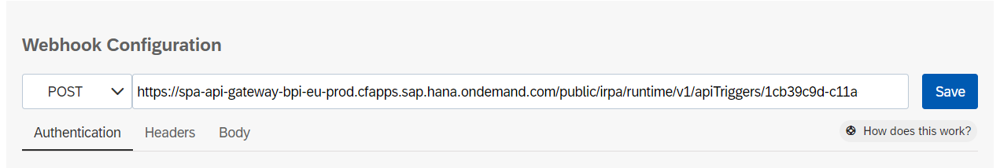

2.  For **Authentication** tab:
  - Set **Authentication type** to **OAuth2 Authentication**.
  - Set **Client ID**, **Client Secret** and **Authorization URL** to those saved in step **3**.

    > For Authorization URL add `/oauth/token` at the end of the URL.

    <!-- border -->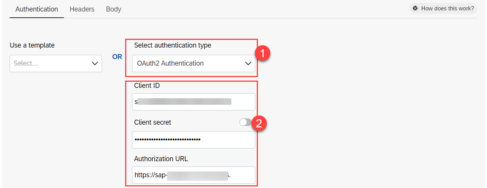

3.  For **Headers** tab:
    - Click **+ New Fields** to create a new field.
    - Set **Key** to `irpa-api-key` and **Value** to the one saved in step **2**.

    <!-- border -->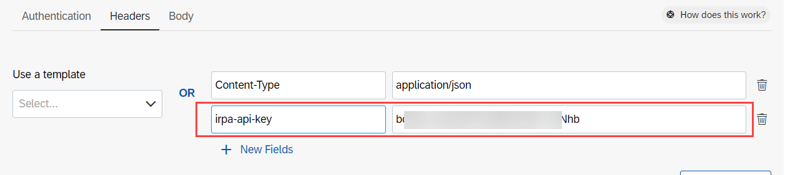

4.  For **Body** tab:
    - Select **Create a custom body**.
    - Paste the following:

    ```JSON
    {
        "invocationContext": {
        "conversationId": "{{conversation_id}}"
        },  
        "input": {
            "orderNumber": "Order {{memory.orderNumber.raw}}"
        }
    }
    ```

    <!-- border -->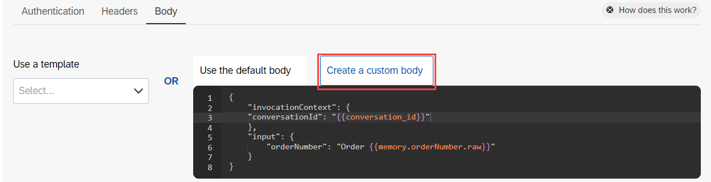

    > `memory.orderNumber.raw` is just a variable where an order number given by a user is stored.

5.  Click **Save** to save your changes.


### Get CAI bot tokens


1.  To get **Bot Developer Token**:
    - Go to **Settings > Tokens**.
    - Note **Developer Token** somewhere and save it.

    <!-- border -->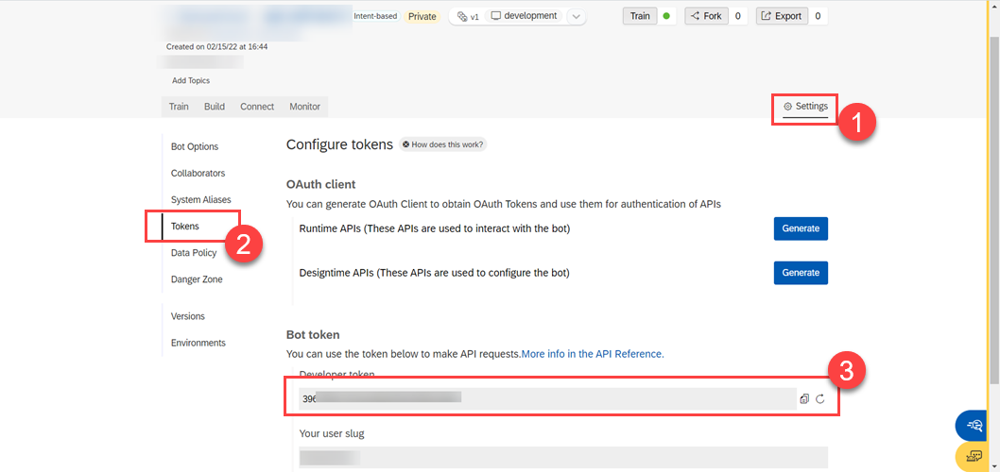

2.  To get `Designtime API Token`:
    - Click **Generate** besides `Designtime APIs`.
    - Select **Client Credentials** and click **Next**.
    - Note **Auth URL**, **Client ID** and **Client Secret** somewhere and save it.
    > Don't confuse these 3 information with those of the service binding's.

    <!-- border -->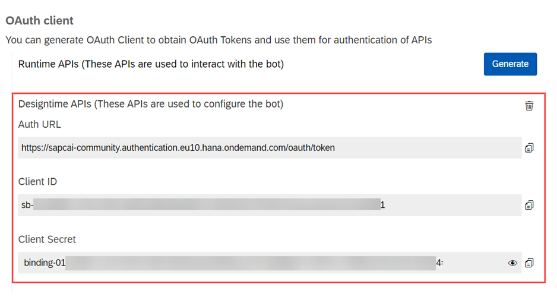

We now have the proper tokens to create **Notifiers**.


### Create notifiers

1.  Navigate to **SAP Process Automation > Monitor > Manage > Automations**.

    <!-- border -->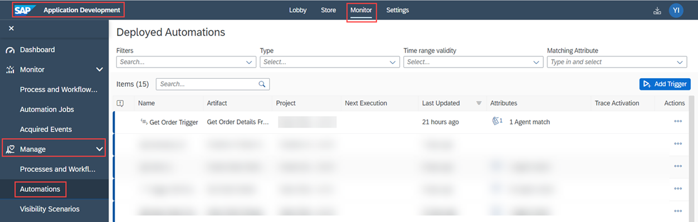

2.  Start **Notifier**:
    - Click 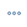 under **Actions** in the same row as your **Trigger**.

    <!-- border -->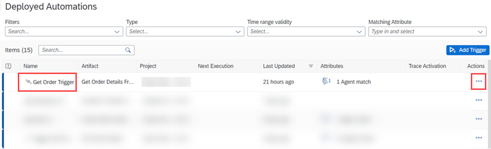

    - Select **Add Notifier**.
    - Select **CAI** and click **Next**.
    - Create the notifier as such:

    |  Field Name     | Value
    |  :------------- | :-------------
    |  Notify on      | **Start**
    |  Name           | **Starting notifier**
    |  Description    | Indicates that the automation has started
    |  Conversation ID| ```${invocation_context.conversationId}```
    |  Token          | **Developer token** from step `6.1`
    |  Auth URL       | `Designtime APIs` token **Auth URL** from step `6.2`
    |  Client ID      | `Designtime APIs` token **Client ID** from step `6.2`
    |  Client Secret  | `Designtime APIs` token **Client Secret** from step `6.2`
    |  What do you want to do?   | **Send a message**
    |  Delay in second           | 0
    |  Message content           | IRPA: Bot Started.

    - Click **Create**.

3.  Success **Notifier**:
    - Click  under **Actions** in the same row as your **Trigger**.
    - Select **Add Notifier**.
    - Select **CAI** and click **Next**.
    - Create the notifier as such:

    |  Field Name     | Value
    |  :------------- | :-------------
    |  Notify on      | **Success**
    |  Name           | **Success notifier**
    |  Description    | Indicates that the automation has finished successfully
    |  Conversation ID| ```${invocation_context.conversationId}```
    |  Token          | **Developer token** from step `6.1`
    |  Auth URL       | `Designtime APIs` token **Auth URL** from step `6.2`
    |  Client ID      | `Designtime APIs` token **Client ID** from step `6.2`
    |  Client Secret  | `Designtime APIs` token **Client Secret** from step `6.2`
    |  What do you want to do?   | **Send a message**
    |  Delay in second           | 0

    - Set **Message content**:

    ```
      ${output.order.orderNumber}:
      Price: ${output.order.orderAmount}€.
      Status: ${output.order.orderStatus}.
      Order Date: ${output.order.orderDate}.
      Country: ${output.order.shippingCountry}.
    ```
    - Click **Create**.

    <!-- border -->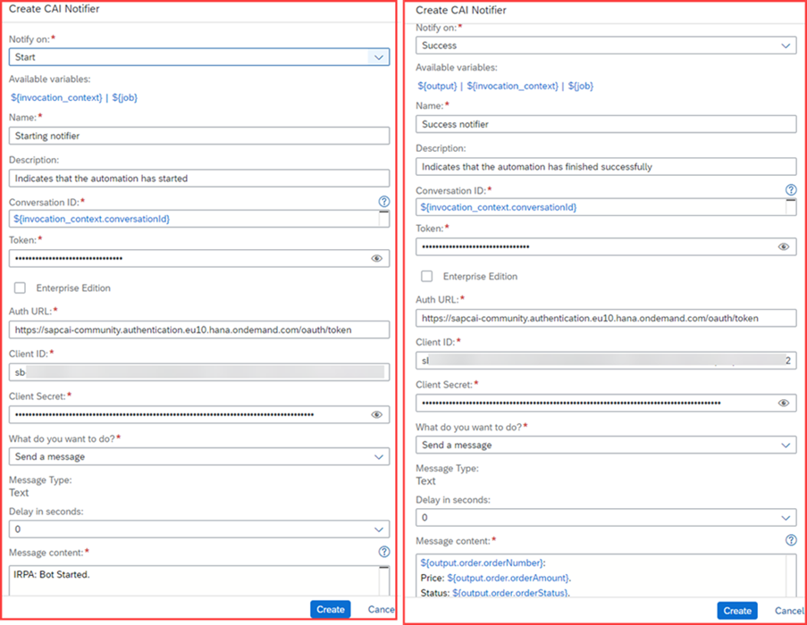

4.  Error **Notifier**:
    - Click  under **Actions** in the same row as your **Trigger**.
    - Select **Add Notifier**.
    - Select **CAI** and click **Next**.
    - Create the notifier as such:

    |  Field Name     | Value
    |  :------------- | :-------------
    |  Notify on      | **Failure**
    |  Name           | **Failure notifier**
    |  Description    | Indicates that the automation has failed
    |  Conversation ID| ```${invocation_context.conversationId}```
    |  Token          | **Developer token**
    |  Auth URL       | `Designtime APIs` token **Auth URL**
    |  Client ID      | `Designtime APIs` token **Client ID**
    |  Client Secret  | `Designtime APIs` token **Client Secret**
    |  What do you want to do?   | **Send a message**
    |  Delay in second           | 0
    |  Message content           | Automation failed with error: `${error.details}`

    - Click **Create**.

    <!-- border -->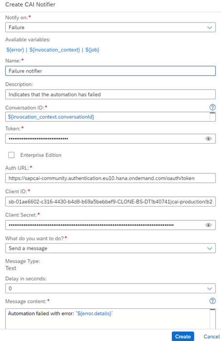

The three notifiers are now created.


### Test automation with CAI bot

1.  Open your SAP Conversational AI chatbot.

2.  Click **Connect** tab.

3.  Click on **SAP Conversational AI Web Client**.

    <!-- border -->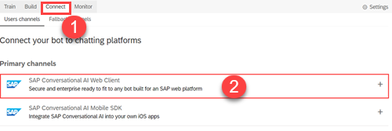

4.  Put **CAI with IRPA** in **Channel Name** and click **Create**.

    <!-- border -->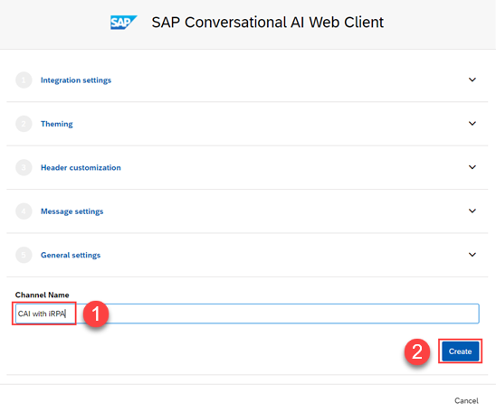

5.  Click on the **Web Client standalone link** to open the chatbot in browser.

6.  The chatbot opens in a new window.

    <!-- border -->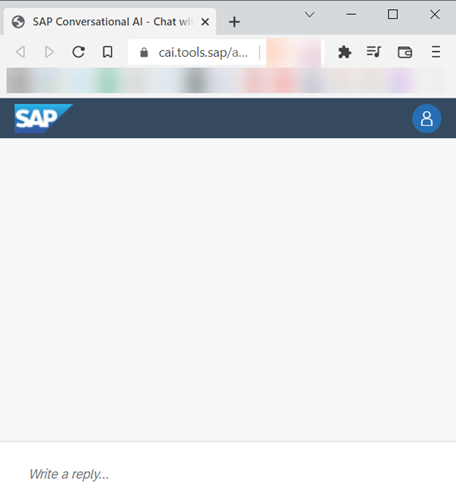

    > Make sure your **Desktop Agent** is in **Background (Unattended)** mode.
    >
    > <!-- border -->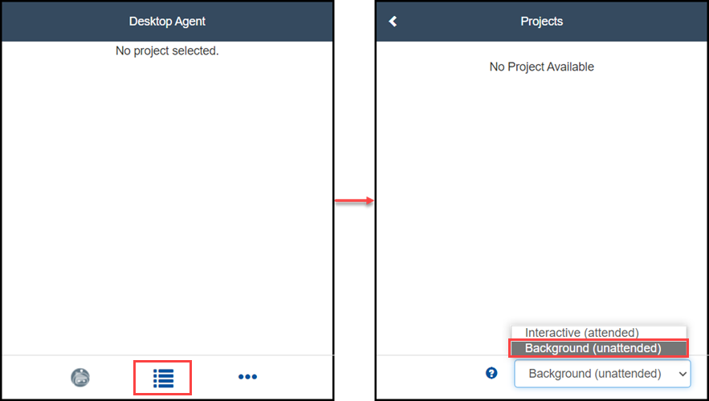

7.  To start my bot I type **Start my automation** according to what I set it up to respond to (Execute the API call) after asking for an order number.

8.  The workflow of the execution:
  - The process starts with the user triggering it in the chatbot (sending **Start my automation**).
  - The chatbot asks for an **Sales Order Number** which will be used as an input for our automation.
  - Once the **Order Number** is submitted by the user, the bot sends the **API Request** to **SAP Process Automation** according to what we configured it, and displays **CAI Bot: Emitting the API Call.**
  - Once the **API Request** is reached, the **SAP Process Automation** **Start notifier** sends back a message declaring its start: **IRPA: Bot Started.**
  - Upon a successful execution of the automation, the **Success notifier** is triggered and the **Sales Order**'s details are returned to the bot that displays them.

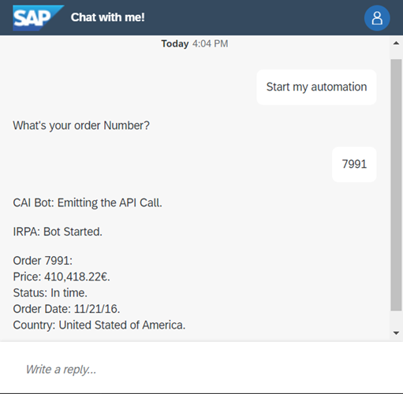


---
