## Prerequisites
 - [Subscribe to SAP Process Automation Using Booster in SAP BTP Free Tier](spa-subscribe-booster)
 - [Install and Setup the Desktop Agent](spa-setup-desktop-agent)

## Details
### You will learn
  - How to capture an application with different screens
  - How to declare elements of a captured application
  - How to build an automation using a captured application
---

In this tutorial, a Sales Orders web application is captured and details will be retrieved for a specific sales order through an automation.

[ACCORDION-BEGIN [Step 1: ](Create an application)]

1.  Open the following link in a new browser window: [Sales Order Application](https://openui5.hana.ondemand.com/test-resources/sap/m/demokit/orderbrowser/webapp/test/mockServer.html).

2.  In **Artifacts** create a new Application.

    !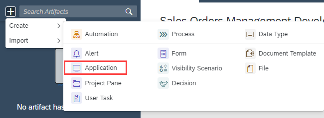

3.  Select **Browse Order** application that was is opened in step **1.1**.

    !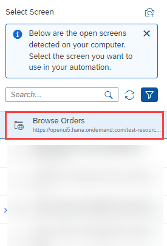

4.  On the **Screen Details** panel on the right:
    - Select **Capture Application**.
    - Select **Create a new application**.
    - Set the **Application Name** to **Order Management**.
    - Set the **Screen Name** to **Orders List** (or **Main List**).
    - Click **Capture**.

    !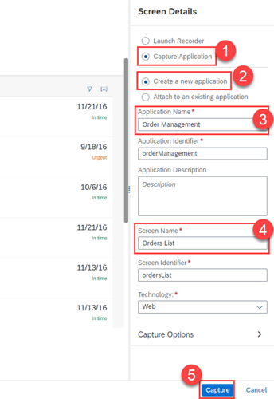

5.  Go back to the application browser window and click on first order to get the second screen.

    !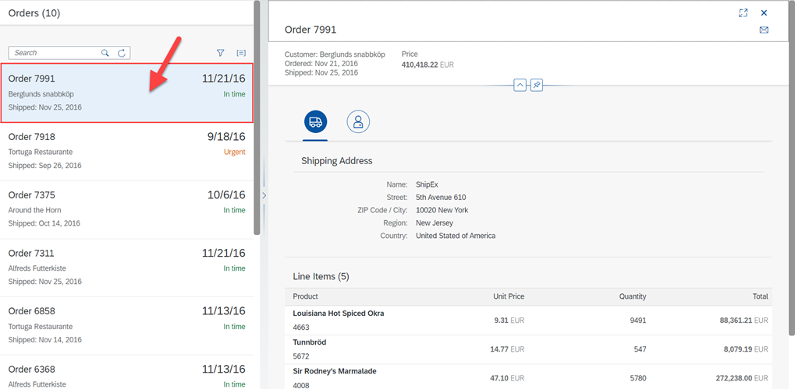

6.  In the **Order Management** Application, create a new **Screen**.

    !

7.  On the **Screen Details** panel on the right of the window that popped-up:
    - Select **Browse Orders** screen.
    - Set **Screen name** to **Order Details**.
    - Click **Capture**.

    !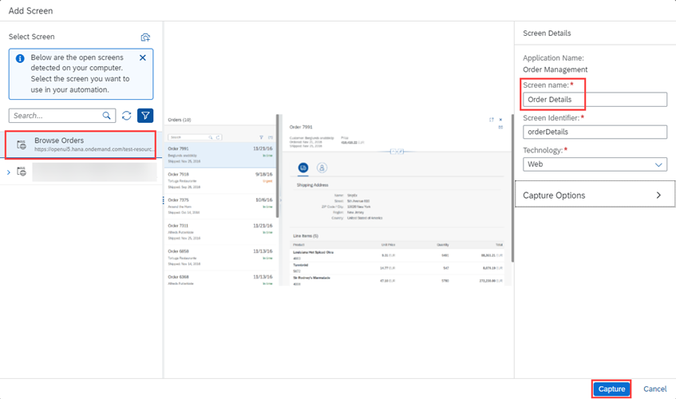

    > On the right side, there is a warning message "Another screen matches the criteria beforehand", putting the right criteria will fix it.

8.  Click on **Order Details** then click on the **Title Criteria**.

    !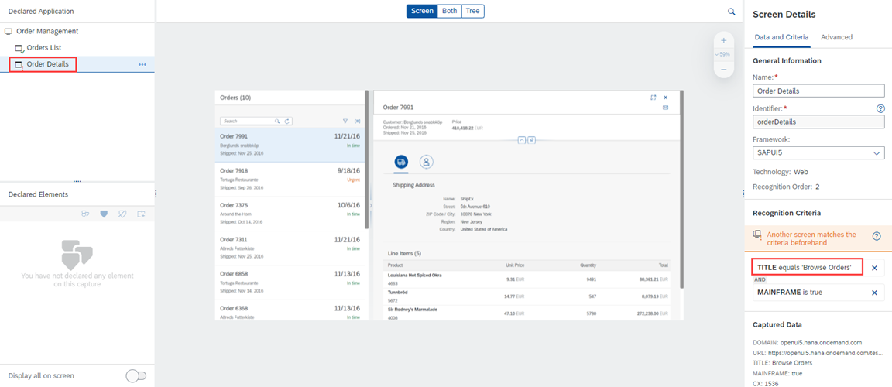

9.  In **Modify Criterion** small window:
    - Set **Property** to **URL**.
    - Set **Operator** to **contains**.
    - Set **Value** to `?tab=`.
    - Click **Apply**.

    !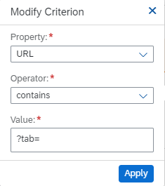

10.  Repeat the steps **1.8** and **1.9** for **Orders List** Screen while setting **Operator** to **doesn't contain**.

    !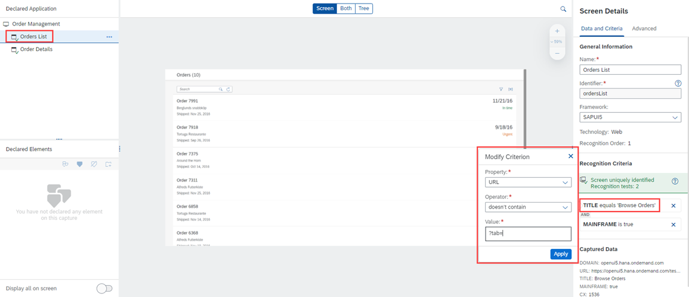

The application is now created with its two screens.

[DONE]
[ACCORDION-END]

[ACCORDION-BEGIN [Step 2: ](Declare order list screen elements)]

1.  In **Order Management** Application, click on **Orders List** Screen.

2.  Select **Both** option situated in the top to show the **DOM Tree**, then click on first order on the screen.

    !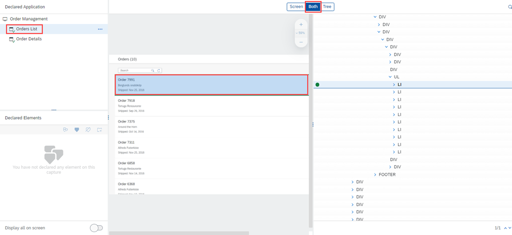

3.  In **Element Details** on the right:
    - Set **Name** to **Orders**.
    - Remove **Text** recognition criteria.
    - Click **Declare Element**.

      !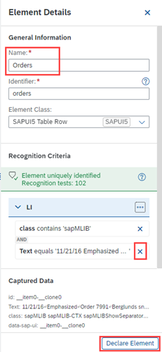

4.  In **Declared Elements** on the left, select **Orders** element and set it as **Is a collection** using the button .

    !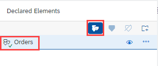

5.  Find the element **Order Date** using the **DOM Tree**.

    !

6.  **Order Date** element:
    - Set **Name** to **Order Date**.
    - Remove **Text** criterion.
    - Select **Class** criterion on **Captured Data** panel.
    - Click **Declare Element** to declare this element.

    !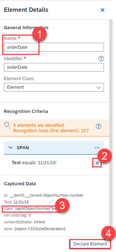

7.  Set **Order Date** as **Is a collection** as shown in step **2.4**.

8.  Repeat same steps ( **2.5 ~ 2.7** ) for **Order Status**.

    !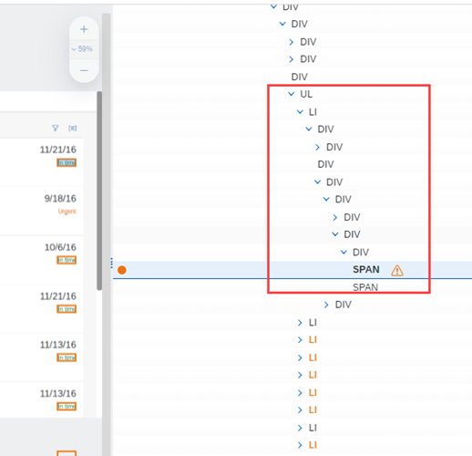

9.  Repeat same steps ( **2.5 ~ 2.7** ) for **Order Number**.

10.  Click **Save**.

**Orders List** screen's *three* elements are now declared.

!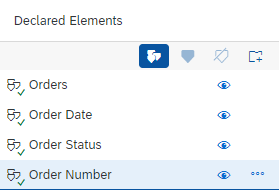

[DONE]
[ACCORDION-END]

[ACCORDION-BEGIN [Step 3: ](Declare order details screen elements)]

1.  In **Order Management** Application, click on **Order Details** Screen.

    !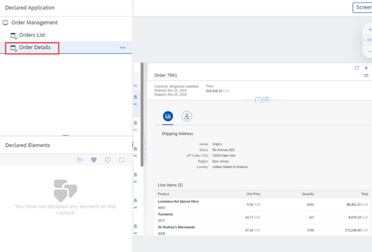

2.  To declare **Order Price**.
    - Click on **410,418.22**.
    - Set **Name** to **Order Price**.
    - Remove **Text** criterion.
    - Select **id** criterion on **Captured Data** panel.
    - Click **Declare Element** to declare this element.

    !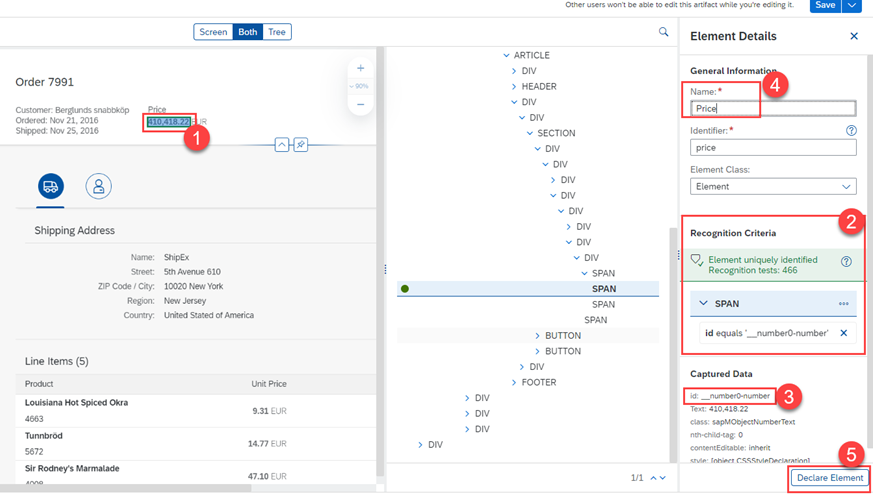

3.  Repeat step **3.2** for **Order Number** element.

4.  Repeat step **3.2** for **Shipping Address**'s 5 elements:

    !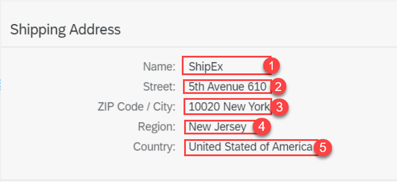  

    | Element       | Name                 | id (Criterion) |
    | :------------ | :------------------- | :------------- |
    | Name          | **Address Name**     | `__text37`     |
    | Street        | **Address Street**   | `__text38`     |
    | ZIP Code/City | **Address zip city** | `__text39`     |
    | Region        | **Address Region**   | `__text40`     |
    | Country       | **Address Country**  | `__text41`     |

5.  Repeat step **3.2** for **Customer** element.

6.  Click **Save** to save your changes.

**Order Details** screen's *seven* elements are now declared.

!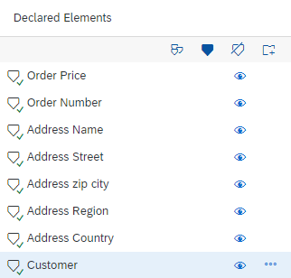

[VALIDATE_3]
[ACCORDION-END]

[ACCORDION-BEGIN [Step 4: ](Create sales order datatype)]

1.  Create a new **Data Type**.

    > **Data Types** are used to describe an entity's schema. An example of that would be describing a person using his: *First name*, *Second name*, *Age*, etc...

    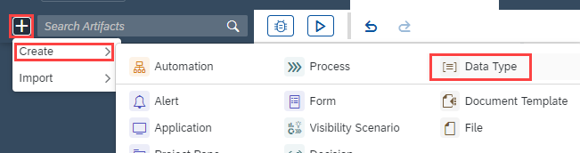

2.  Set **Name** to **Sales Order**.

    

Now, declare its fields.

1.  Click **New Field** to create a new field in **Data Type**.

    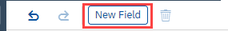

2.  Add the following fields:

    | Field Name             | Type   |
    | :--------------------- | :----- |
    | `orderNumber`          | String |
    | `orderDate`            | Date   |
    | `orderAmount`          | Number |
    | `shippingCountry`      | String |
    | `orderStatus`          | String |

    > You will notice that not all declared elements were used.

3. Click **Save** to save your changes.

**Sales Order** datatype is now ready to be used.

[DONE]
[ACCORDION-END]

[ACCORDION-BEGIN [Step 5: ](Create automation & set input/output)]

Create a new **Automation** artifact and name it **Get Order Details From Application**.

!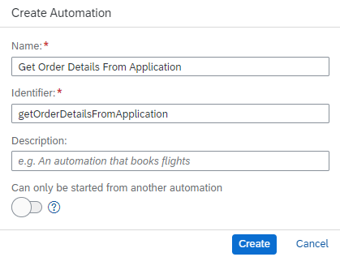

**Order Number** has to be passed as an input to our automation. And return a **Sales Order** as an output.

1. Click on the canvas of the automation then click **Input/Output**.

2. Click **Add new input parameter**.

    !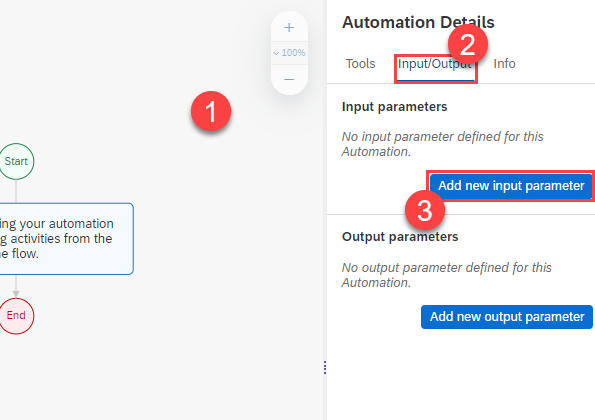

3. Set **Name** to `orderNumber` *(Case sensitive)* and **Type** to **String**.

    !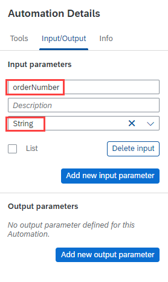

4. Click **Add new output parameter**.

5. Set **Name** to `order` and **Type** to **Sales Order**.

    !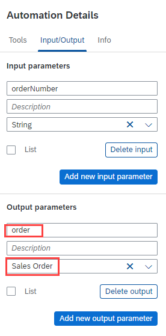

[DONE]
[ACCORDION-END]

[ACCORDION-BEGIN [Step 6: ](Building automation)]

1.  Add **Order List** Screen to the automation.

    !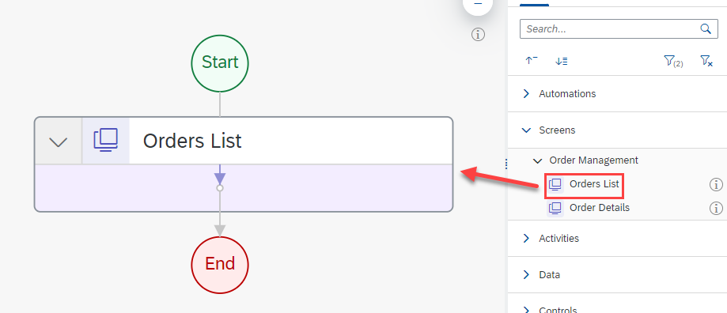

2.  Click on the screen in the automation then click **Define Screen Activities**.

    !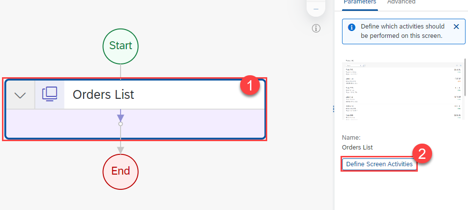

3.  Search **Start Web Page** activity and drag-and-drop it inside the **Orders List** screen.

    !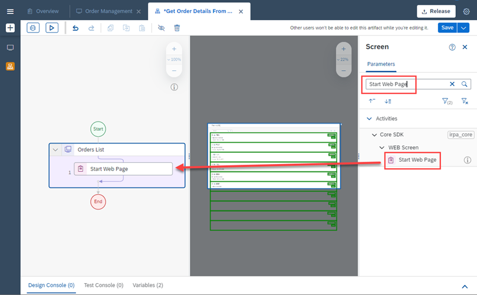

4.  Click on **Start Web Page** activity to modify its attributes:
    - Make sure the target is set to `Orders Management > Orders List`.
    - Select your browser.

    > Note: SAP Intelligent Robotic Process Automation browser extension must be installed on the used navigator.

    !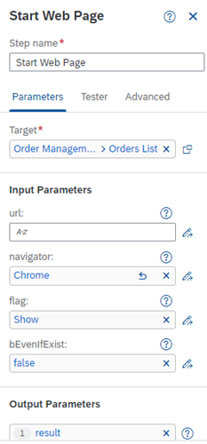

Now, to find the desired order's details, iterating through the orders is mandatory.

1.  Search **For Each** activity, and add it inside the screen activity in the automation.

    !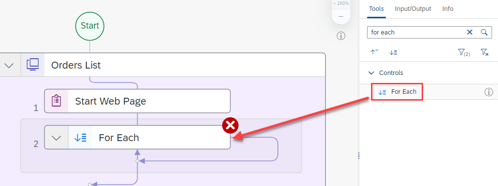

2.  Click **For Each** activity, then:
    - Click **Target Editor**.
    - Select **Order Management > Orders List > Order Number**.
    - Click **Confirm**.

    !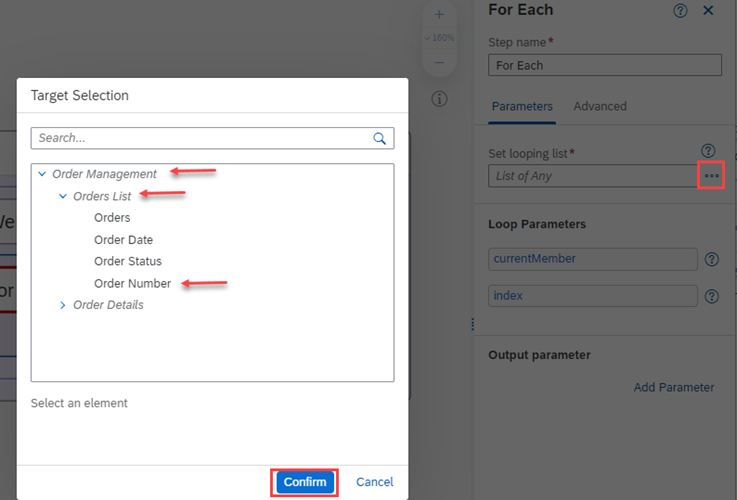

3.  Click on the screen to open **Define Screen Activities**, then:
    - Search for **Get Element** screen activity.
    - Drag-and-Drop it inside of the **For Each** activity in the automation.
    - Open **Target Editor**.
    - Select **Order Management > Orders List > Order Number**.
    - Set **Index of the element** to **(2) index**.
    - Set **Output Parameters** to `currentOrderNumber`.

    !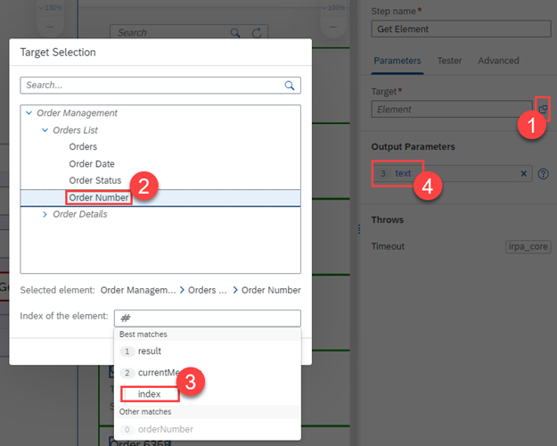

To check whether the order in the current iteration of the for loop matches the one we have in the input, checking equality must be done.

Search for **Condition** activity:

- Drag-and-Drop it inside the **For Each** Activity.

- Click on it to edit its attributes.

- Open **Edit Formula**.

- Set expression to `Step0.orderNumber === Step3.currentOrderNumber`.

- Click **Save Expression**.

!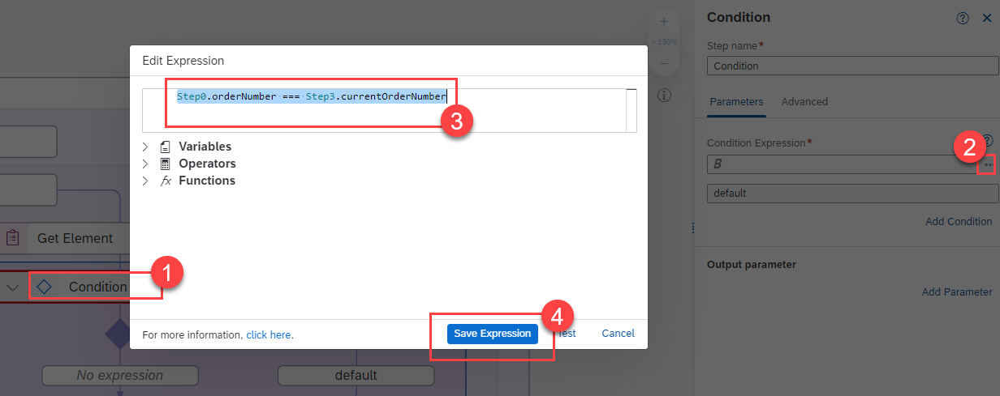

When the order is found, its details are retrieved.

1.  Add four **Get Element** screen activities inside of the condition activity.

2.  For all **Get Element** screen activities:

    | Get Element n° | Name                  | Target                                                                                                 | Output Parameters
    | :------------- | :-------------------- | :----------------------------------------------------------------------------------------------------- | :----
    | First          | **Get Order Status**  | **Order Management > Orders List > Order Status** (with **Index of the element** set to **(2) index**) | `orderStatus`
    | Second         | **Get Order Date**    | **Order Management > Orders List > Order Date** (with **Index of the element** set to **(2) index**)   | `orderDate`
    | Third          | **Get Order Price**   | **Order Management > Orders Details > Order Price**                                                    | `orderPrice`
    | Fourth         | **Get Order Country** | **Order Management > Orders Details > Order Country**                                                  | `orderCountry`

      !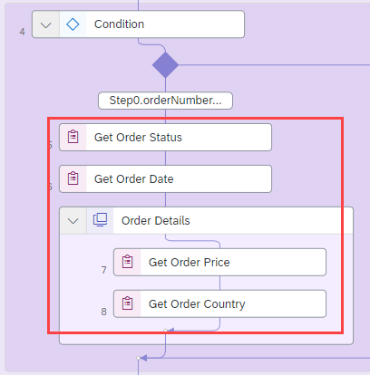

    > You can notice that **Order Details** screen was added when its elements were used by **Get Element** screen activity. That is because in order to use an element it has to be wrapped by its screen.

3.  To access the second screen, we must click on the adequate order:
    - Add a **Click** screen activity before **Order Details** screen activities.
    - Set its target to **Order Management > Orders List > Orders** with **Index of the element** set to **(2) index**.
    - Add a **Wait** activity right after **Click** screen activity.

    !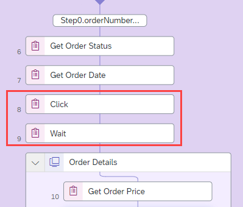

To store the gathered data, create a **Sales Order** variable.

1.  Search for **Sales Order** on the right panel.

2.  Drag-and-Drop it at the top of the automation, right after **Start**.

    !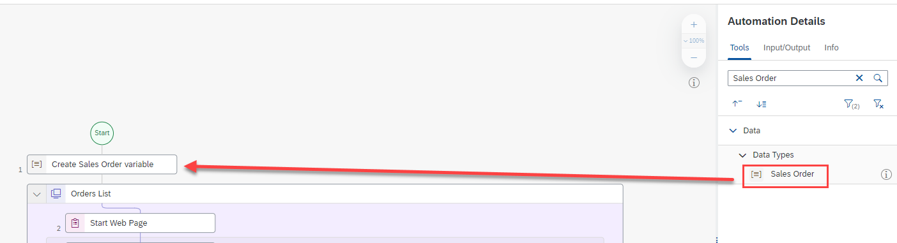

3.  Click on the activity and set **Output Parameters** to `order`.

4.  At the end of the automation, click **End** and set **order** to `order`.

    !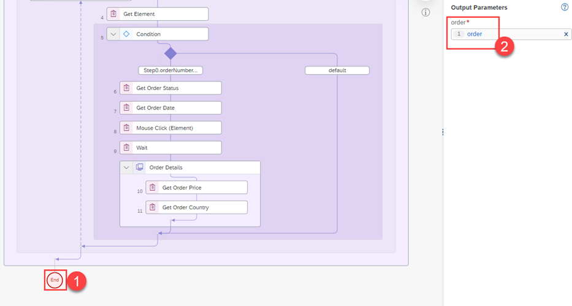

5.  Add **Set Variable Value** activity after **Order Details** screen:
    - Set **variable** attribute to **(1) order**.
    - For **value** field select **Create Custom Data**.
    - For the 5 fields that appeared:

    | Field Name        | Value
    | :-------------    | :-------------
    | `orderNumber`     | `(4) currentOrderNumber`
    | `orderDate`       | `(7) orderDate`
    | `orderAmount`     | Open expression Editor and set value `Number.parseFloat(Step10.orderPrice)`
    | `shippingCountry` | `(11) orderCountry`
    | `orderStatus`     | `(12) `

    !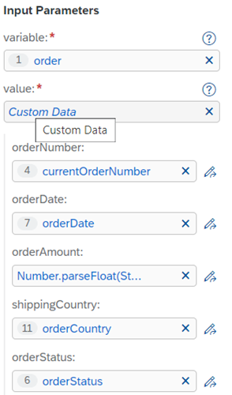

Add **Loop End** control after **Set Variable Value** activity to stop the looping process once the order is found and its data is retrieved.

!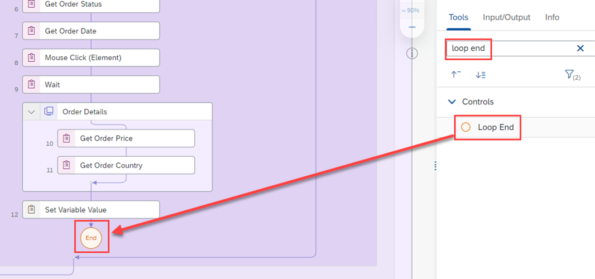

To show the resultant order after the execution finishes: add **Log Message** activity and set **Value** to `(1) order`.

Click **Save** to save your changes.

The automation is now finished and ready to be used as a standalone automation or with a process.

The final automation looks like the following:

!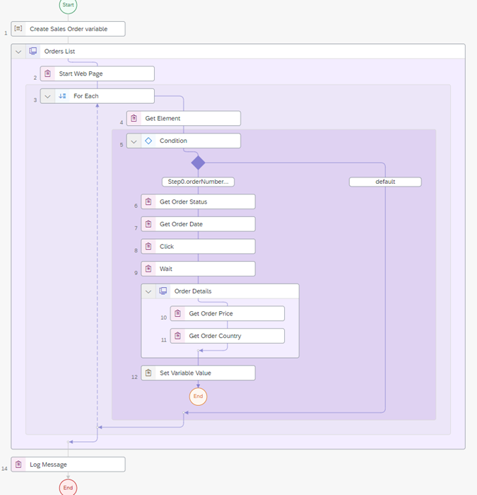

[DONE]
[ACCORDION-END]

[ACCORDION-BEGIN [Step 7: ](Test automation)]

1.  Click **Test**.
2.  Set **`orderNumber`** to an existing order in the website (ex. 7991) to test the automation with it.

!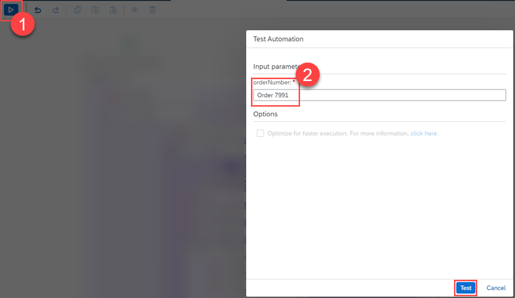

**Test Results**:

1.  Automation opens **Chrome** [Browse Orders Application](https://openui5.hana.ondemand.com/test-resources/sap/m/demokit/orderbrowser/webapp/test/mockServer.html).
2.  Loops through all orders and verifies whether the order with the order number given in the input exists. If it finds the order it clicks on it and sets the values present in the screen.
3.  Ends the looping.
4.  The Order is retrieved and shown with all its details in **Test Console**.

!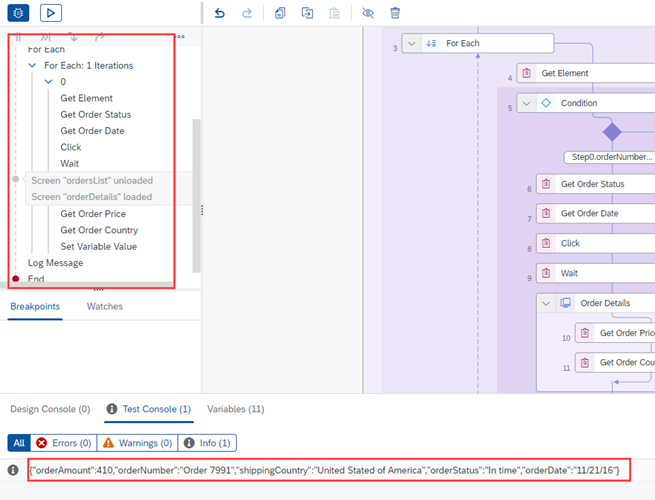

[DONE]
[ACCORDION-END]

---
