## Prerequisites
  - A windows machine
  - If you are using a MAC, please install a VDI
  - [Install and Setup the Desktop Agent](spa-setup-desktop-agent)
  - Complete the mission: [Build Your First Business Process with SAP Process Automation](mission.sap-process-automation)

## Details
### You will learn
  - How to create an automation in **SAP Process Automation**
  - How to use the **Excel SDK**
  - How to use control blocks: Conditions and Loops

---
An Automation is a succession of steps to orchestrate multiple activities and applications on a local machine.

[ACCORDION-BEGIN [Step 1: ](Create the Automation)]

 In this exercise, you will automate the process to read the *sales order* details from an Excel and select the specific sales order details based on the input from the submitted form. To design your automation, you will need an excel file filled with the sales orders data. You have the possibility to create it yourself using the following data:

| Order Number| Order Amount | Order Date | Shipping Country         | Expected Delivery Date | Order Status
|  :----------| :------------|:-----------| :------------------------|:-----------------------|:-----------
|  PO7991     | 410418.22    | 1/21/2022	| United States of America | 1/29/2022	            | In Time
|  PO7918     | 150935.13	   | 1/22/2022	| United Kingdom           | 1/27/2022	            | Urgent
|  PO7375     | 313977.82	   | 1/23/2022	| United Kingdom	         | 2/20/2022              | In Time
|  PO7311     | 755055.4	   | 1/24/2022	| United Kingdom	         | 3/30/2022              | In Time
|  PO6858     | 429358.4     | 1/25/2022	| United Kingdom	         | 2/20/2022	            | In Time
|  PO6368     | 43739.82	   | 1/26/2022	| United Kingdom	         | 3/25/2022	            | In Time
|  PO6189     | 483574.12	   | 1/27/2022	| Germany	                 | 2/5/2022	              | In Time
|  PO3115     | 273993.56	   | 1/28/2022	| Germany	                 | 3/10/2022	            | In Time
|  PO2686     | 220887.56	   | 1/29/2022	| Germany	                 | 3/5/2022	              | In Time
|  PO8282     | 436955.64	   | 1/30/2022	| United States of America | 3/30/2022	            | In Time

1. In the **Lobby** from the **editable version** of your project, do the following:
    - Select the process **Order Processing**.
    - Choose 
    - Select **Automation** > **New Automation**.

    !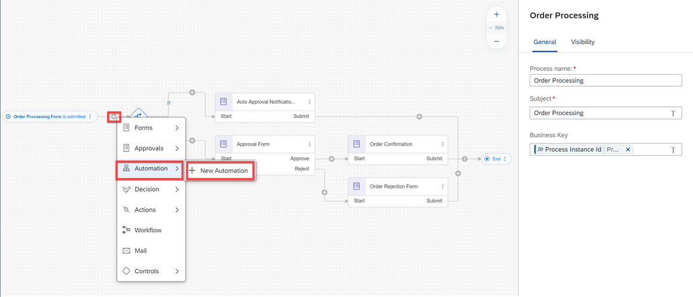

2. A pop up will appear to configure the Desktop Agent version. Do the following in the pop up:

    - From the dropdown, select the version of the Desktop Agent installed on your machine.

    > It would be with suffix as **Registered**.

    - Choose **Confirm**.

    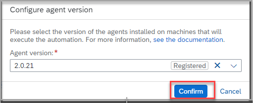

3. A new pop-up will appear to create the automation. Do the following in the pop-up:

    -  Enter **Name** of the automation as **Get Order Details**.
    -  Enter a **Description**.
    -  Choose **Create**.

    > Identifier will be auto-filled.

    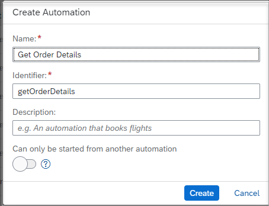

    An automation **Get Order Details** will be created successfully.

    !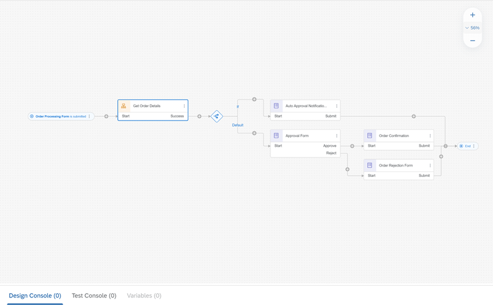

[DONE]
[ACCORDION-END]

[ACCORDION-BEGIN [Step 2: ](Create Environment Variable)]

Business project usually need to use parameters and variable at runtime. These variables are usually saved in their runtime landscapes, Dev, Test or Production environments for example. In this case, you will need to maintain an environment variable that will contain the file full path of the excel file used in the automation.

> Environment Variables allow you to reuse certain information for a given environment. You use environment variables to pass parameters to automations.

1. Select **Settings > Environment Variables > Create**

    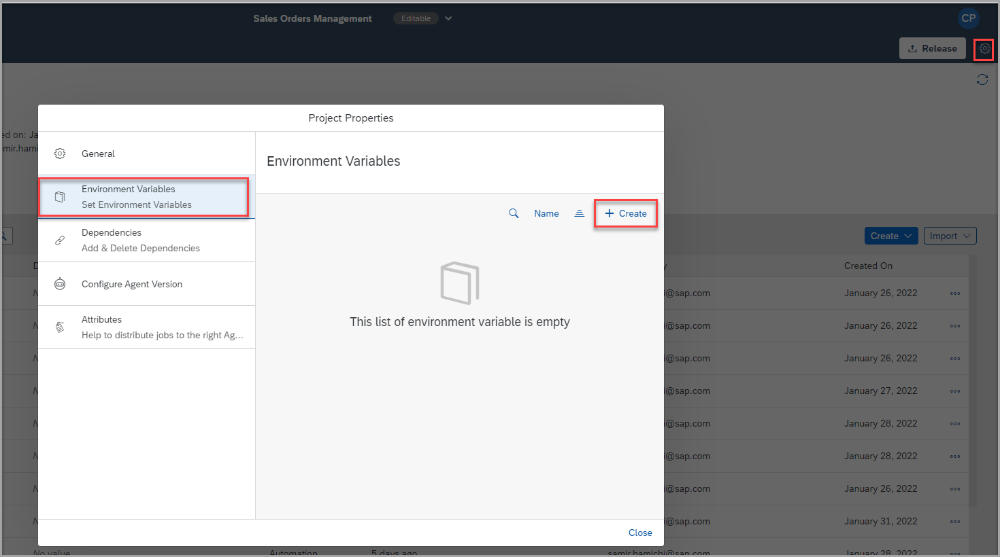

2. In the new environment variable screen, do the following:

    - Enter the **Identifier** of the variable as `OrderFilePath`.
    - Select **Type** as **String**.
    - Choose **Create**.

    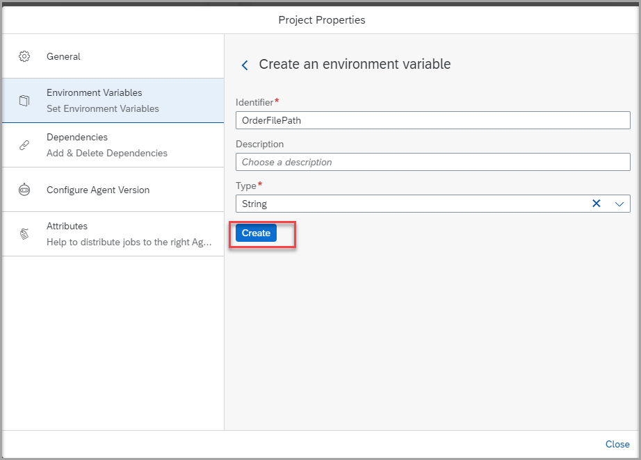

    The Environment Variable is created successfully.

    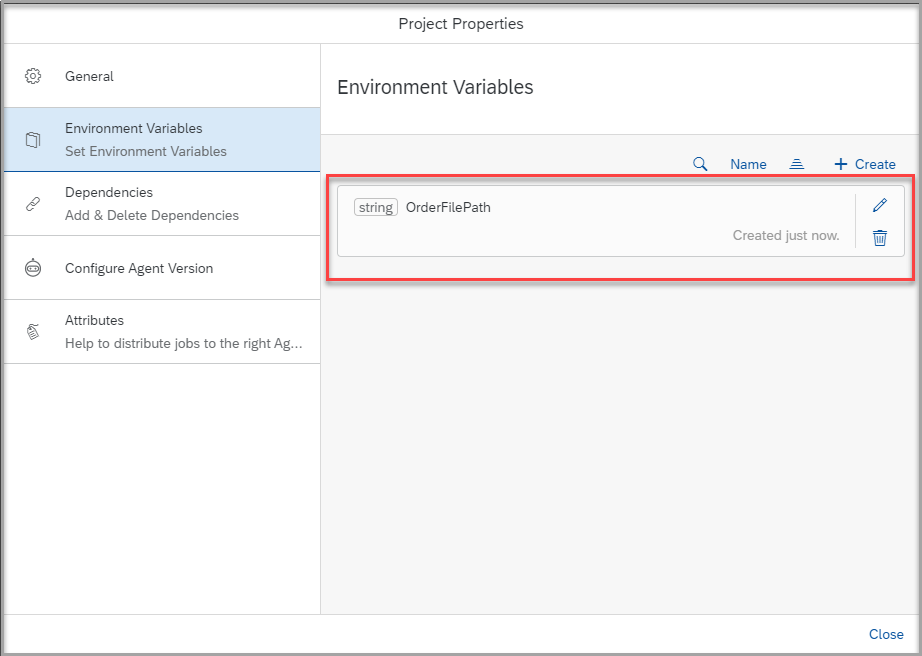

    - Close the project properties.

[DONE]
[ACCORDION-END]

[ACCORDION-BEGIN [Step 3: ](Add Excel Activities)]

You will now design the automation in the Automation Editor by dragging-and-dropping activities into the workflow of the automation. Later you will configure the inputs and outputs of each activity. You will need activities to interact with Microsoft Excel application. These activities will open Excel application, open the workbook that contains the sales orders details and map them into a data type that will be created during the design. Last, after extracting and mapping the data, the Excel application will be closed.

1. Double click on the automation **Get Order Details** which navigates to the Design Studio to build your automation.

    Since excel is used in this automation, you have to open an excel instance. **Open Excel Instance** is a mandatory activity to use when using Excel. It opens an instance of Excel. Once you open an Excel instance, you can use other Excel activities.

2. To open **Excel Instance**, do the following:

    -  Search for the **Open Excel Instance** activity in **Automation Details** section on the right.
    -  Drag and drop the activity into the canvas.

    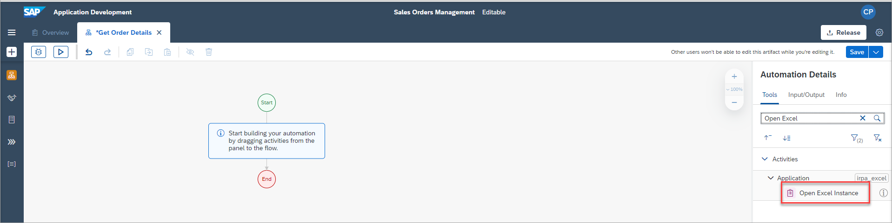

    Next, Excel Data Mapping is done with the Excel Cloud Link activity. Excel Data Mapping allows you to transform columns-based data from an Excel sheet into data that can be used in your automation. The data from the Excel sheet stays the same but the structure becomes a data type structure, making it possible to use throughout your project.

3. To get the **Excel Cloud Link**, do the following:

    -  Search for the activity **Excel Cloud Link** in **Automation Details**.
    -  Drag and drop the activity into the canvas.
    -  Select **Edit activity**.

    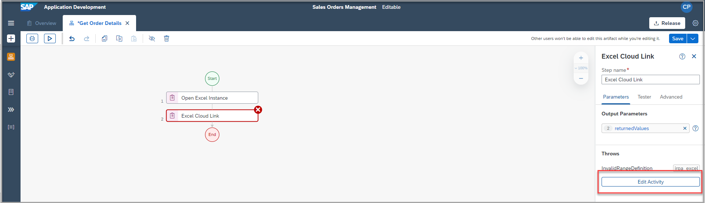

4. In the **Excel File** screen that opens up, select **Browse** and choose the **SalesOrdersDetails.xlsx** file which is saved on your machine.

    > The Excel file is mapped automatically.

    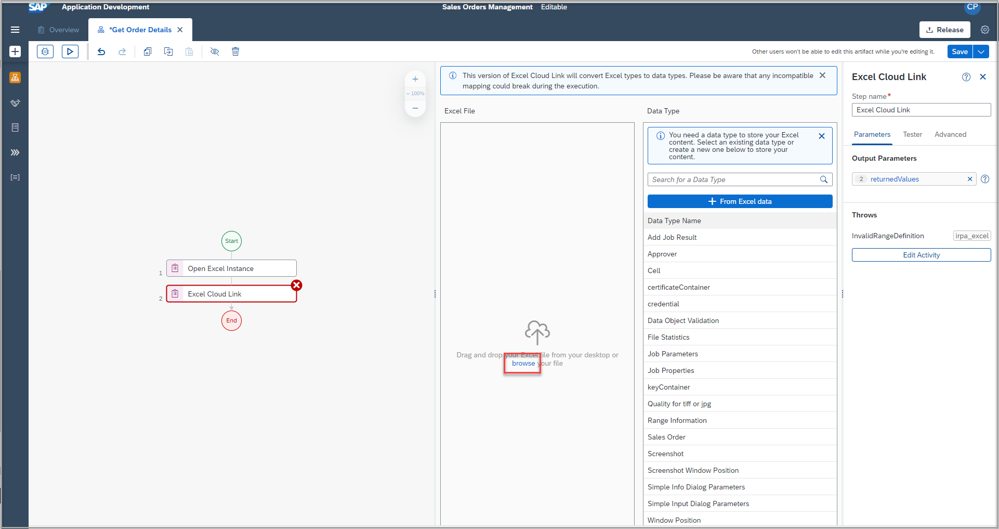

 5.  Enter the **Environment Variable** as `OrderFilePath` which was created above as the parameter value for **Workbook path**.

    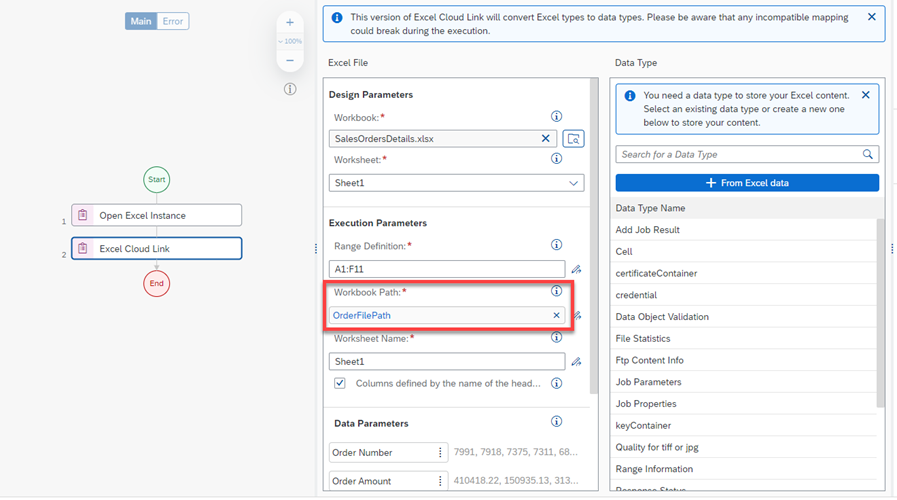

 6. Select the button **From Excel Data**.

    > A pop up appears to create a data type. A **Sales Order** variable is needed to collect the data from the excel sheet columns. In this step, a variable is automatically created from the excel file columns.

    !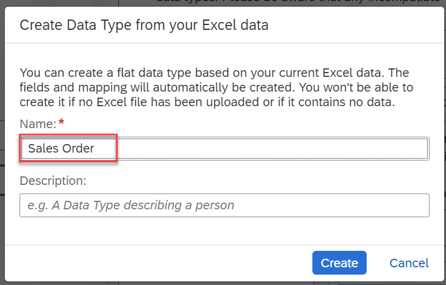

 7. Enter the **Name** of the data type as **Sales Order** and choose **Create**.

    > Framework creates a data type with the columns of the Excel as the field names. You can see it in the Artifacts section in the Overview tab.

    !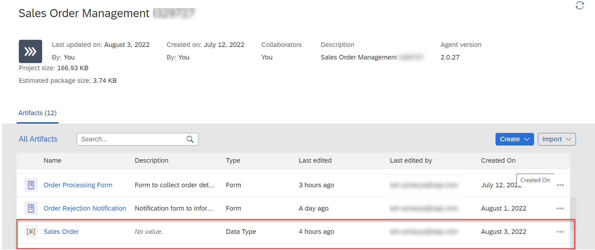

 8. In the **Get Order Details** automation, change the variable name to **Orders** in the **Output Parameters** of the **Excel Cloud Link** activity.

    !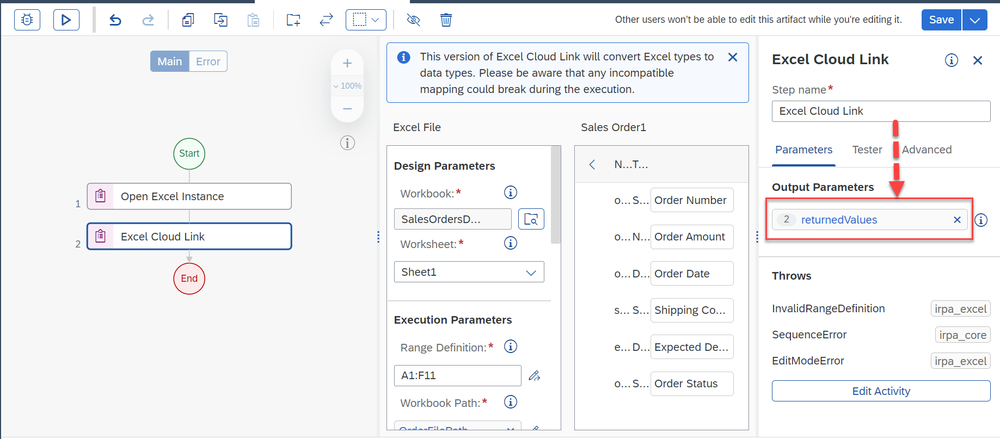

    Once Excel is no longer required, close the excel instance. **Close Excel Instance** activity closes an instance of Excel. To close the opened instance of the excel file, do the following:

    -  Search for the activity **Close Excel Instance** in **Automation Details**.
    -  Drag and drop the activity into the canvas.

9. **Save** the automation.

[VALIDATE_1]
[ACCORDION-END]

[ACCORDION-BEGIN [Step 4: ](Add Input and Output Parameters)]

Input and output parameters allow you to exchange data in the workflow of your automation between activities, screens, and scripts.

1. Click on the canvas and select the **Input/Output** section in **Automation Details**.

    !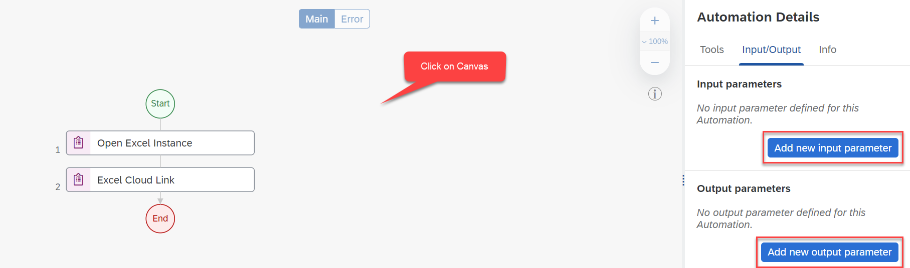

2. Add Input and Output parameters as following:

    |  Parameter Name   | Data type          | Parameter Type | Description
    |  :--------------- | :----------------- | :------------- | :--------------------------------------------------- |
    |  `OrderNumber`    | **`String`**       | Input          | Receives order number from the Order Processing Form
    |  `selectedOrder`  | **`Sales Order`**  | Output         | Selected order details are passed to the Process

    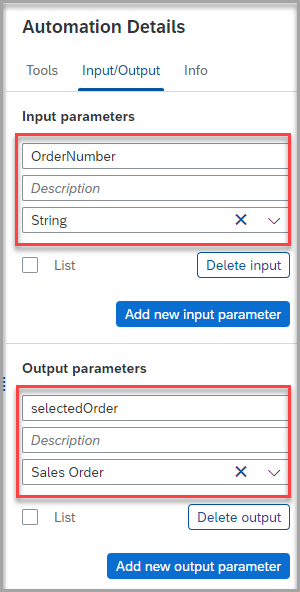

[DONE]
[ACCORDION-END]

[ACCORDION-BEGIN [Step 5: ](Create a Variable)]

Variables that are used, build your automation, and are data storage that have a name, a type (example: string, list of string or data type), and a value. A variable in the automation is also associated to a step represented by its number.

1.  Search for the **Sales Order** data type (created in the previous step) in **Automation Details**.

    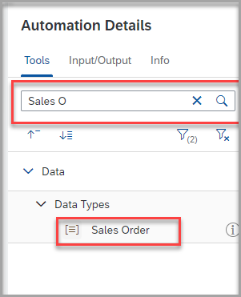

2.  Drag and drop the **Sales Order** into the canvas.

    !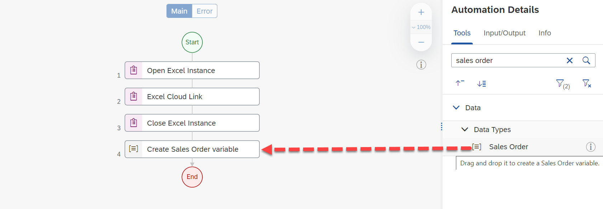

    > A variable of the data type **Sales Order** is created.

3. Enter the value of **Output Parameters** as `selectedOrderDetails`.

    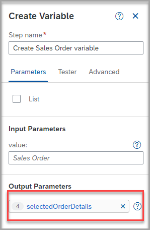

[DONE]
[ACCORDION-END]

[ACCORDION-BEGIN [Step 6: ](Looping through Excel Sheet and searching for the Order)]

Now you will loop through each **Order** from the excel sheet, retrieve the order details for order number submitted in the **Order Processing Form**. **For Each** control allows you to go through a list of members provided as input to your automation, and execute an action for each member in that list.

This control has the following loop parameters:

  - `currentMember`: The member of the list for the current loop iteration.
  - `index`: An integer that is the index of the current loop iteration, starts at 0.

1. Search for the control **For Each** in **Automation Details**.

2. Drag and Drop the activity into the canvas.

3. Enter the value of **Set looping List** as **Orders**.

    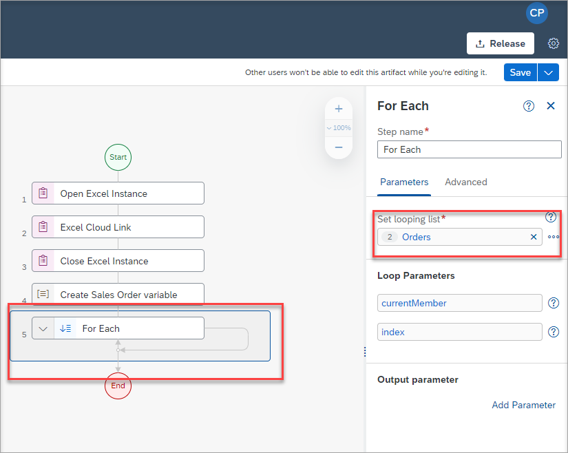

    To match the desired order, a control activity has to be added to search for a match to its order number. The **Condition** activity is the activity that you will add. In this condition, you will check if the order number entered in the **Form** is available in data read from Excel in **Step 2**.

4.  Search for the activity **Condition** in Automation Details.
5.  Drag and Drop the activity **inside** the **For Each** block.
6.  Choose  -> **Edit Formula** to edit the formula.

    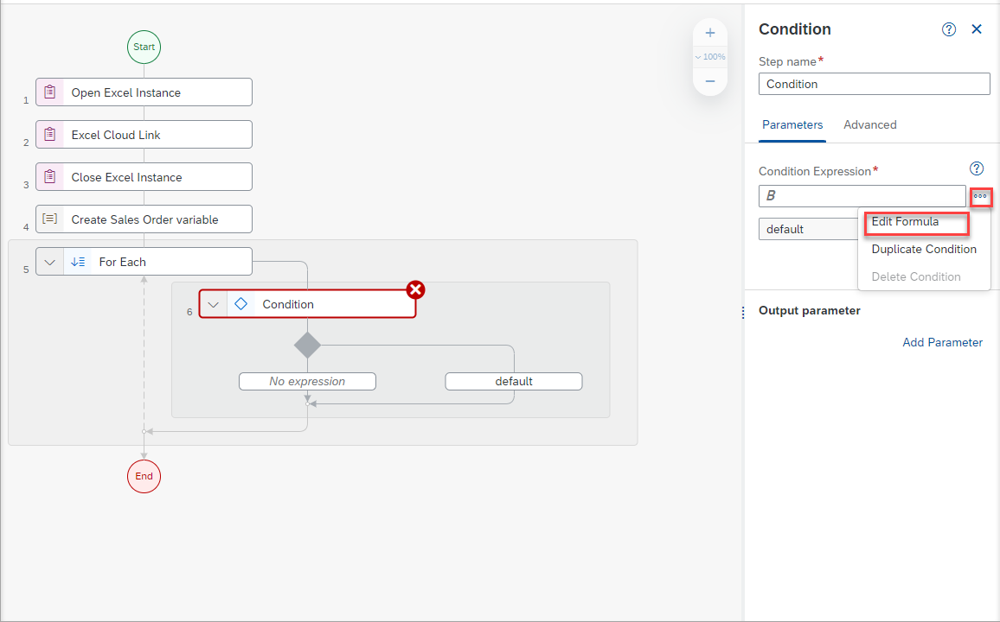

7.  A pop up window appears to enter the condition expression. You can enter this expression manually or you can expand the **Variables** list and select the given variables to form the expression: `Step0.OrderNumber === Step5.currentMember.orderNumber`

    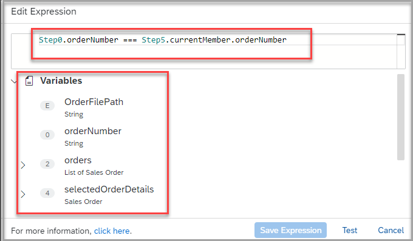

    If the order number is found in Excel, i.e. the condition is **True**, set the variable using **Set Variable Value** activity that is a **Data Management Activity**.

8. Search for the activity **Set Variable Value** in **Automation Details**.

9. Drag and Drop the activity into the canvas.

    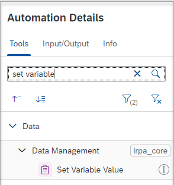

10. In the **Set Variable Value** configuration screen on the right, do the following:

    - Enter `selectedOrderDetails` as the **variable**.
    - Enter `currentMember` as the **value**.

    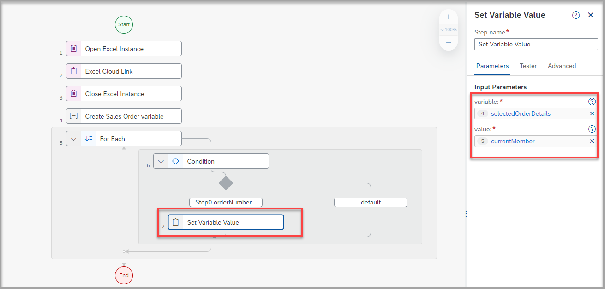

11. Once the order number is found in the excel, use the control **End Loop** to stop the loop.

    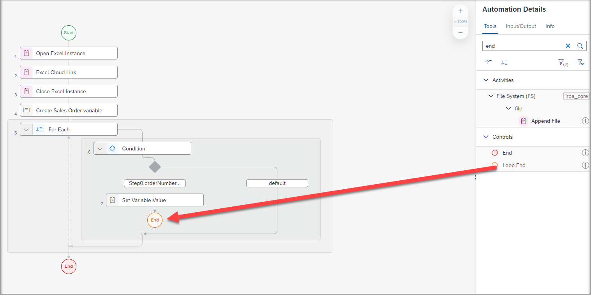

12. Use **Log message** activity to print your results. Lets use this activity to check `selectedOrderDetails` in testing mode.

    !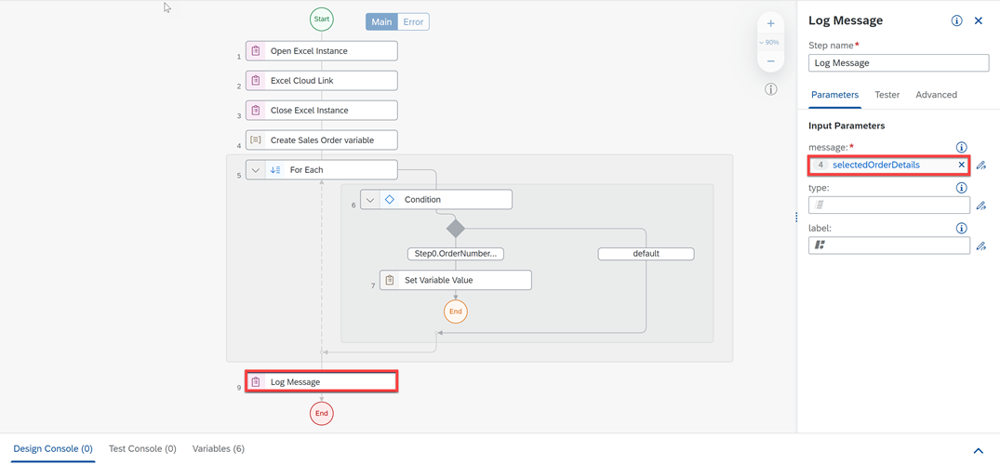

[VALIDATE_2]
[ACCORDION-END]

[ACCORDION-BEGIN [Step 7: ](Link Automation Parameters with Business Process)]

Apart from creating an output parameter, it is mandatory to pass the data through the **End** step to expose the data outside the automation.

1. Choose **End**.

2. In the **End** configuration screen on the right.

3. Enter `selectedOrderDetails` as the **Output Parameter**.

    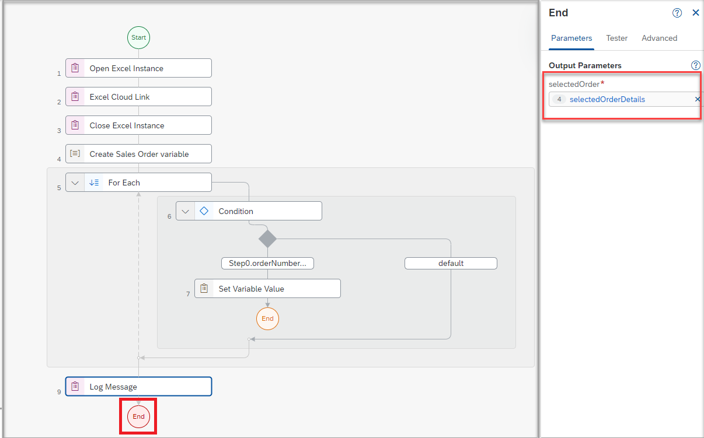

    > Make sure to add the steps **Condition**, **Set variable value**, **End Loop** inside the **For Each** block.

4. **Save** the Automation.

    The complete automation **Get Order Details** looks as below.  

    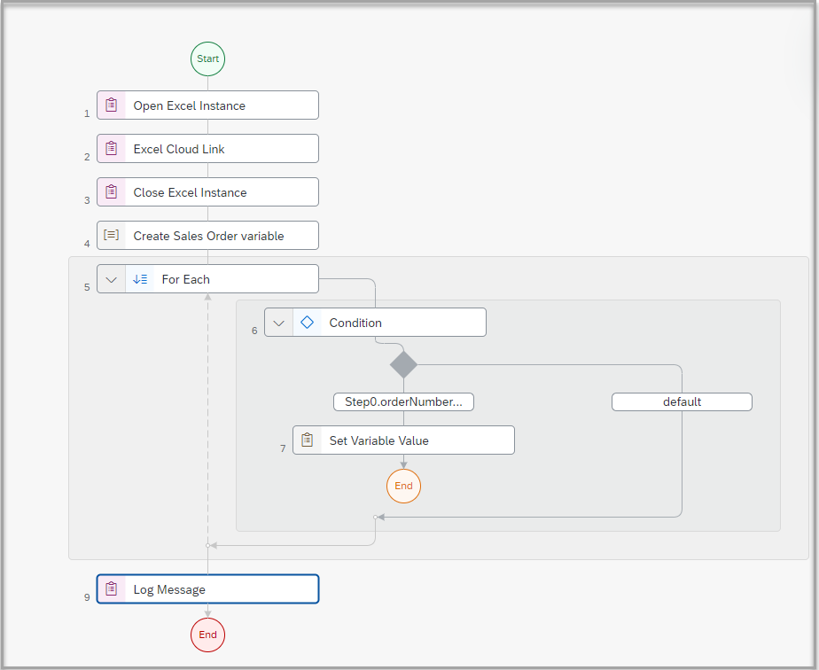

    Now, map the **Automation Parameters** with **Form Parameters**.

5. Select **Get Order Details** automation in the process **Order Processing**.

6. Map the input parameter `OrderNumber` of the automation  **Get Order Details** with the **Order Number** of **Order Processing Form**.

    !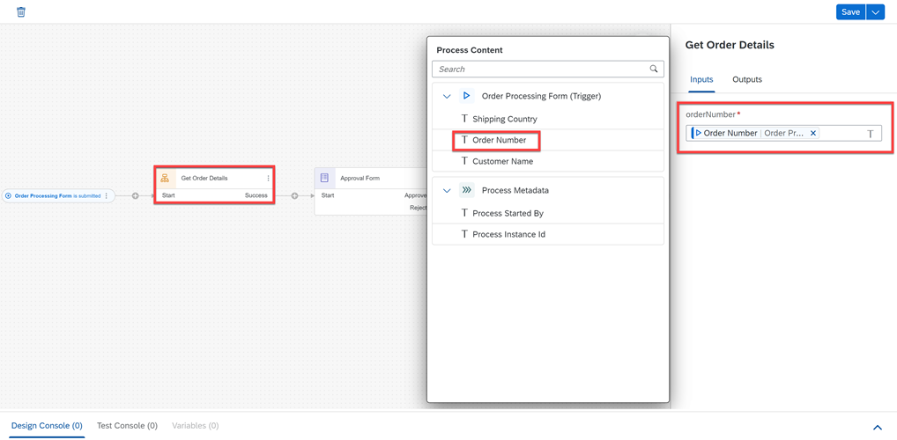

7. Choose **Save** to save the **Order Processing** process.

[DONE]
[ACCORDION-END]

[ACCORDION-BEGIN [Step 8: ](Test the Automation)]

1. Navigate back to the automation **Get Order Details**

2. Choose the  button.

3. Enter the parameters to test the Automation.

    |  Parameter         | Value  
    |  :---------------- | :-------------  |
    |  `OrderNumber`  | Any order number which is available in `SalesOrdersDetails` Excel |
    |  `OrderFilePath` | Path where the `SalesOrderDetails` Excel is stored on your local machine |

    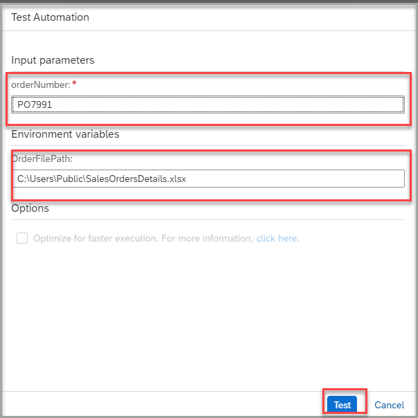

4. Test Results:

    - Automation opens the `SalesOrderDetails` Excel.
    - Reads the Excel content.
    - Closes the Excel.
    - Loops through Excel and verifies if entered `OrderNumber` is available in the Excel. If the `OrderNumber` is available in the Excel, it sets the  Orders Details.
    - Ends the looping.
    - Prints the selected order details.

    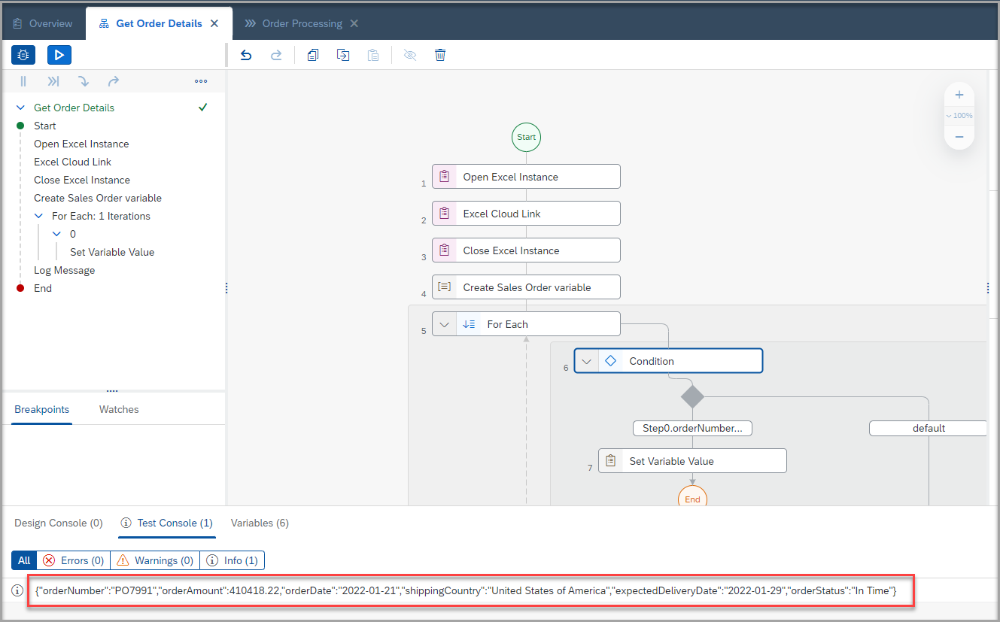

[DONE]
[ACCORDION-END]

[ACCORDION-BEGIN [Step 9: ](Simplify the Start Form)]

After the design of the automation that retrieves the data form the excel file, simplify the start form by deleting the not needed fields.

1. Open the Start Form in the editor.

    !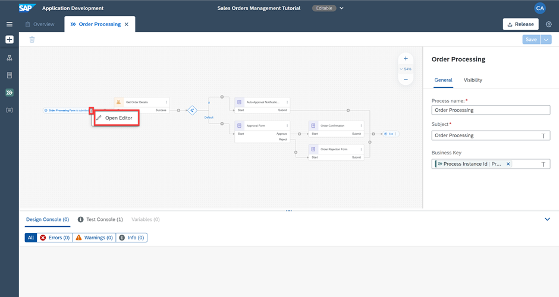

2. Delete the following fields from the form: Order Amount, Order Date, Expected Delivery Date and Shipping Country. You can achieve that by selecting the contextual menu of each field like for Order Amount field below.

    !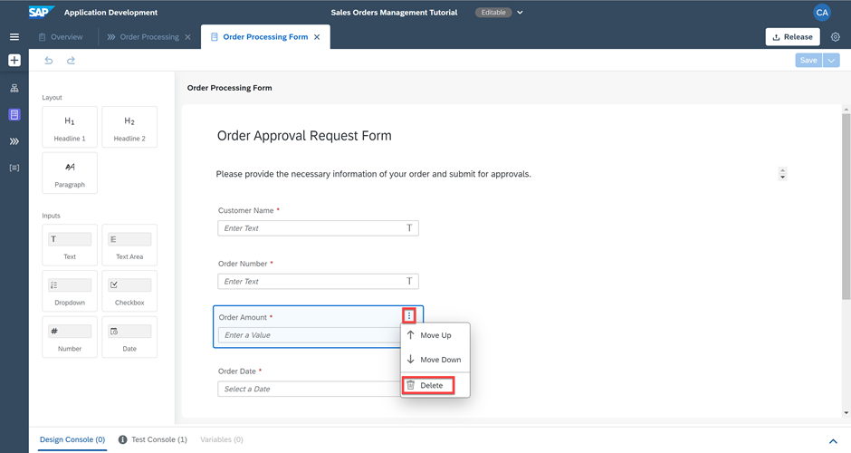

3. Save the Form, close the Form Editor and go back to the Process.

    !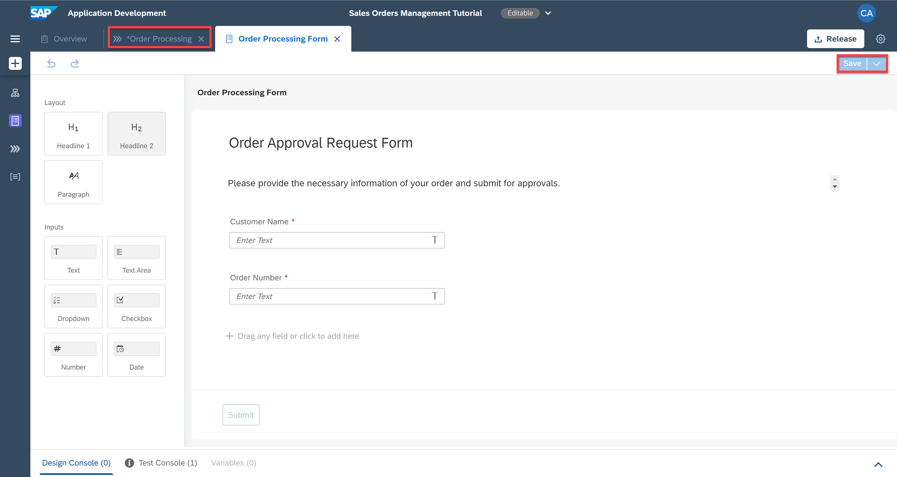

[DONE]
[ACCORDION-END]

[ACCORDION-BEGIN [Step 10: ](Mapping Forms of the Process)]

The different Forms of the process will need Inputs Mapping from the Automation Outputs.

!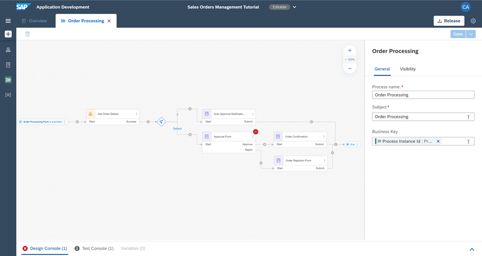

1. Select the Approval Form and go to the Inputs.

    !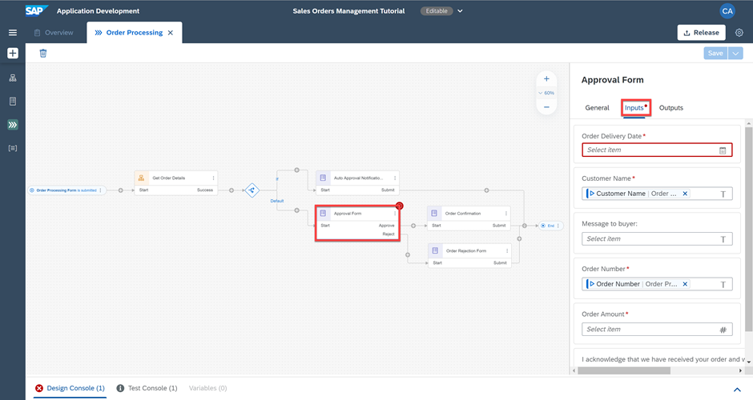

2. Select the Order Delivery date and choose the `expectedDeliveryDate` from the Automation outputs.

    !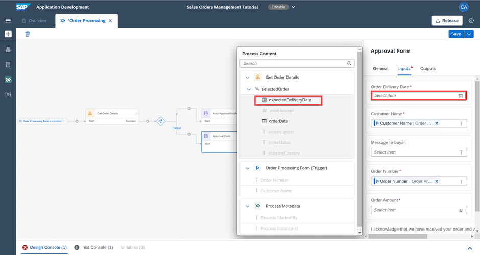

3. Select the Order Amount input and choose the `orderAmount` from the Automation outputs.

    !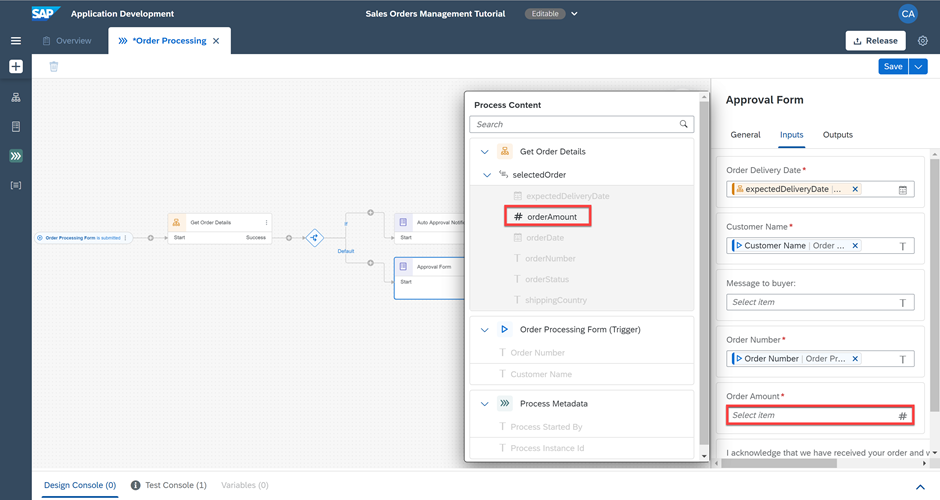

4. Do the same for the Order Confirmation Form.

    !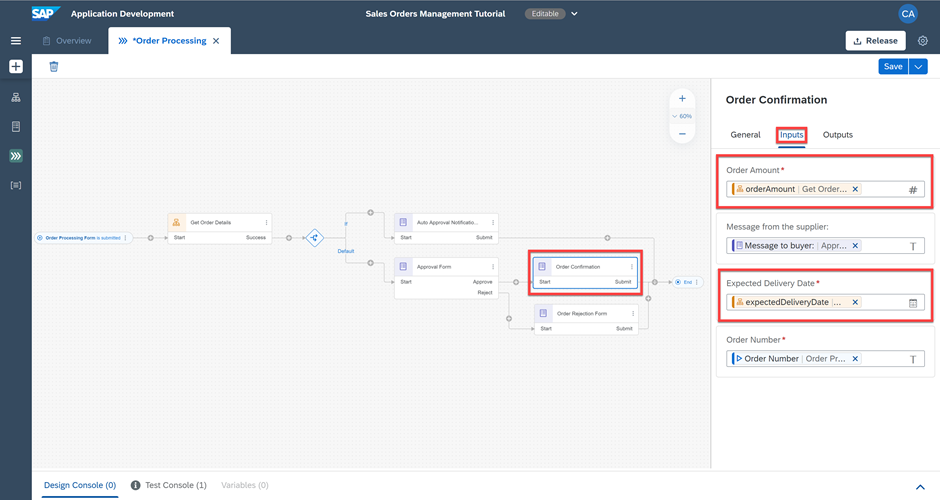

5. The last mapping for the Order Rejection Form.

    !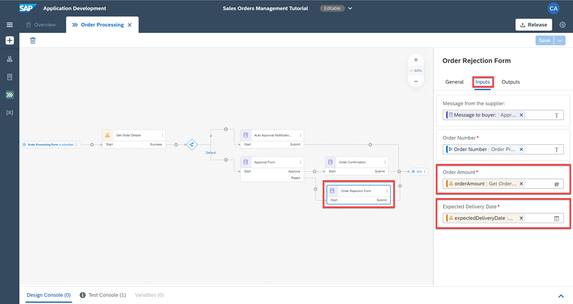

6. Save the Process.

    !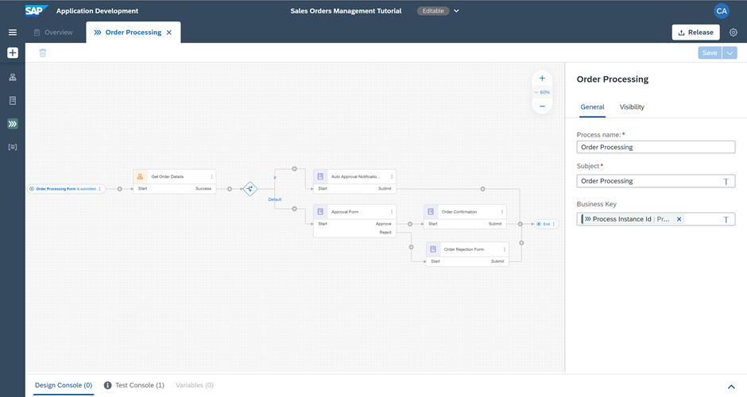

You have successfully completed creating an automation in your process.

[DONE]
[ACCORDION-END]

---
