## Prerequisites
  - A windows machine
  - If you are using a MAC, please install a VDI
  - [Install and Setup the Desktop Agent](spa-setup-desktop-agent)
  - Complete the mission: [Build Your First Business Process with SAP Process Automation](mission.sap-process-automation)

## Details
### You will learn
  - How to create an automation in **SAP Process Automation**
  - How to use the **Excel SDK**
  - How to use control blocks: Conditions and Loops

---
An Automation is a succession of steps to orchestrate multiple activities and applications on a local machine.

[ACCORDION-BEGIN [Step 1: ](Create the Automation)]

In this exercise, you will automate the process to read the *sales order* details from an Excel and select the specific sales order details based on the input from the submitted form. To design your automation, you will need an Excel file filled with the sales orders data. You have the possibility to create it yourself using the following data:

| Order Number| Order Amount | Order Date | Shipping Country         | Expected Delivery Date | Order Status
|  :----------| :------------|:-----------| :------------------------|:-----------------------|:-----------
|  PO7991     | 410418.22    | 1/21/2022	| United States of America | 1/29/2022	            | In Time
|  PO7918     | 150935.13	   | 1/22/2022	| United Kingdom           | 1/27/2022	            | Urgent
|  PO7375     | 313977.82	   | 1/23/2022	| United Kingdom	         | 2/20/2022              | In Time
|  PO7311     | 755055.4	   | 1/24/2022	| United Kingdom	         | 3/30/2022              | In Time
|  PO6858     | 429358.4     | 1/25/2022	| United Kingdom	         | 2/20/2022	            | In Time
|  PO6368     | 43739.82	   | 1/26/2022	| United Kingdom	         | 3/25/2022	            | In Time
|  PO6189     | 483574.12	   | 1/27/2022	| Germany	                 | 2/5/2022	              | In Time
|  PO3115     | 273993.56	   | 1/28/2022	| Germany	                 | 3/10/2022	            | In Time
|  PO2686     | 220887.56	   | 1/29/2022	| Germany	                 | 3/5/2022	              | In Time
|  PO8282     | 436955.64	   | 1/30/2022	| United States of America | 3/30/2022	            | In Time

1. In the **Lobby** from the **editable version** of your project, do the following:
    - Select the process **Order Processing**.
    - Choose **+**
    - Select **Automation**, **New Automation**.

    !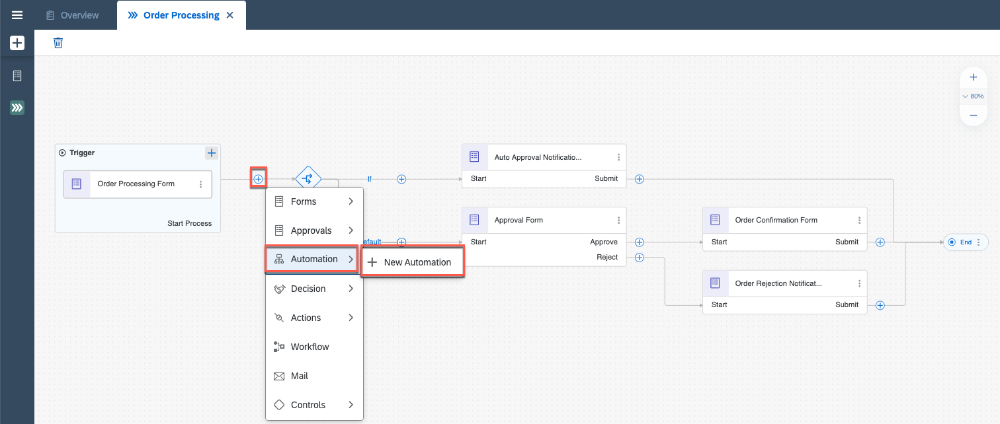

2. A pop up will appear to configure the Desktop Agent version. Do the following in the pop up:

    - From the dropdown, select the version of the Desktop Agent installed on your machine. It would be displayed with suffix as **Registered**.
    - Choose the **Confirm** button.

    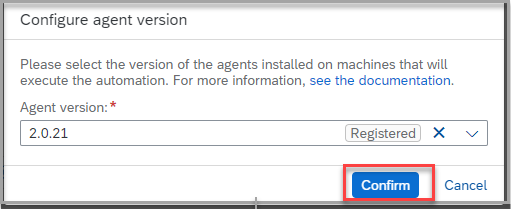

3. A new pop-up will appear to create the automation. Do the following in the pop-up:

    -  Under Name Field enter: **Get Order Details**,
    -  Under Description enter: **Automation for Order Process**,
    -  Choose the **Create** button.

    > Identifier will be auto-filled.

    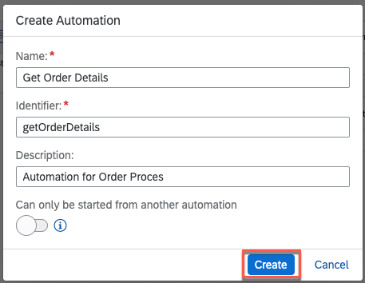

    An automation **Get Order Details** will be created successfully.

    !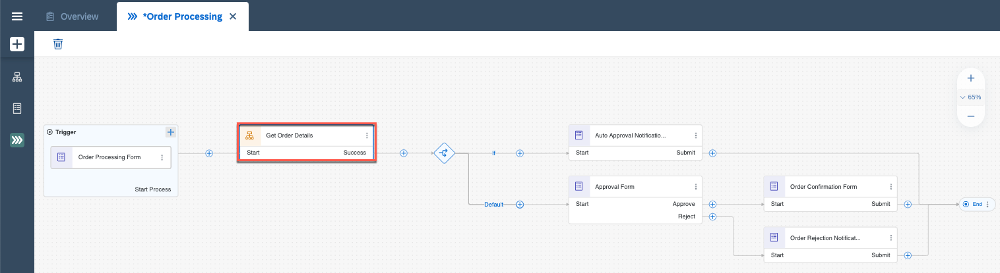

[DONE]
[ACCORDION-END]

[ACCORDION-BEGIN [Step 2: ](Create Environment Variable)]

Business projects usually need to use parameters and variable at runtime. These variables are usually saved in their runtime landscapes for example Dev, Test or Production environments. In this case, you will need to maintain an environment variable that will contain the file full path of the Excel file used in the automation.

> Environment Variables allow you to reuse certain information for a given environment. You use environment variables to pass parameters to automations.

1. Select **Settings**.

    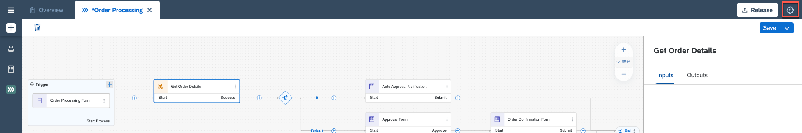

2. In the Project Properties window, select **Environment Variables**, then **+ Create**.

    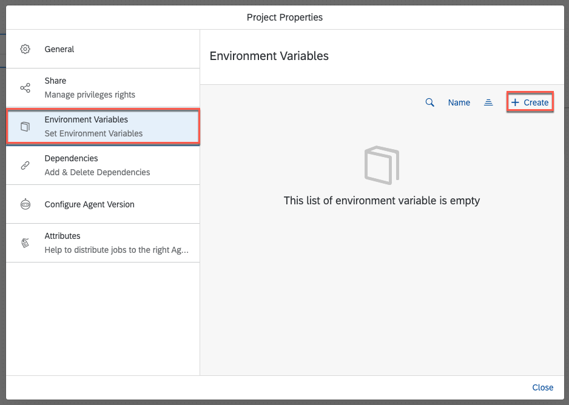

3. In the create an environment variable screen:

    - Under Identifier enter: `OrderFilePath`,
    - Under Type select **String**,
    - Choose the **Create** button.

    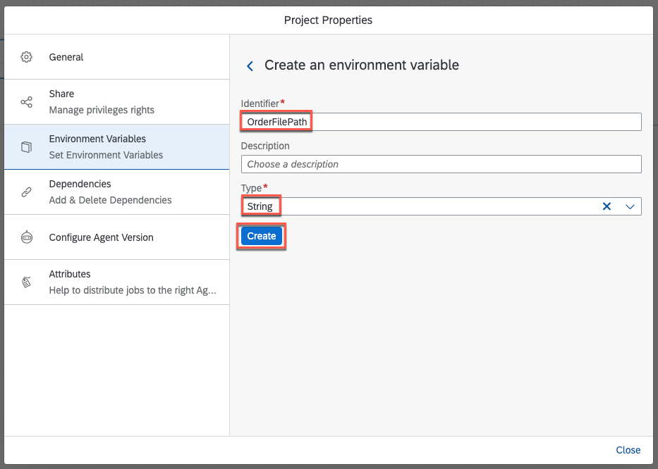

4. After the Environment Variable is created successfully, **close** the project properties window.

    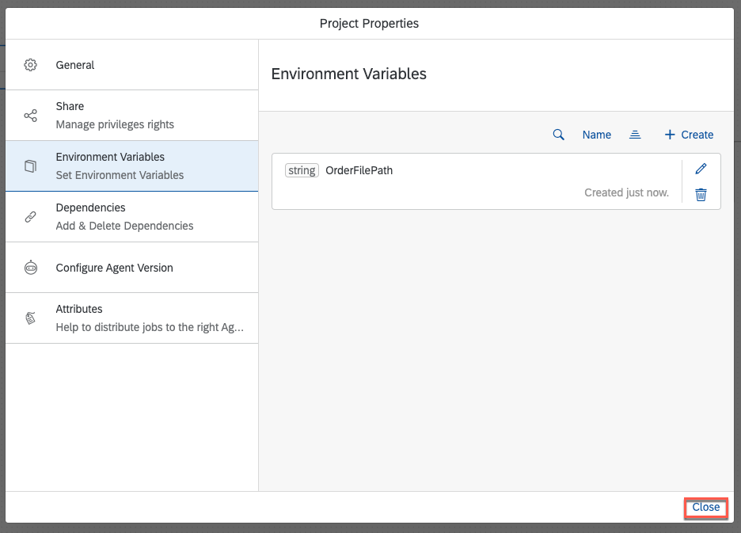

[DONE]
[ACCORDION-END]

[ACCORDION-BEGIN [Step 3: ](Add Excel Activities)]

You will now design the automation in the Automation Editor by dragging-and-dropping activities into the workflow of the automation. Later you will configure the inputs and outputs of each activity. You will need activities to interact with Microsoft Excel application. These activities will open Excel application, open the workbook that contains the sales orders details and map them into a data type that will be created during the design. Last, after extracting and mapping the data, the Excel application will be closed.

1. Select 3 dots next to **Get Order Details**, choose **Open Editor**, which navigates to the Design Studio to build the automation.

    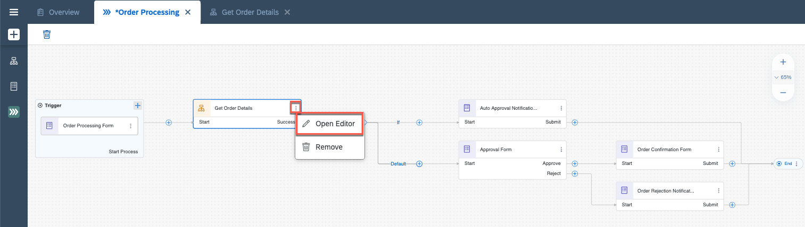

    > Since Excel is used in this automation, you have to open an Excel instance. Open Excel Instance is a mandatory activity to use when using Excel. Once you open an Excel instance, you can use other Excel activities.

2.  To open the **Excel Instance**:
    -  In the Automation Details section on the right, search for the **Open Excel Instance** activity,
    -  **Drag and drop** the activity into the canvas.

    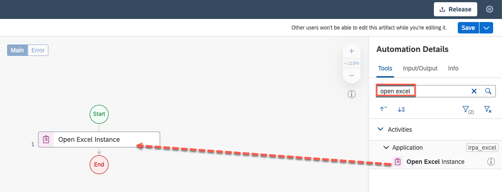

    > Next, Excel Data Mapping is done with the Excel Cloud Link activity. Excel Data Mapping allows you to transform columns-based data from an Excel sheet into data that can be used in the automation. The data from the Excel sheet stays the same but the structure becomes a data type structure, making it possible to use throughout your project.

3. To get the **Excel Cloud Link**:

    -  in the Automation Details search for the activity **Excel Cloud Link**,
    -  Drag and drop the activity into the canvas,

    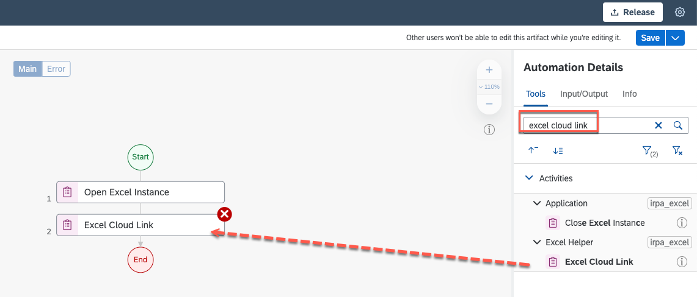

4. Select Excel Cloud Link, in the details on the right side, choose the **Edit activity** button.

    

5. In the Excel File screen:
    - select **Browse**,
    - choose the **SalesOrdersDetails.xlsx** file which is saved on your machine.

    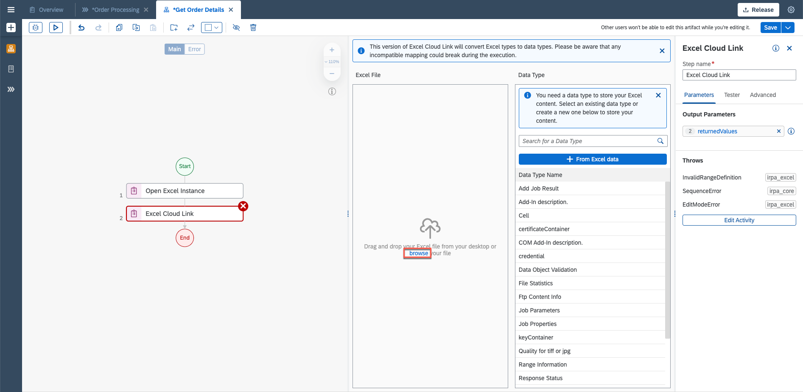

    > The Excel file is mapped automatically.

6.  In the Workbook Path field enter the Environment Variable as `OrderFilePath`, which was created above as the parameter value for **Workbook path**.

    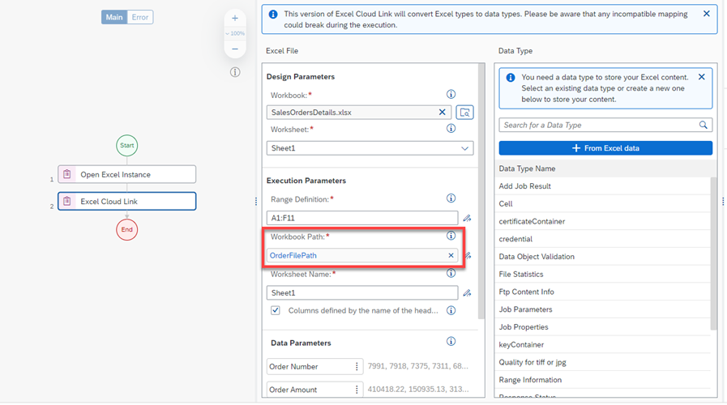

7. Select the button **From Excel Data**.

    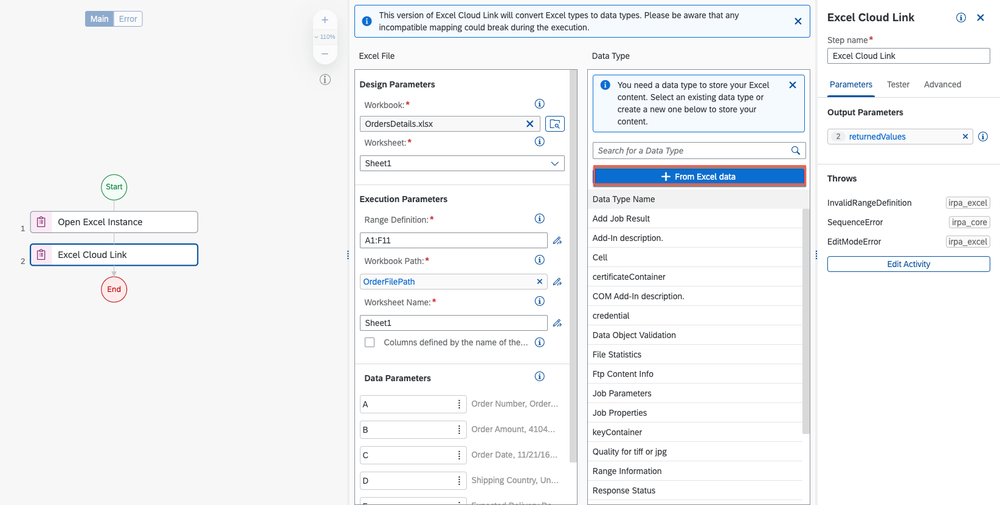

    > A pop up appears to create a data type. A **Sales Order** variable is needed to collect the data from the Excel sheet columns. In this step, a variable is automatically created from the Excel file columns.

8. Under Name of the data type **Sales Order** and choose the **Create** button.

    !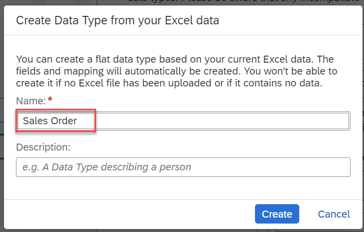

    > Framework creates a data type with the columns of the Excel as the field names. You can see it in the Artifacts section in the Overview tab.

    !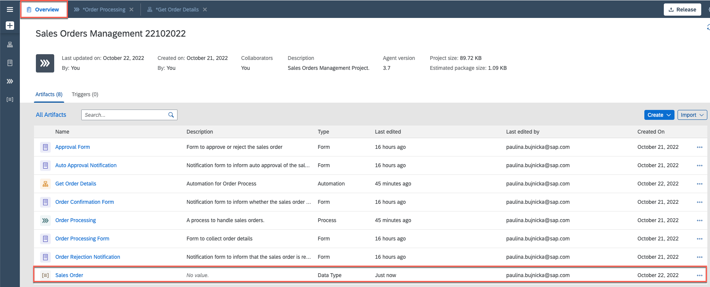

9. Go to Get Order Details automation. In Excel Cloud Link activity on the right side, under Output Parameters, change the variable name to **Orders**.

    !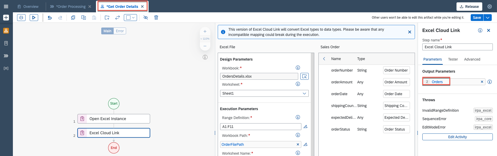

10. Close the activity.

    !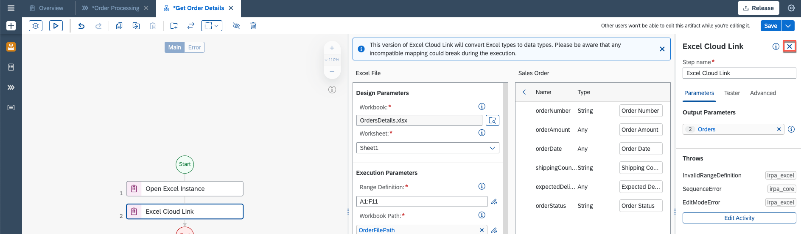

11. Click on the canvas.

    !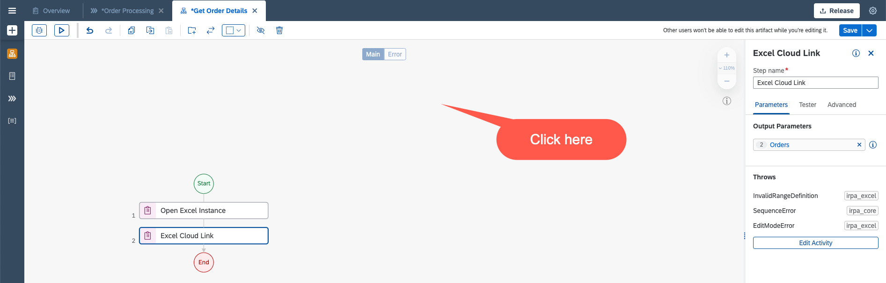

    >Once Excel is no longer required, close the Excel instance. Close Excel Instance activity closes an instance of Excel.

12. To close the opened instance of the Excel file:
    - In the Automation Details search for the activity **Close Excel Instance**,
    -  Drag and drop the activity into the canvas.

    !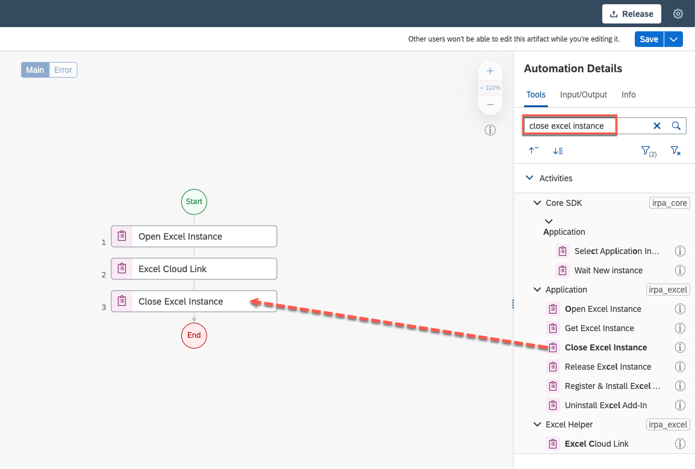

13. **Save** the automation.

    !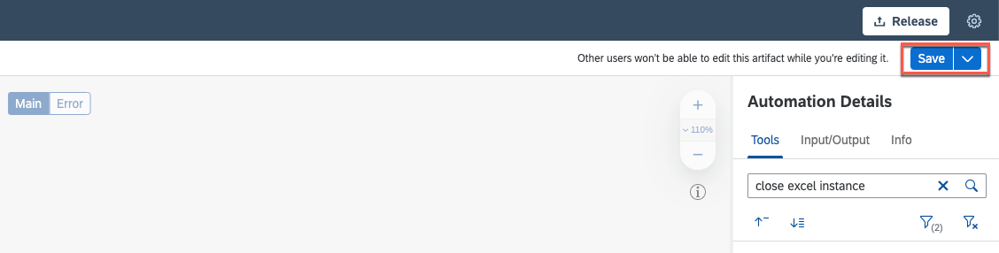

[VALIDATE_1]
[ACCORDION-END]

[ACCORDION-BEGIN [Step 4: ](Add Input and Output Parameters)]

Input and output parameters allow you to exchange data in the workflow of your automation between activities, screens, and scripts.

1. Click on the canvas and select the **Input/Output** section in Automation Details.

    !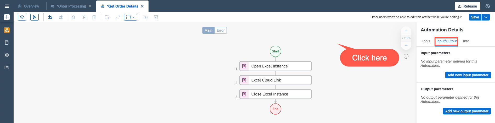

2. Add Input parameters as following:
    - In Parameter Name enter: `OrderNumber`,
    - In Description enter: Receives order number from the Order Processing Form,
    - In Data type choose: **String**.

    !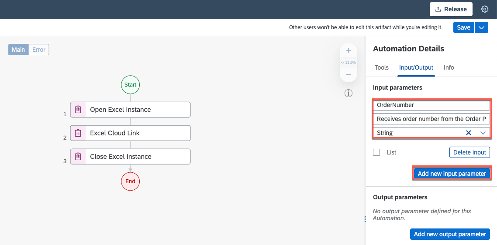

3. Add Output parameters as following:
    - In Parameter Name enter: `SelectedOrder`,
    - In Description enter: Selected order details are passed to the Process,
    - In Data type choose: **Sales Order**.

    !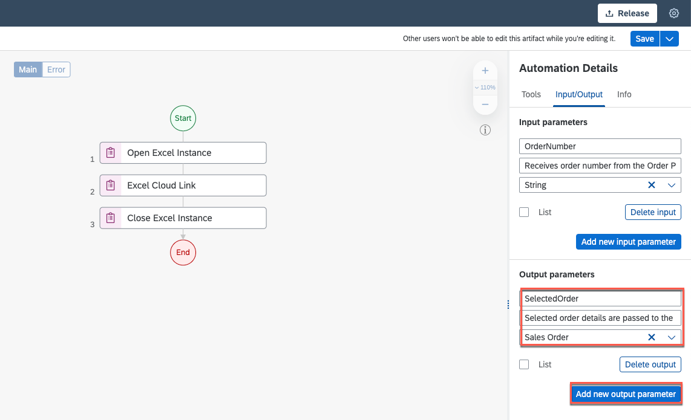

[DONE]
[ACCORDION-END]

[ACCORDION-BEGIN [Step 5: ](Create a Variable)]

Variables that are used, build your automation, and are data storage that have a name, a type (example: string, list of string or data type), and a value. A variable in the automation is also associated to a step represented by its number.

1.  In the **Automation Details** under Tools:
    - Search for the **Sales Order** data type (created in the previous step),
    - Drag and drop the **Sales Order** into the canvas.

    !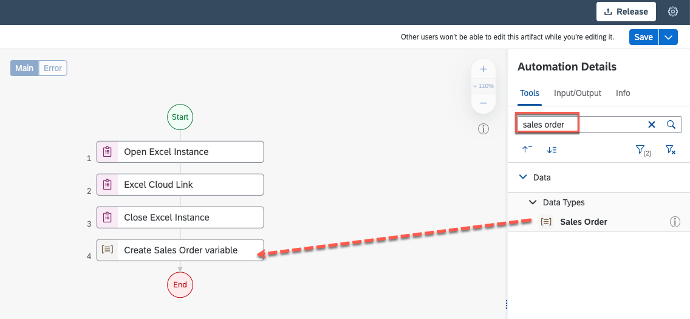

    > A variable of the data type **Sales Order** is created.

2. Select **Create Sales Order variable**. Under Output Parameters enter the value of as `selectedOrderDetails`.

    !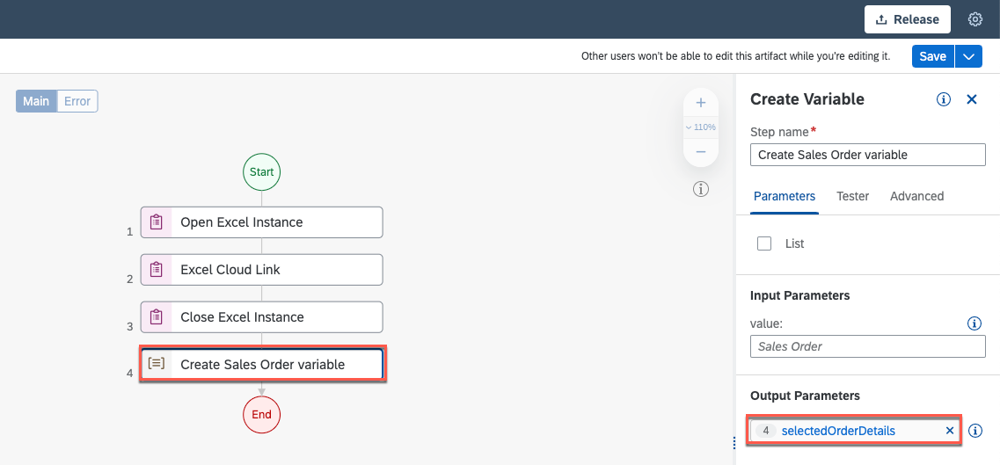

[DONE]
[ACCORDION-END]

[ACCORDION-BEGIN [Step 6: ](Looping through Excel Sheet and searching for the Order)]

Now you will loop through each **Order** from the Excel sheet, retrieve the order details for order number submitted in the **Order Processing Form**. **For Each** control allows you to go through a list of members provided as input to your automation, and execute an action for each member in that list.

This control has the following loop parameters:

  - `currentMember` - The member of the list for the current loop iteration.
  - `index` - An integer that is the index of the current loop iteration, starts at 0.

1. To loop through each order:
    - Click on the canvas,
    - In Automation Details search for the control **For Each**,
    - Drag and Drop the activity into the canvas.

    !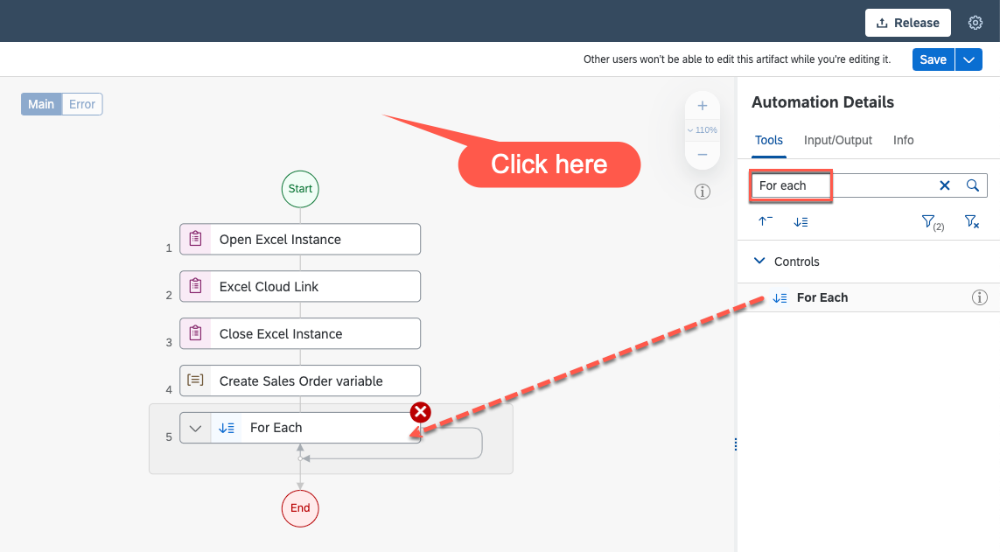

2. Select **For Each** activity, enter the value of Set looping List as **Orders**.

    !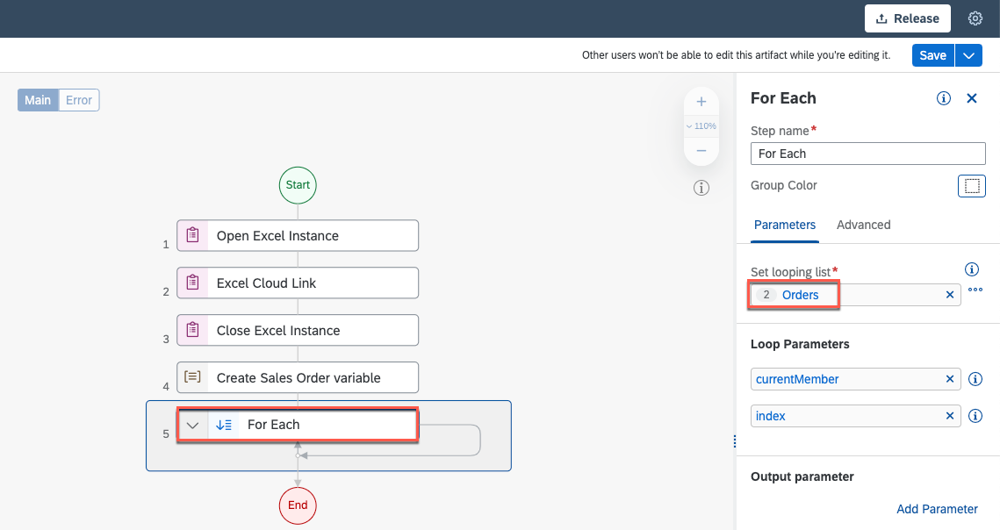

    > To match the desired order, a control activity has to be added to search for a match to its order number. The **Condition** activity is the activity that you will add. In this condition, you will check if the order number entered in the **Form** is available in data read from Excel in **Step 2**.

3.  To add the condition:
    - Click on the canvas,
    - in Automation Details search for the activity **Condition**,
    - Drag and Drop the activity inside the **For Each** block.

    !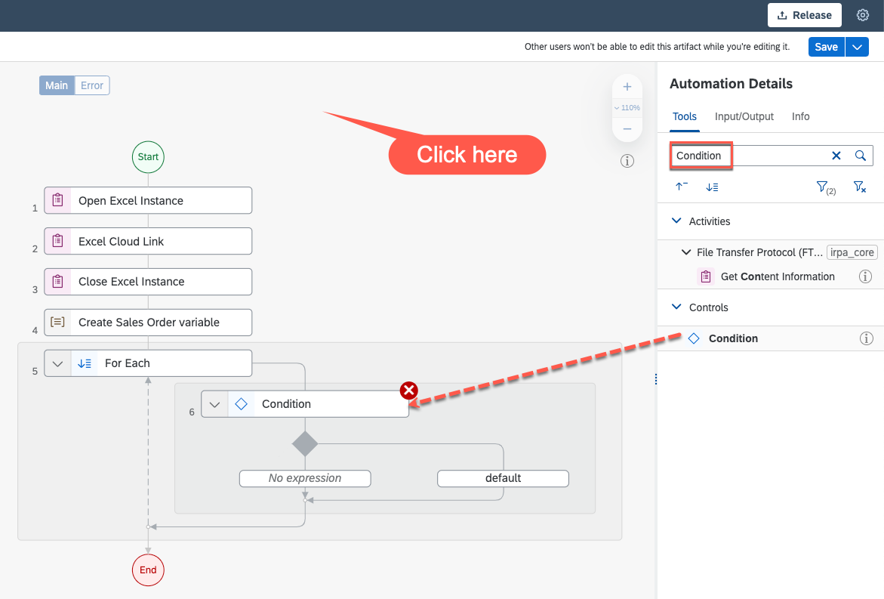

4.  Choose **Condition**, select 3 dots next to Condition Expression field, select **Edit Formula**.

    !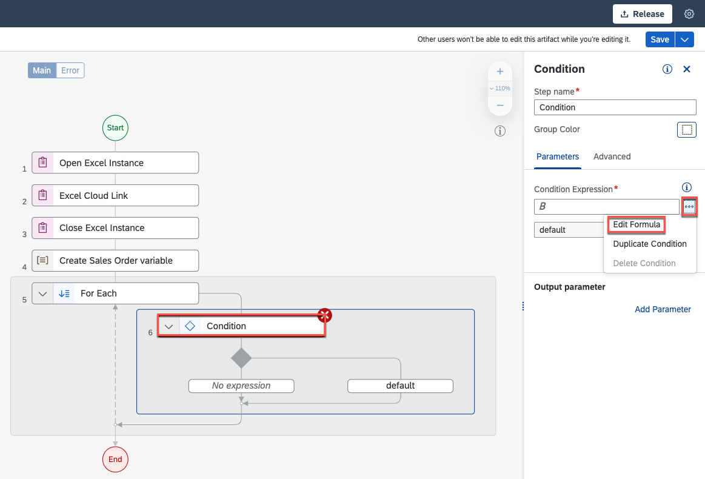

5.  A pop up window appears to enter the condition expression:
    - You can enter this expression manually or you can expand the **Variables** list and select the given variables to form the expression: `Step0.OrderNumber === Step5.currentMember.orderNumber`,
    - Select the **Save Expression** button.

    !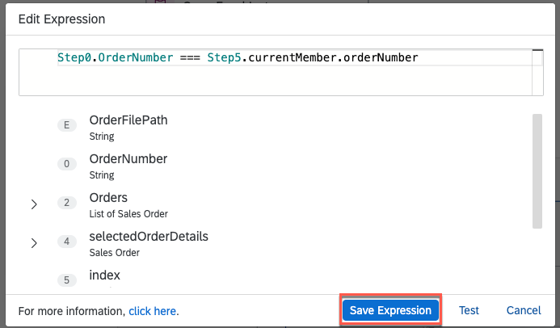

    > If the order number is found in Excel, i.e. the condition is **True**, set the variable using **Set Variable Value** activity that is a **Data Management Activity**.

6. To add set variable Value:
    - Click on the canvas,
    - in Automation Details search for the activity **Set Variable Value**,
    - Drag and Drop the activity into the canvas.

    !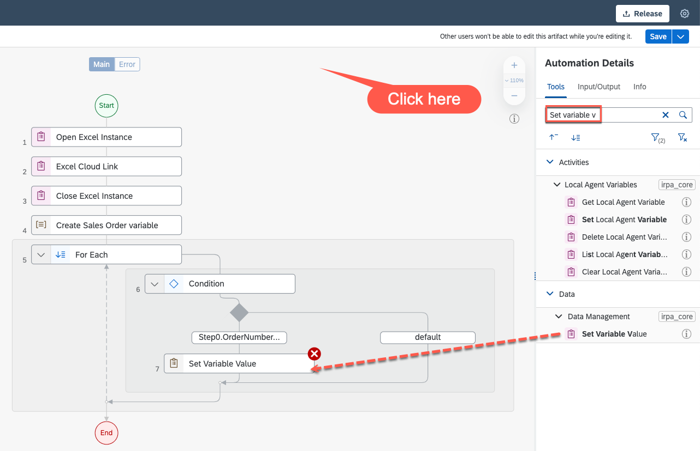

7. Select **Set Variable Value**. In the configuration screen on the right, do the following:

    - In the variable field enter `selectedOrderDetails`.
    - In the value field enter `currentMember`.

    !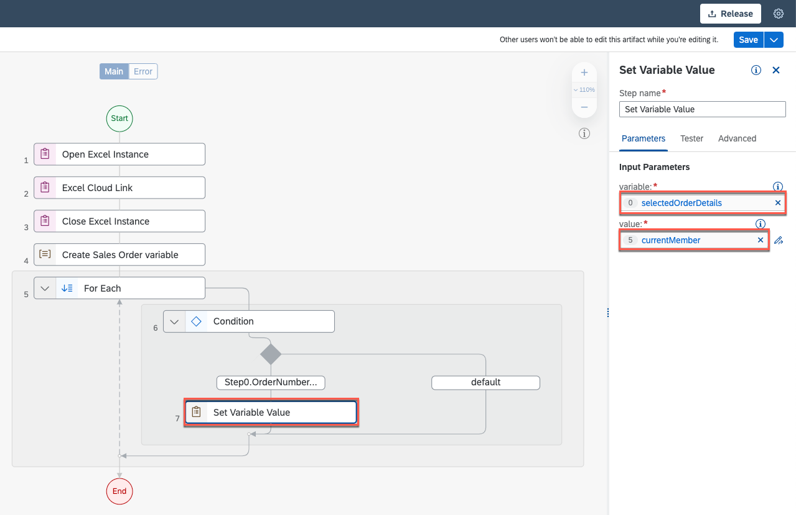

    > Once the order number is found in the Excel, use the control **End Loop** to stop the loop.

8. To end loop:
    - Click on the canvas,
    - in Automation Details search for the activity **Loop End**,
    - Drag and Drop the activity into the canvas.

    !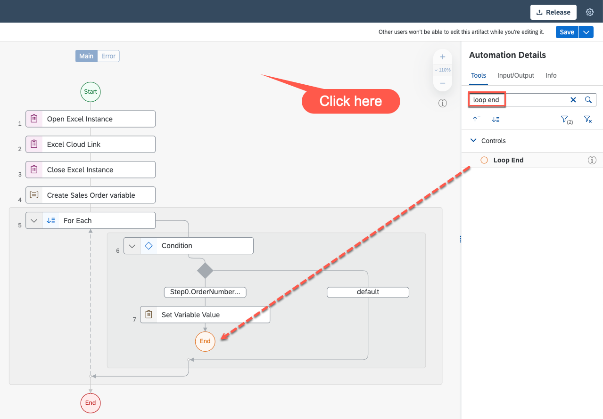

9. Use **Log message** activity to print your results. To add Log Message:
     - in Automation Details search for the activity **Log message**,
     - Drag and Drop the activity into the canvas.

    !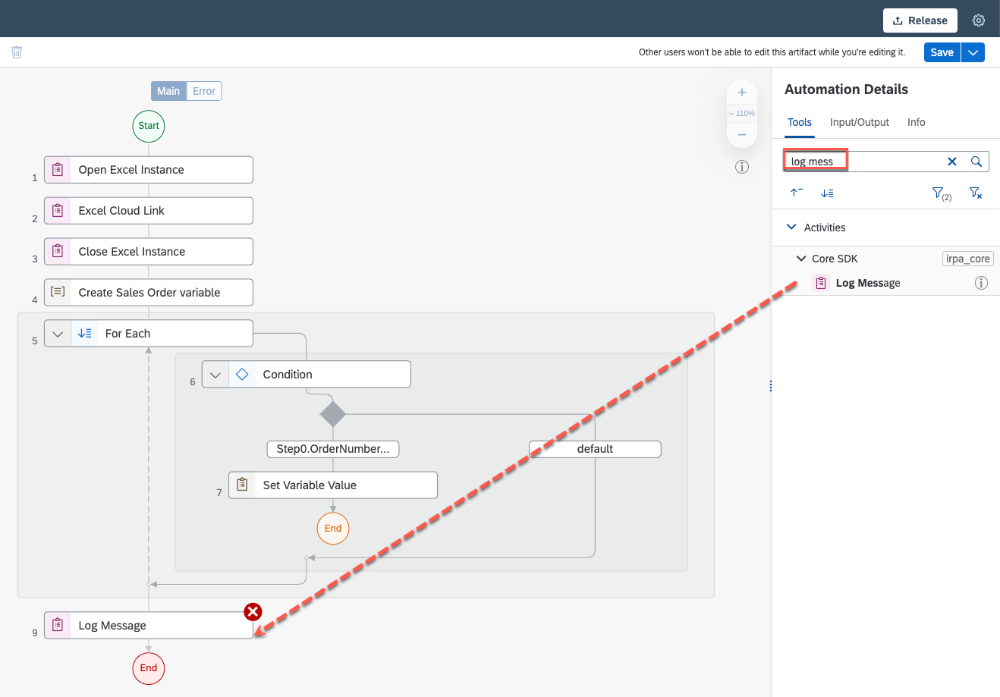

10. Use the activity to check `selectedOrderDetails` in testing mode. To do that:
    - Select **Log Message**,
    - In message field enter `selectedOrderDetails`.

[VALIDATE_2]
[ACCORDION-END]

[ACCORDION-BEGIN [Step 7: ](Link Automation Parameters with Business Process)]

Apart from creating an output parameter, it is mandatory to pass the data through the **End** step to expose the data outside the automation.

1. To do that:
    - Select **End**,
    - In the configuration screen on the right, under the Output Parameter, in the `SelectedOrder` Field enter `selectedOrderDetails`,
    - **Save** the Automation.

    !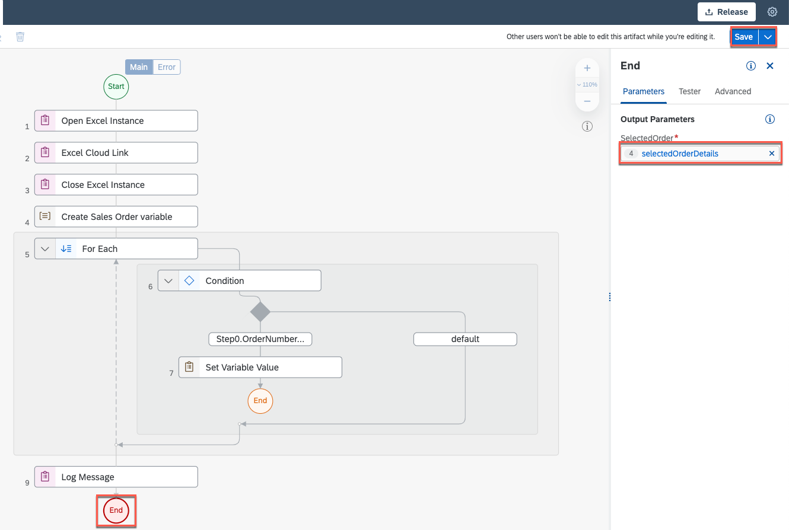

    > Make sure to add the steps **Condition**, **Set variable value**, **End Loop** inside the **For Each** block.

2. The complete automation **Get Order Details** automation looks as below.  

    !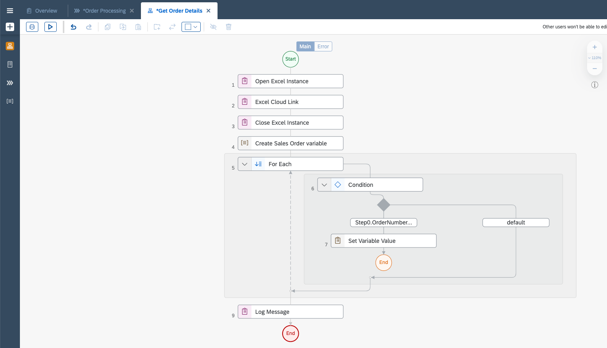

3. Map the Automation Parameters with Form Parameters.

4. Select **Order Processing** Process. Choose **Get Order Details** automation in the process.

    !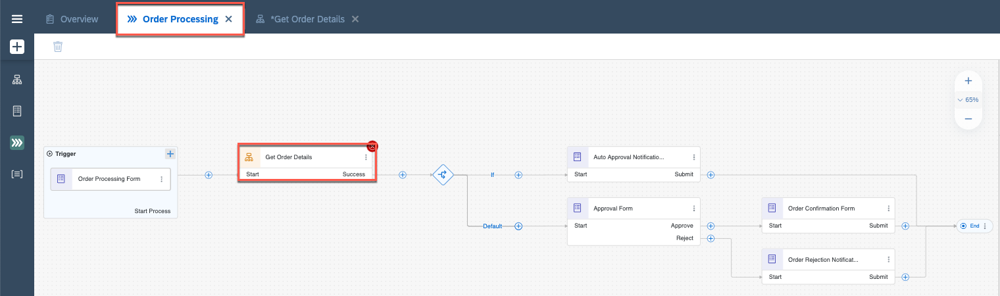

5. In Get Order Details map the input parameters `OrderNumber` of the automation  with the **Order Number** of Order Processing Form.

    !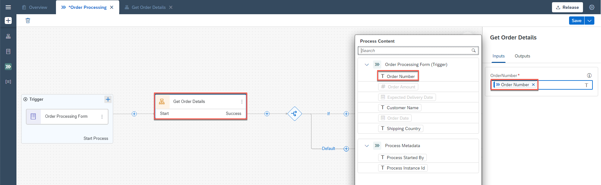

7. Choose the **Save** button.

[DONE]
[ACCORDION-END]

[ACCORDION-BEGIN [Step 8: ](Test the Automation)]

1. Navigate back to the automation **Get Order Details** and choose the **Test** button.

    !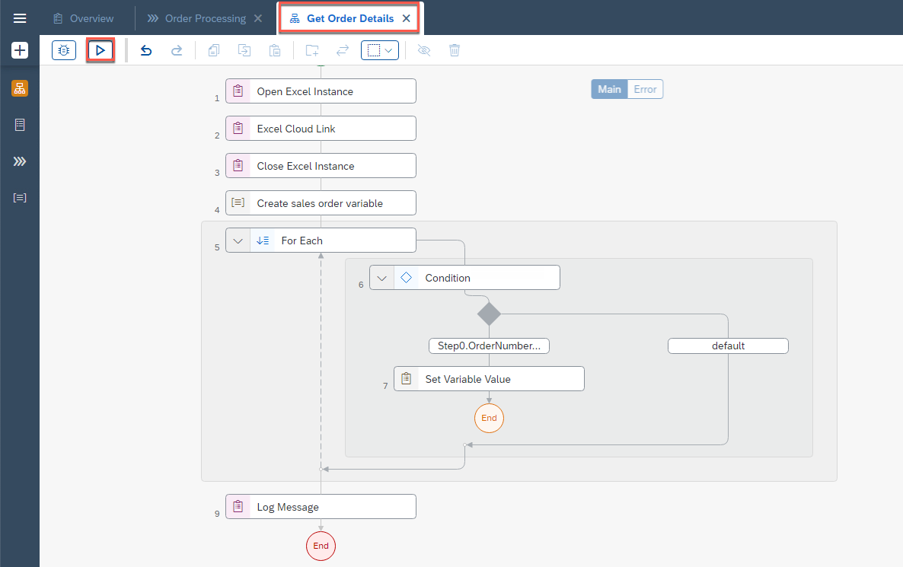

2. In the **Test Automation** window, enter the parameters to test the Automation:

    |  Parameter         | Value  
    |  :---------------- | :-------------  |
    |  `OrderNumber`  | Any order number which is available in `SalesOrdersDetails` Excel |
    |  `OrderFilePath` | Path where the `SalesOrderDetails` Excel is stored on your local machine |

    Select **Test** button.

    !

3. Test Results:

    - Automation opens the `SalesOrderDetails` Excel.
    - Reads the Excel content.
    - Closes the Excel.
    - Loops through Excel and verifies if entered `OrderNumber` is available in the Excel. If the `OrderNumber` is available in the Excel, it sets the  Orders Details.
    - Ends the looping.
    - Prints the selected order details.

    !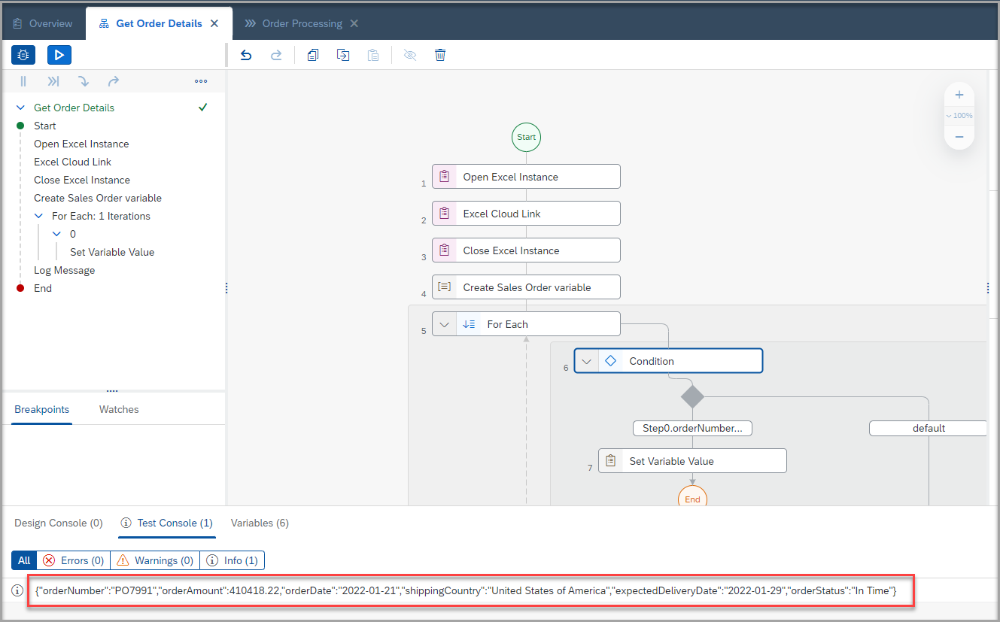

[DONE]
[ACCORDION-END]

[ACCORDION-BEGIN [Step 9: ](Simplify the Start Form)]

After the design of the automation that retrieves the data form the Excel file, simplify the start form by deleting the not needed fields.

1. In the Order Processing Process tab:
    - Select 3 dots next to **Order Processing Form**,
    - Select **Open Editor**.

    !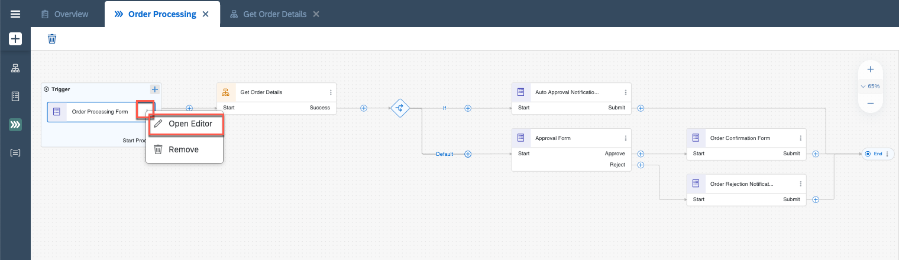

2. In the form delete following inputs by selecting the 3 dots next to each input  menu  and selecting **Delete**:
    - Order Amount,
    - Order Date,
    - Expected Delivery Date,
    - Shipping Country.

    !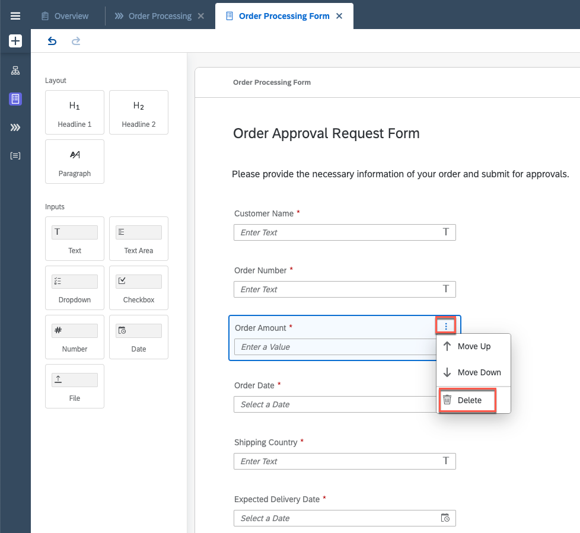

3. **Save** the Form, close the Form Editor and go back to the Order Processing Tab.

    !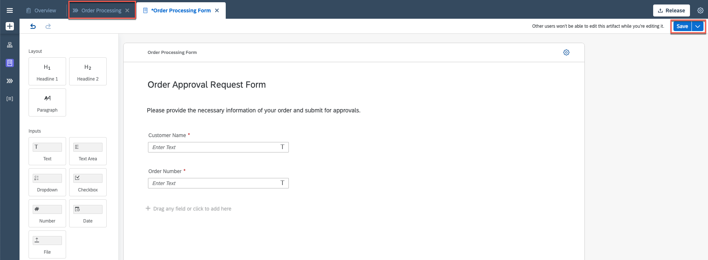

[DONE]
[ACCORDION-END]

[ACCORDION-BEGIN [Step 10: ](Mapping Forms of the Process)]

The different Forms of the process will need Inputs Mapping from the Automation Outputs.

!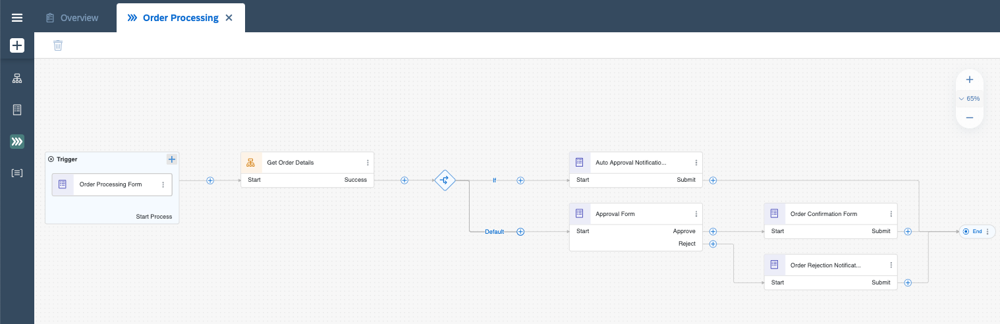

1. Select the **Approval Form** and go to the Inputs:
    - In the **Order Amount** field, choose the `orderAmount` from the Automation outputs,
    - In the **Expected Delivery Date** field, choose `expectedDeliveryDate` from the Automation outputs.

    !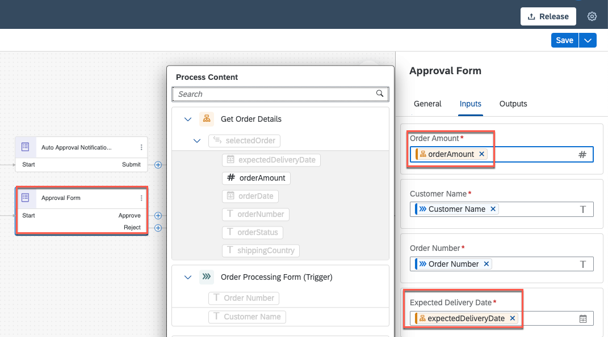

4. Do the same for the **Order Confirmation Form**.

    !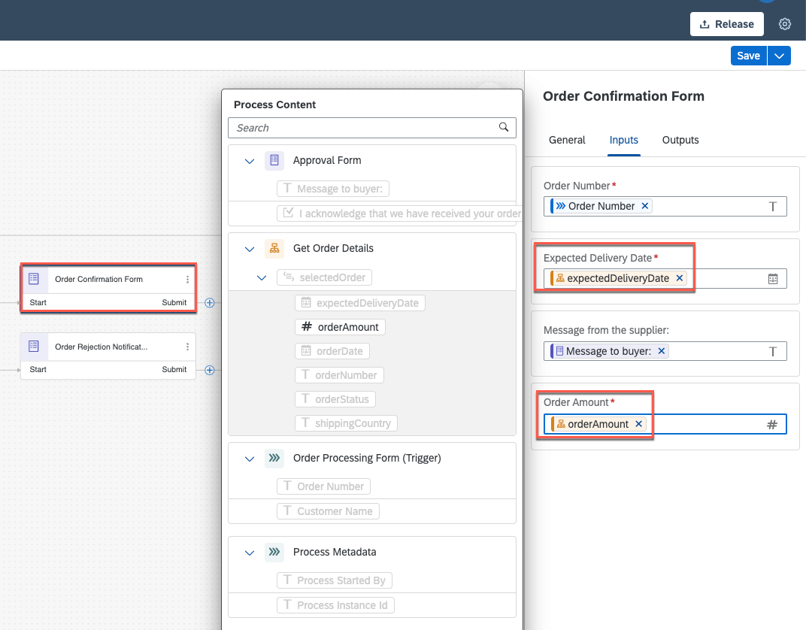

5. Do the same for the **Order Rejection Form**.

    !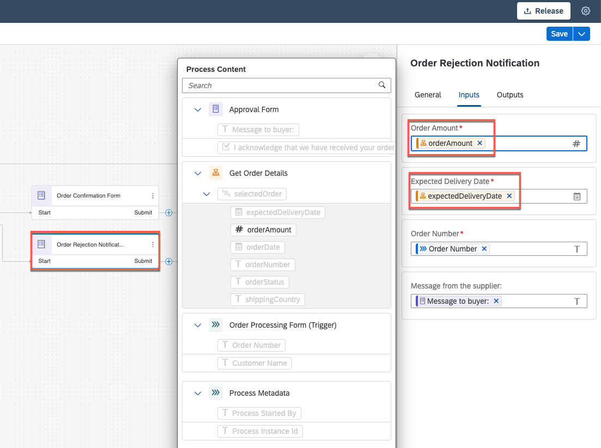

6. **Save** the Process.

    !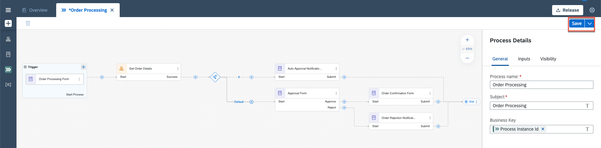

You have successfully completed creating an automation in your process.

[DONE]
[ACCORDION-END]

---
