## Prerequisites
 - [Create an Automation to Extract Data](spa-create-automation)

## Details
### You will learn
 - Create & configure decision in the process
 - Create & configure data types
 - Model decision tables with rules expressions

---

[ACCORDION-BEGIN [Step 1: ](Add a Decision to the Process)]

A **decision** consists of one or more policies. Each policy consists of a collection of rules. They are used to automate the decision-making parts of a business process. After you create a decision, define your business logic by adding rules to the policy. There are two types of rules:

- **Decision Table Rule**: A decision table is a collection of input and output rule expressions in a tabular representation.
- **Text Rule**: A text rule is the collection of rule expressions in a simple if-then format.

A **Decision Diagram** is a flow chart that describes the execution flow of the decision logic from the input to the output. Using a decision diagram, you can view the input, output, policies of a decision and the rules of the policies. You can also access each component of a decision, like a policy or a rule, via the decision diagram itself.

> To add a decision, you must first identify the set of rules that you need to add to the decision-making process. Once you have identified your rules, then define the data types relevant for designing the rules. This is an important step before you start modelling your decision because these data types will contain all necessary fields that will be needed to model the rule.

In this section, you will create and configure a decision which will be used to determine the relevant approvers based on the sales order fields.

1. In the process builder, choose **+** of the **default conditional flow** and select **Decision > New Decision** option.

    !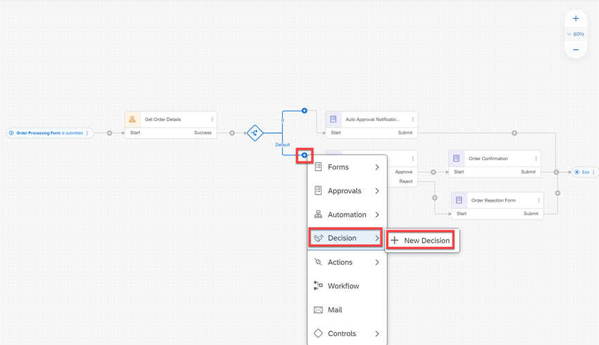

2. In the pop-up, do the following

    -	Enter **Determine Approver** in the **Name** field.

    -	Enter **Rule to identify the potential approvers for sales order** in the **Description** field.

    -	Choose **Create**.

    !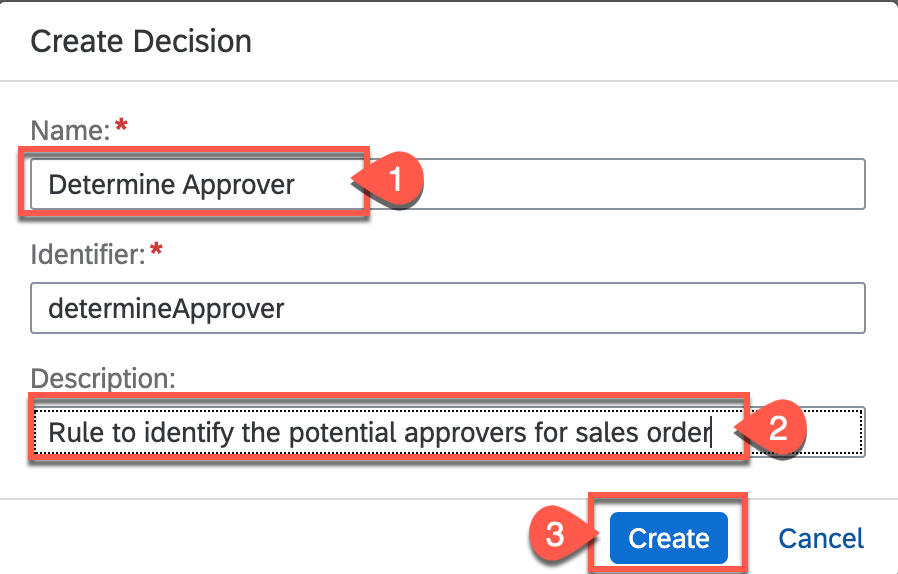

3. Now you have to model the decision. For that, choose the *three-vertical-dots* on **Determine Approver** decision to open the menu and choose **Open Editor**.

    !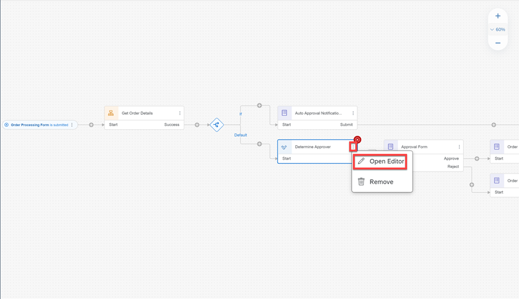

    A decision editor opens. You can see the decision diagram on the left panel and configuration option for Input and Output on the right panel. Notice the default policy that is pre-created with the decision.

    > A Policy is a collection of rules to be executed in strict order, meaning that they will run in the order in which they are added to the policy, and only the results of the last rule execution will be given as the final output of the decision.  

    !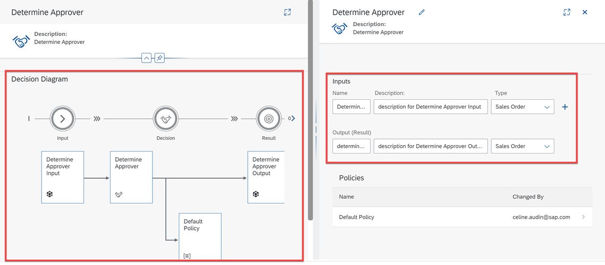

[DONE]
[ACCORDION-END]

[ACCORDION-BEGIN [Step 2: ](Create Data Types)]

A data type describes the data structure that can be used as an input and/or output parameter in an automation, a decision or processes. Data types enable you to formalize the data used as input/output parameters for steps, activities, skills processes, scenarios, triggers, or notifiers. Data types facilitate the manipulation and validation of data.

> You can create a data type manually, but some data types can also be created automatically when SDK packages or pre-packaged scenarios are imported or after running an automation.

Now, you have to map the Input and Output of the decision to the actual data object available with the process. In this section, you will use Sales Order as the Input data object and Approver as the Output data object. While the Sales Order was already created in the automation step, you will create an Approver data object for decision output.

1. Go back to the **Overview** tab, choose **Create** and from available options select **Data Type**.

    !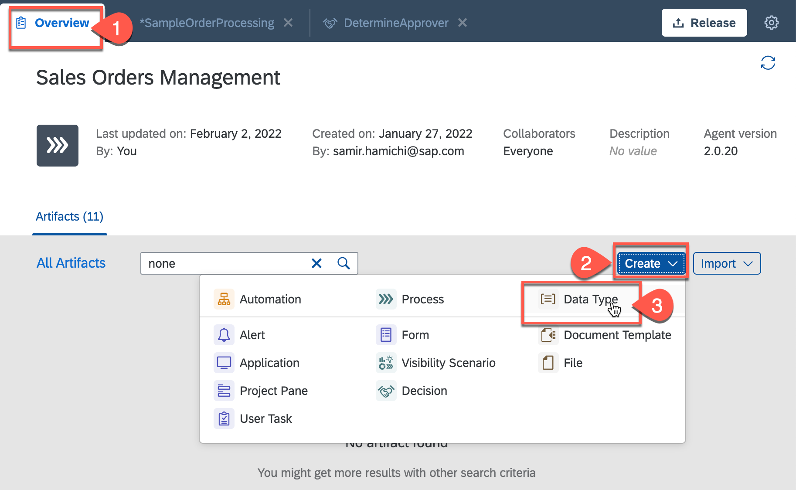

2. In the pop-up, do the following:
    - Enter **Approver** in the **Name** field.

    - Enter **Approver details who will approve the order from supplier side** in the **Description** field.

    - Choose **Create**.   

    !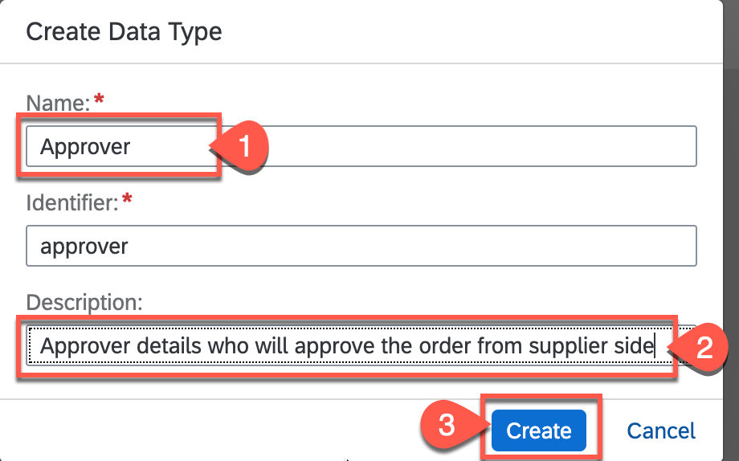

3. In the **Approver** data type screen, choose **New Field** to add a new attribute to the data object.

    !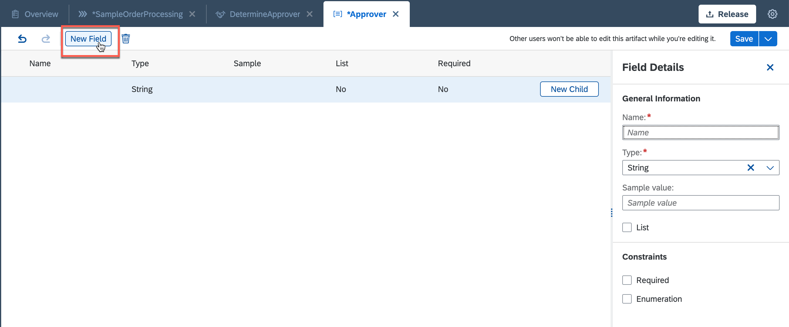

4. In the **Field Details** section on the right, enter **Email** in the **Name** field. Keep the **Type** as **String**.

    > You can choose the **Type** dropdown list to see the different kind of data types that are supported like Number, Password, Date, Time, Boolean etc.

    !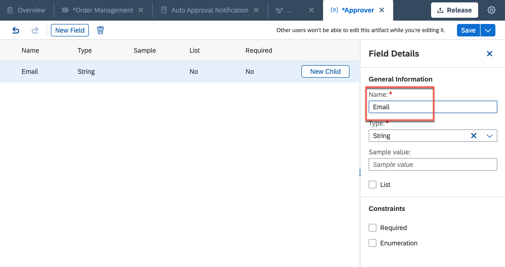

5. Similarly, add another attribute `UserGroup` of **Type** **String** to the data type.

    !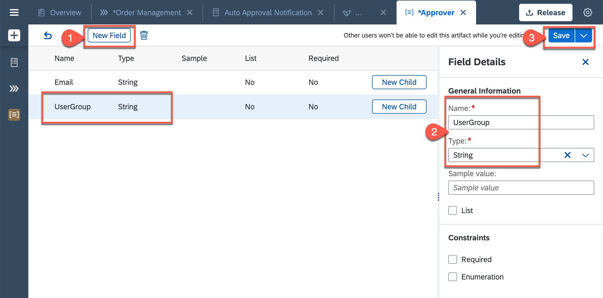

[DONE]
[ACCORDION-END]

[ACCORDION-BEGIN [Step 3: ](Configure Decision)]

After the data types are created, you will now configure the decision :

- With Input and Output data types.

- Create decision table rule to the business policy.

First add this newly created data object as the decision output:

1. Go back to **Determine Approver** decision screen, choose **Type** options to select :
    - **Sales Order** as **Input**.
    - **Approver** as **Output (Result)**.

    !

    Then you will create the actual decision-making parts that make the decision in the process.

2. From left panel, choose **Default Policy**, and on right panel select **Add Rule**.

    !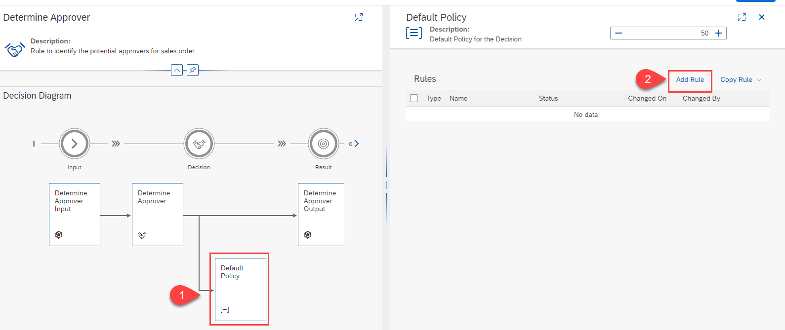

3. Select **Decision Table** as **Type of Rule** and set the **Rule Name** to **Determine Approver** and the **Rule Description** to **Determine approver for sales order**. Choose **Next Step**.

    !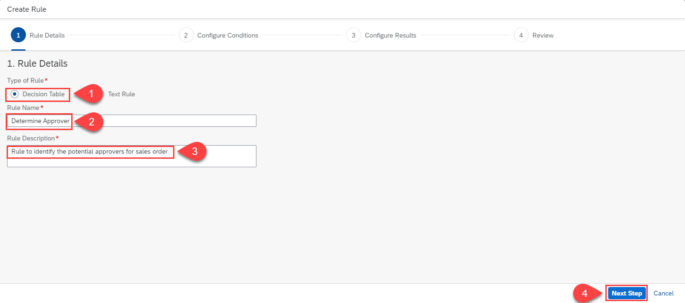

    > A decision table is a tabular representation of the rule with If and Then header and row columns. If-header columns contain the expressions which are evaluated, and Then-header columns contain the result structure that will be returned after the decision is run.

4. You will now configure the conditions. Under **Data Types**, choose **Determine Approver Input** and select **Shipping Country**.

5. Now select **Order Amount** and choose **Next Step** to configure the results.

    !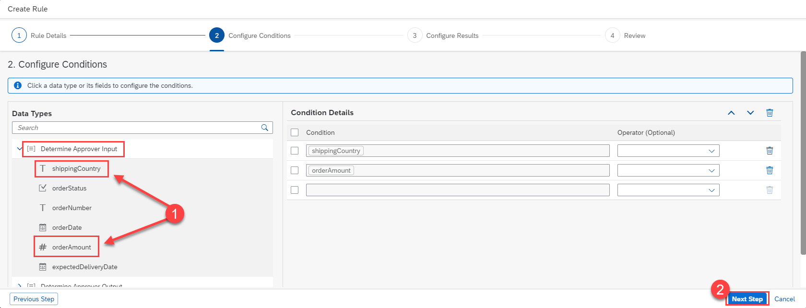

6. Under **Result Data Types**, select **Determine Approver Output** as the output or result of the decision table.

7. Select **User Group** and **Email** and select **Next Step**.

    !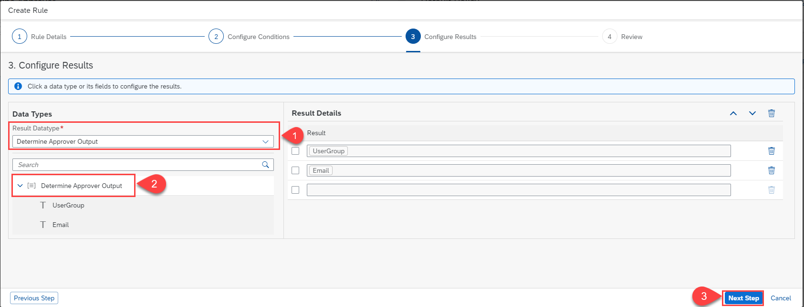

8. Choose **Create** to create the rule.

    !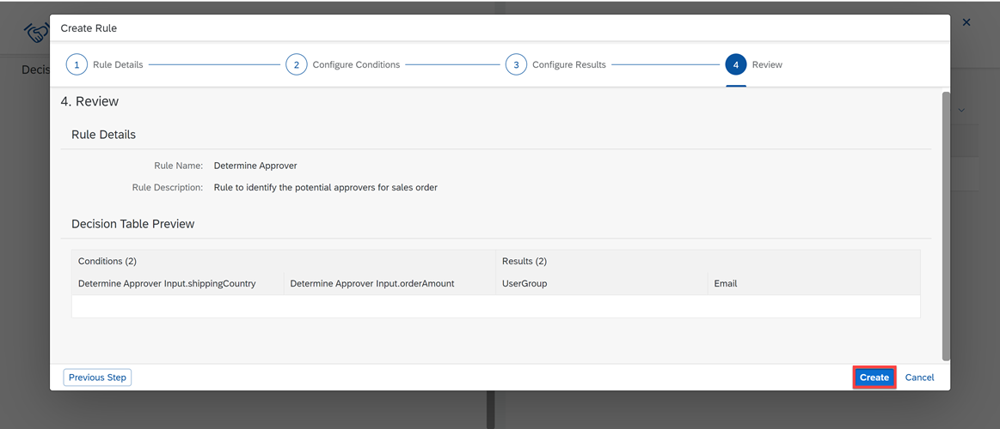

    You can use the Settings option to easily define these If and Then header expressions with inline suggestions or free-flow typing.

9. In the newly created *Decision Table*, do the following to add values to condition and result columns:

10. For the **Determine Approver Input.shippingCountry** (first column) you will now add the expression value using *rule expression language*.
    -  Choose the input text box.
    -  Copy and paste this expression in the input box: **EXISTSIN ['United Kingdom' , 'India' , 'Germany']**

    > You can also use in-place context sensitive help to type the whole expression manually as explained below.

    - Start entering `exi`, and from the available operators select **EXISTS IN**.

    !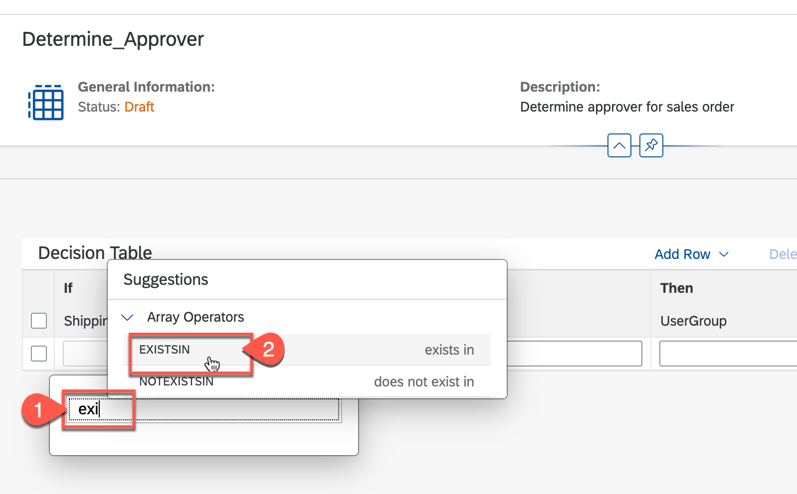

    - Continue typing, and write this expression:

    **EXISTSIN ['United Kingdom' , 'India' , 'Germany']**

    > You can either type-in the entire expression as free-flow or use the context help to write the expression.

    > For all *String* type of data object attribute, you have to mandatory add single-quote (') before and after the text.

    - After you have finished, press Enter key or click outside the input field to confirm.

    !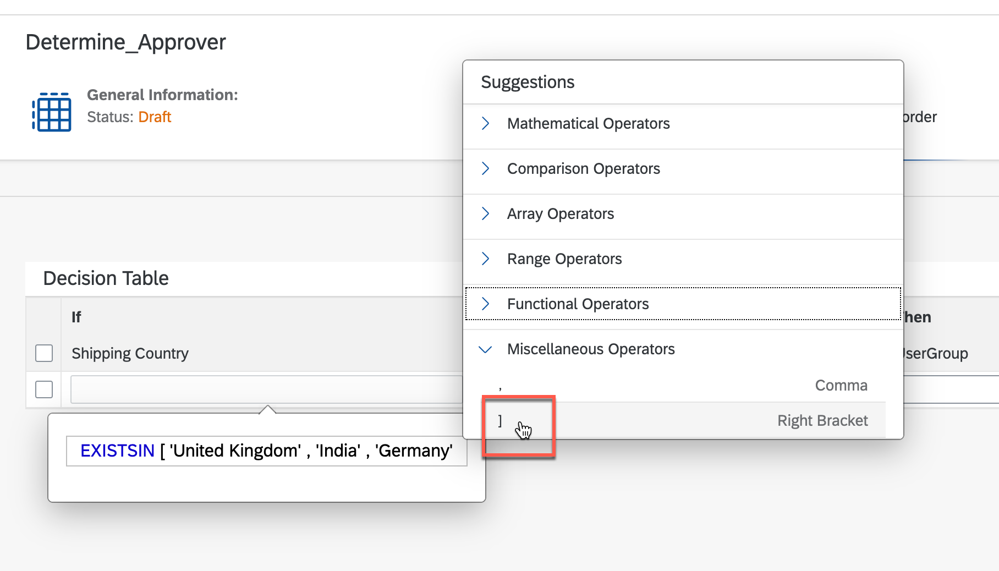

    > Remember that for all String type data object attributes, you must add a single quote (') before and after the text.

11. Choose the input field of **Order Amount** column (second column of the decision table) and enter **<= 100000**.

    !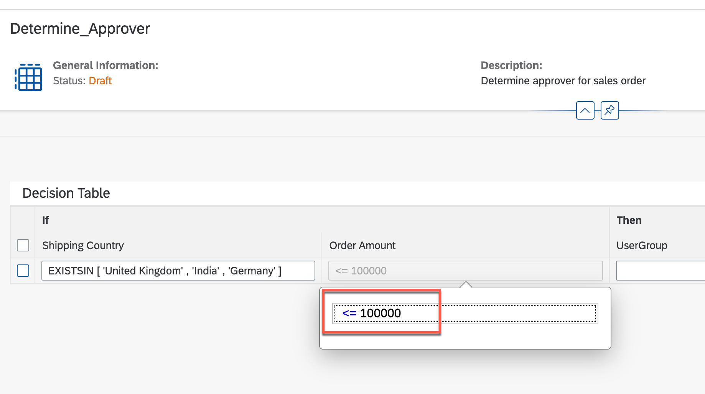

12. Similarly, enter the following expressions for the respective result column (or **Then** section):

    | Result Column    | Expression
    |  :------------- | :-------------
    | Email      | `your user email`
    | User Group     | `SO_APPROVER` |

    !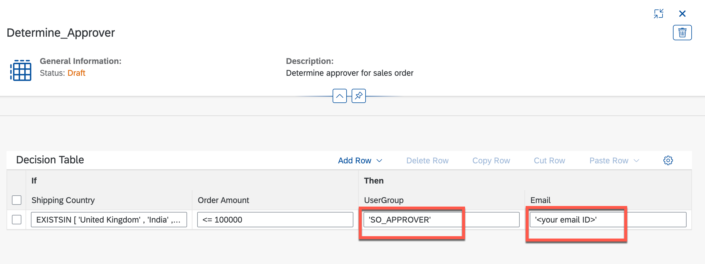

    User Group is a role collection or group created in the BTP cockpit or in your respective user management system. These groups have users who are responsible for certain jobs. The advantage of using groups is that you can add/remove users from these groups without the need to change the decision.

    To ensure that the decision table rule returns definite output for all kinds of sales orders, add one more row to the decision table to return the list of approvers who can approve the sales order for value greater than 100000.

    So, for example, for all sales orders coming from India, Germany, or the United Kingdom (the defined shipping countries) which have a value smaller or equal than 100,000 – the first row will run. For all other sales orders, whose value is greater than 100000, the second row will return; and for any other combination that does not match the rows – an empty result will be returned.

13. To add a new row to the decision table, do the following:
    - Choose the check-box of the first row.
    - Choose **Add Row**.
    - From the dropdown options, select **Insert After**.

    !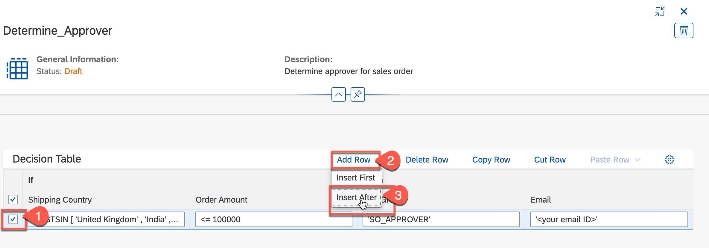    

14. Similarly, enter the following values for the new row:

    |  Condition Column    | Value
    |  :------------- | :-------------
    |  Shipping Country        |
    | Order Amount         |>100000 |

    |  Action Column   | Value
    |  :------------- | :-------------
    |  `UserGroup`        | `SO_MGMNT`
    |  `Email`       | `your user email`|

15. Choose **Save**.

    > Save will both save and activate the decision table. If there are any validation issues in the decision table, then Save will not happen and the errors will be shown in the **Design Console**

    !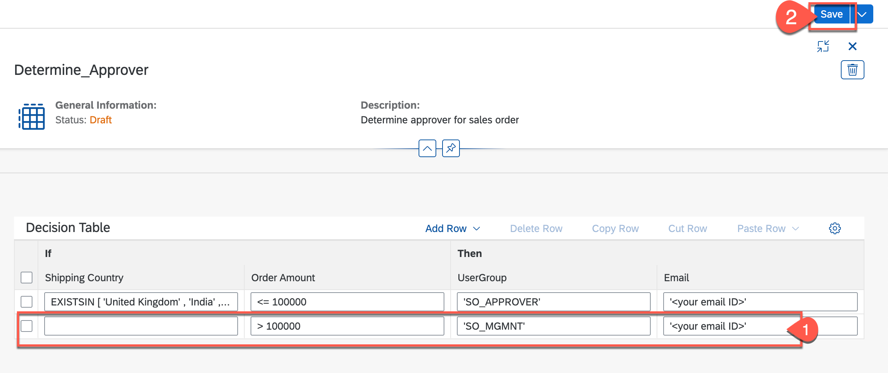

[DONE]
[ACCORDION-END]

[ACCORDION-BEGIN [Step 4: ](Configure Decision in Process Builder)]

After you have created and configured the decision, next you have to map the input fields of the decision with the actual process content fields from the process builder.

1. Open the process builder, choose **Determine Approver** decision and do the following:

    - Choose **Inputs** tab.

    > You might not see entries in the Input, please refer to [the Knowledge Base Article](https://launchpad.support.sap.com/#/notes/3207153) for the complete workaround.

    - Map the following decision table input with the process content:

    |  Decision Input Field   | Process Content
    |  :------------- | :-------------
    | `expectedDeliveryDate`           |`selectedOrder > expectedDeliveryDate`
    | `orderAmount` | `selectedOrder > orderAmount`
    | `orderDate` | `selectedOrder > orderDate`
    | `orderNumber` | `selectedOrder > orderNumber`
    | `orderStatus` | `selectedOrder > orderStatus`
    | `shippingCountry` | `selectedOrder > shippingCountry` |

    !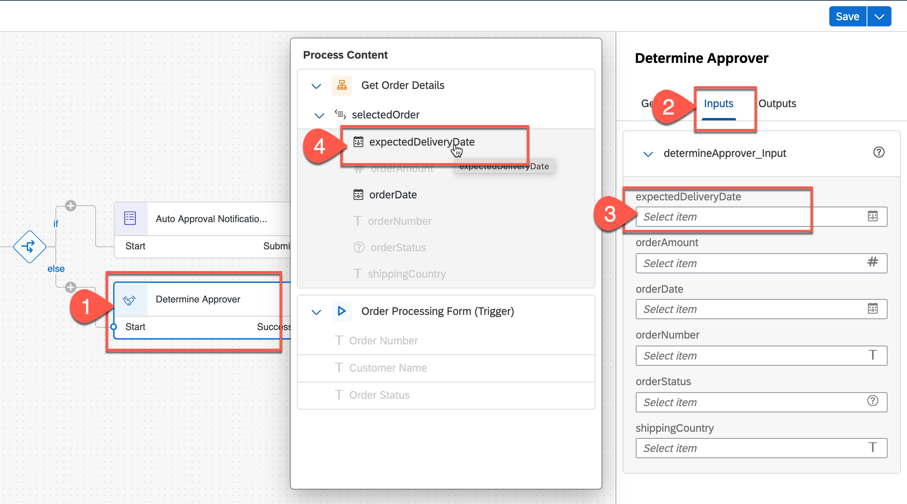  

2. **Save** the process.    

    !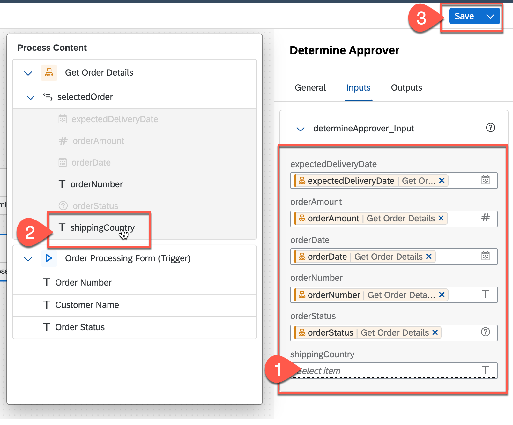

    > You might see an error symbol on your decision. This is because the outbound connection from the decision is still dangling and not connected to any activity. You may connect it to the end activity.

[VALIDATE_1]
[ACCORDION-END]

[ACCORDION-BEGIN [Step 5: ](Update the Process)]

You will now adapt the business process one last time to fully automate your approver selection by matching the recipients of the approval form to the one returned from the decision table. You may match the subject of the approval form as well to the **Order Number** from the **Get Order Details** automation.

>You can modify your selection as needed.

!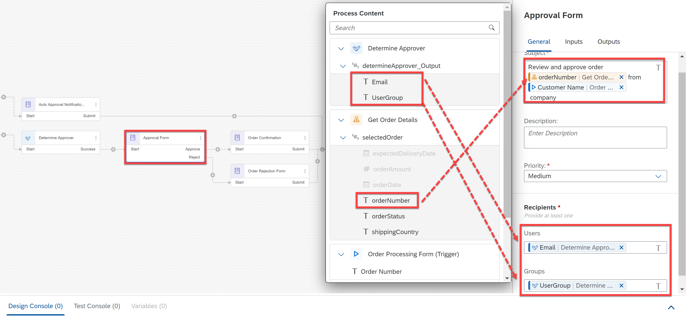

[DONE]
[ACCORDION-END]
---
