## Prerequisites
 - Access to SAP Process Automation Lobby.
 - Business process project and process must be created.

## Details
### You will learn
  - how to add interactive forms in the process.
  - how to design the form with layout and input fields using drag-and-drop approach.
  - how to configure the forms as the process steps.

Tasks are vital part of any business process. **SAP Process Automation** helps you to easily and quickly create forms that are made available to the business users in their inboxes to take relevant action. Forms have one layout, once access point, traceable actions and are designed to involve right kind of stakeholders.  

These interactive forms can be created by just dragging and dropping the text elements and input fields to the canvas. Once a form has been created, it can then be used as process trigger to start the process or added as an approval step in the business process.

Let us now explore how these different forms are created. In the steps below you will create 3 forms which will be used to:
1. start the approval process
2. send a task in the inbox of the business user for the approval
3. notify the requester for approval or rejection.

---

[ACCORDION-BEGIN [Step 1: ](Create Form to Trigger Business Process)]

> First you will create a trigger form that will start the business process. For that you have to  open your process in process builder and add a new form.

1. Click **New Form** in **Trigger Settings**.

    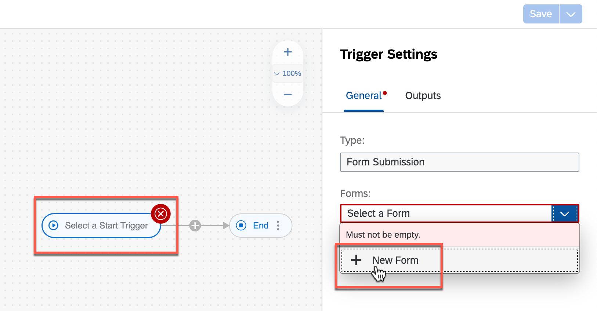

2. In the pop-up for new form, do the following:
    - Enter the **Name** as **Order Processing Form**.
    - Enter a **Description** of your choice.
    - Choose **Create**.

    > The form **Identifier** field is auto-filled.

    

    The form will be added as the start trigger.

    

3. Now it is time to design the **Form** with available layout and input fields options using drag-and-drop feature and simple configurations. All you need to do is drag-and-drop the form fields and enter the given names and field settings.

    | Form Fields | Field Settings with Label |
    |---|--|
    | Headline 1 | Order Approval Request Form |
    | Paragraph  | Please provide the necessary information of your order and submit for approvals.|

    - For all below **Input Fields** enter the labels and select the **Required** checkbox
    | Form Fields| Field Settings with Label |
    |---|---|
    | Text | Customer Name|
    | Text | Order Number|
    | Number | Order Amount|
    | Date | Order Date|
    | Text | Expected Delivery Date|

    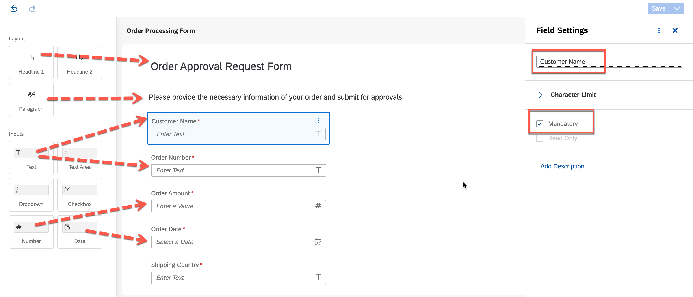

4. Save the form using **Save** button on top-right corner of the screen.

    ### Your Trigger form are ready!

    

As you have added the form to start the process, now you will design the process with more activities related to approval of the sales order.

[VALIDATE_3]
[ACCORDION-END]

[ACCORDION-BEGIN [Step 2: ](Create and Configure an Approval Form)]

Approval form will be used to get faster and easier approvals from the business users to take informed decisions and getting rid of sending emails. These approval forms could be about approving or rejecting the sales order, invoices, or onboarding, IT requests etc. The forms are then converted into tasks in an automated workflow which will appear in the `MyInbox` of the user.

You can create these different forms using **Form Builder** embedded in the process builder using different form field options. You can drag-and-drop to design and easily modify them without any coding.  

1. Add a **New Approval Form** to the process.

  s

2. In the **Create Form** dialog box, do the following:
    - Enter **Approval Form** in the **Name** field.
    - Enter **Form to approve or reject the sales order** in the **Description** field.
    - Choose **Create**.

    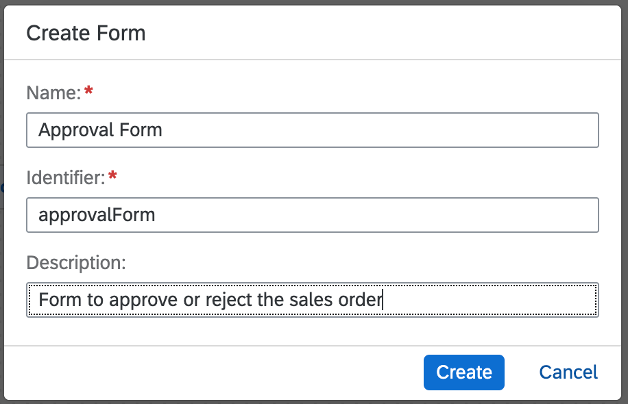

3. Design the **Approval Form** in the form builder by simply dragging-and-dropping fields onto the form editor and configuring respective field settings.

  | Form Fields | Field Settings with Label |
  |---|--|
  | Headline 1 | Approve Sales Order |
  | Paragraph  | A new order has been received. Please review and confirm whether the requirements can be met or not.|
  | Paragraph  | Sales Order Details:|

  - For all below **Input Fields** enter the labels and select the **Read Only** checkbox
  | Form Fields| Field Settings with Label |
  |---|---|
  | Text | Customer Name|
  | Text | Order Number|
  | Number | Order Amount|
  | Date | Order Delivery Date|

    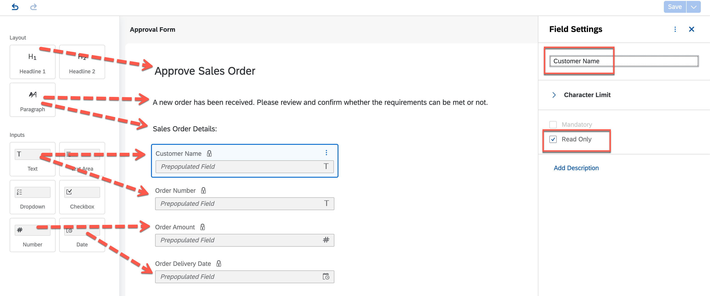

  - For all below **Input Fields** enter **only the labels**
  | Form Fields| Field Settings with Label |
  |---|---|
  | Paragraph | Supplier Acknowledgment|
  | Checkbox | I acknowledge that we have received your order and will process it based on the availability|
  | Text Area | Message to buyer:|

    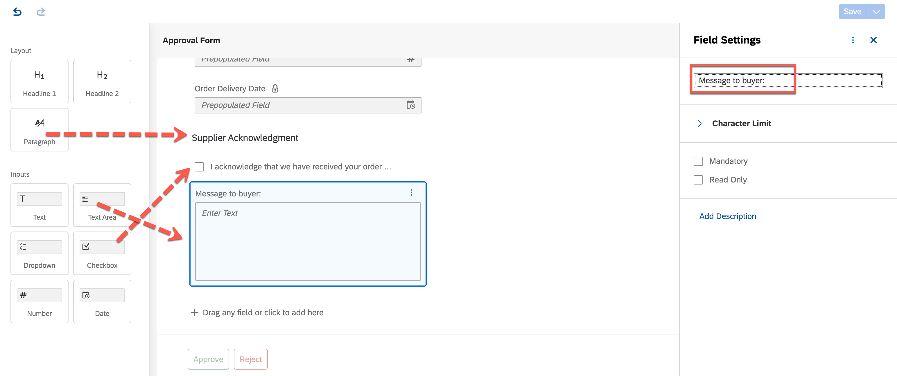

4.	Save the form using **Save** button on top-right corner of the screen.

5.	Go back to the process builder to map the process content with the form input fields, and select the **Approval Form** to configure the **General** information section.

    -  In the **Subject** box, enter **Review and Approve Order `select Order Number from the process content` from `select Customer Name from the process content` company**

    - For **Users** in **Recipients**, select **Process Metadata > Process Started By** from process content.

    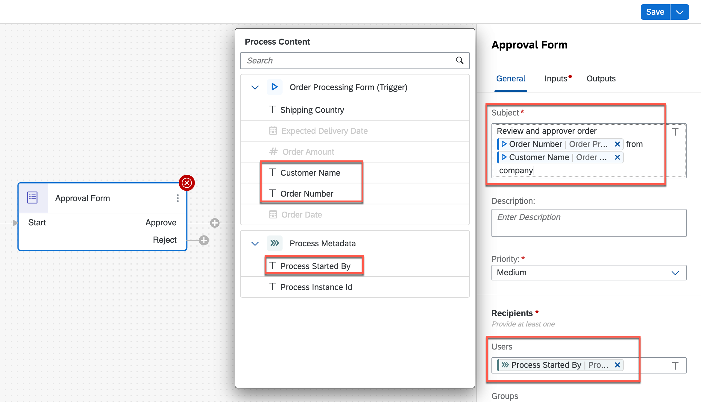

6.	Similarly, go to **Inputs** tab and map the different input fields (which were marked as read-only in the approval form) by selecting the respective **Process Content** entry.

  > The process content will highlight the entries with same data type of the input field. For Example: If the input field is of Number type then Process Content will show only number-type entries.

    | Form Input Fields| Process Content Entry |
    |---|---|
    | Customer Name | Order Processing Form > Customer Name|
    | Order Delivery Date | Order Processing Form > Expected Delivery Date|
    | Order Amount | Order Processing Form > Order Amount|
    | Order Number | Order Processing Form > Order Number|

    

7. **Save** the process.

[VALIDATE_2]
[ACCORDION-END]

[ACCORDION-BEGIN [Step 3: ](Create and Configure Form for Notifications)]

Once the user can approve or reject the request, a notification will be send to the requester which could be in an email or via form itself.

1. Add a **New Form** to the process.

  s

2. In the **Create Form** dialog box, do the following:
    - Enter **Order Confirmation Form** in the **Name** field.
    - Enter **Notification form to inform whether the sales order is approved by the supplier** in the **Description** field.
    - Choose **Create**.

    

3. Double click the form in the process builder to open the form builder. In the form builder, design the form to notify the requester of the order confirmation.

  | Form Fields | Field Settings with Label |
  |---|--|
  | Headline 1 | Order Confirmation |
  | Paragraph  |Your order has been received and accepted for delivery. We will send you the details as soon as the order is shipped. You can find the details of your order below, please review and verify your request: |
  | Text Area  | Message from the supplier:|
  | Paragraph  | Sales Order Details:|

  - For all below **Input Fields** enter the labels and select the **Read Only** checkbox
  | Form Fields| Field Settings with Label |
  |---|---|
  | Text | Order Number|
  | Number | Order Amount|
  | Date | Expected Delivery Date|

    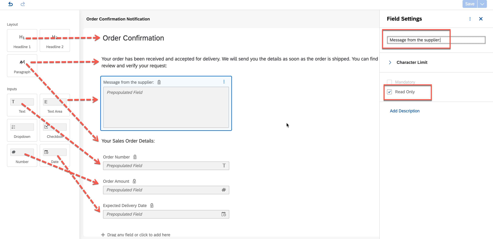

4.	Save the form using **Save** button on top-right corner of the screen.

5.	Go back to the process builder to map the process content with the form input fields, and select the **Order Confirmation** form to configure the **General** information section.

    -  In the **Subject** box, enter **Your order `select Order Number from the process content` has been successfully received**

    - For **Users** in **Recipients**, select **Process Metadata > Process Started By** from process content.

        

6.	As done before in the approval form, go to **Inputs** section and map the different input fields (which were marked as read-only) with the respective process content entries.

  > The process content will highlight the entries with same data type of the input field. For Example: If the input field is of Number type then Process Content will show only number-type entries.

    | Form Input Fields| Process Content Entry |
    |---|---|
    | Order Number | Order Processing Form > Order Number|
    | Message from the supplier | Approval Form > Message to buyer|
    | Expected Delivery Date | Order Processing Form > Expected Delivery Date|
    | Order Amount | Order Processing Form > Order Amount|

    

7. **Save** the process.

With this you completed designing and configuring the notification form. You can copy the same form to create another form to send rejection notification to the requester.

> If copy is not available then create the form in same way and modify the texts wherever relevant as shown below

8. Add the new form to the rejection route of the approval form.

    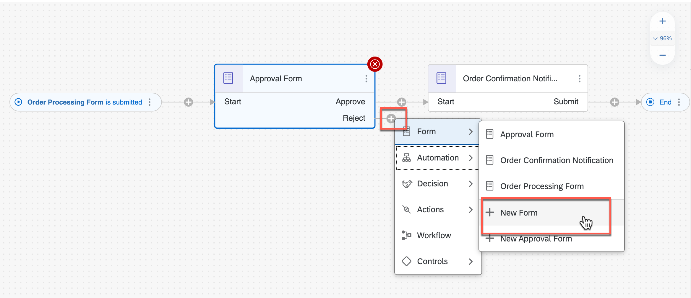

9. In the **Create Form** dialog box, do the following:
    - Enter **Order Rejection Form** in the **Name** field.
    - Enter **Notification form to inform that the sales order is rejected by the supplier** in the **Description** field.
    - Choose **Create**.

    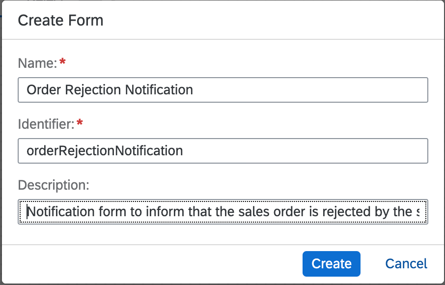

10. Design the order rejection form in the form builder.
  - Do not forget the **Save** the form once completed.

    | Form Fields | Field Settings with Label |
    |---|--|
    | Headline 1 | Order Rejection |
    | Paragraph  |We are sorry to inform you that your order cannot not be accepted. Any inconvenience caused due to refusal of order is regretted. You can find the reason of rejection and the details of your order below, please confirm the request: |
    | Text Area  | Message from the supplier:|
    | Paragraph  | Sales Order Details:|

    - For all below **Input Fields** enter the labels and select the **Read Only** checkbox
    | Form Fields| Field Settings with Label |
    |---|---|
    | Text | Order Number|
    | Number | Order Amount|
    | Date | Expected Delivery Date|
    | Paragraph | please press the SUBMIT button to acknowledge the order status.|

    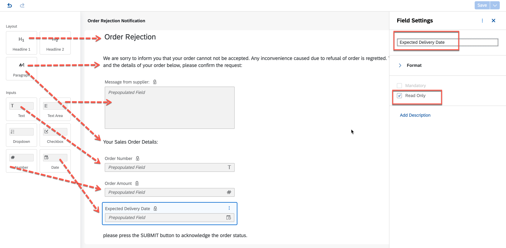

    - Do not forget the **Save** the form once completed.

    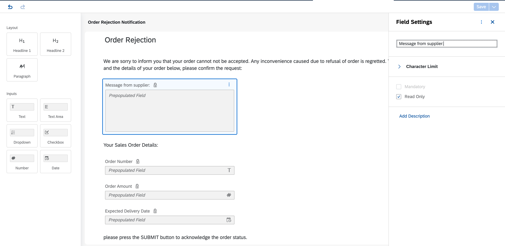

11.	Go back to the process builder and configure the order rejection form.

    - Configure **General** section

      | Property| Value |
      |---|---|
      | Subject | Your order `select order number from the process content` is rejected by the supplier |
      | Priority| High|
      | Recipients | Process Metadata > Process Started By|

      

    - Configure **Inputs** section

      | Form Input Fields| Process Content Entry |
      |---|---|
      | Expected Delivery Date | Order Processing Form > Expected Delivery Date|
      | Message from the supplier | Approval Form > Message to buyer|
      | Order Amount | Order Processing Form > Order Amount|
      | Order Number | Order Processing Form > Order Number|

      

12.	Finally connect the outgoing flow of the order rejection form to the **End** activity.

    

### With this you complete the process design of your business process. You have experienced building a process in quick time in a completely no-code environment and with no technical know-how. You used our new enhanced process builder to create an one-step approval process with trigger form, approval form and notification forms.

[VALIDATE_1]
[ACCORDION-END]
---
