# Build Your First Automation Using Outlook SDK of SAP Process Automation
<!-- description --> In this tutorial, you will be developing a basic automation using Outlook SDK of SAP Process Automation. In the end, by using the activities in Outlook SDK, you will know how to search outlook inbox or a specific email folder and download any attachments found in the email to a specific local folder.

SAP Process Automation has native integration to several Microsoft Office products including Outlook and Excel SDK. In this Tutorial, you will explore how to use Outlook SDK to your automations.

## Prerequisites
- Complete the tutorial: [Subscribe to SAP Process Automation Using Booster in SAP BTP Free Tier](spa-subscribe-booster)
- Complete the tutorial: [Install and Set Up the Desktop Agent](spa-setup-desktop-agent)
- Basic understanding of SAP Process Automation. You may review the below missions
    - [Build Your First Business Process with SAP Process Automation](mission.sap-process-automation)
    - [Boost your Business Process with Automation, Decision and Process Visibility](mission.sap-process-automation-boost)
## You will learn
  - How to use Outlook SDK of SAP Process Automation to search the given email

---

### About Outlook SDK in SAP Process Automation

The Outlook SDK in SAP Process Automation, is a collection of activities allowing you to create automations using Microsoft Outlook.
It comes with a rich set of functionality. For example,

- Search an email
- Read an email
- Download attachments from an email to your local folder
- Reply to an email
- Administrative operations like move or copy email from one outlook folder to another and many more

### Create an Automation Project

1.  There are two ways to create an automation project from SAP Process Automation Lobby.
      1.  You can click the shortcut **Create an automation**
      2.  You can get started with a **Business Project** either through **Create a Process** or using the **Create** -> **Business Process** and include automation within that.

    <!-- border -->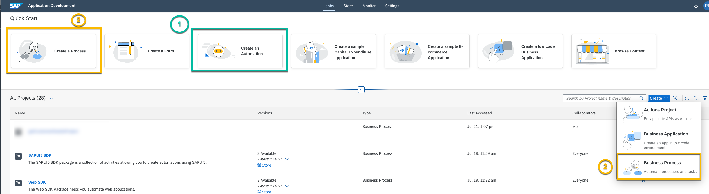
    For this tutorial, use **Create an automation**  option.

2.  Project used in this tutorial is called as `Outlook Sample`. Feel free to name your project as per your convenience.

    <!-- border -->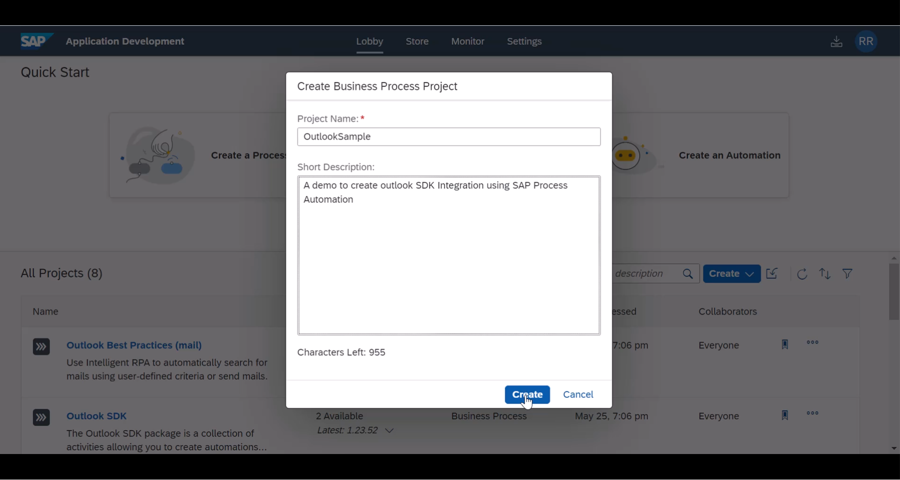

3.  Subsequently it will ask you to select your desktop agent, At the time time of this tutorial creation, a screenshot was taken based on  **Agent Version 0.24**. You can pick your active, (preferably) latest desktop agent version.

    > By the time you follow these scripts, newer Desktop agent versions may have been introduced. so always kindly install the latest version of desktop components and select the latest version of agent in this step.

    <!-- border -->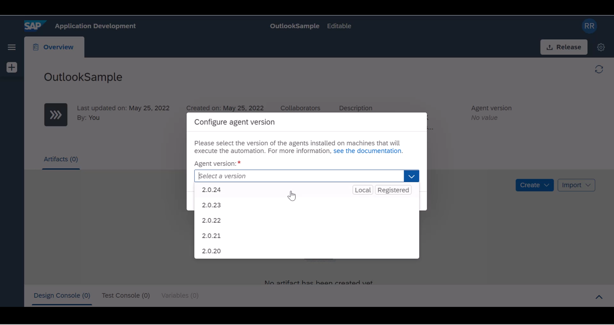

4.  Subsequently, a dialog box is displayed to create a new automation. You can give a name to your automation. For example, you may use `searchInOutlook`. You can follow your own naming convention and name for your automation.

    <!-- border -->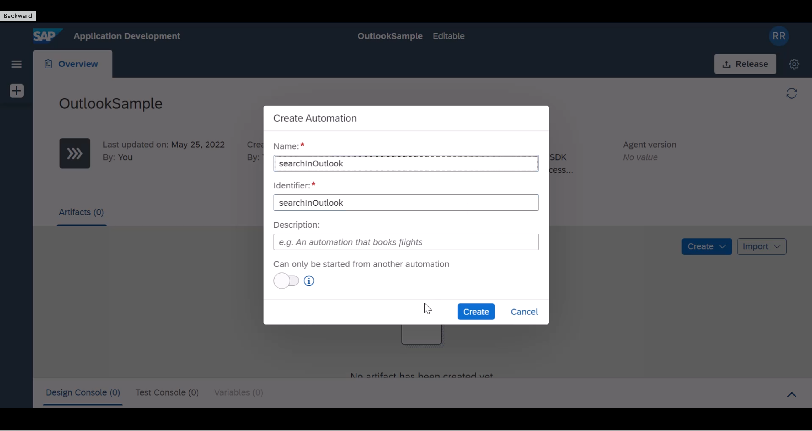

    If you had taken the route of creating a new business process project, you can add a new automation by following the given menu options.

    <!-- border -->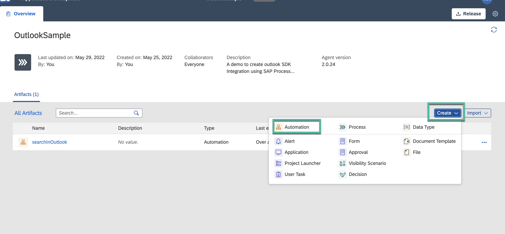

    A new tab will open and displays an empty automation for you to get started.

5.  As you can see, it adds mandatory core dependencies as part of automation addition to your project

    <!-- border -->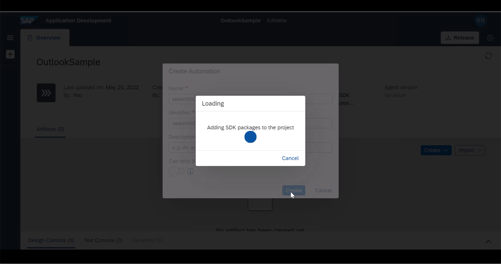

6.  Once an empty project is created, you need to include Outlook SDK dependency to this project. Locate the settings wheel icon in your project

    <!-- border -->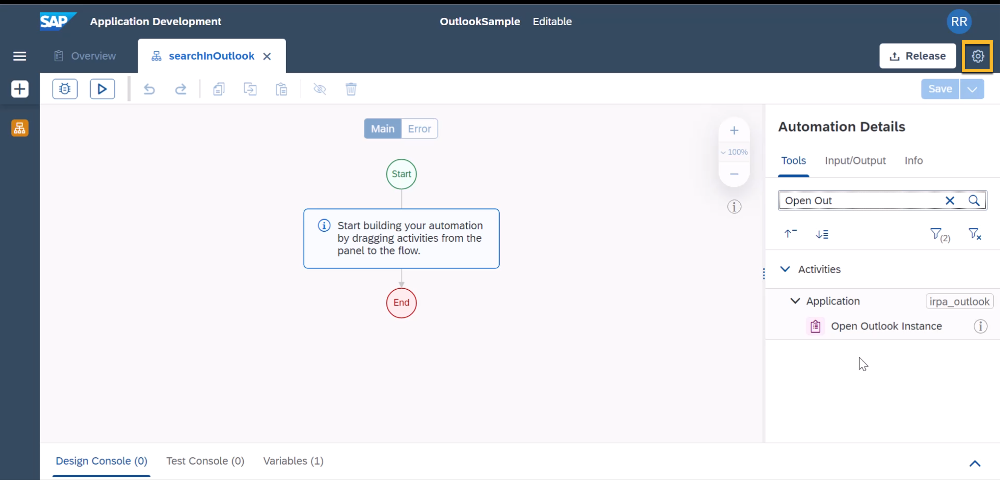

7.  From the dependency section, locate Outlook SDK and include it as a dependency to your project. At the time of this tutorial creation, Outlook SDK `Version 1.24.58` was used.

    > Again, by the time you follow these scripts, newer versions of Outlook SDK may have been introduced. so always kindly update Outlook SDK to the latest version.

    <!-- border -->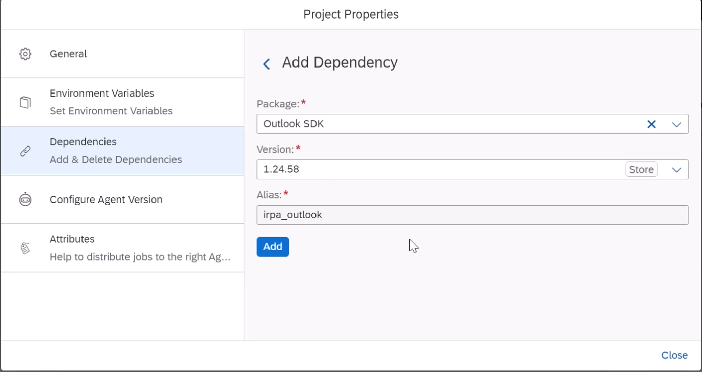

    At this point, you are ready to work with Outlook SDK.

### Search using Outlook SDK

1.  From the `Tools` panel on the right side, search for the activity **Open Outlook Instance**
    <!-- border -->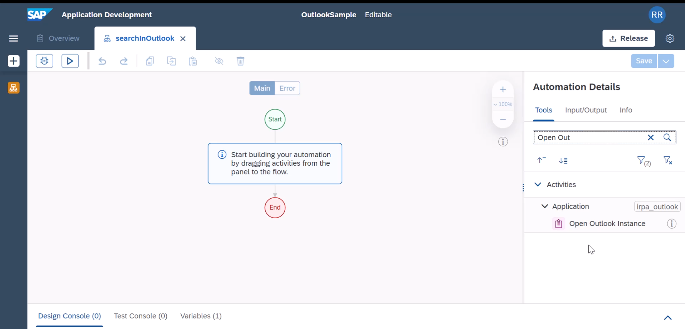

2.  Drag it onto your automation flow
    <!-- border -->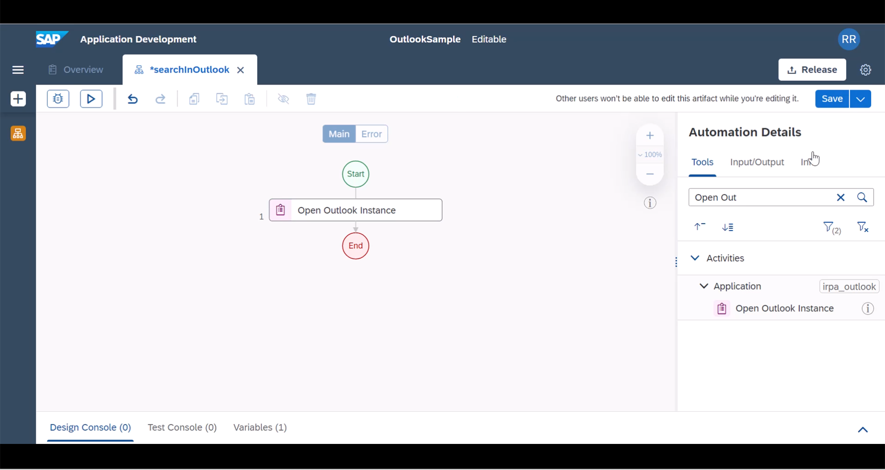

3.  Your task will be to do a simple folder search. So locate **Search Email** activity and add it to the flow
    <!-- border -->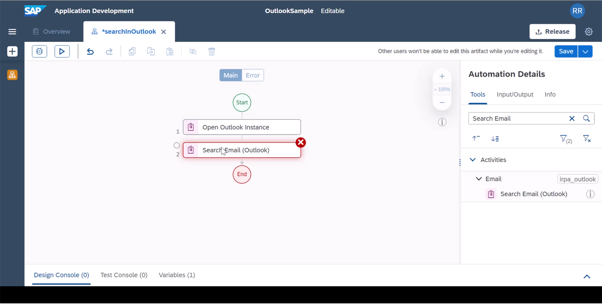

4.  Select the newly added activity and **Create Custom Data** as search criteria under `Parameters` section.
    <!-- border -->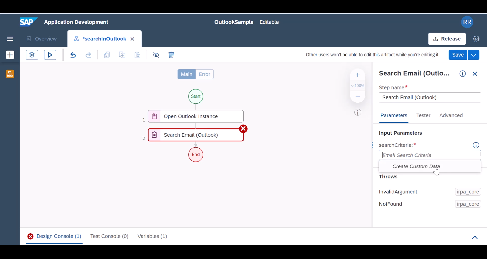

5.  Provide a folder name and a `storeName` as per the input form. Here `storeName` refers to the email inbox, where you wanted the SDK to search.
    - `folderName` : it is optional input. You need to provide one if you wanted automation to search a specific outlook folder
    - `storeName` : As some of you, may have additional mailbox configured within your outlook application, this field could be handy to search specific folder in your inbox. If you wanted to search the default inbox, you can leave the `storeName` empty.

    | Name         | Value                     | Example
    | :------------| :------------------------ | :---------------------
    | `folderName` | *Outlook sub folder name* | Invoices/ToCreate
    | `storeName`  | *Email id*                | mymail@bestrunsap.com

    <!-- border -->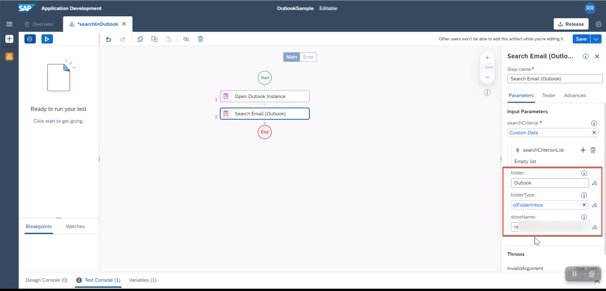

    > Review the option `SearchCriterionList`. You can include additional search criteria like emails with specific subject or from specific sender. You can refer to the [documentation](https://help.sap.com/doc/e57d7b179db649e6b5f2d26d9894f9d9/Cloud/en-US/datatypes/emailSearchCriterion.html) for additional information

6.  Add `GetEmailsinContext` activity to the flow. The previous step creates a context which is what you are going to use in the next steps.
    <!-- border -->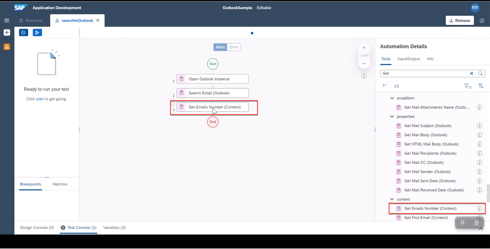

7.  As this is your first automation using Outlook SDK, you can do a simple check to find out if there is a result in the search. For example, you can find out how many emails are present in that outlook folder. For this, add a **Log Message** activity
    <!-- border -->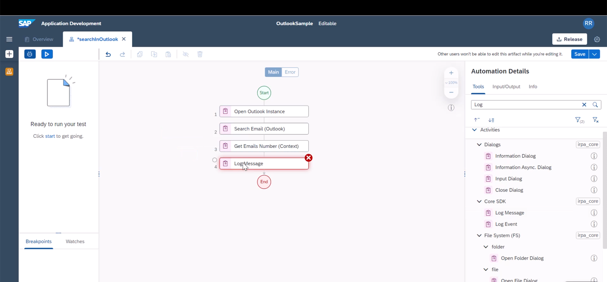

8.  If you wanted, you can include a custom message using the expression editor
    <!-- border -->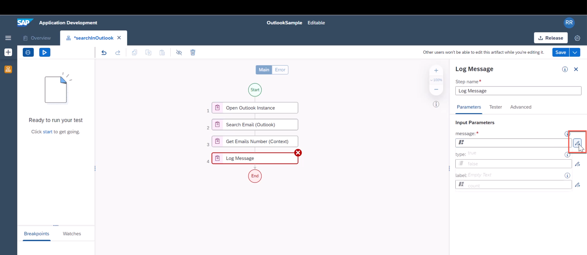

9.  Add a custom message to log the total emails in your search results
    <!-- border -->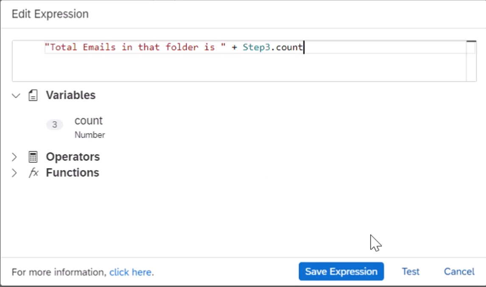

10. Add **Close Outlook Instance** and **Release Outlook Instance** to your flow. This is always required with an **Open Outlook Instance** call to release resources used by you.
    <!-- border -->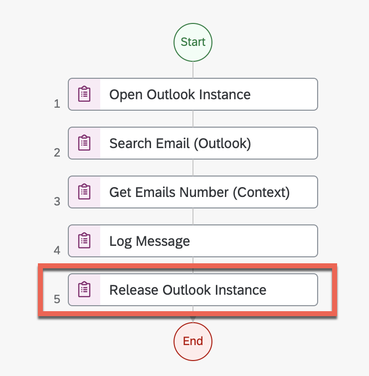

11. Save the project, test run the project, you should see your expected result
    <!-- border -->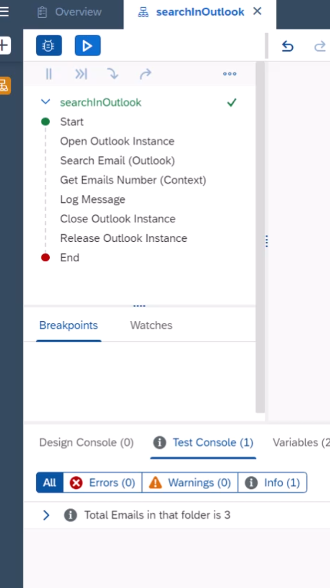

    > - Do review the below resources
    >     - Microsoft Outlook Best Practices from the SAP Process Automation [documentation](https://help.sap.com/docs/IRPA/8e71b41b9ea043c8bccee01a10d6ba72/5a48c81502db40b08e4aac866e04592a.html)
    >     - Outlook Email Best Practices Automation from the [SAP Process Automation Store](https://irpa.store.sap.com/#/package/a4c61c62-356e-4165-bdcb-bef08e236cf5)

