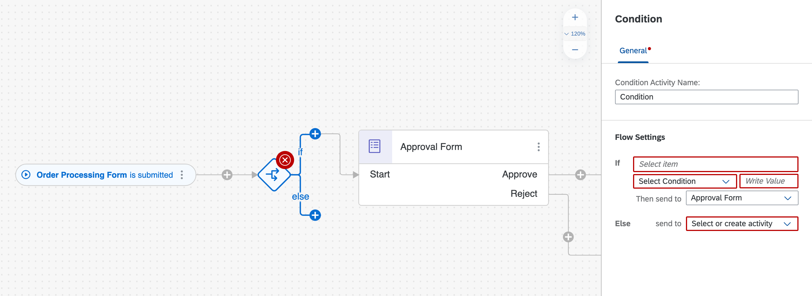
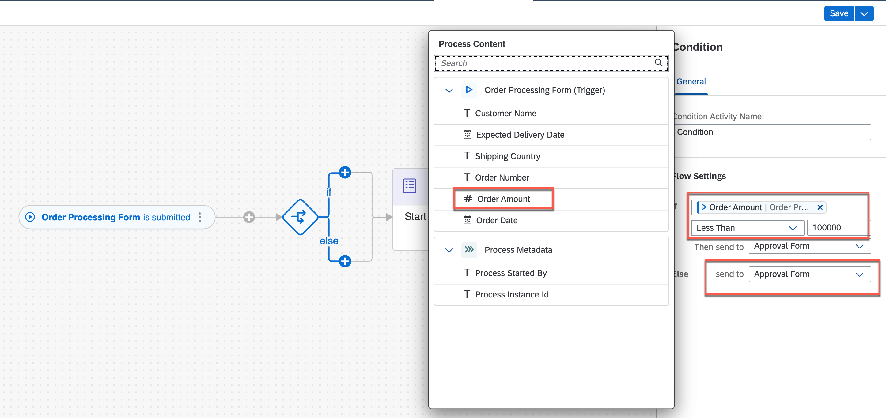
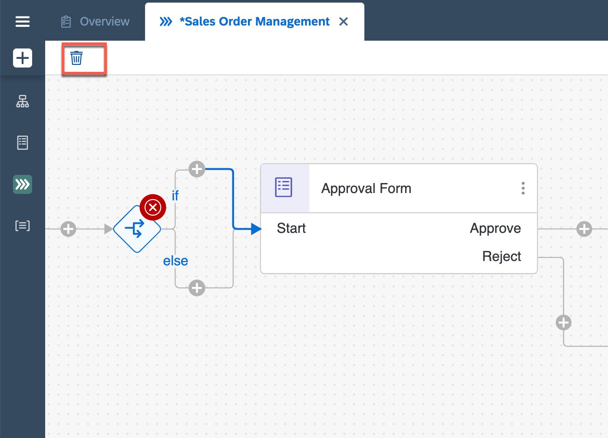
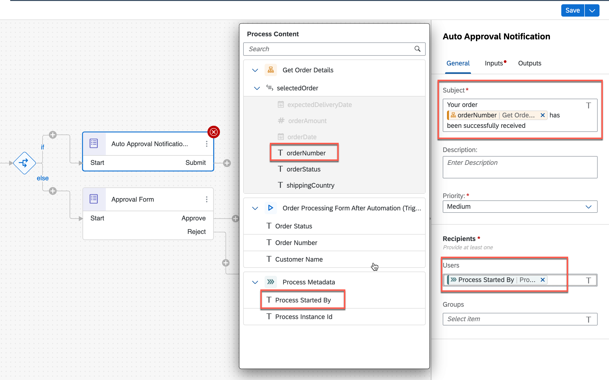
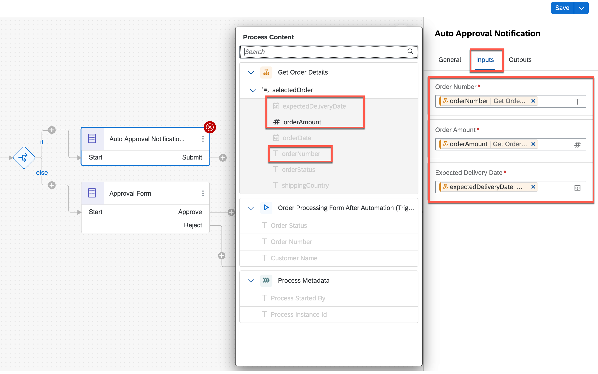
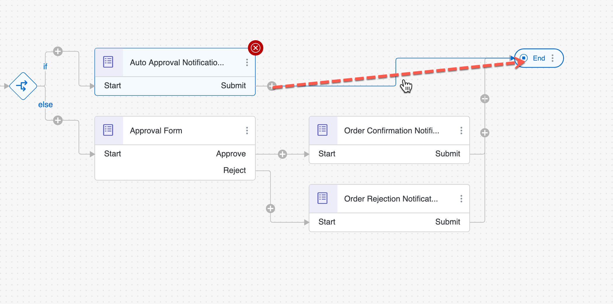

## Prerequisites
 - Access to SAP Process Automation lobby
 - Business project and process must be created

## Details
### You will learn
  - How to create and configure process condition
  - How to define different process flows for each conditional criteria

**Process condition** routes the business process based on certain criteria. These conditions apply an If or Else rule to the process content and respond according to the rules defined as settings in the process builder.

In this unit, you will learn how to use process condition in a business process to get rid of unnecessary approvals when the process is routed for auto-approval or one-step-approval flow based on the sales order criteria.

---

[ACCORDION-BEGIN [Step 1: ](Create and Configure Process Condition)]

Now that you have designed the process with forms, let us define which process flow should run based on If/else condition criteria.  

1. To add a condition to a process,
    - Open the **Process Builder**.
    - Select **+** after the start form.
    - Choose **Controls > Condition**.

    !

    This adds the condition to the process, giving access to the Configure screen.

    !

2. Now let us configure the condition settings to select If criteria as **Order Amount Less Than 100000** and **select Approval Form as else** criteria.

    With this process condition, the sales order above a specific amount only will be sent for approval and rest will be auto-approved.

    On the right **Condition** configuration page, do the following:
    - Click on **If** text box.
    - Select **Order Amount** from the process content.
    - Select **Less Than** operator.
    - Enter **100000** as the value.

    > Process content will contain list of attributes that have been defined in previous skills. For Example: In the screenshot, you can see attributes from the trigger form. You will use these process content to configure different skills during business process modelling.

    !

3.	Now it is time to decide the process flow if the condition criteria is met. For that, first you have to remove the connection from If-route to Approval Form and then create a new form to notify the requester of the auto-approval.

    !

4. To create the new form, add the **New Form** from the **If-route** with any given name and description.

    !

    In the pop-up for new form, do the following:
        - Enter the **Name** as **Auto Approval Notification**.
        - Enter a **Description** of your choice.
        - Choose **Create**.

      > The form **Identifier** field is auto-filled.

      !

5. Design the notification form, in the same way as you did in previous chapter, to send yet another notification to the requester about auto-approval.

  | Form Fields | Field Settings with Label |
  |---|--|
  | Headline 1 | Automatic Order Confirmation |
  | Paragraph  | Your order has been received and we will send you the details as soon as the order is shipped. You can find the details of your order below, please review and verify your request:|
  | Paragraph  |Sales Order Details: |

  - For all below **Input Fields** enter the labels and select the **Read Only** checkbox
  | Form Fields| Field Settings with Label |
  |---|---|
  | Text | Order Number|
  | Number | Order Amount|
  | Date | Expected Delivery Date|
  | Paragraph | please press the SUBMIT button to acknowledge the order status.|

  

6. Go back to the process builder and configure the auto approval form.

    - Configure **General** section

      | Property| Value |
      |---|---|
      | Subject | Your order `select order number from the process content` has been successfully received |
      | Recipients | Process Metadata > Process Started By|

      

    - Configure **Inputs** section

      | Form Input Fields| Process Content Entry |
      |---|---|
      | Order Number | Order Processing Form > Order Number|
      | Order Amount | Order Processing Form > Order Amount|
      | Expected Delivery Date | Order Processing Form > |

      

7. Finally connect the outgoing flow of the auto-approval form to the **End** activity.
    - Do not forget to **Save** the process once done.  

    

### This completes the process design with condition criteria that will decide what process flow is executed and whether there will be an auto-approval or one-step approval route.

[VALIDATE_1]
[ACCORDION-END]

---
