## Details
### You will learn
  - How to create and configure process condition
  - How to define different process flows for each conditional criteria

---
A **process condition** routes the business process based on certain criteria. These conditions apply an If or Else rule to the process content and respond according to the rules defined as settings in the process builder.

In this unit, you will learn how to use process condition in a business process to get rid of unnecessary approvals when the process is routed for auto-approval or one-step-approval flow based on the sales order criteria.

[ACCORDION-BEGIN [Step 1: ](Create and configure process condition)]

Now that you have designed the process with forms, let us define which process flow should run based on if/else condition criteria.  

1. To add a condition to a process:

    - Open the **Process Builder**.
    - Select **+** after the start form.
    - Choose **Controls > Condition**.

    !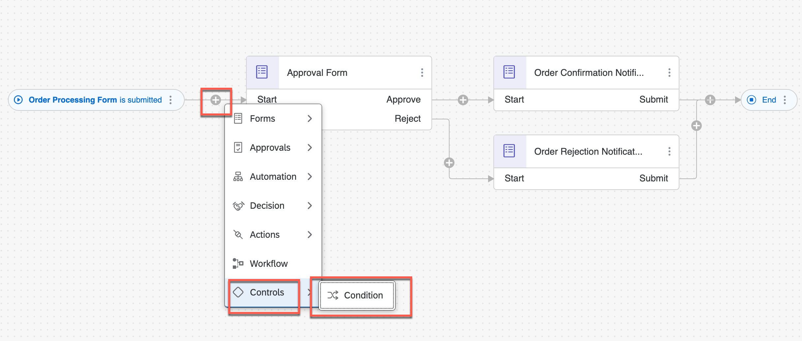

    This adds the condition to the process.

2. To configure your condition, choose **Open Condition Editor**.

    !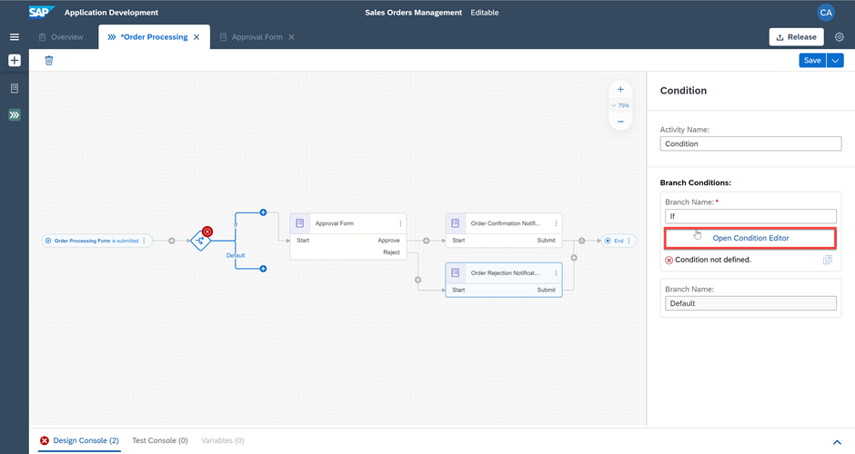

3. Edit your branch condition by setting **Order Amount** from the process content.

    !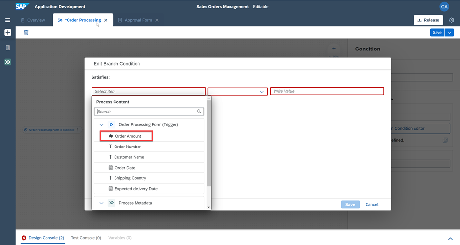

    > Process content will contain list of attributes that have been defined in previous skills. For Example: in the screenshot, you can see attributes from the trigger form. You will use these process content to configure different skills during business process modelling.

4. Select **is less than**.

    !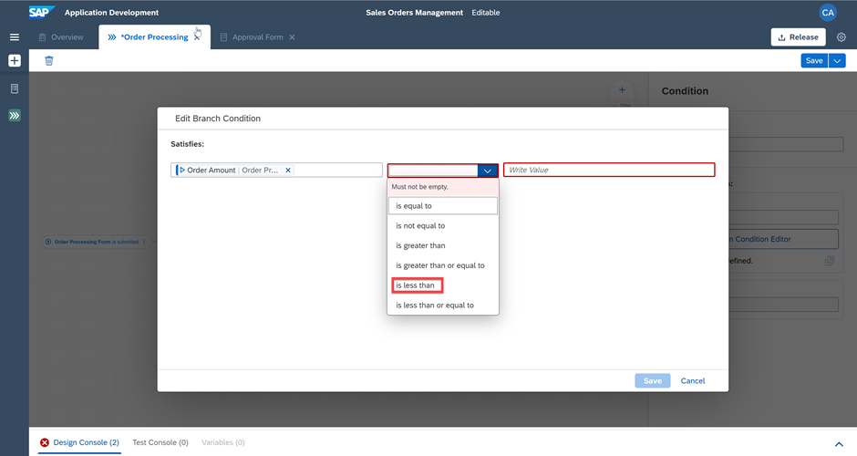

5. Enter **100000** as the value and choose **Apply**

    You have configured your **if** branch to: **if Order Amount is less than 100000**.

    !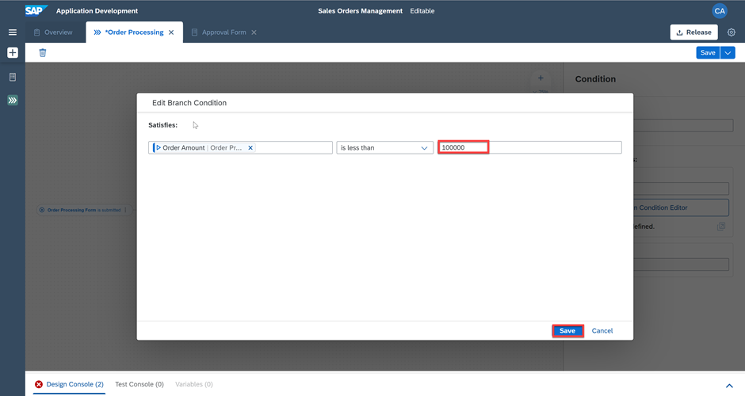

6. Similarly, add one more condition
    - Click **Add Group**
    - In the group section,
        - Select **Any** to make it **OR** conditional group
        - Select **Shipping Country is equal to India** as the first condition
        - Select **Shipping Country is equal to Germany** as the second condition

    > You can expand the Summary section to see the how the process conditions are designed

    - Finally, click **Apply** to add the condition to the business process

    !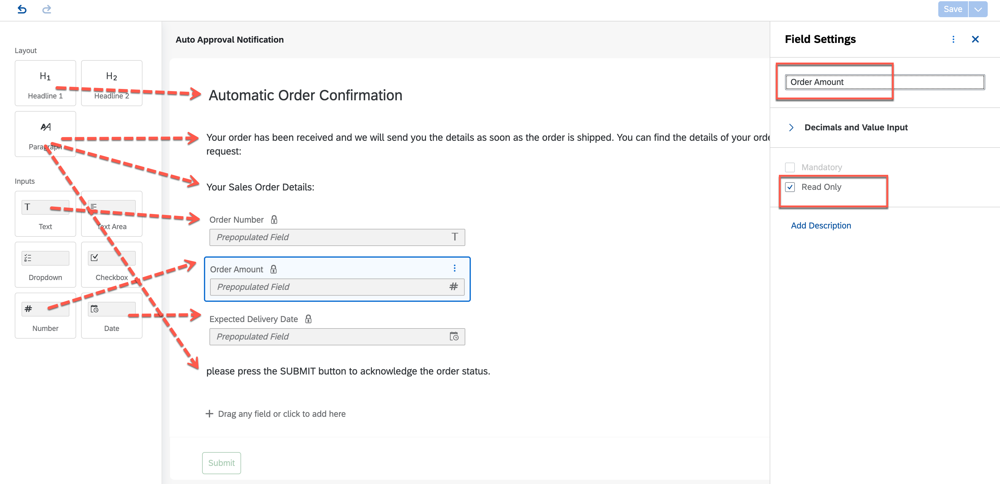

7. Now, link your **Default** branch to **Approval Form**.

    !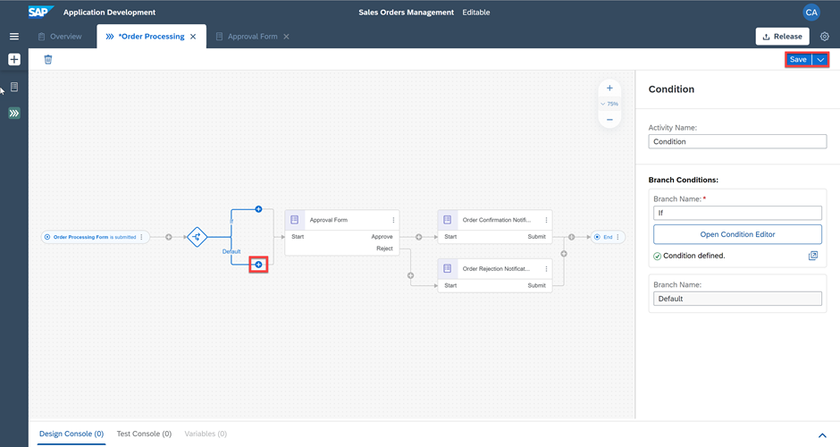

    With this process condition, the sales order above a specific amount only will be sent for approval and rest will be auto-approved.    

8.	Let's decide the process flow if the condition criteria is met. For that, first you have to remove the connection from If-route to Approval Form and then create a new form to notify the requester of the auto-approval.

    !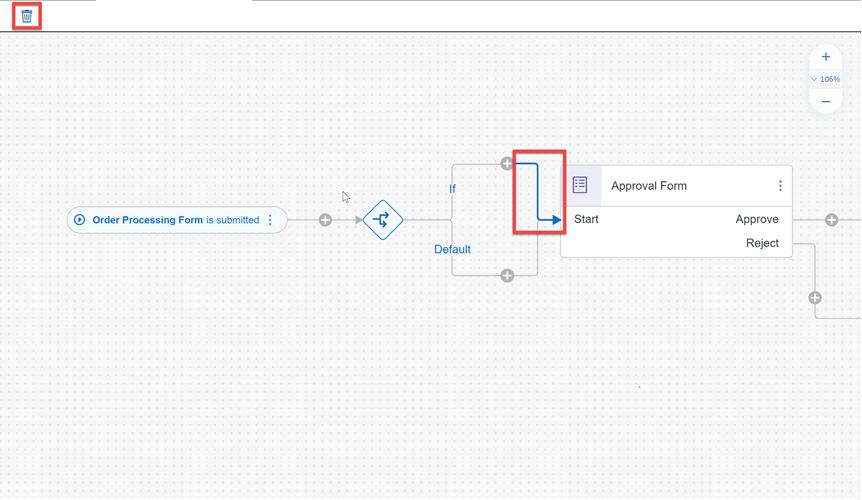

9. To create the new form, add the **New Form** from the **If-route**.

    !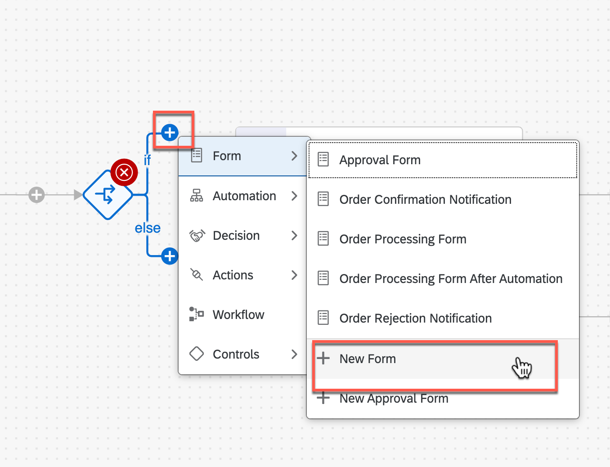

    In the pop-up for new form, do the following:

    - Enter the **Name** as **Auto Approval Notification**.
    - Enter a **Description** as **Notification form to inform auto approval of the sales order**.
    - Choose **Create**.

    > The form **Identifier** field is auto-filled.

    !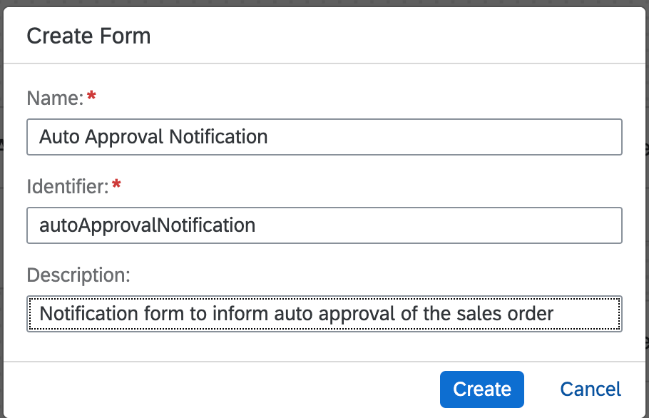

10. Design the notification form, in the same way as you did in the previous chapter, to send another notification to the requester about auto-approval.

    | Form Fields | Field Settings with Label
    |  :------------- | :-------------
    | Headline 1 | Automatic Order Confirmation
    | Paragraph  | Your order has been received and we will send you the details as soon as the order is shipped. You can find the details of your order below, please review and verify your request:
    | Paragraph  | Your Sale's Order Details:

    - For all below **Input Fields** enter the labels and select the **Read Only** checkbox.

    | Form Fields| Field Settings with Label
    |  :------------- | :-------------
    | Text | Order Number
    | Number | Order Amount
    | Date | Expected Delivery Date
    | Paragraph | Please press the SUBMIT button to acknowledge the order status.

11. Save your work.

    !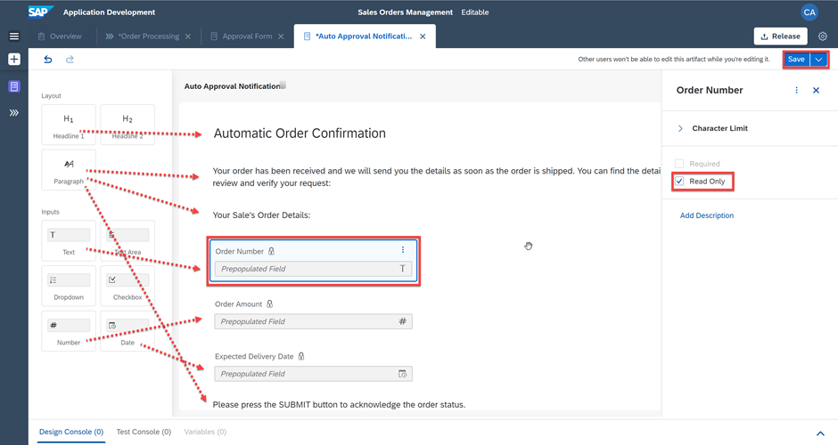

12. Go back to the process builder and configure the auto approval form.

    - Configure the **General** section.

    | Property| Value |
    |  :------------- | :-------------
    | Subject | Your order **Order Number > Order Processing Form** has been successfully received
    | Recipients | **Process Started By > Process Metadata**

    !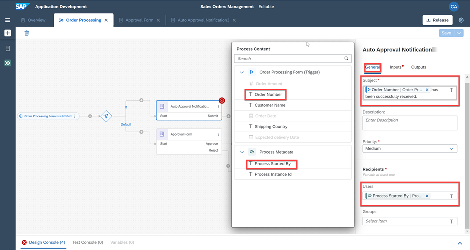

    - Configure the **Inputs** section.

    | Form Input Fields| Process Content Entry
    |  :------------- | :-------------
    | Order Number | Order Number > Order Processing Form
    | Order Amount | Order Amount > Order Processing Form
    | Expected Delivery Date | Expected Delivery Date > Order Processing Form

    !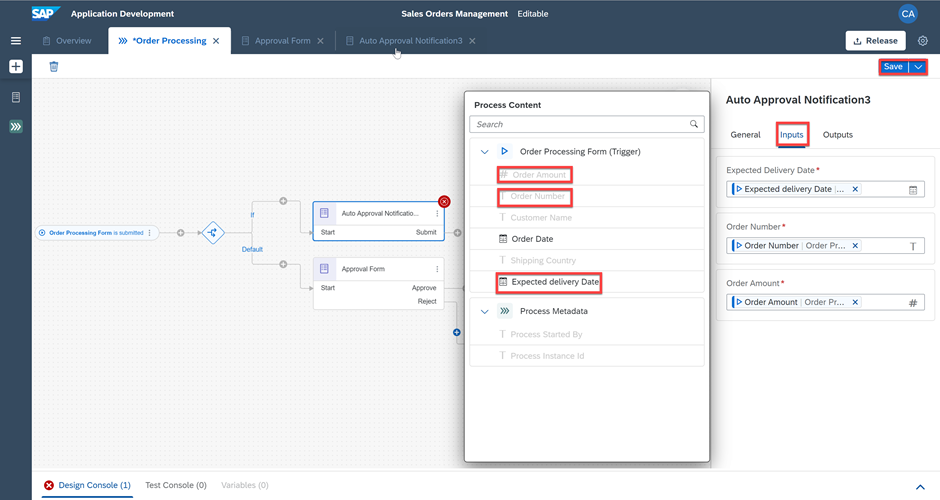

13. Finally, connect the outgoing flow of the auto-approval form to the **End** activity.

    - Do not forget to **Save** the process once done.  

    !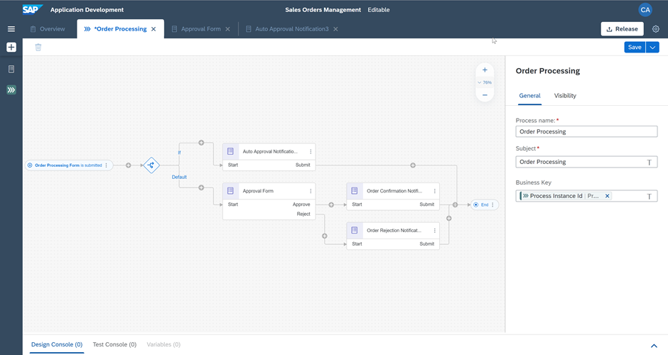

    This completes the process design with condition criteria that will decide what process flow is executed and whether there will be an auto-approval or a one-step approval route.

[DONE]
[ACCORDION-END]

[ACCORDION-BEGIN [Step 2: ](Validation)]

[VALIDATE_1]
[ACCORDION-END]

---
