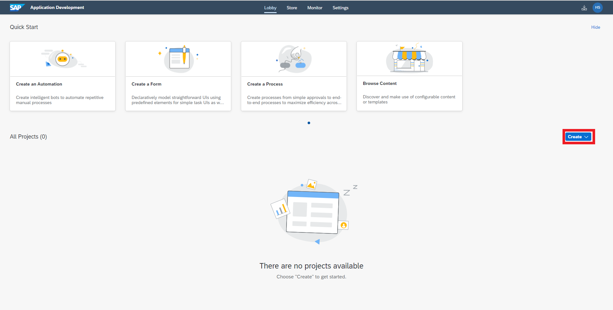
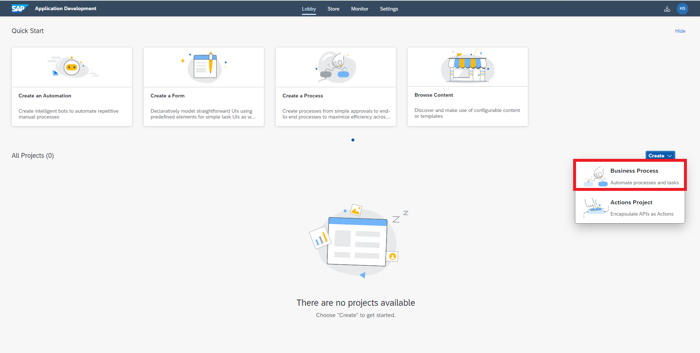
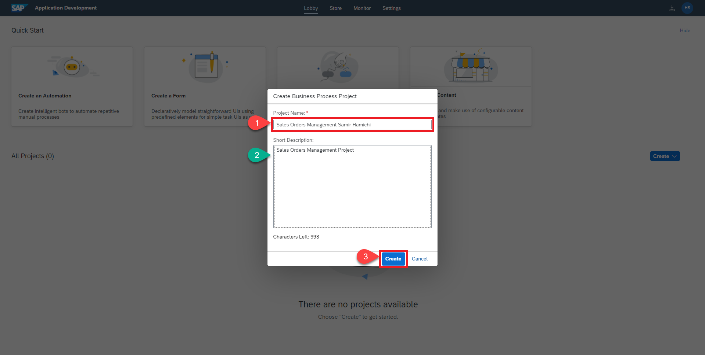
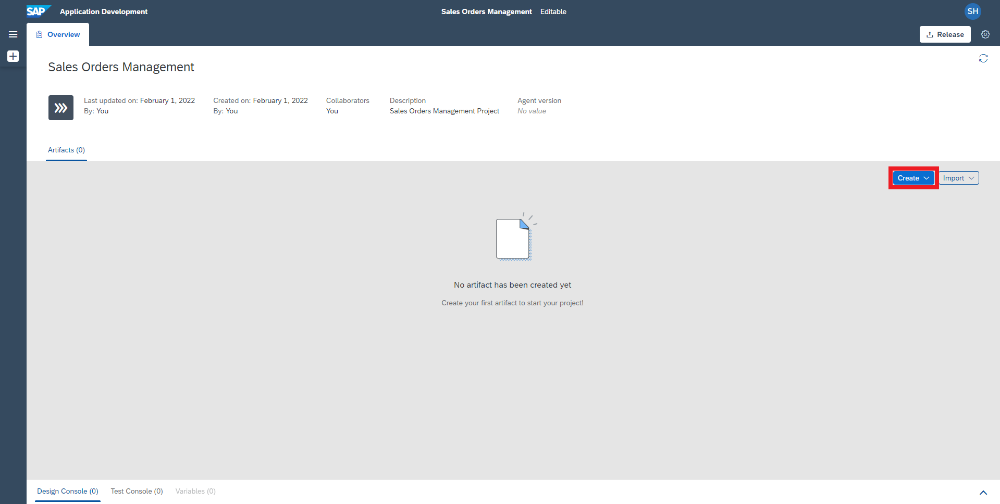
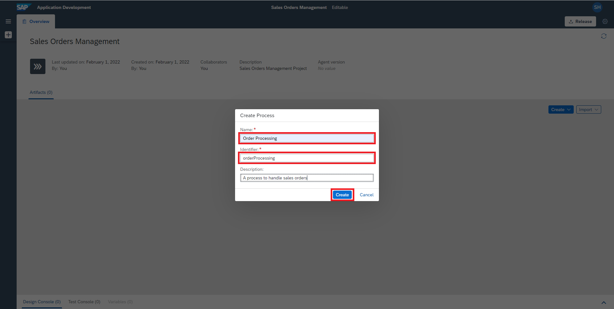

## Prerequisites
  - You will need either a trial account with the SAP Process Automation enabled (as described by this [blog](https://blogs.sap.com/2022/09/09/sap-process-automation-now-available-in-your-trail-account/)), or a regular account with the free-tier service plan for SAP Process Automation (as described in [Subscribe to SAP Process Automation Using Booster in SAP BTP Free Tier](https://developers.sap.com/tutorials/spa-subscribe-booster.html)).

## Details
### You will learn
  - How to create a SAP Process Automation project
  - How to create a process that automates sales order creation and approval

---

With the new citizen automation user experience, you will get access to a new scope of opportunities for running your day-to-day workflows. In this tutorial, you will learn how a low-code and no-code tool can help you build the apps you need at the speed your business demands, using visual drag and drop tools for application development.

There are many use cases where you can make a difference using SAP Process Automation. During this tutorial, you will see how the Sales Order Approval process can be built using forms where a sales order is a document which confirms a sale that is generated by the seller after receiving a purchase order from the buyer. These sale order requests have to be reviewed and approved by the supplier to ensure that the sales orders are delivered on time. Once approved or rejected, the requester will be notified.

---

[ACCORDION-BEGIN [Step 1: ](Create a business process project)]

1. In the **Lobby**, choose **Create**.

    > The lobby is a central page for creating, accessing, and managing your projects in SAP Process Automation. You can access business application processes, company configured templates, and other resources for your end-to-end business process.

    !

2. Select **Business Process**.

    > Business Process Projects are a collection of skills in SAP Process Automation. Projects are part of the internal business processes of a company and are defined based on business scenarios. A project can contain a set of processes, forms, automations and decisions, which are reusable artifacts.

    !

3. In the **Create Business Process Project** dialog box, do the following:
    - Enter a **Project Name**: Sales Orders Management.
    - Enter a **Short Description**: Sales Orders Management Project.
    - Choose **Create**.

    !

    A new tabs opens with the project that you created.

[VALIDATE_1]
[ACCORDION-END]

[ACCORDION-BEGIN [Step 2: ](Create a business process)]

1. In the **Project Overview**, choose **Create**.

    !

2. Select **Process**.

    > Inside a project, you can create a process. This process is equivalent to a workflow in any business scenario. You can create this process from different skills such as forms, decisions, automations.

    !

3. In the **Create Process** dialog box, provide the following:
    - Enter a **Name**: Order Processing.
    - Enter a **Description** for your process: A process to handle sales orders.
    - Choose **Create**.

    > The process **Identifier** field is auto-filled.

    The process builder loads.

    !

[VALIDATE_2]
[ACCORDION-END]

---
