# Create an Automation to Extract Invoice Details
<!-- description --> Extract invoice document using Document Extraction Template to send the invoice details to the process

## Prerequisites
 - Complete the tutorial on creating an [Invoice Approval Process](spa-dox-create-process)
 - [Install and Setup the Desktop Agent](spa-setup-desktop-3-0-agent)
 - Download the [Invoice Document](https://github.com/sap-tutorials/Tutorials/blob/master/tutorials/spa-dox-create-automation/invoice.pdf) to your local machine

## You will learn
  - How to extract data using Document Extraction Template
  - How to bind parameters between process and automation

---

### Create automation

1. In the process **Get Invoice Details**:
    - Choose **+**,
    - Select **Automation**,  **New Automation**.

    <!-- border -->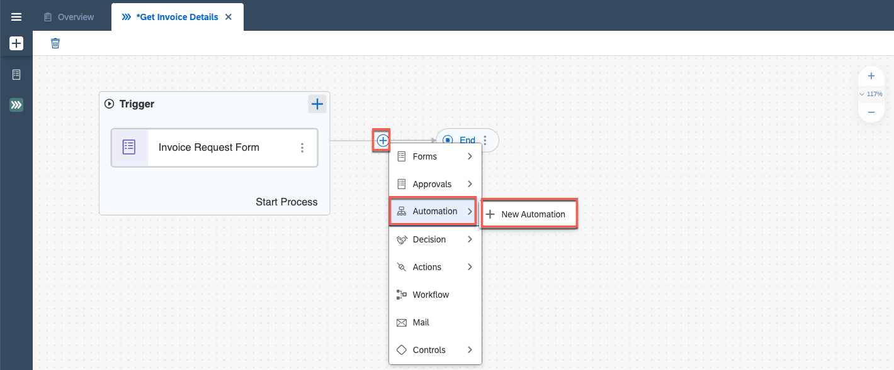

2. A pop up will appear to configure the Desktop Agent version. Do the following in the pop up:
    - From the dropdown, select the version of the Desktop Agent installed on your machine.
    - Choose **Confirm**.

    > It would be with suffix as **Registered**.

    <!-- border -->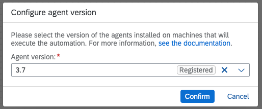

3. A new pop-up will appear to create the automation. Do the following in the pop-up:

    -  Enter **Name** of the automation: **Extract Invoice Data**,
    -  Enter **Description** of your choice,
    -  Choose **Create**.    

    <!-- border -->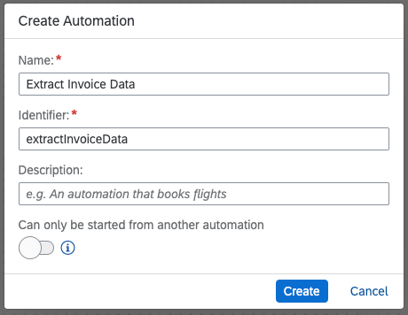

    An automation **Extract Invoice Data** will be created successfully.

    <!-- border -->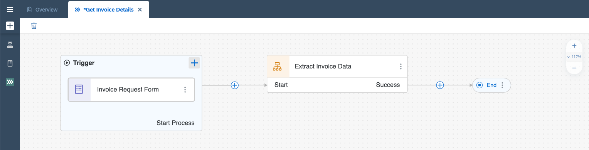

### Create data types

1. Go to the **Overview** Tab. Choose the **Create** button. Create an artifact of the type **Data Type**.

    <!-- border -->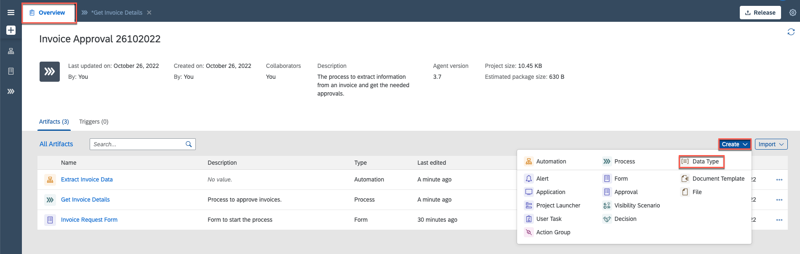

2. A new pop-up will appear:
    - Enter **Name** of the data type: **Invoice**,
    -  Enter **Description** of your choice,
    - Choose **Create**.

    <!-- border -->

3.  In the Data Type **Invoice** add new fields as following:

    |  Field Name     | Type
    |  :------------- | :-------------
    |  `DocumentNumber`| String
    |  `GrossAmount`   | Number
    |  `SenderName`    | String

    <!-- border -->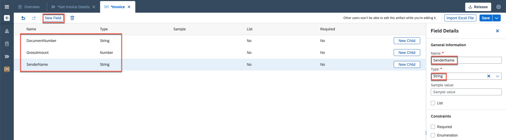

4. Choose **Save**.

    <!-- border -->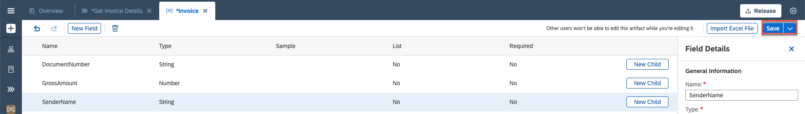

### Create input and output parameters

    Input and output parameters allow you to exchange data in the workflow of your automation between activities, screens, and scripts.

1. Go to the **Overview** tab. Open **Extract Invoice Data** Automation.

    <!-- border -->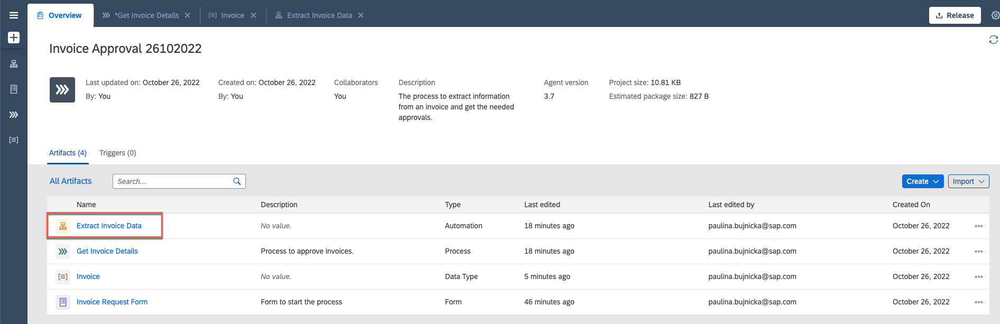

2.  In **Automation Details**, select the **Input/Output** section.

    <!-- border -->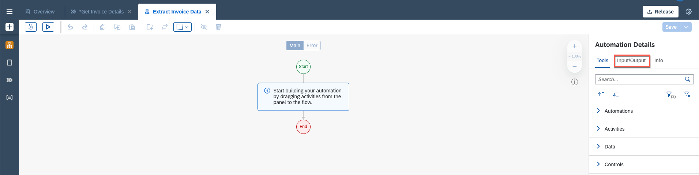

3. Add Input and Output parameters.

    <!-- border -->

4. Edit Input and Output parameters as follows:

    |  Parameter Name       | Data type        | Parameter Type | Description
    |  :---------------     | :-------------   | :------------- | :---------------
    |  `FilePath`      | String     | Input          | Path where the invoice document is stored  
    |  `InvoiceDetails`    | Invoice| Output         | Extracted Invoice Details

    <!-- border -->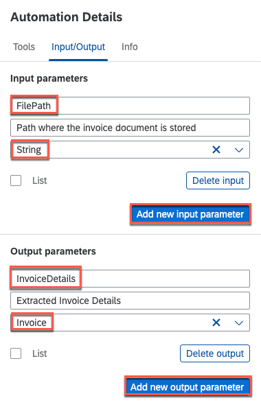

3. Choose **Save**.    

### Create document template

1. Go the **Overview** Tab. Choose **Create** and **Document Template**.

    <!-- border -->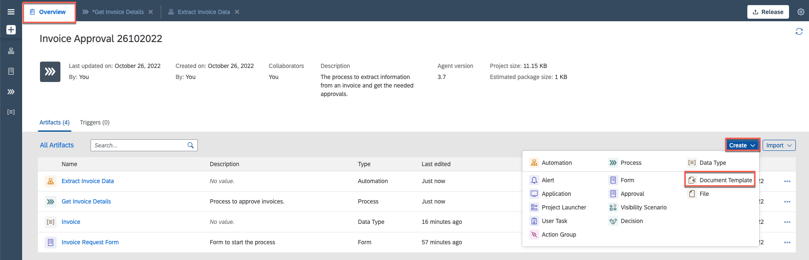

2. In the **Create Document Template** window, under **Details**:
    - Choose **Create a new template**,
    - Enter the **Name** of the template,
    - Upload the invoice document which you have downloaded from prerequisites,
    - Choose **Next**.

    <!-- border -->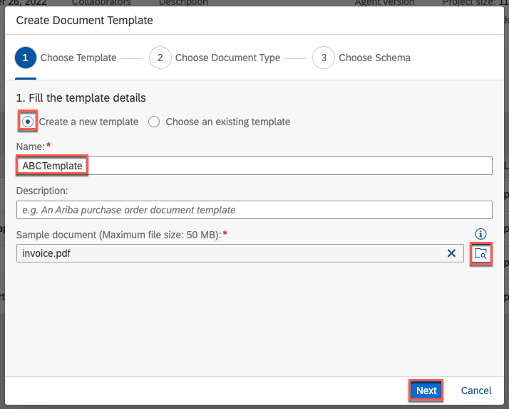

3. Select **Invoice** as the document type of your template and choose **Next**.

    <!-- border -->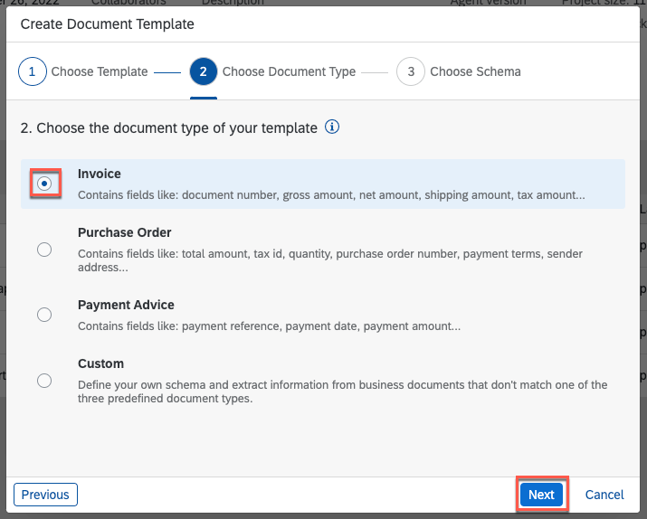

4. Under **Choose Schema**:
    - Choose **Create New**,
    - Enter the **Name** of the schema,
    - Choose the Header fields that you would extract the data from the Invoice document. In this scenario you would select `documentNumber`, `grossAmount`, `senderName`.
    - Choose **Add**.

    <!-- border -->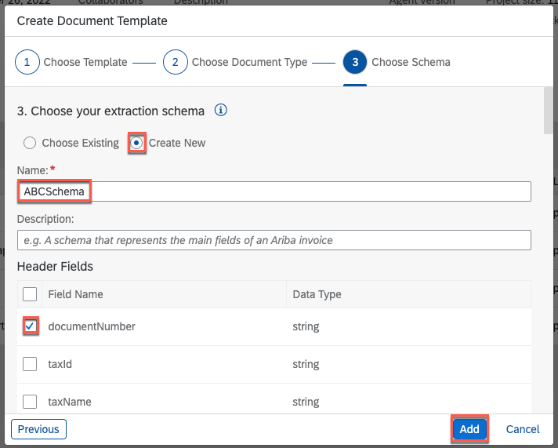

5. Document Information Extraction SDK would be added as dependency to your project. The schema and template are created successfully.

6. Once Upload will be completed, choose **Open in a new tab**.

    <!-- border -->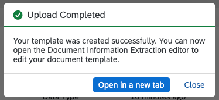

### Annotate and activate the document template

1. You are now navigated to Document Information Extractor. It allows you to edit and annotate the template. To work on Document Information Extractor, please check if you have been assigned to `Document_Information_Extraction_UI_Templates_Admin` role in SAP BTP Cockpit. Otherwise, add the role manually. You would get an error if you do not have DOX roles.

    <!-- border -->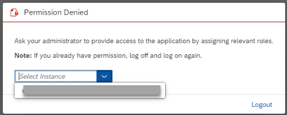

2. Select the **Document Name**.

    <!-- border -->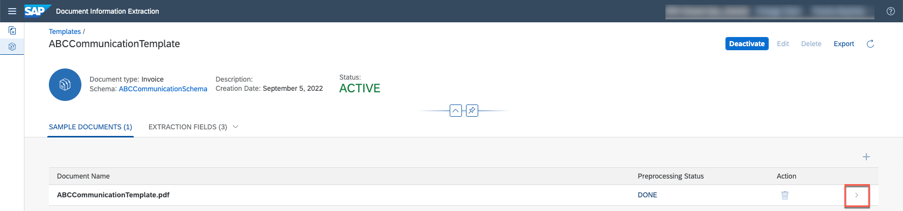

3. Choose **Annotate**.

    <!-- border -->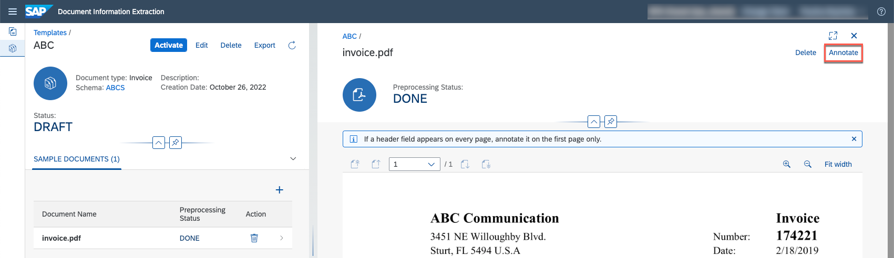

4. Choose **Edit**.

    <!-- border -->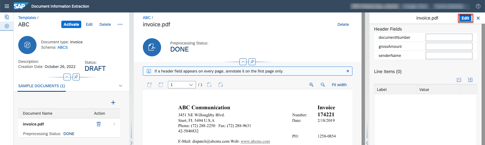

5. Select the data in your invoice document which you would like to extract the information. In this scenario, you will read the Document Number, Gross Amount and Sender Name.
    - Select the value  **174221** in the document and map to the field `documentNumber`. Choose **Apply**.

        <!-- border -->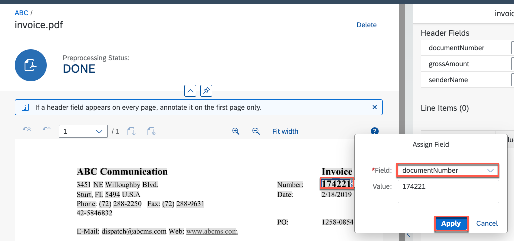

    - Select the value **ABC Communication** in the document and map to the field `senderName`. Choose **Apply**.

        <!-- border -->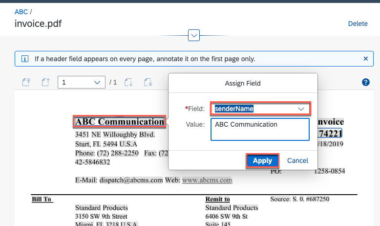

    - Select the value **220** in the document and map to the field `grossAmount`.

        <!-- border -->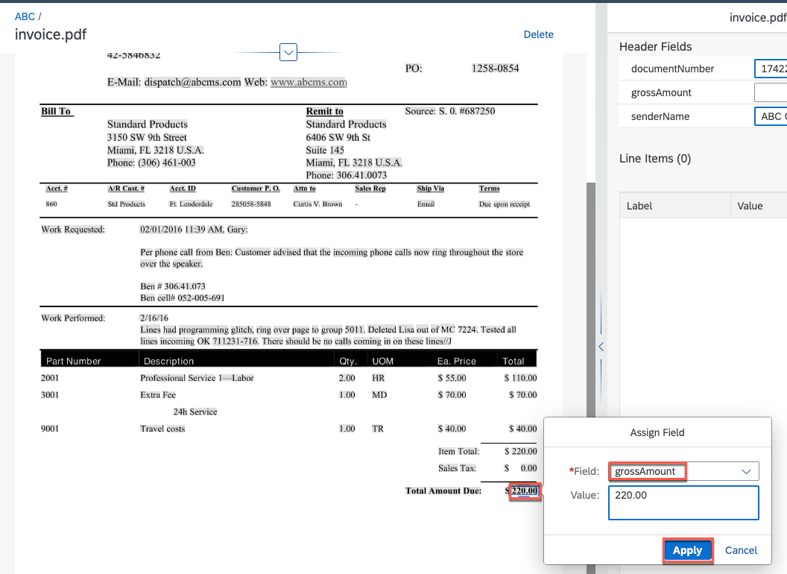

6. Once mapping is done. Choose **Save** and **Activate** the template.

    <!-- border -->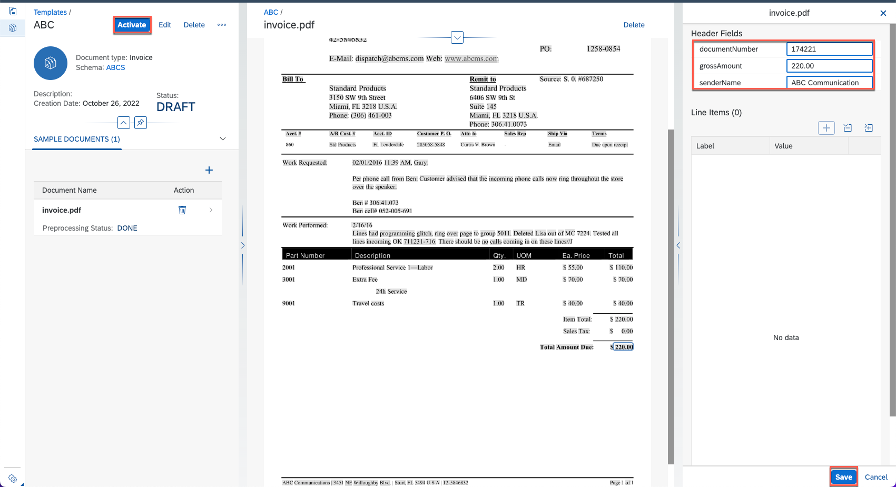

### Build the automation

1. Navigate back to Application Development and select **Extract Invoice Data** automation tab.

    <!-- border -->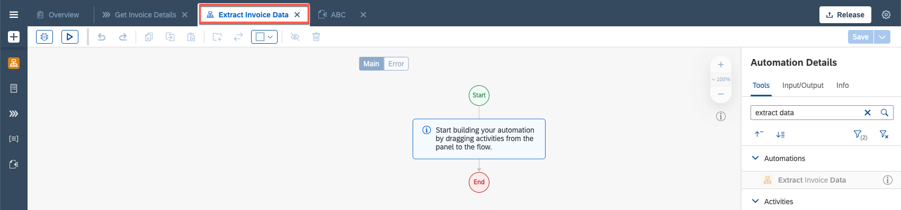

2. In Automation Details, under Tools, in search field, search for **Extract data (Template)** activity.

    > You can extract data with Document Information Extraction using the chosen document template and given PDF file.

    <!-- border -->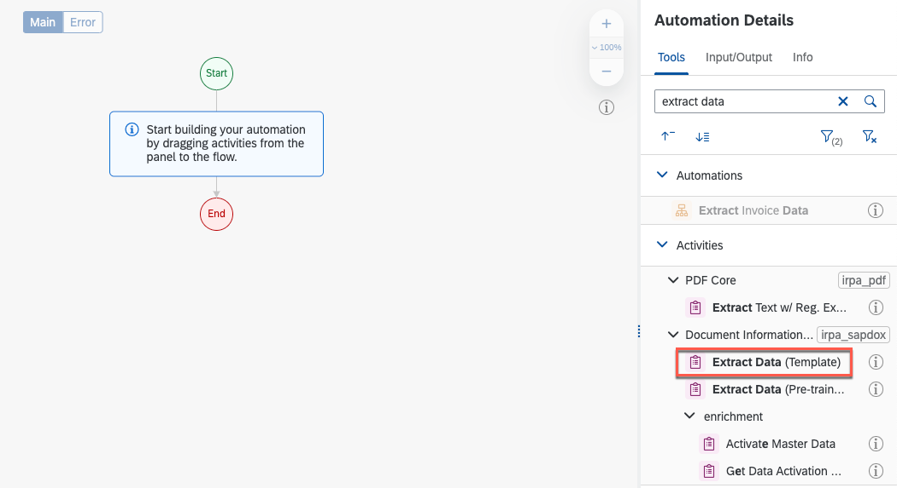

3. Drag and drop the activity **Extract Data (Template)** into the automation flow.

    <!-- border -->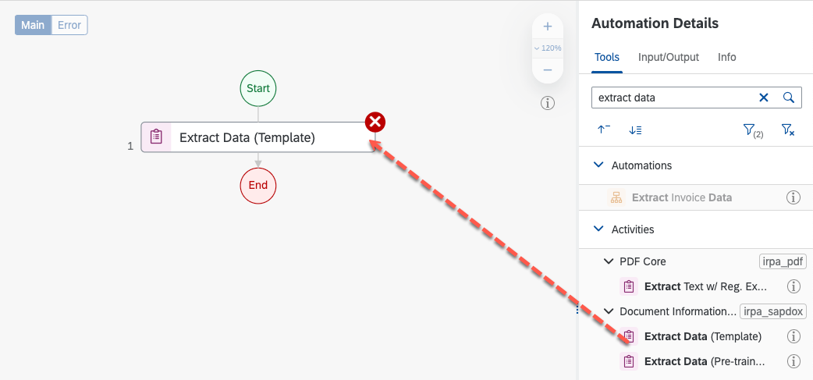

4. Select the activity. Maintain the parameters for the activity as follows:
    - Under Document Schema: select your Schema
    - Under Document Template: select your Template
    - Under `documentPath`: choose `FilePath`

    <!-- border -->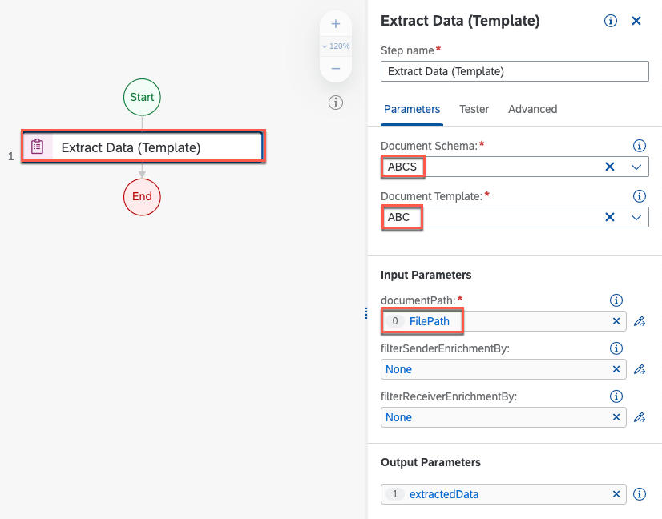

5. You have already created the data type **Invoice** in Step 2. Now, you will create a variable of type **Invoice**.

6. Click on the canvas. Search for the datatype **Invoice**, located under the **Data Types** section.

    <!-- border -->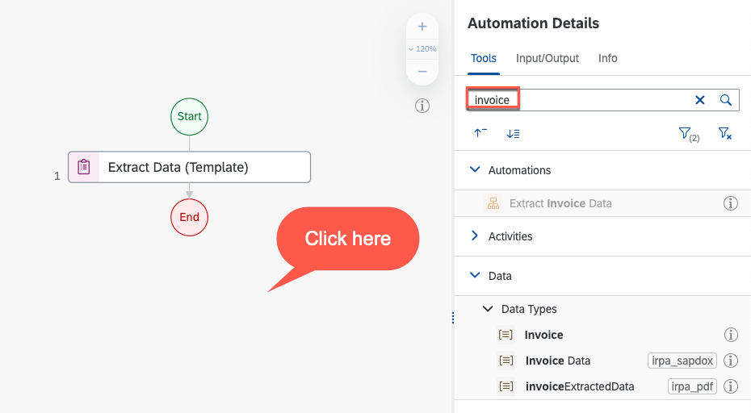

7. Drag and drop the data type **Invoice** into the automation flow.

    <!-- border -->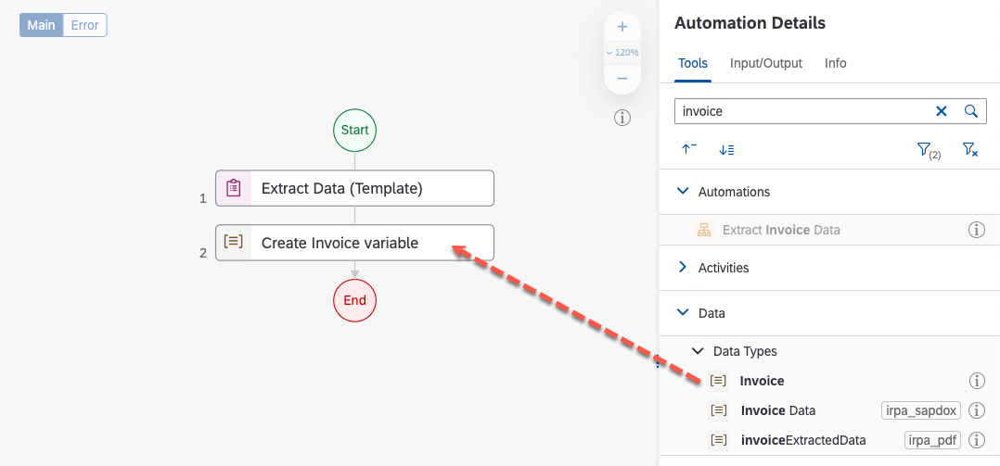

8. Select **Create Invoice variable**. In the Input Parameters, under value, choose **Create Custom Data**.

    <!-- border -->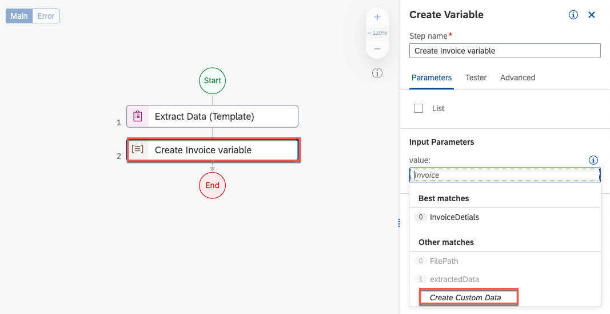

9. Choose the Edit button to map the parameters:
    - `DocumentNumber` to the extracted invoice data from the activity Extract Data (template),
    - Repeat the same for `GrossAmount` and `SenderName` and map it to the corresponding fields of `extractedData`.

    <!-- border -->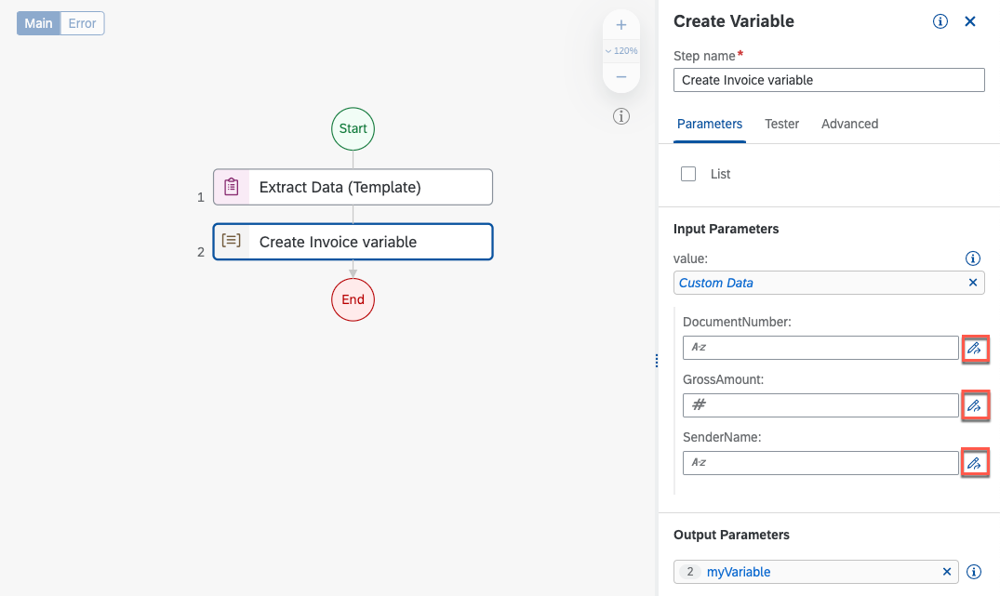

10. Rename the output parameter to `myInvoiceData`.

11. The final input and output parameters of **Create Invoice Variable** looks as below.

    <!-- border -->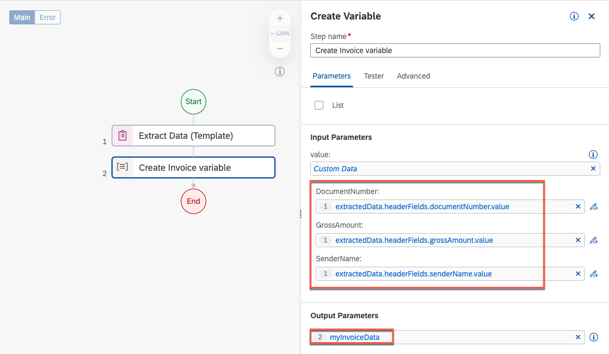

12. Print the invoice data using the activity **Log message**.

    >  With this activity you generate a log message within the tester and the trace file, which is useful for setting up an automation. By default, a log will be "Information".

13. Click on canvas, search for **Log Message** activity and drag and drop it into the automation flow.

    <!-- border -->

14. Select **Log Message** activity. In Input Parameters under message add `myInvoiceData` value.

    <!-- border -->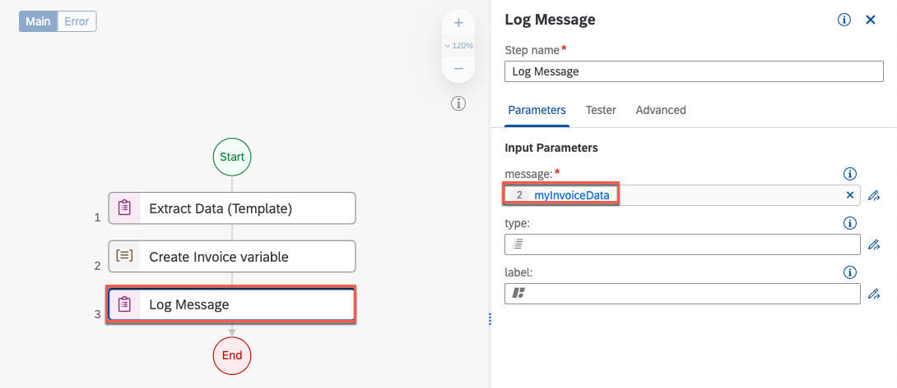

15. Select **Save**.

### Passing the parameters outside the automation

1. Select the **End**. Pass the variable `myInvoiceData` to the output parameter `InvoiceDetails`, which you have created in Step 2.

    <!-- border -->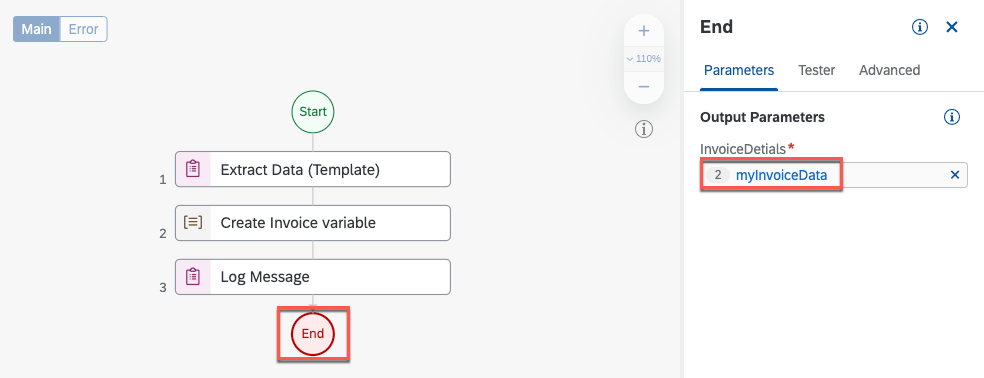

2. **Save** the automation.

### Mapping of parameters to the automation and process

1. Navigate to the **Get Invoice Details** process and select the automation **Extract Invoice Data**. Map the input parameter of the automation to the form parameter `FilePath`.

    <!-- border -->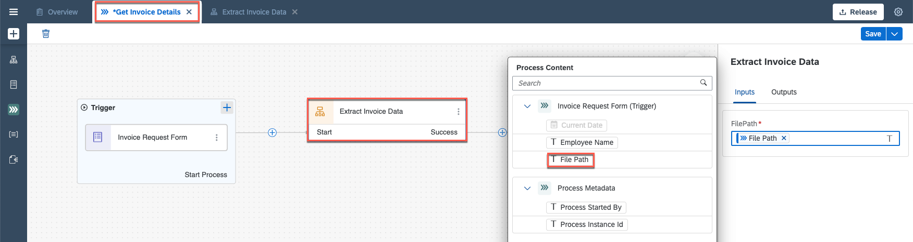

2. Select **Save**.

### Test the automation

1. Select Test button and enter the `Filepath` where the invoice document is stored locally on your machine.

    <!-- border -->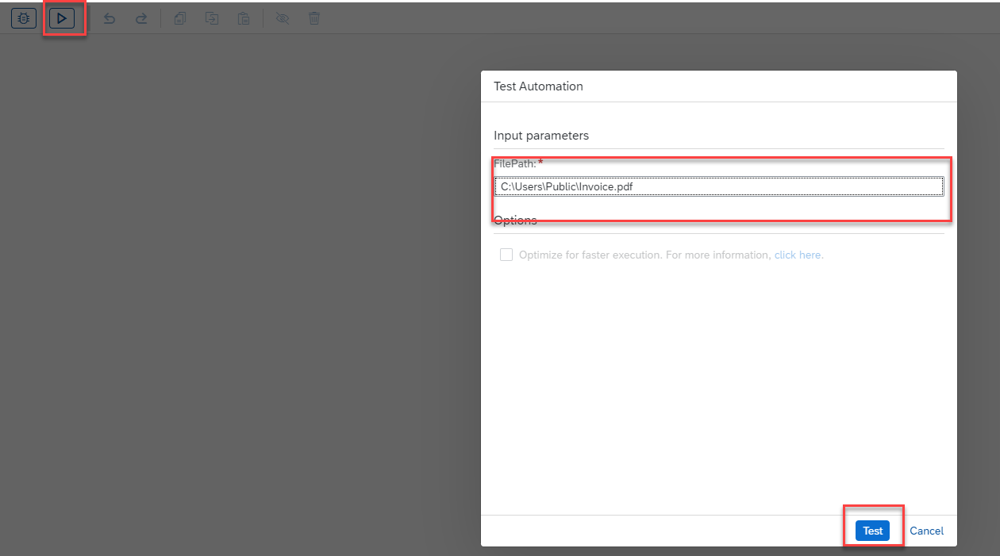

2. The automation opens the Invoice Document, extracts data and prints the details i.e Document number, Gross amount and Sender name.

    <!-- border -->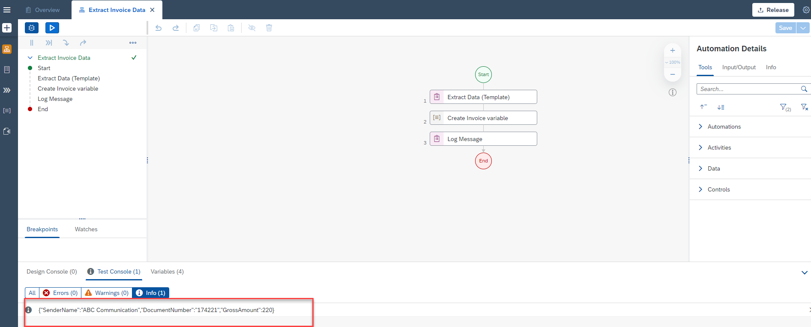

3. Your automation is built successfully.

4. Once this tutorial is completed, the process will look like this:

    <!-- border -->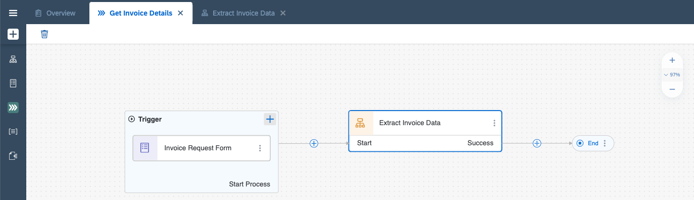

---
