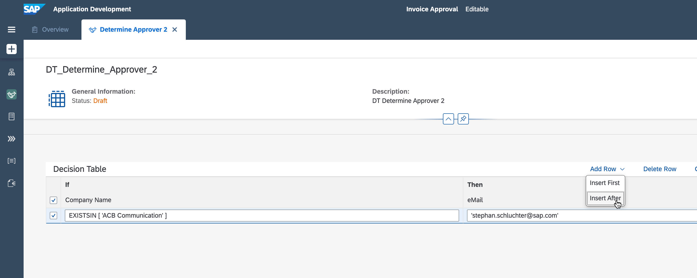

## Prerequisites
 - Access to a SAP BTP tenant with SAP Process Automation
 - You have created the process, the form to trigger the process  and the automation to extract the invoice data

## Details

With a Decision you can include several policies, guidelines, business rules and so on into your process flow.

### You will learn
  - How to create a decision
  - How to make use of data types and how to create them
  - How to maintain a decision table and include it in the process flow

---

[ACCORDION-BEGIN [Step 1: ](Add a Decision and Create a Data Type)]

You will now add a decision to the flow of your process. With this you are able to include business logic.

1. Click on **+** following the automation **Extract Invoice Data**, in the menu select **Decision** > **New Decision** to add a new one.

2. Maintain the **Name** **`Determine Approver`** and also a **Description**, the **Identifier** will be created automatically. Click **Create**.

3. The Decision **Determine Approver** is now in the process, click the three dots and select **Open Editor**.

4. You see a **Decision Diagram** showing the flow of the data within the Decision and also the **Inputs**. Change there the **Type** to **`Invoice`**.
> "Invoice" is the data type which has been created in the Automation and contains all relevant extracted data.

5. The data type for **Output** needs to be created. Therefore, select **+** on the left-hand side to create one.

6. Select **Create > Data Type**.

7. Define the **Name** **`Approver`** and also add a **Description**, again, the **Identifier** will be created automatically. Click **Create**.

8. Create a **New Field**.

9. Maintain the **Name** **`eMail`**, leave the **Type** as **`String`**.

10. The new data type containing the email address of the approver is now created, **Save** your work.

11. Go back to your Decision **Determine Approver** and select as **Output** the newly created data type **`Approver`**.

12. Open the **Default Policy** and select **>**.

[VALIDATE_6]
[ACCORDION-END]

[ACCORDION-BEGIN [Step 2: ](Create a Decision Table)]

There are many ways to express a business rule, in this case you will create  decision table to determine the approver of the invoice based on certain criteria.

1. Click **Add Decision Table**.

2. Maintain the **Name** **`DT Determine Approver`** and also the **Description**. Click **Add**.

3. Open the decision table **DT Determine Approver**.

4. To make it easier to maintain the following configuration steps, select **Enter Full Screen Mode**.

5. First, define the **Decision Table Settings**.

6. Select the box underneath **Condition Expressions** and press space bar to access the **Suggestions**. There select **Determine Approver Input**.

7. Select **Sender Name**.

8. The **Condition Expression** needs a label, maintain **Company Name**. This will be the label of the "If" column in the decision table.

9. Below, open **Result** and select the result **Determine Approver Output**. This will be the output parameter of the result of your decision table.

10. Now the settings are done, **Condition Expressions**, **Label** as well as **Result** are defined. Notice it automatically selects **eMail** as output, as you have defined it earlier after creating the new data type.
Click **Apply**.

11. Define the attributes for **Company Name** **`EXISTSIN['ABC Communication']`** and **eMail** **`<your SAP BTP user ID, e.g. diana.smith@mail.com>`**. You can also make use of the value help, by pressing the space bar before maintaining the expression in the first column.

This means, if the company name in the invoice is "ABC Communication", then the approval request will be sent to you. Otherwise...follow the next step.

12. In case the **Company Name** is defined as **`EXISTSIN['Telecommunications']`**, the approval request should be sent to **`'jane.doe@sap.com'`** or whatever recipient you might want to choose. Select the first row and **Add Row** to **Insert After**. Then maintain the row accordingly.

13. **Save** your work, your decision table is ready.

[VALIDATE_7]
[ACCORDION-END]

[ACCORDION-BEGIN [Step 3: ](Maintain Input and Output of the Decision)]

Though the Decision is ready, you need to connect it to the data flow of your process and define which data should be the input and output here. Also to get rid of this error marker.

1. Go back to the process and select the Decision.

2. Define the input, select the text field of **Document Number**.

3. Assign the related data from the **Process Content**, here select **Document Number**.

4. Repeat this also for **Gross Amount** and **Sender Name**, both are part of **Invoice Details**. The the input mapping is done.

5. Just check the **Output**, it is **eMail**, as you have defined it in the decision itself. **Save** your work.

You have now defined who should approve the invoice, based on the company name. Next you will use the outcome of the business rule, the email address, as input for the approval.

[DONE]
[ACCORDION-END]
