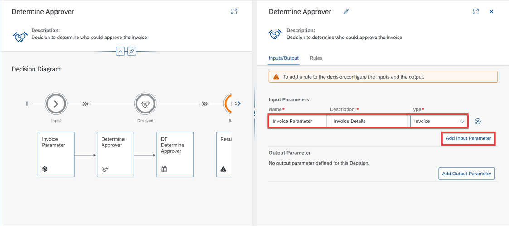
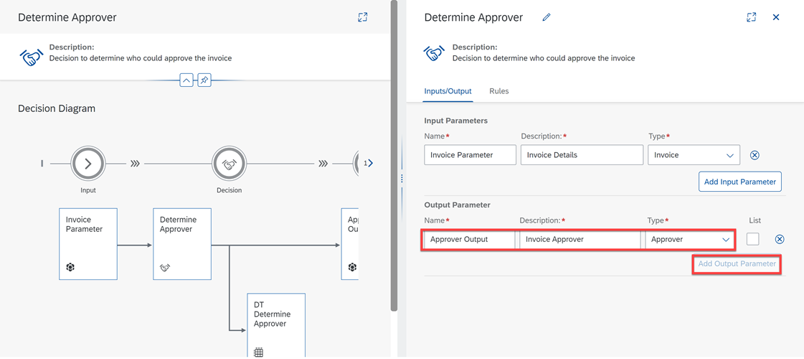
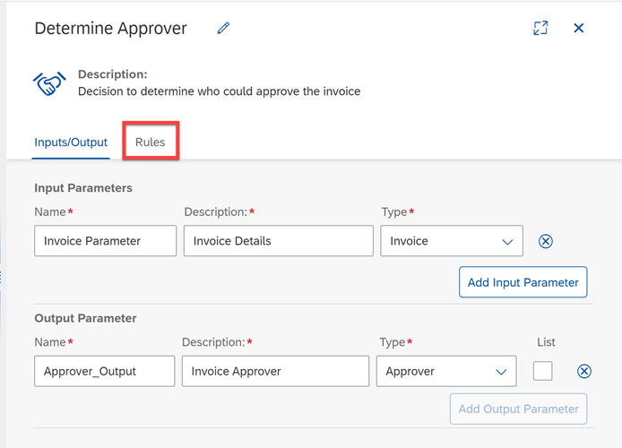
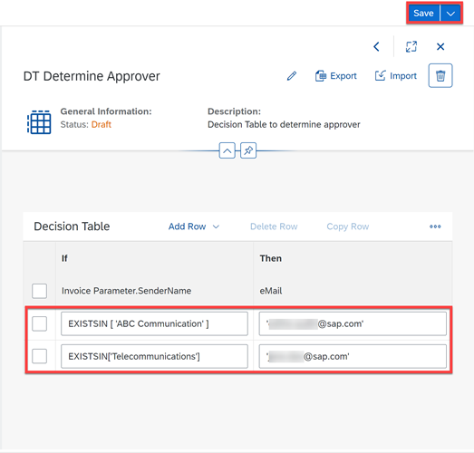

# Create a Decision for Invoice Approval Process
<!-- description --> Create a decision to determine the approver of the invoices

## Prerequisites
 - You have [created the process](spa-dox-create-process), the form to trigger the process and the [automation](spa-dox-create-automation) to extract the invoice data

## You will learn
  - How to create a decision
  - How to make use of data types and how to create them
  - How to maintain a decision table and include it in the process flow

## Intro
   With a Decision you can include several policies, guidelines, business rules and so on into your process flow.

---

### Add a decision and create a data type

You will now add a decision to the flow of your process. With this you are able to include business logic.

1. Choose **+** following the automation **Extract Invoice Data**. In the menu select **Decision**, then **New Decision** to add a new one.

    <!-- border -->

2. In the **Create Decision** window:
    - Maintain the Name: **Determine Approver**,
    - Description: **Decision to determine who could approve the invoice**,
    - Choose **Create**.

    > The Identifier will be created automatically.

    <!-- border -->

3. The **Determine Approver** Decision is now in the process. Choose the three dots and select **Open Editor**.

    <!-- border -->

4. You see a **Decision Diagram** showing the flow of the data within the Decision, and also the **Input and Output Parameters**.

5. Add an input parameter with the following information:
    - Name: **Invoice Parameter**,
    - Description: **Invoice Details**,
    - Type: **Invoice**.

    > "Invoice" is the data type which has been created in the Automation and contains all relevant extracted data.

    <!-- border -->

6. The data type for **Output** needs to be created. Therefore, select **+** on the left-hand side to create one. Select **Create** > **Data Type**.

    <!-- border -->

7. In the new pop-up window:
    - Define the Name: **Approver**,
    - Add a Description: **Including the approvers email address**,
    - Choose **Create**.

    > The Identifier will be created automatically.

    <!-- border -->

8. Create a **New Field**:
    - Maintain the **Name** `eMail`,
    - Choose the **Type** as `String`.

    <!-- border -->

9. The new data type containing the email address of the approver is now created.

10. **Save** your work.

    <!-- border -->

11. Go back to your **Determine Approver** Decision. Add an **Output Parameter**:
    - Name: **Approver Output**,
    - Description: **Invoice Approver**,
    - Select Type: the newly created data type **Approver**.

    <!-- border -->

12. **Save** your work.

### Create a decision table

There are many ways to express a business rule, in this case you will create a decision table to determine the approver of the invoice based on certain criteria.

1. Open the **Rules** tab.

    <!-- border -->

2. Choose **Add Rule**.

    <!-- border -->

3. In the Create Rule window:
    - Set the Rule Name to **DT Determine Approver**,
    - Set the Description to **Decision Table to determine approver**,
    - Choose **Next Step**.

    <!-- border -->

4. You will now configure the conditions:
    - Under **Data Types**, choose **Invoice Parameter**,
    - Select **Sender Name**,
    - Choose **Next Step** to configure the results.

    <!-- border -->

5. You will now configure the results:
    - Under **Result Vocabulary**, select **Approver Output**,
    - Select **eMail**,
    - Select **Next Step** to review.

    <!-- border -->

6. Review and choose **Create** to create the rule.

    <!-- border -->

7. You may edit the rule you just created by selecting the pencil icon.

    <!-- border -->

8. Define the attributes:
    - for **Invoice Parameter.SenderName**: `EXISTSIN['ABC Communication']`
    - for **eMail**: `<'your SAP BTP user ID'>`, e.g. `<'diana.smith@mail.com'>`.

    You can also make use of the value help, by pressing the space bar before maintaining the expression in the first column.

    This means, if the company name in the invoice is "ABC Communication", then the approval request will be sent to you. Otherwise, follow the next step.

    <!-- border -->

9. Select the first row and **Add Row** to **Insert After**. In case the **Invoice Parameter.SenderName** is defined as `EXISTSIN['Telecommunications']`, the approval request should be sent to any recipient you might want to choose. e.g. `'jane.doe@sap.com'`.

    <!-- border -->

10. **Save** your work. The decision table is ready.

    <!-- border -->

### Maintain input and output of the decision

Though the Decision is ready, you need to connect it to the data flow of your process and define which data should be the input and output here. Also, to get rid of this error marker.

1. Go back to the process and select the Decision.

    <!-- border -->

    > You might not see entries in the Input. This is due to a bug. As a workaround, click on the three-vertical-dot and remove the decision. Add the decision again in the process.

    > Please refer to [the Knowledge Base Article](https://launchpad.support.sap.com/#/notes/3207153) for the complete workaround.

2. Define the Inputs:
    - Select `DocumentNumber`: map with `DocumentNumber` from **Invoice Details**,
    - Select `GrossAmount`: map with `GrossAmount` from **Invoice Details**,
    - Select `SenderName`: map with `SenderName` from **Invoice Details**.

    The input mapping is done.

    <!-- border -->

3. Check the **Output**, it is **eMail**, as you have defined it in the decision itself.

    <!-- border -->

4. **Save** your work.

You have now defined who should approve the invoice, based on the company name. Next, you will use the outcome of the business rule, the email address, as input for the approval.
