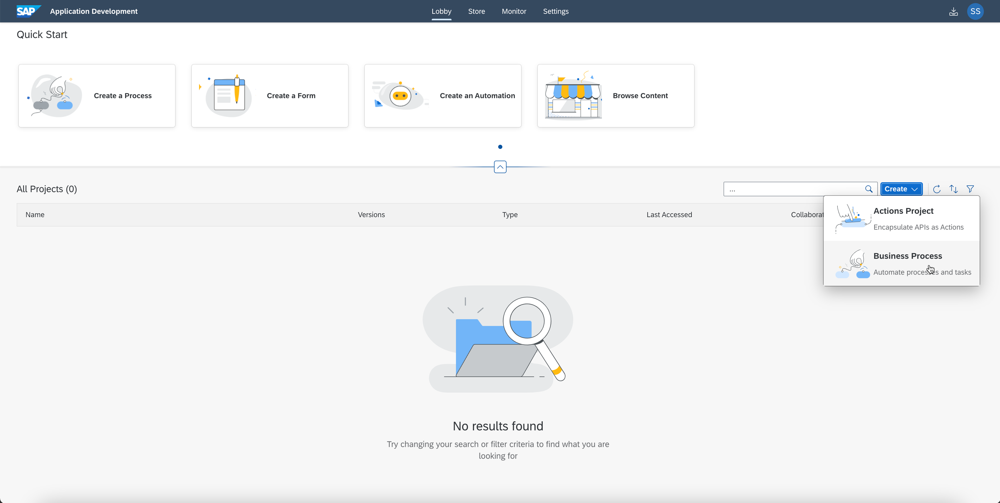
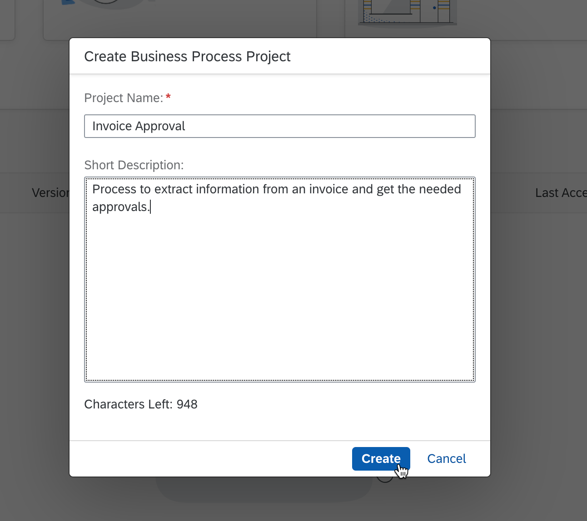
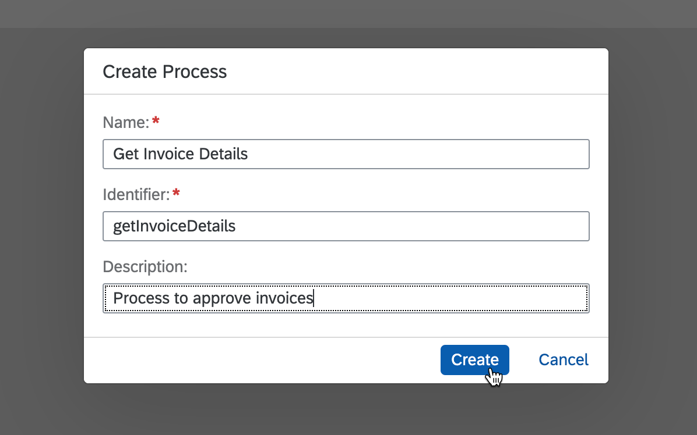
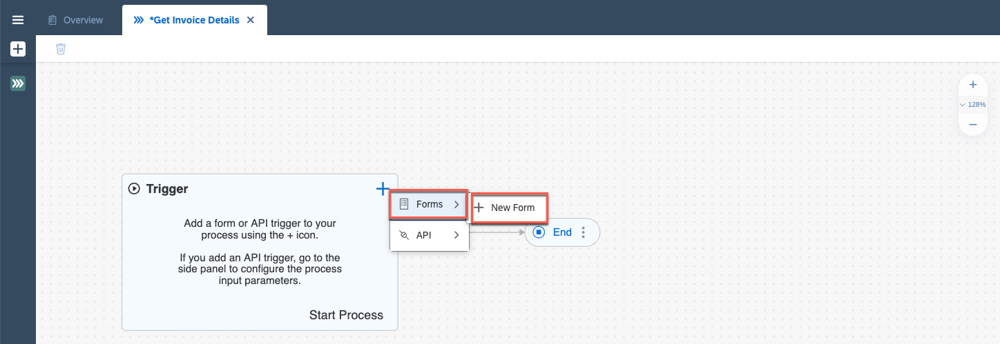
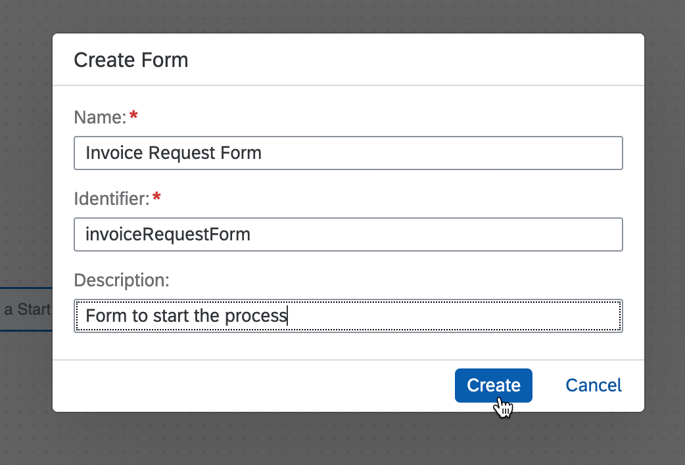
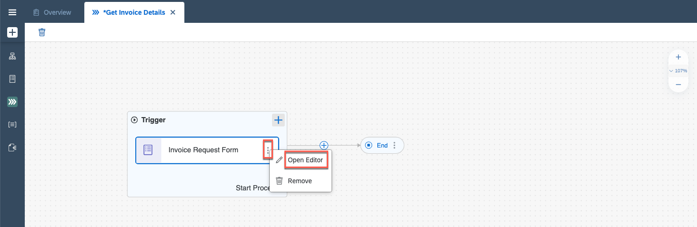
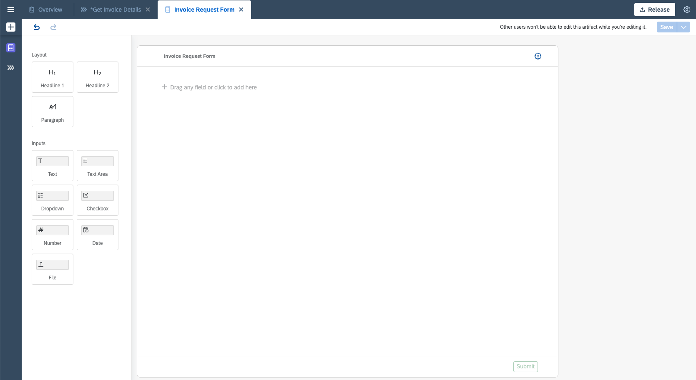
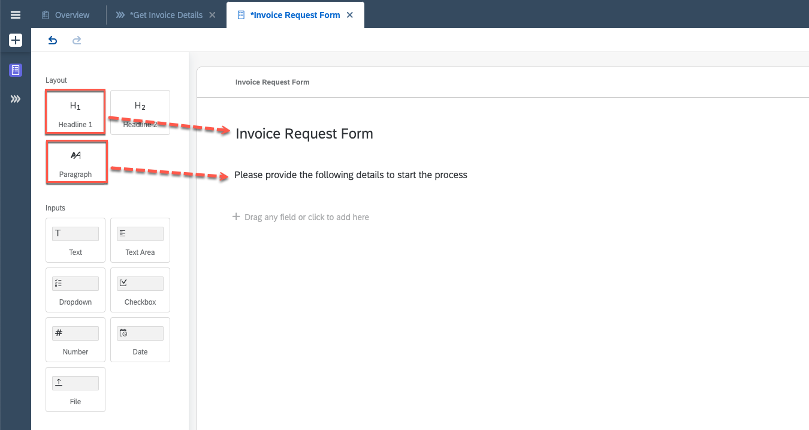
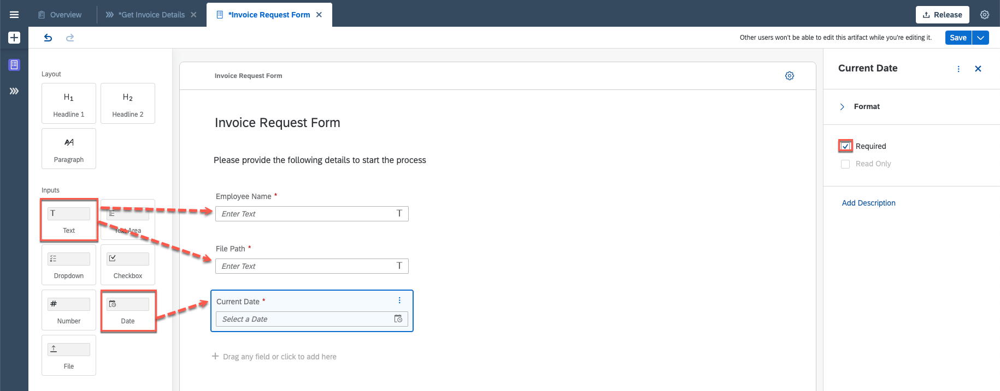
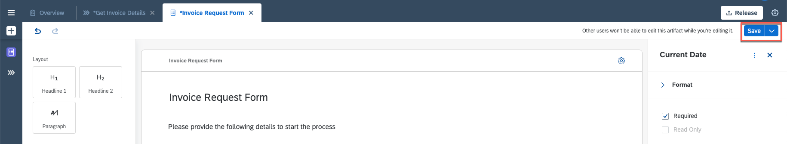

# Create an Invoice Approval Process
<!-- description --> Create the project and the first form for the Invoice Approval Process

## Prerequisites
 - An [SAP BTP Free Trial account](https://blogs.sap.com/2022/09/09/sap-process-automation-now-available-in-your-trail-account/) with the enabled the SAP Process Automation **OR**,
 - An [SAP BTP Free Tier Account](spa-subscribe-booster) with SAP Process Automation booster.

## You will learn
  - How to create a project and the related process
  - How to add a form to trigger this process

## Intro
  You work in the finance department of the company and need to regularly process incoming scanned invoices.
  This is actually causing a lot of manual effort in order to extract the data out of the pdf or image, send to the approval of the manager before the data would be actually entered into the system.
  This needs to be automated since we are talking about multiple invoices which are coming every single day. Also we need to define the approval flow depending on the specific criteria (in this tutorial series, company is considered as criteria).
  
---

### Create a Business Process Project

   The project includes all artifacts you will create during the course of these tutorials. You can share, release, rename or delete these projects.

1. Once you have entered the Lobby, choose **Create** and select **Business Process**.

    <!-- border -->

2. In the wizard enter:
    - under the **Project Name**: Invoice Approval,
    - under the **Short Description**: The process to extract information from an invoice and get the needed approvals,
    - choose **Create**.

    <!-- border -->

### Create a Process

   The process will describe the flow of the activities.

1. Within the newly created project **Invoice Approval**, select **Create** and then choose **Process**.

    <!-- border -->

2.  In the **Create Process** window enter:
    - under the **Name**: Get Invoice Details,
    - under the **Description**: Process to approve invoices.
> The identifier will be created automatically.

    <!-- border -->

    The process with a start and end event is now available for you.

### Define the Form to Start the Process

   To trigger the process, you will create a form to provide the most relevant inputs.

1. In the canvas, select **+** in the Trigger, then **Forms** and **New Form**.

    <!-- border -->

2. In the **Create Form** window enter:
    - in the **Name**: Invoice Request Form,
    - in the **Description**: Form to start the process,
    - choose **Create**.

    > The Identifier will be filled automatically.

    <!-- border -->

3. Open the form editor.

    <!-- border -->

4. In the form you have multiple Layout and Input elements.

    <!-- border -->

5. To add Layout or Inputs, drag and drop them or click on the element to enter them in the form.

6. Add Layout elements:

    |  **Layout Type**  | **Name**
    |  :------------- | :-------------
    |    Headline 1   | Invoice Request Form |
    |    Paragraph      |  Please provide the following details to start the process |

    <!-- border -->

7. Add Input elements:

    |  **Input Field Type**  | **Name** | **Settings**
    |  :------------- | :------------- | :------------
    |    Text       | Employee Name | Required
    |    Text       | File Path | Required
    |      Date     | Current Date | Required

    > Required checkbox indicates, that it is a mandatory field.

    <!-- border -->

8. **Save** the Form.

    <!-- border -->

---
