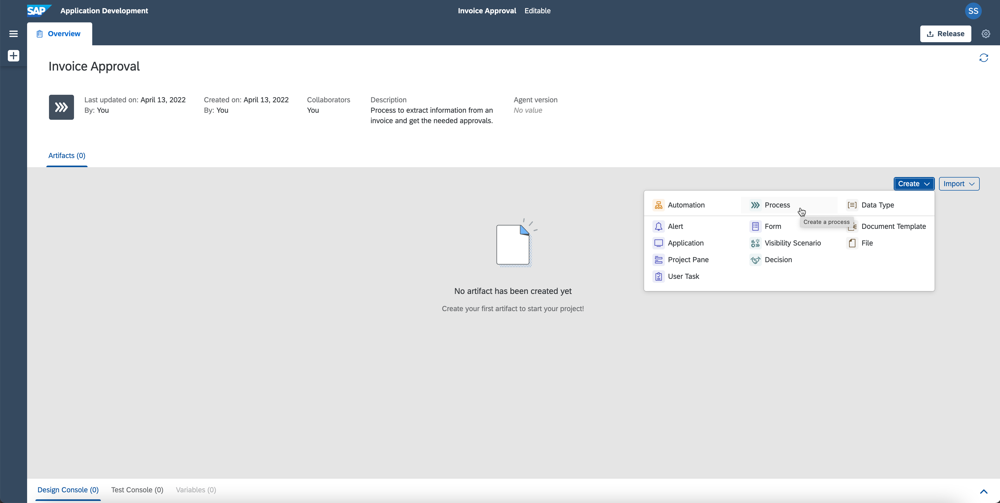
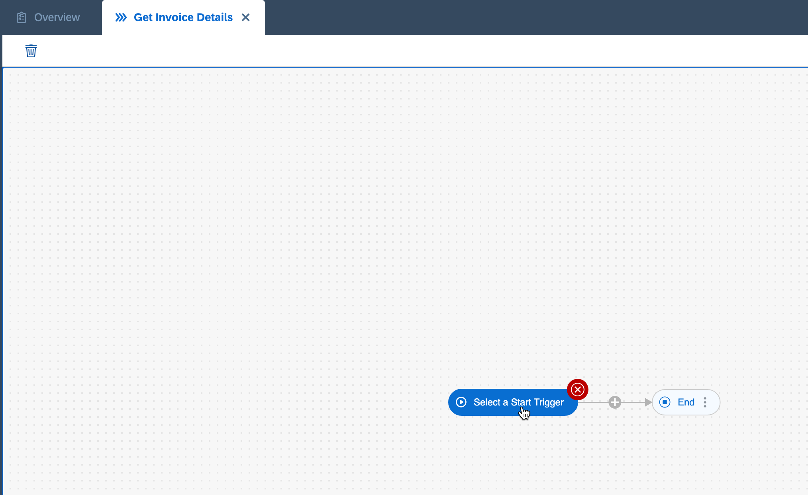
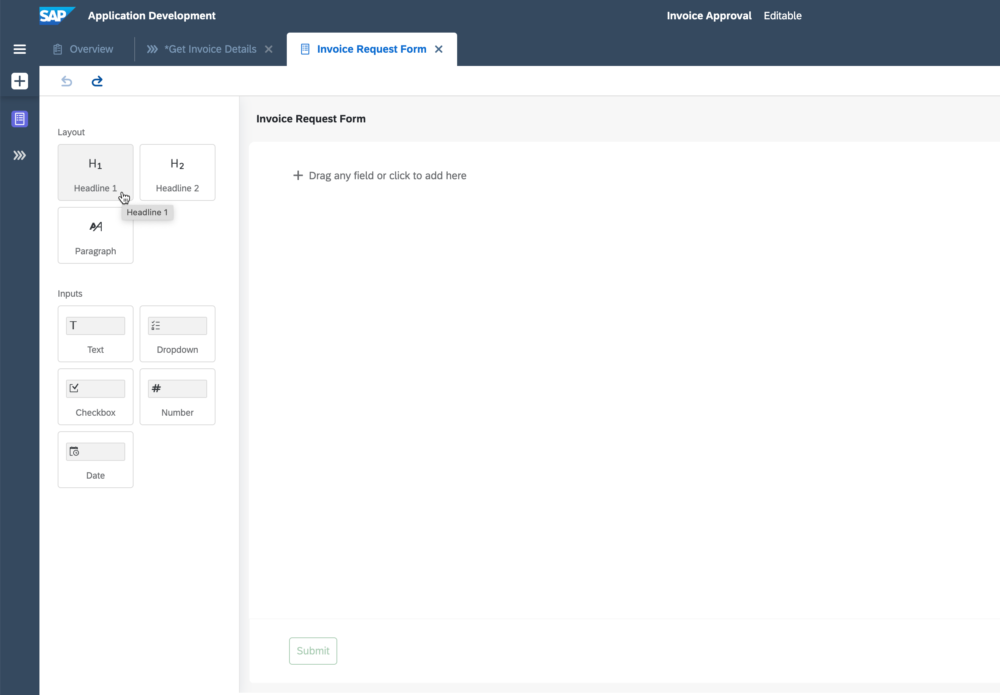
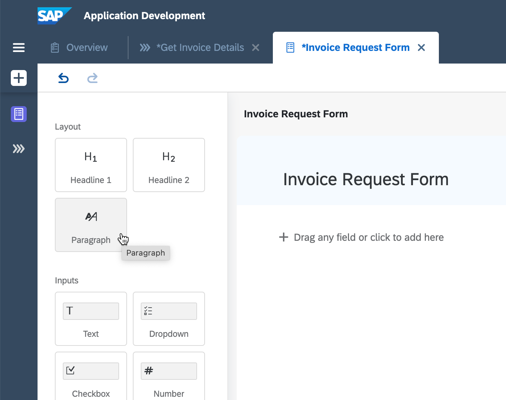
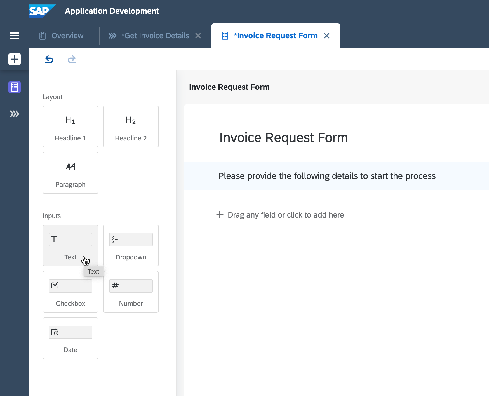
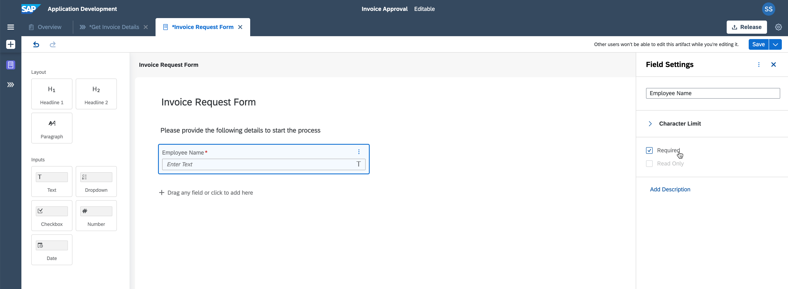
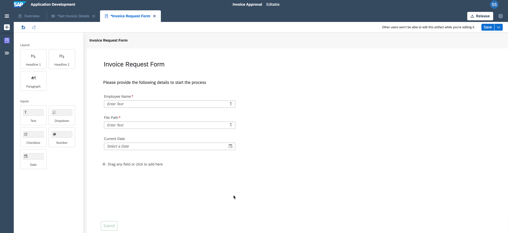

## Prerequisites
 - You will need either a trial account with the SAP Process Automation enabled (as described by this [blog](https://blogs.sap.com/2022/09/09/sap-process-automation-now-available-in-your-trail-account/)), or a regular account with the free-tier service plan for SAP Process Automation (as described in [Subscribe to SAP Process Automation Using Booster in SAP BTP Free Tier](https://developers.sap.com/tutorials/spa-subscribe-booster.html)).

## Details
You work in the finance department of the company and need to regularly process incoming scanned invoices.
This is actually causing a lot of manual effort in order to extract the data out of the pdf or image, send to the approval of the manager before the data would be actually entered into the system.
This needs to be automated since we are talking about multiple invoices which are coming every single day. Also we need to define the approval flow depending on the specific criteria (in this tutorial series, company is considered as criteria).

### You will learn
  - How to create a project and the related process
  - How to add a form to trigger this process

---

[ACCORDION-BEGIN [Step 1: ](Create a Business Process Project)]

   The project includes all artifacts you will create during the course of these tutorials. You can share, release, rename or delete these projects.

1. Once you have entered the Lobby, choose **Create** and select **Business Process**.

    !

2. In the wizard enter the **Project Name** **`Invoice Approval`** and also a **Short Description**, then choose **Create**.

    !

[VALIDATE_1]
[ACCORDION-END]

[ACCORDION-BEGIN [Step 2: ](Create a Process)]

   The process will describe the flow of the activities.

1. Within the newly created project **Invoice Approval**, select **Create** and then choose **Process**.

    !

2. Maintain the **Name** **`Get Invoice Details`** and also the **Description**. The identifier will be created automatically.

    !

    The process with a start and end event is now available for you.

[VALIDATE_2]
[ACCORDION-END]

[ACCORDION-BEGIN [Step 3: ](Define the Form to Start the Process)]

   To trigger the process, you will create a form to provide the most relevant inputs.

1. In the canvas, select **+**, then **Forms** and finally **+ New Form**.

    !

2. Provide the following information and choose **Create**:

    |  Field Name     | Value
    |  :------------- | :-------------
    |  Name          | **`Invoice Request Form`**
    |  Description    | **`Form to start the process`**

    > Note: Identifier will be filled automatically.

    !

    In the form you have multiple layout and input elements.

3. Create a headline, drag and drop **Headline 1** into the canvas.

    !

4. Give the headline a name: **`Invoice Request Form`** and add a **Paragraph**.

    !

5. Maintain the paragraph: **`Please provide the following details to start the process`** and add a **Text** field.

    !

6. Change the name of the **Text** field to **`Employee Name`** and select **Required** to indicate it is a mandatory field.

    !

7. Add two additional fields with the following details. Once done, **Save** your work.

    |  Input Field Type  | Name | Settings
    |  :------------- | :------------- | :------------
    |    Text       |**`File Path`**| **Required**
    |      Date      |  **`Current Date`** | **Required**

    !

[VALIDATE_3]
[ACCORDION-END]

---
