# Release, Deploy and Run the Process
<!-- description --> Release, deploy and run the Process to work on Tasks and monitor the Process

## Prerequisites
-  Complete creating the E2E process by creating  the [trigger](spa-dox-create-process), the [automation](spa-dox-create-automation), the [decision](spa-dox-create-decision) and [forms](spa-dox-forms)
- [Agent Management settings to execute the process with an automation](spa-run-agent-settings)

## You will learn
  - How to release, deploy and run the Process
  - How to work on the Tasks
  - How to monitor the Process

## Intro
  Till now, you have developed a Business Process where you will start with a form to enter your name as the processor and the file path where the invoice is stored. Then you would need to upload and annotate the invoice in order to get the data from the relevant fields by the bot: company name, invoice amount and document number. Bot will extract this data. After this you need to decide, who would be the approver (so you need to enter your email). Then you need to build the approval form to review the submitted data and approve it for further processing.

---

### Release Business Process Project

   Before you run the process, ensure that the process is saved and that there are no errors showing in the Design Console.
   To run the process, you must first release and then deploy the Business Process project. Releasing a project creates a version or snapshot of the changes.

1. In the Process Builder, choose **Release**.

    <!-- border -->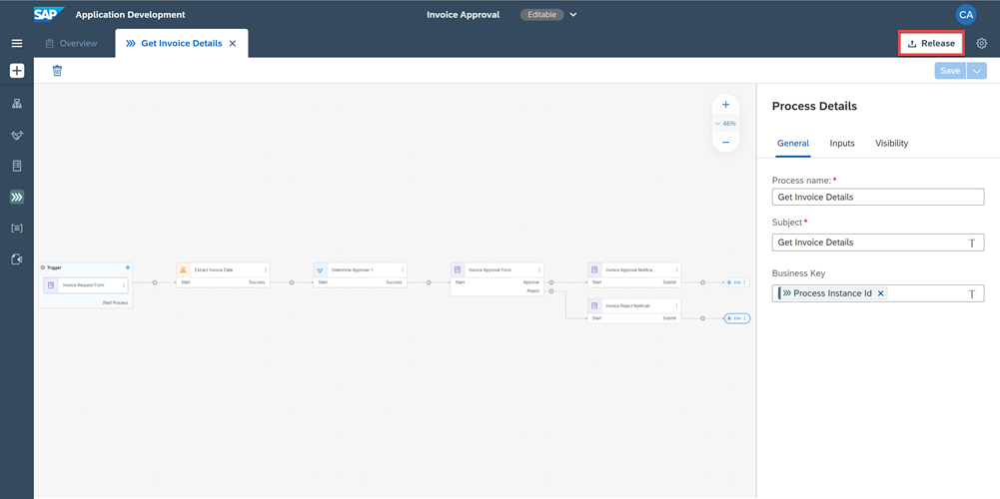

2. Add a **Version Comment** if needed and choose **Release**.

    <!-- border -->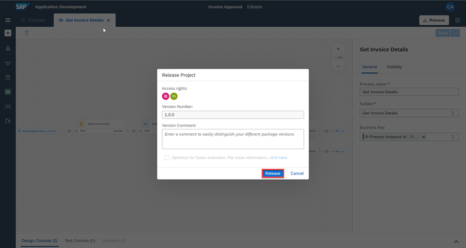

3. If it is an additional version, choose the type of version, add a **Version Comment** if needed and choose **Release**.

    <!-- border -->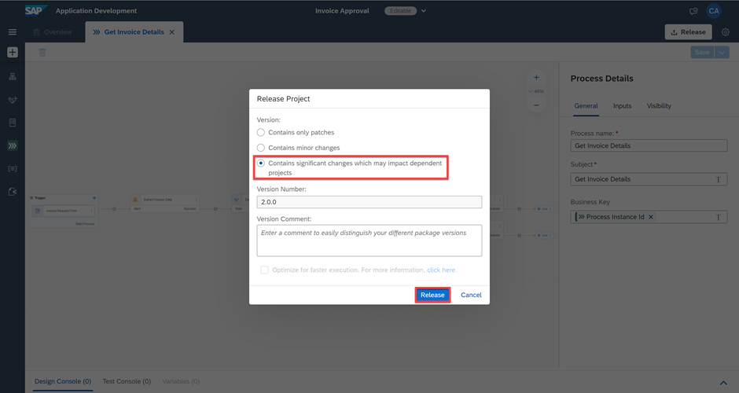

    > Every time you release, a new version will be created. Versions are incremented automatically based on how you want to store the changes in the repository (that is as major or minor updates or as a patch). Versions use an x.y.z format where x is a major version number, y is minor, and z is the patch number. For instance, if you are releasing your process project for the first time, then the version will start with 1.0.0. The next time you release there will be options to choose from – that is, if the new version is a major, minor, or patch update; version numbers will be automatically updated.

4. The project released successfully and is ready to be deployed.

    > If needed, you can refer to the [Documentation](https://help.sap.com/docs/PROCESS_AUTOMATION/a331c4ef0a9d48a89c779fd449c022e7/bcb638ecb98d4e1db8267ecccd8ffdf3.html?version=Cloud).

    <!-- border -->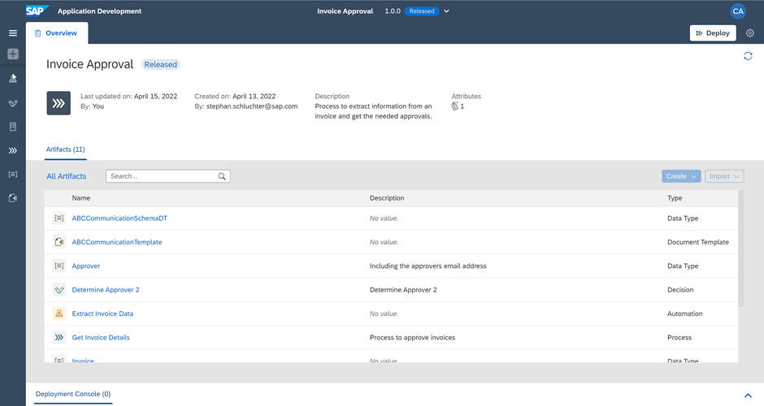

### Deploy the Released Process

    You can deploy Business Process projects from each released version of the project in the Process Builder or through the Lobby. Deploying the project makes it available for others to use it. Bare in mind that you can only deploy a released version of the project.

1. From the released version of the Business Process project in the Process Builder, choose **Deploy**.

    <!-- border -->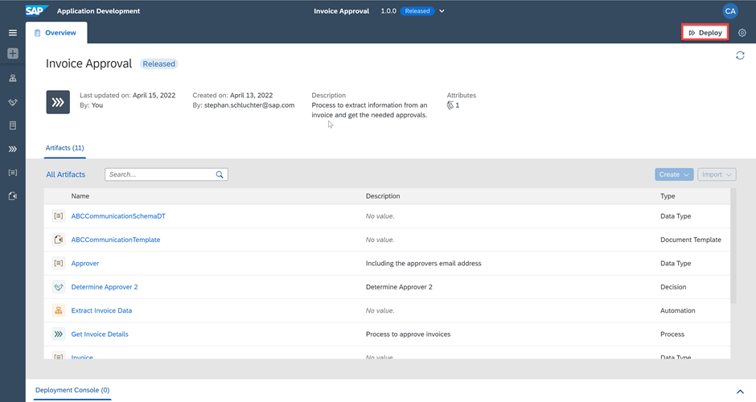

2. In this case there are no **Variables** to set.

    > Variables allow you to reuse certain information for a given Business Process project deployment. You use variables to pass parameters to automations. You can create variables in the Process Builder for which you can later set values when deploying the Business Process project.

3. Choose **Confirm**.

    <!-- border -->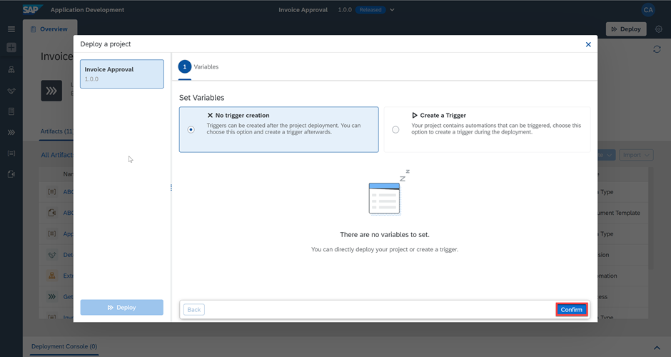

3. Choose **Deploy**.

    <!-- border -->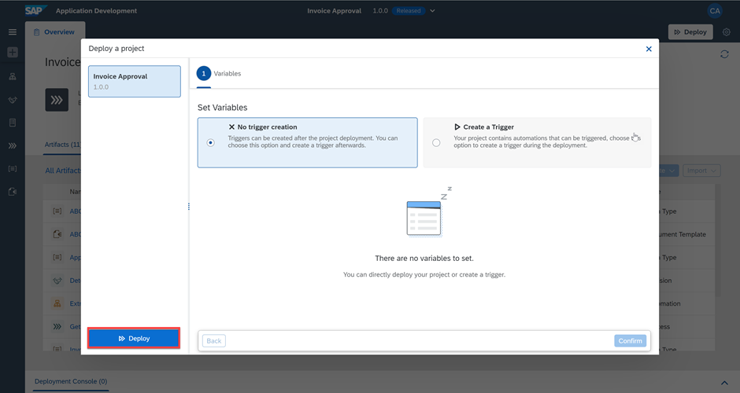

    To Deploy will take a couple of seconds/minutes depending upon how big your project is and how many different skills it has. Any errors during the deployment will be shown in the Design Console.

4. The project deployed successfully and is now ready for running and monitoring.

    <!-- border -->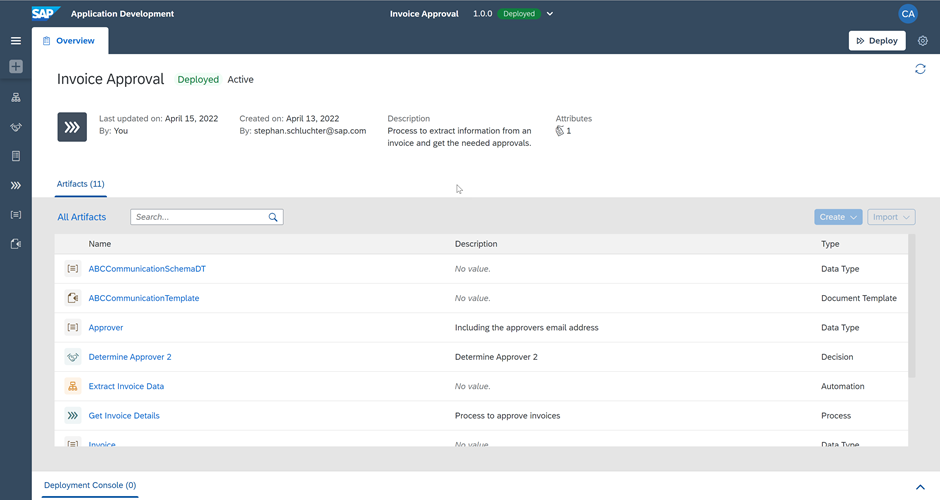

    Once the deployment is successful, you will see a changed status. You can also see all your deployed and/or released project versions from the project status list next to the project name.

    <!-- border -->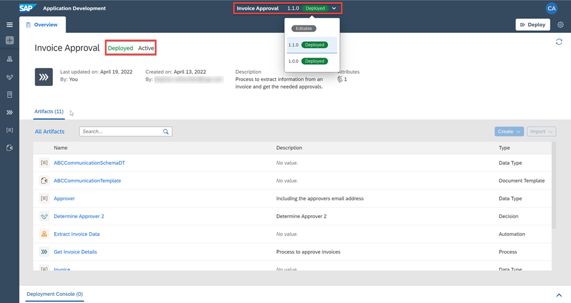

    > You cannot edit released or deployed projects. To continue working on your project, you need to select the Editable option from the list of released versions.

### Run the Business Process

   Now that you have successfully deployed your project, it is time to run the process and see the results.

1. From the deployed version of the Business Process project in the Process Builder, open the process **Get Invoice Details**.

    <!-- border -->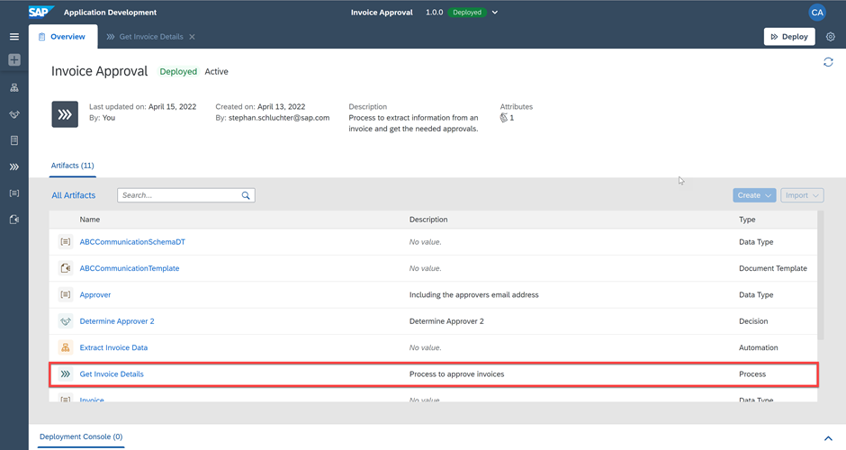

2. Select **Invoice Request Form**.

3. Choose the **Copy** icon aside the **Form Link** in the **Trigger Settings**.

    <!-- border -->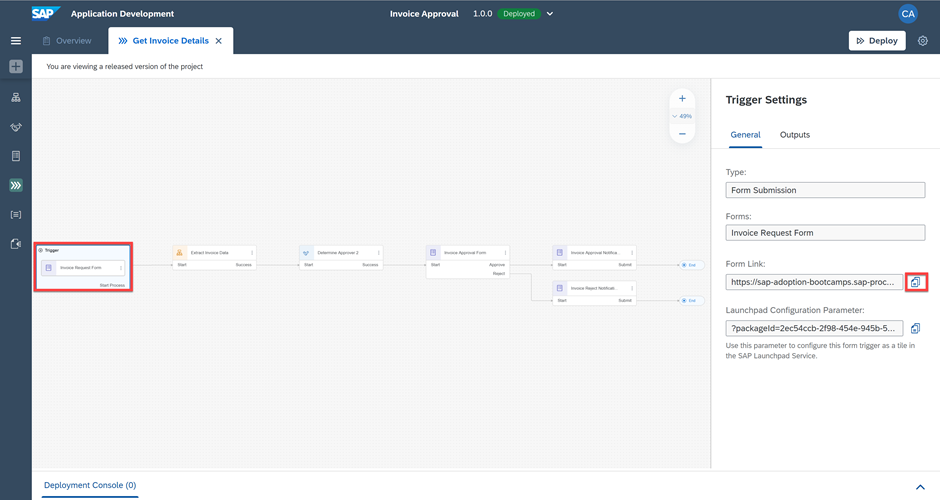

3. Open the Form pasting the **Form Link** in a browser window.

    <!-- border -->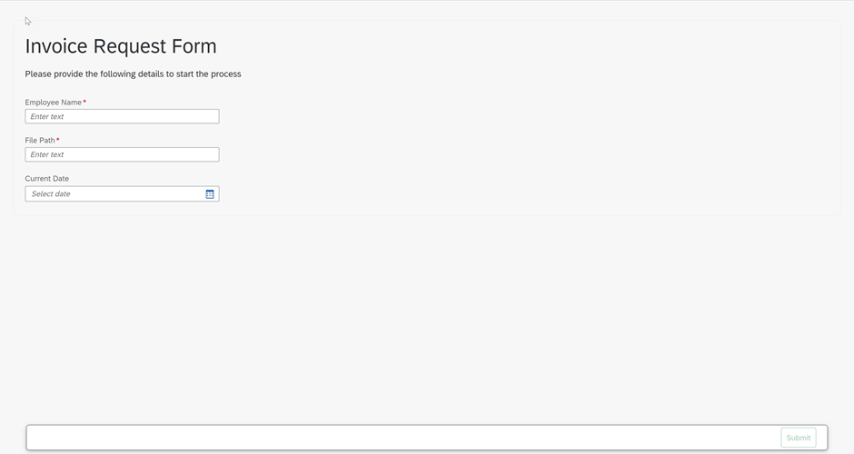

4. Fill the **Invoice Request Form** and choose **Submit**.

    > Do not enter any random value or else the Automation will not give any results.

    <!-- border -->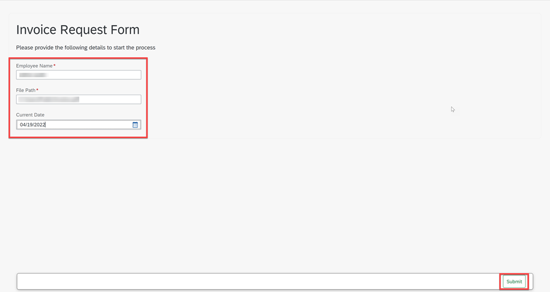

5. The process is triggered. You can now work on the tasks and monitor the process.

    <!-- border -->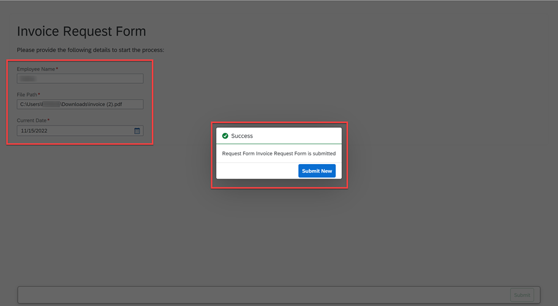

### Work on the Tasks

1. Start in the **Lobby** and open the **My Inbox** application by selecting the button  at the top right corner.

    <!-- border -->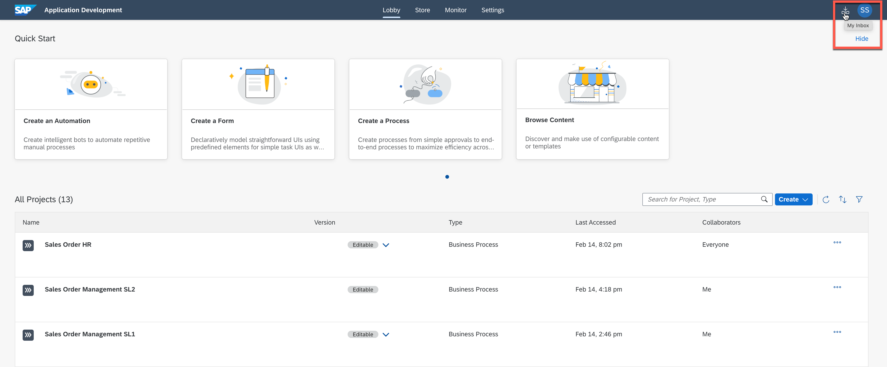

2. After opening the **My Inbox** application, you will see on the left-hand side all the tasks listed. Select the task with the invoice number with which you triggered the process.

    <!-- border -->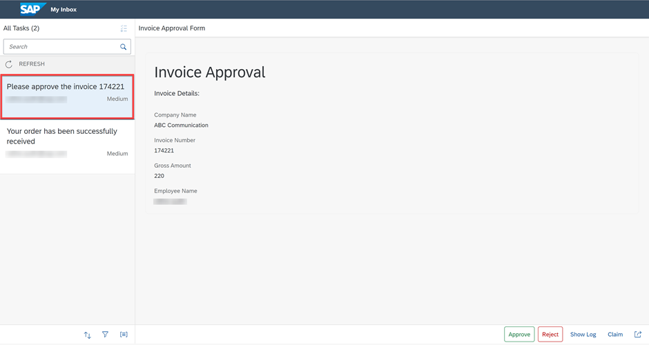

3. Move on with one of the actions:

    <!-- border -->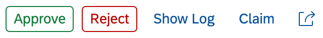

      - **Approve**, **Reject**, **Show Log** (to see what has been done so far),
      - **Claim** (to reserve this task for you) or
      - **Mail** (to forward this task via email).

4. You could also **sort**, **filter** or **group** the tasks at the bottom of the task list with these buttons:

    <!-- border -->

5. Depending on your selected actions and the information you have provided at the start of the process, the next task would be to **Approve** the invoice.

    <!-- border -->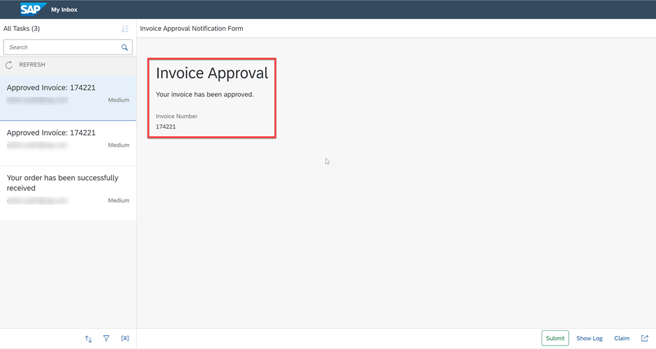

### Monitor Process and Automation

1. Navigate to the **Monitor** tab and choose **Process and Workflow Instances**.

    <!-- border -->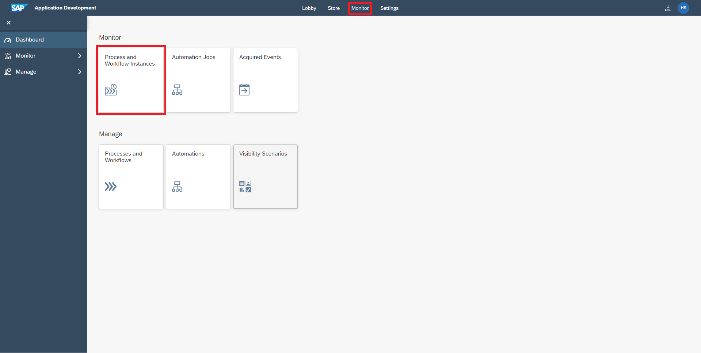

2. Choose **Get Invoice Details** instance to check the status of the **CONTEXT** and **EXECUTION LOG**.

    <!-- border -->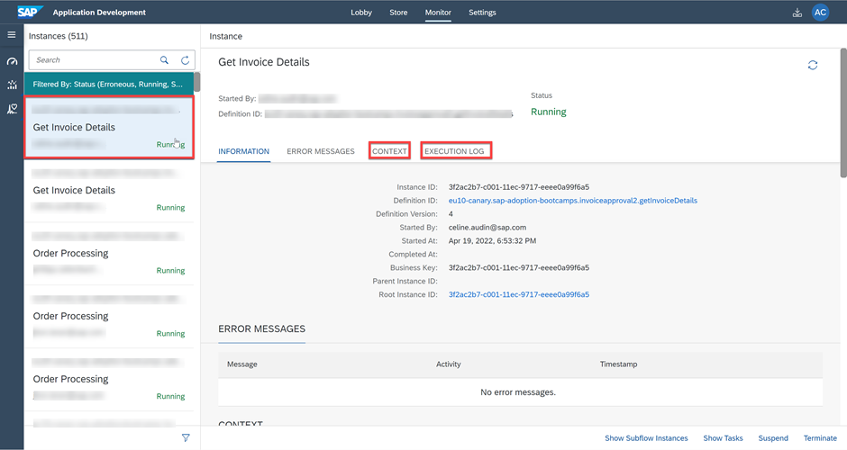

3. Go to **Automation Jobs** under **Monitor**.
   You can see the Automation ran successfully:

    <!-- border -->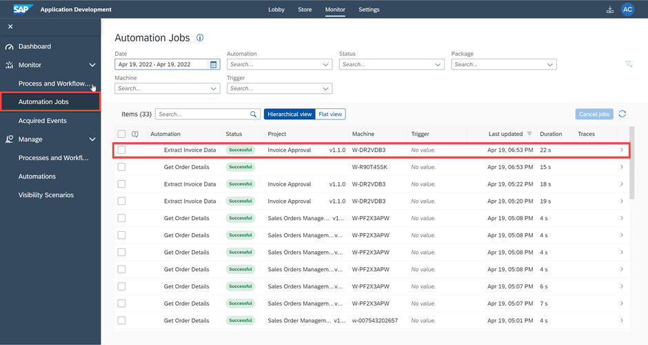

    Notice how the process instance progresses further to the approval step in the business process.

    <!-- border -->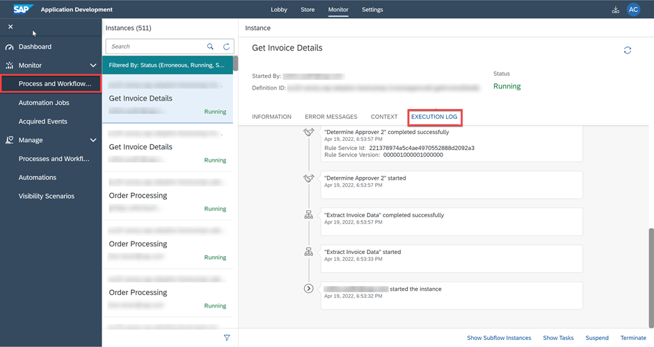

---
