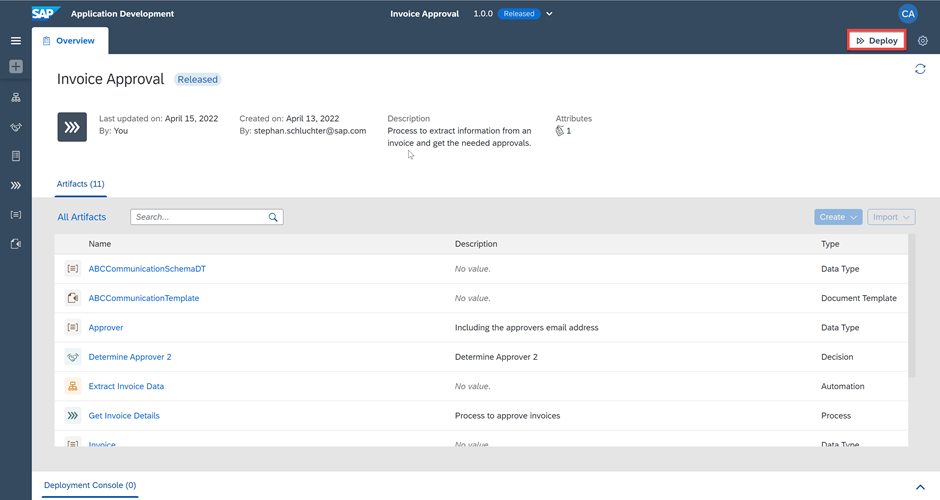
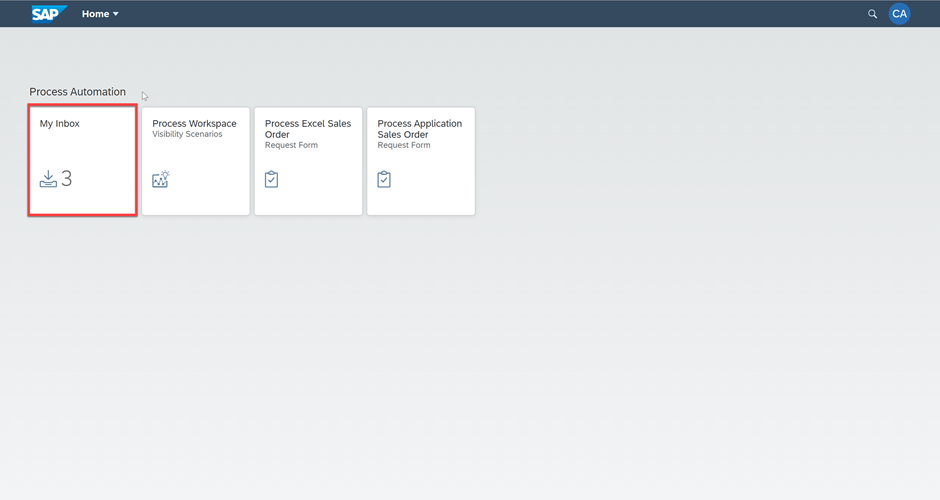
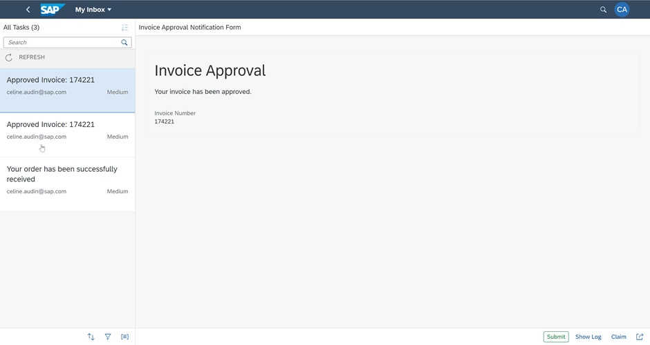

## Prerequisites
- [Agent Management settings to execute the process with an automation](spa-run-agent-settings)
- [Install and Setup the Desktop Agent](spa-setup-desktop-agent)

## Details
### You will learn
  - How to release, deploy and run the Process
  - How to work on the Tasks
  - How to monitor the Process

---

[ACCORDION-BEGIN [Step 1: ](Release Business Process Project)]

1. In the Process Builder, choose **Release**.

    !

2. Add a **Version Comment** if needed and choose **Release**.

   !

3. If it is an additional version, choose the type of version, add a **Version Comment** if needed and choose **Release**.

   !

4. The project released successfully and is ready to be deployed.

    > If needed, you can refer to the [Documentation](https://help.sap.com/viewer/DRAFT/d668fd319a104511b515d574782b497f/Dev/en-US/5ec3714e12ce487da35c009505eaf3a5.html).

   !

[DONE]
[ACCORDION-END]

[ACCORDION-BEGIN [Step 2: ](Deploy the released Process)]

  You can deploy business process projects from each released version of the project in the Process Builder or through the Lobby.

1. From the released version of the business process project in the Process Builder, choose **Deploy**.

  !

2. In this case there are no **Variables** to set.
   > ## What's going on?
   > Variables allow you to reuse certain information for a given business process project deployment. You use variables to pass parameters to automations. You can create variables in the Process Builder for which you can later set values when deploying the  business process project.

3. Choose **Confirm**.

   !

3. Choose **Deploy**.

   !

4. The project deployed successfully and is now ready for running and monitoring.

   !

[DONE]
[ACCORDION-END]

[ACCORDION-BEGIN [Step 3: ](Run the Business Process)]

From the deployed version of the Business Process Project in the Process Builder, open the process **Get Invoice Details**.

  !

2. Select **Invoice Request Form**.

3. Choose the **Copy** icon aside the **Form Link** in the **Trigger Settings**.

    !

3. Open the Form pasting the **Form Link** in a browser window.

    !

4. Fill the **Invoice Request Form** and choose **Submit**.

  > Do not enter any random value or else the Automation will not give any results.

    !

5. The process is triggered. You can now work on the tasks and monitor the process.

    !

[DONE]
[ACCORDION-END]

[ACCORDION-BEGIN [Step 4: ](Work on the Tasks)]    

1. Start in the **Lobby** and open the **My Inbox** application by selecting the button  at the top right corner.

    !

2. After opening the **My Inbox** application, you will see on the left-hand side all the tasks listed. Select the task with the invoice number with which you triggered the process.

    !

3. Move on with one of the actions:

    !

      - **Approve**, **Reject**, **Show Log** (to see what has been done so far),
      - **Claim** (to reserve this task for you) or
      - **Mail** (to forward this task via email).

4. You could also **sort**, **filter** or **group** the tasks at the bottom of the task list with these buttons:

      !

5. Depending on your selected actions and the information you have provided at the start of the process, the next task would be to **confirm** the invoice.

      !

      > You have accessed the tasks now directly via the design environment. Of course, in real life this would most likely not be the case. The tasks will be accessed, for example, via the launchpad. Please follow the next steps to do so.

[DONE]
[ACCORDION-END]

[ACCORDION-BEGIN [Step 4: ](Access the Task via the Launchpad)]    

1. Access the [launchpad via this URL](https://sap-adoption-bootcamps.launchpad.cfapps.sap.hana.ondemand.com/site?siteId=955152a5-9685-45f6-8168-05ca15b6e600#Shell-home).

2. Access and open the **My Inbox** application.

   !

3. Select **your task** and perform the actions as done before.

   !

[DONE]
[ACCORDION-END]

[ACCORDION-BEGIN [Step 4: ](Monitor Process and Automation)]

1. Navigate to the **Monitor** tab and choose **Process and Workflow Instances**.

    !

2. Choose **Get Invoice Details** instance to check the status of the **CONTEXT** and **EXECUTION LOG**.

    !

3. Go to **Automation Jobs** under **Monitor**.
   You can see the Automation ran successfully:

    !

    Notice how the process instance progresses further to the approval step in the business process.

    !

[VALIDATE_1]
[ACCORDION-END]

---
