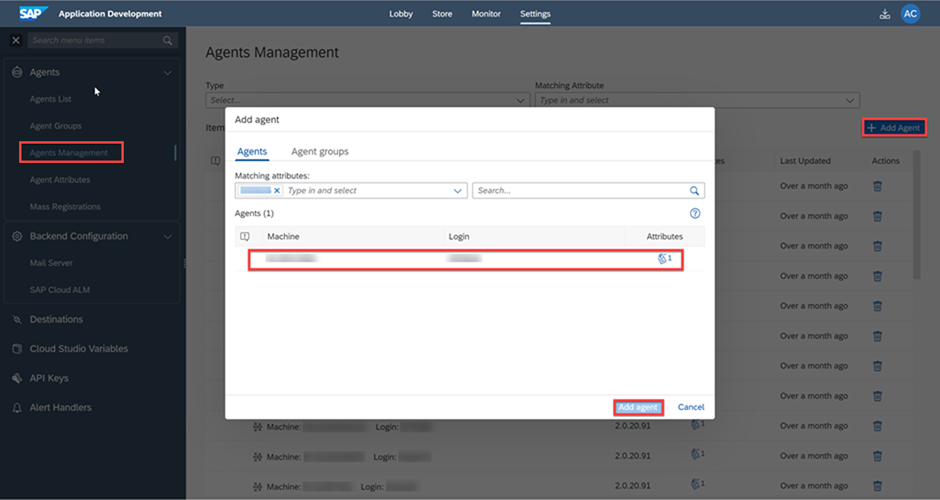
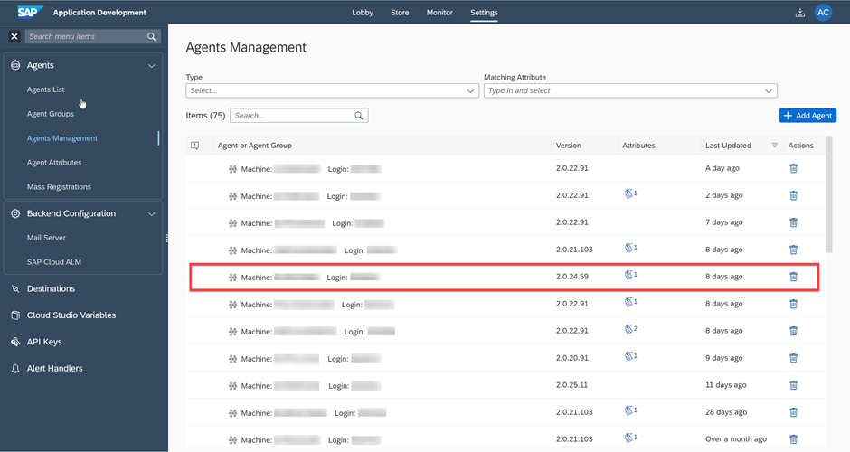
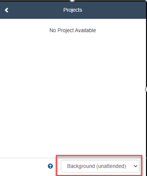

## Prerequisites
 - Prerequisite 1

## Details
### You will learn
  - How to create an Agent Attribute in the tenant.
  - How to add the attribute to your agent.
  - How to add the attribute to your project.

---

[ACCORDION-BEGIN [Step 1: ](Create an Agent Attribute in the tenant)]

Now that you have your project free of errors, ready to be released, you need to add an **Attribute** to your project. But first, you need to create an Agent Attribute.

To do so, please follow these steps:

1. Select **Settings**.

2. Choose **Agent Attributes**.

3. Choose **Create Attribute**.

4. In the **Create Agent Attribute** dialog box, please enter **My Agent Attribute** in the **Name** field.

5. From the **Type** dropdown list, select **Predefined** if you wish to add values or else leave **Free** as **Type**.

6. In the **Values** field, you may enter any value you wish (i.e. employee ID).

7. Choose **Create**.

    !  

[DONE]
[ACCORDION-END]

[ACCORDION-BEGIN [Step 2: ](Add the attribute to your agent)]

1. Choose **Agent List** to verify that your Agent is idle or ready and connected in unattended mode then click on it.

    !

2. Choose **Manage Attributes**.

3. In the **Manage Matching Attributes** dialog box, add your attribute:

      - From the drop-down list, select **My Agent Attribute**
      - Enter the value you selected previously in the **Values** field and press **ENTER**
      - Choose **Confirm**

    !

4. Choose **Agents Management** then **Add Agent**.

5. Select your agent.

6. Choose **Add agent**.

    !

7. Your agent is now added and ready to run.

    !

[DONE]
[ACCORDION-END]

[ACCORDION-BEGIN [Step 3: ](Add the attribute to your project)]

1. Navigate back to your project in the Process Builder.

2. Choose **Settings**.

3. Select **Attributes**.

4. From the dropdown list, select **My Agent Attribute**.

5. Enter your value in the **Values** field and press **ENTER**.

6. Choose **Save**.

7. Choose **Close**.   

      !

[VALIDATE_3]
[ACCORDION-END]      

[ACCORDION-BEGIN [Step 4: ](Desktop Agent in unattended mode)]

When you are running the process make sure to have the Desktop Agent in unattended mode.

!

[DONE]
[ACCORDION-END]

---
