# Run the Business Process
<!-- description --> Release, deploy and run the business process

## You will learn
  - How to release and deploy the process
  - How to run the process
  - How to monitor the process
  - How to access the tasks

---

### Release business process project

To run the process you have to first release and then deploy the business process project. 

Releasing a project creates a version or snapshot of the changes and deploying the project makes it available in runtime to be consumed. You can only deploy a released version of the project, and at a given time there can be multiple deployed versions of the same project.

1. In the Process Builder, to release a project, choose the **Release** button on the top-right corner of the screen and provide a description.

    > Version have x.y.z format where x is a major version number, y is minor and z is the patch number. Every time you release, a new version will be created. Version is incremented automatically based on how you want to store the changes in the repository like major or minor update or just as a patch.

    <!-- border -->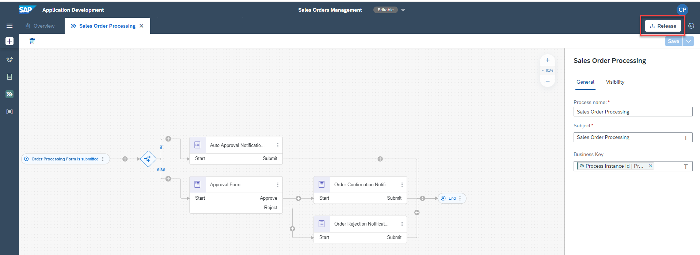

2. If you are releasing for the first time, then the version will start with 1.0.0. Next time you release there will be options to choose if it is a major, minor or patch update and version numbers will be automatically updated.

    <!-- border -->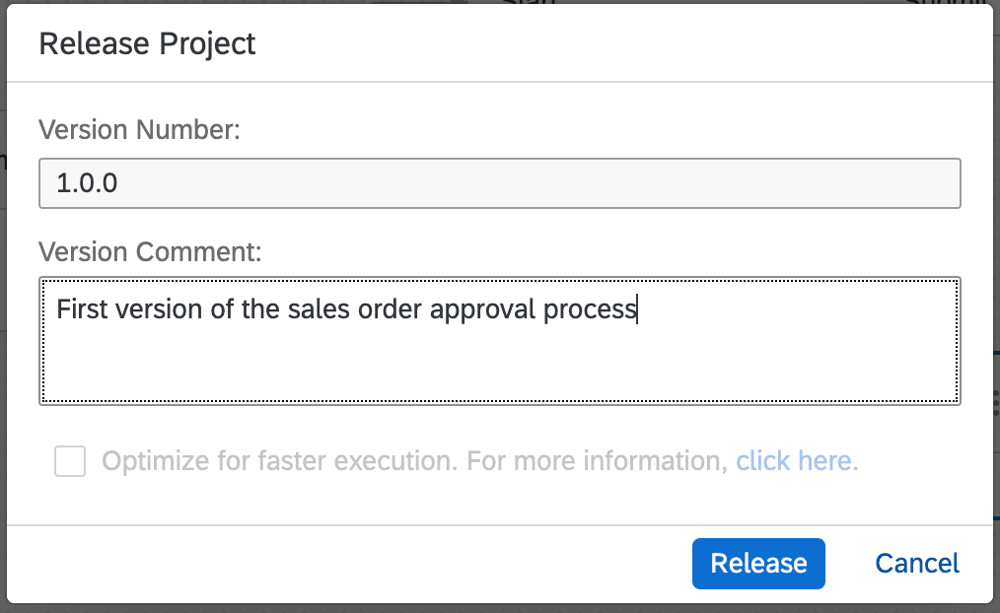

### Deploy released project

1. Once the project is released successfully, you will find a **Deploy** option on the top-right corner of the screen.

    <!-- border -->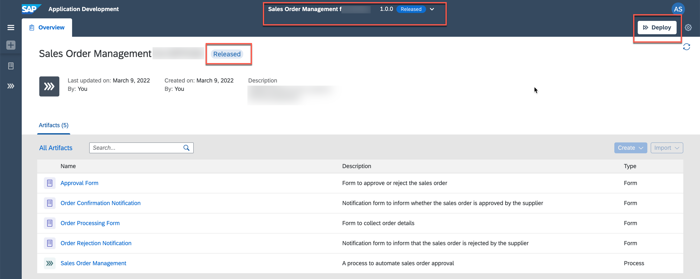

    > Deploy will take a couple of seconds/minutes depending upon how big your project is and how many different artefacts it has. Any errors during the deployment will be shown in the Design Console.

2. Once the deployment is successful, you will see a changed status. You can also see all your deployed and/or released project versions from the project status list next to the project name.

    <!-- border -->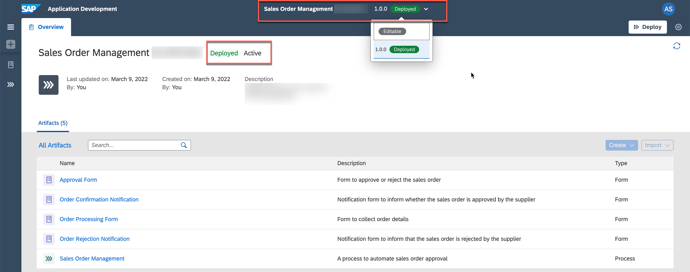

    > You cannot edit released or deployed projects. To continue working on your project, you need to select the Editable option.

### Run business process

Great, so you have successfully deployed your project as well. It is time to run the process and see the results.

1. Open the process builder of the deployed version, and choose **Order Processing Form** to get the form URL which can be directly opened from the web browser.

    <!-- border -->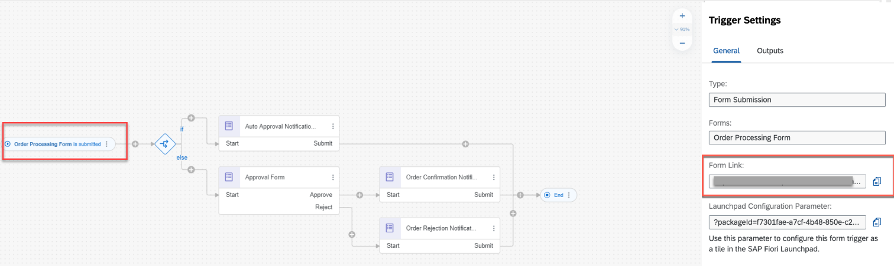

2. When you open the form in the browser, you will have all the input fields as you have defined in the process trigger form. Fill the form and choose **Submit**.

    <!-- border -->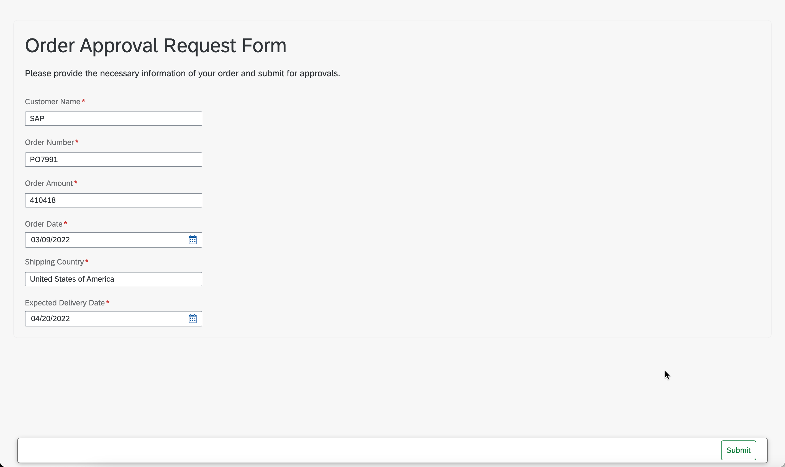

3. After you select the submit button, you will receive a notification that the form has been successfully submitted. This means that the workflow has been triggered and the approval process has been started.

    <!-- border -->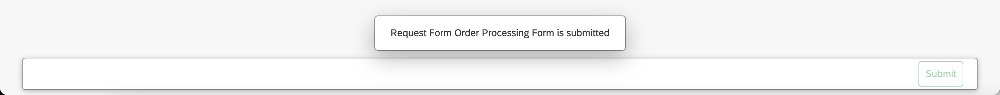

### Monitoring the process flow

Monitoring business process is one of the key aspect of the automated processes. Technical monitoring is an administrator job where a process admin proactively and consistently monitors the process performance, identifies any issues in the process and takes necessary actions to ensure business process continuity.

**SAP Process Automation** provides different applications to monitor and manage different process artefacts. These applications are available under the **Monitor** tab in the Application Development studio.

1. All deployed processes can be accessed from **Manage** > **Processes and Workflows** application. To monitor all the running instances of the process, you have to go into **Monitor** > **Process and Workflow Instances** application.

    <!-- border -->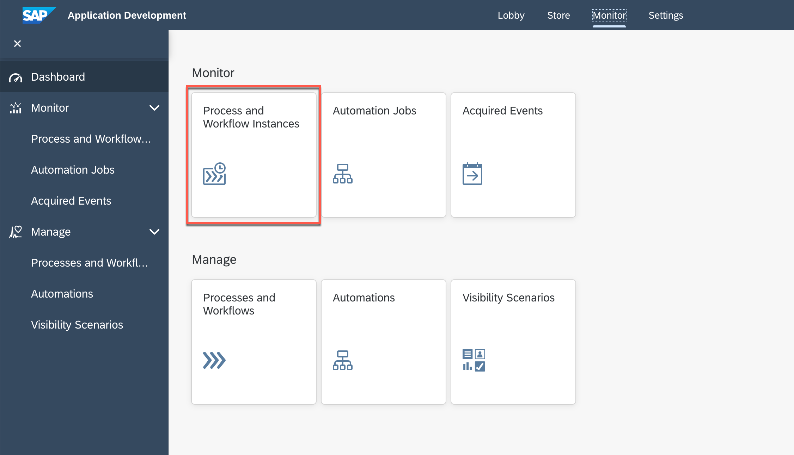

2. In there, you will see all the running, erroneous and suspended process instances. Use the filter bar to get a more customized view of the process instances based on different statutes like running, completed, suspended, terminated etc.

3. Choose your process instance that was just triggered via the start form.

    > Explore different process monitoring options. Observe the process instance information, process context which is the actual process data flowing across different activities in the process and the execution logs where you can see entire trace of how the process has been progressing with some basic runtime information of each activity.

    <!-- border -->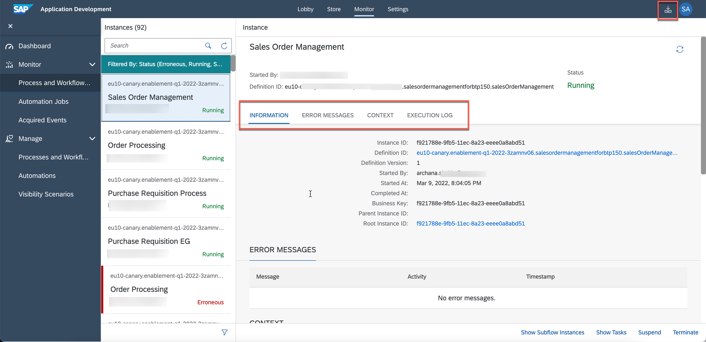

4. As you can see the process is now waiting for the task to be completed. These tasks are generated from the forms that are added in the process and can be accessed via the **My Inbox** application (top-right corner of the screen).

    Notice the **Recipients** list. This is the same as configured in the **General** section of the **Approval Form**. The task will go into the inboxes of all the recipients.

    <!-- border -->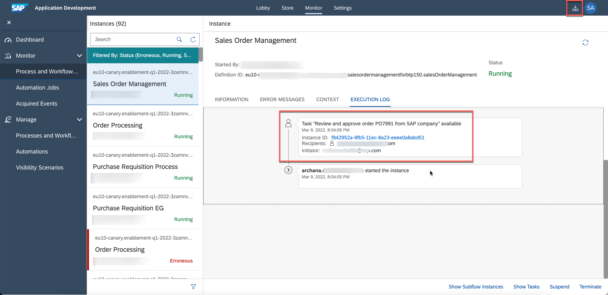

### Accessing the tasks

1. Tasks are the request for the users to participate in an approval or review process. These tasks appear in the **My Inbox** application shipped with **SAP Process Automation**. User can claim, approve and reject the task from their inbox.

    <!-- border -->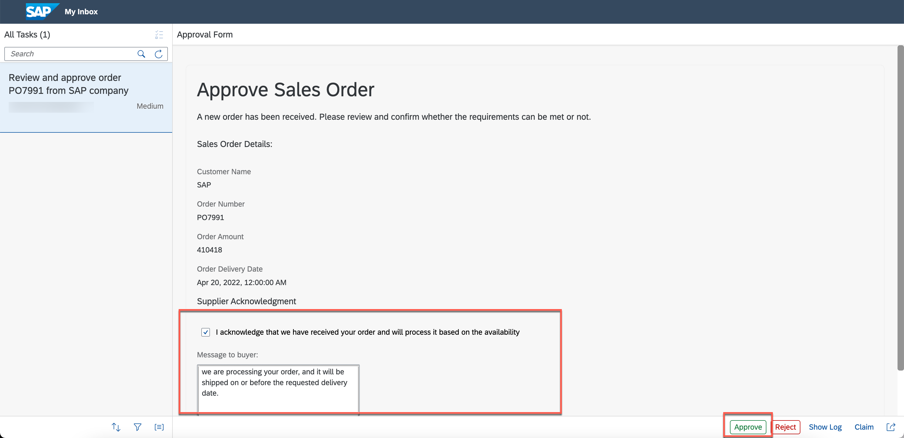

2. Once you approve or reject the approval task, refresh the inbox again to get the final notification based on action taken. Once you acknowledge the notification sent via the approval process, the process will be completed.

    <!-- border -->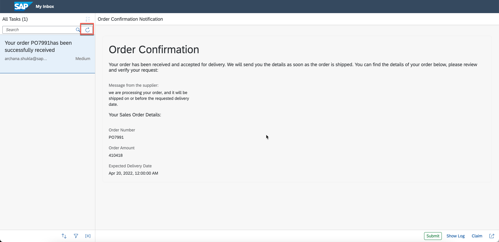

---
