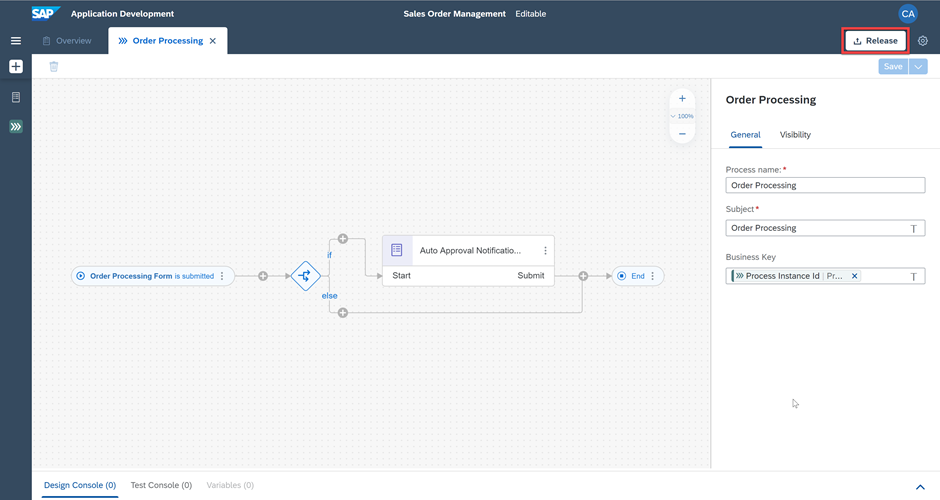
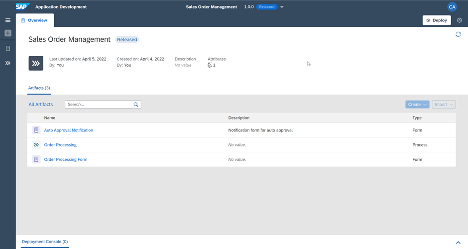
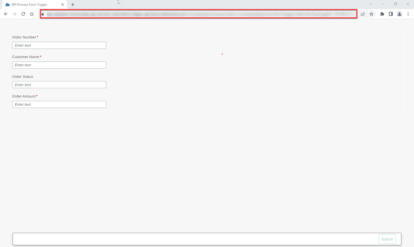
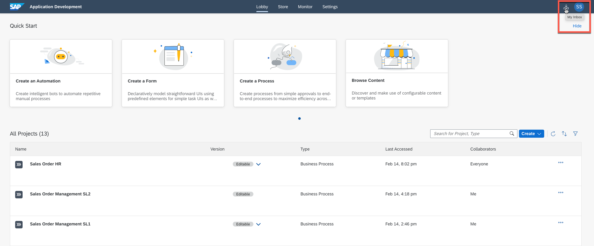
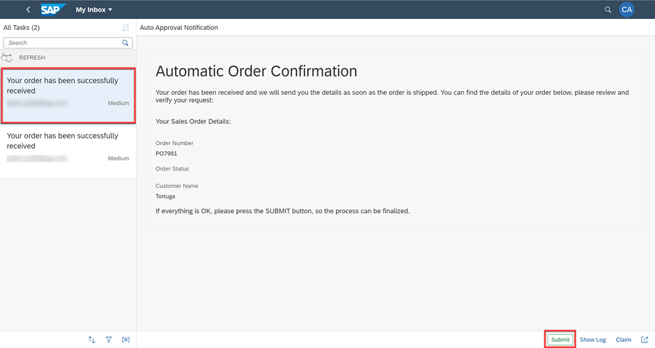

## Prerequisites
  -[Subscribe to SAP Process Automation using Booster in SAP BTP Free tier](spa-subscribe-booster)

## Details
### You will learn
  - How to release and deploy the Process
  - How to run the Process
  - How to monitor the Process

---

[ACCORDION-BEGIN [Step 1: ](Release Business Process Project)]

There are two ways to release individual projects once they are finished:

   - When you're releasing a new business process project, enter a brief summary of the changes in the release **Version Comment** section (optional) then choose **Release**.
   - When you're releasing a modified version of a business process project that is already released, in the release **Version Contains** section, select one of the following:

      - Select **Patches** to indicate bug fixes. It updates the third digit of the version number.
      - Select **Minor Changes** to indicate small modifications. It updates the second digit of the version number.
      - Select **Major Changes** to indicate important modifications potentially leading to incompatibility between versions. It updates the first digit of the version number.

1. In the Process Builder, choose **Release**.

    !

2. For the first version, add a **Version Comment** if needed and choose **Release**.

    !

2. For the additional version, choose the type of version, add a **Version** annotation if needed and select **Release**.

    !

3. The project released successfully and is ready to be deployed.

    !

[DONE]
[ACCORDION-END]

[ACCORDION-BEGIN [Step 2: ](Deploy released project)]

You can deploy business process projects from each released version of the project in the Process Builder or through the Lobby.

1. From the released version of the business process project in the Process Builder, choose **Deploy**.

    !

2. The project deployed successfully and is ready for running and monitoring.

    !

[DONE]
[ACCORDION-END]

[ACCORDION-BEGIN [Step 3: ](Run Business Process)]

1. From the deployed version of the Business Process Project in the Process Builder, open the process **Order Processing**.

    !

2. Select the Order Processing Form and choose the **Copy** icon aside the **Form Link**.

    !

3. Open the form by pasting the **Form Link** in a browser window.

    !

4. Fill the Order details and choose **Submit**.

    !

5. The process is triggered. You can now work on the tasks, monitor the process and gain insights.

    !

[DONE]
[ACCORDION-END]

[ACCORDION-BEGIN [Step 4: ](Work on the tasks)]

1. Go to the **Lobby** and open the **My Inbox** application by selecting the button  at the top right corner.

    !

2. After opening the **My Inbox** application, you see on the left-hand side all the tasks listed. **Select the task** with the sales order number with which you triggered the process.

    !

3. Move on with one of the actions:

    - **Submit**, **Show Log** (to see what has been done so far),
    - **Claim** (to reserve this task for you) or
    - **Mail** (to forward this task via email).

4. You can also **sort**, **filter** or **group** your tasks at the bottom of the task list with these buttons:
    !

5. Depending on your selected actions and the information you have provided at the start of the process, the next task could be to **Submit** the order.

[DONE]
[ACCORDION-END]

[ACCORDION-BEGIN [Step 5: ](Monitor the Process)]

1. Navigate to the **Monitor** tab and choose **Process and Workflow Instances**.

    !

2. Choose **Order Processing** instance to check the status of the **CONTEXT** and **EXECUTION LOG**.

    !

[VALIDATE_1]
[ACCORDION-END]

---
