## Details
The Desktop Agent 3 is a component of SAP Process Automation that is installed locally on user desktops. It executes automation projects that launch and run applications of various kinds, read information from screens, enter data, click options, and process data.

## Prerequisites
 - A Windows PC
 - If you are using a MAC, please install a VDI

### You will learn

  - How to install the Desktop Agent 3
  - How to register a tenant in the Desktop Agent 3

---

[ACCORDION-BEGIN [Step 1: ](About the Desktop Agent 3)]

The Desktop Agent 3 is an on-premise component of SAP Process Automation that is installed locally on user desktops. It executes automation projects that launch and run applications of various kinds, read information from screens, enter data, click options, and process data.

The very first time you launch the Desktop Agent 3 on your workstations, you will be prompted to log in. If you are unsure of your login details, please ask an administrator.

[DONE]
[ACCORDION-END]

[ACCORDION-BEGIN [Step 2: ](Download the Desktop Agent 3)]

The setup program is provided in the form of an industry standard Windows MSI installer.

1. You can install the Desktop Agent 3 from SAP Application Development. Navigate to the **Settings** on your tenant, choose **Agent Update** under **Agents**.

    >The following steps are required if you have not set up your Secret ID yet.

2. Select **Go to RBSC portal** button.

    !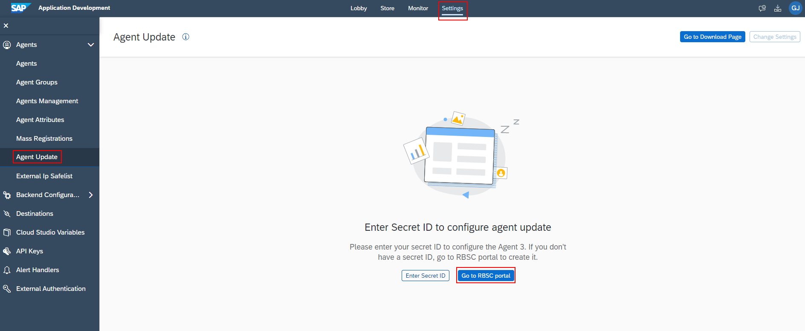

3. Select **Add user** button.

    !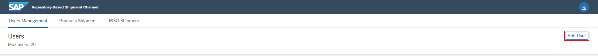

4. Set the name of the user and choose **Add user**.

    !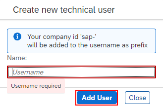

5. Confirm with **OK** button.

    !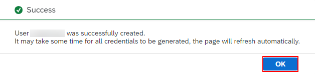

6. To generate a new Secret ID, choose **Generate** and then select **OK**. **Note the full username as it will be needed later.**

    !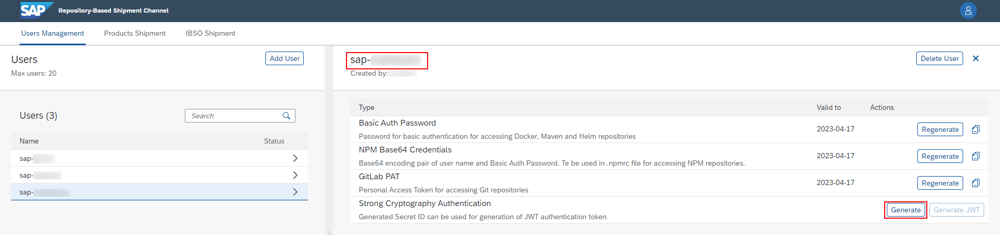

7. When the Secret ID is generated, copy its value and click **OK**.

    !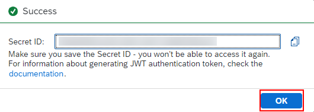

8. Go back to the SAP Application Development, and select the **Change Settings** button.

    !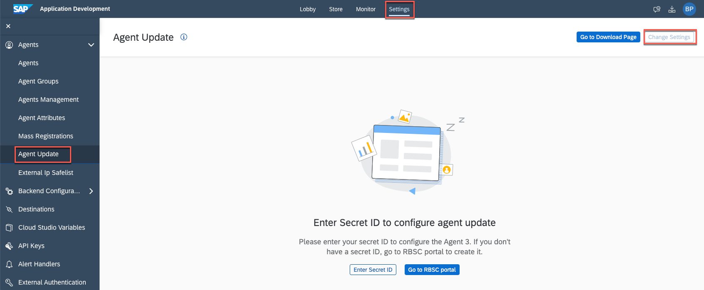

9. Set the username and the Secret ID.

    !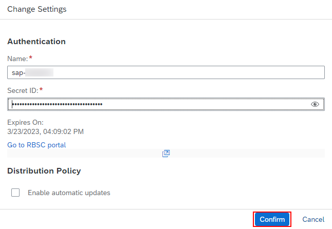

10. Activate the latest version: click the 3 dots and select **Activate**. Then click the **Go to Download Page** button.

    !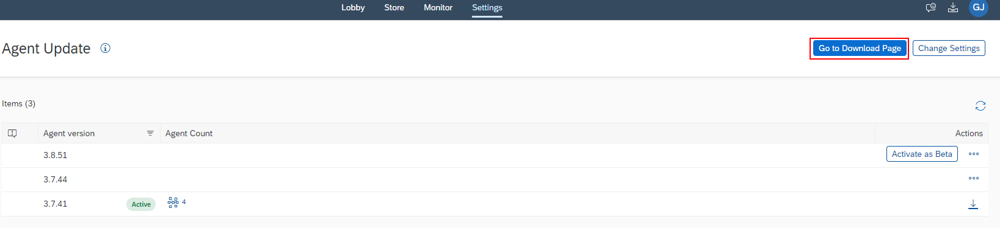

11. Download the file.

    !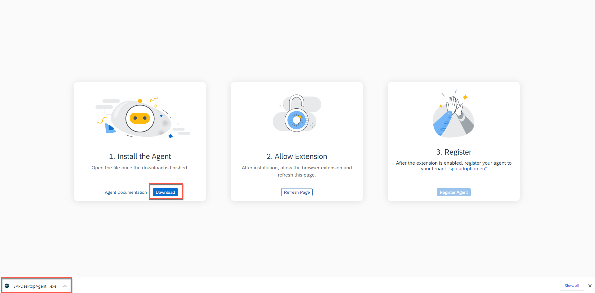

[DONE]
[ACCORDION-END]

[ACCORDION-BEGIN [Step 3: ](Install the Desktop Agent 3)]

When you install the Desktop Agent 3, it will automatically set up the SAP Process Automation web browser extension for Google Chrome and Edge.

>To prevent issues during the installation, please close all the Chrome or Edge tabs opened on your machine.

>The minimum version of the Desktop Agent supported by SAP Process Automation is **3.7.41**.

1. Open the downloaded file with **administrator rights**. Select **Next** to begin the installation process.

    !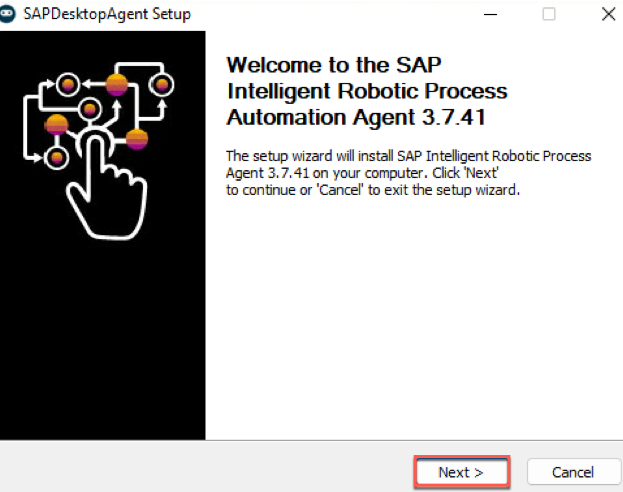

2. Make sure you install the service, and confirm.

    !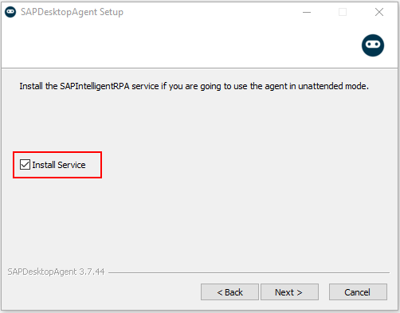

3. Wait for the installation process to complete.

    !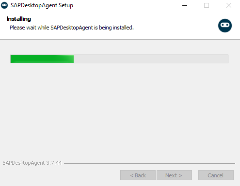

4. Once the installation has been successfully completed, choose **Finish** and launch the Desktop Agent 3.

    >A Google Chrome extension and an Edge add-on are installed when you install the Desktop Agent but you have to enable them (at least the Google Chrome extension).

6. On Google Chrome select the manage extensions under Extensions.

    !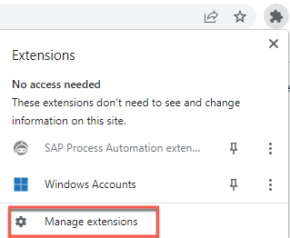

7. Enable SAP Process Automation extension.

    !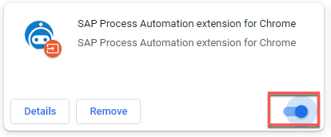

[DONE]
[ACCORDION-END]

[ACCORDION-BEGIN [Step 4: ](Register the Desktop Agent on your Tenant)]

Once the installation steps of the SAP Robotic Process Automation setup wizard are completed, you need to register your agent and connect it to a SAP Process Automation tenant in order to execute automations.

> The Agent icon will be available on your System Tray, when the Desktop Agent 3 is installed.

[OPTION BEGIN [Automatically]]

1. After Step 3 completed. Open the **Download Page**. If the **Register Agent** is enabled, refresh the page.

    !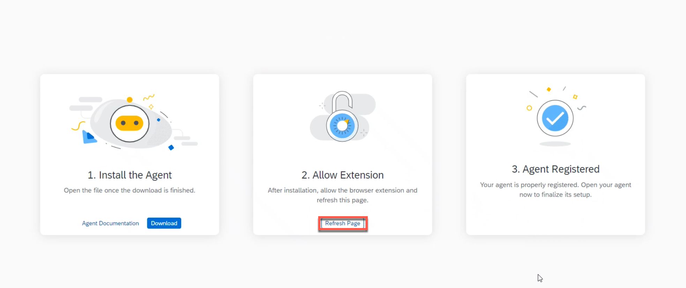

2. Once the process is completed, open the **Desktop Agent 3** and confirm the tenant configuration.

    !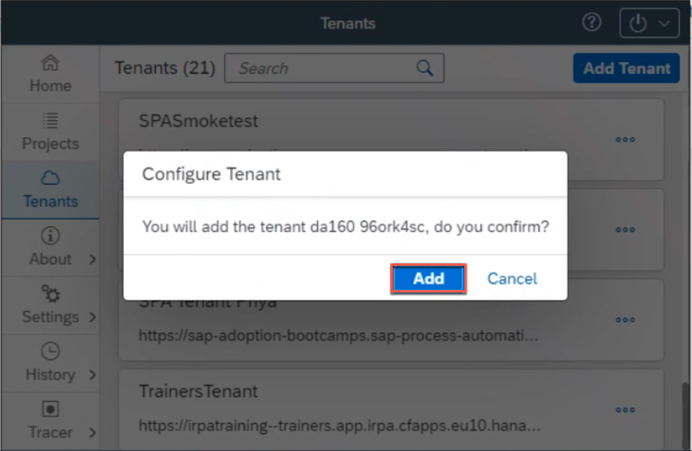

3. The tenant is active.

    !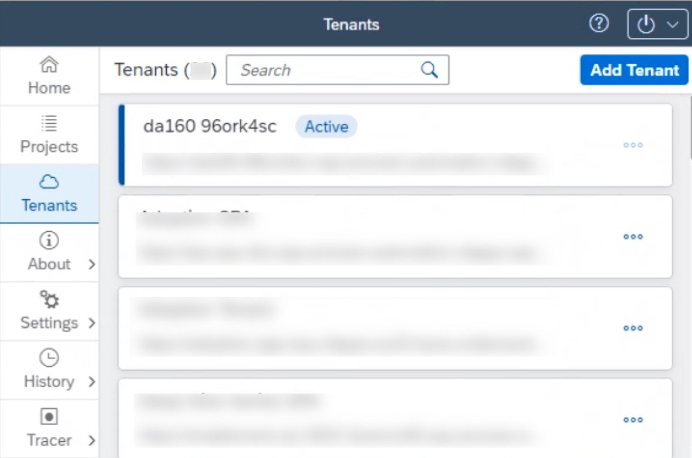

4. Once you completed the previous actions, log in to your tenant with your user name or e-mail and password.

    !

5. The Agent should be in **Idle** state, waiting to start a project. To check, go to **Settings**, and select **Agent List**.

    !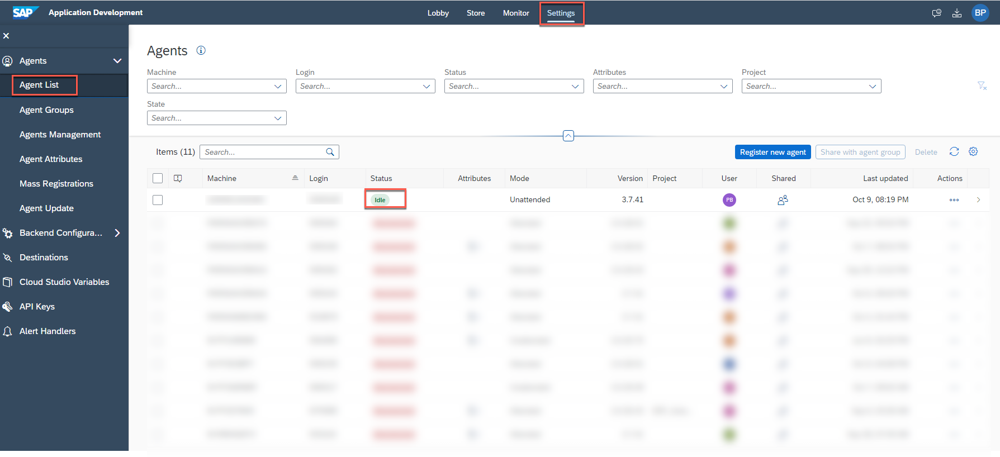

[OPTION END]

[OPTION BEGIN [Manually]]

1. Select the **Desktop Agent 3** icon.

    !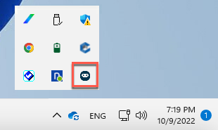

2. Choose **Tenants**, select **Add Tenant** button.

    !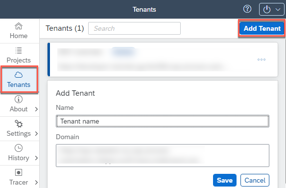

3. On the SAP Process Automation homepage, go to **Settings**, choose **Agents List** under **Agents** and select the **Register new agent** button.

    !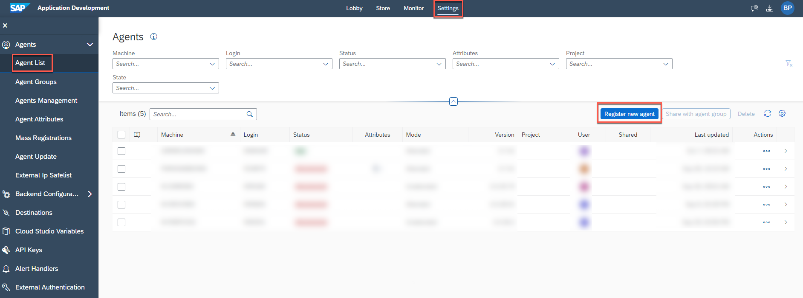

4. When the pop-up window opens, select **Copy and Close**.

    !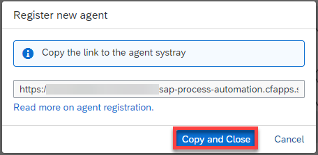

5. In **Desktop Agent 3 Tenants** window:
    - In the **Name** field type the name of the Tenant,
    - In the **Domain** field paste the URL,
    - Choose **Save**.

    !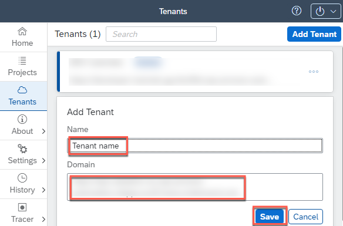

6. Select the tenant, choose **Activate** and confirm.

    !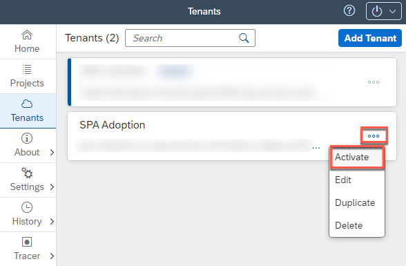

7. Once you completed the previous actions, log in to your tenant with your user name or e-mail and password.

    !

8. The Agent should be in **Idle** state, waiting to start a project. To check, go to **Settings**, and select **Agent List**.

    !

[OPTION END]

[VALIDATE_1]
[ACCORDION-END]

[ACCORDION-BEGIN [Step 5: ](Add your agent)]

1. Navigate back to the **Application Development**. Select **Settings**. Choose **Agents Management** then **Add Agent**.

    !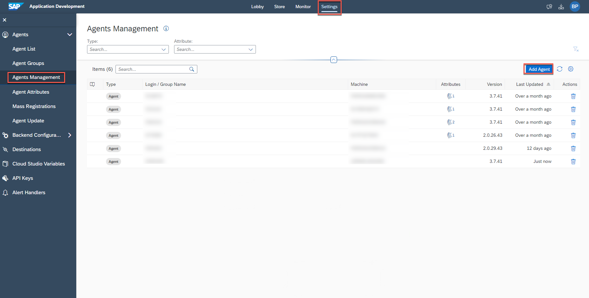

2. When the pop-up window opens, select your agent and choose **Add agent**.

    !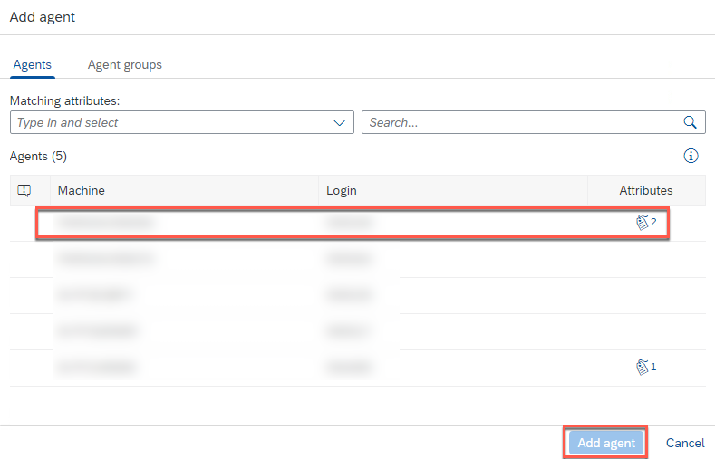

3. Your agent is now added and ready to run.

    !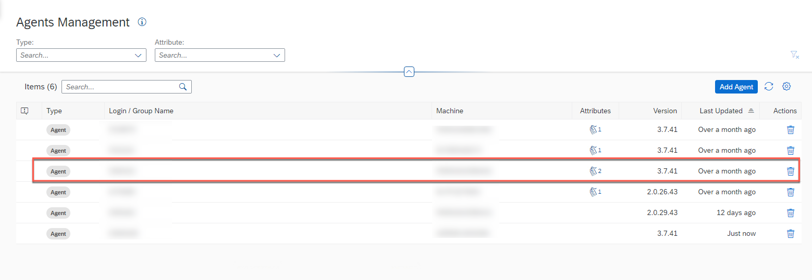

[DONE]
[ACCORDION-END]

---
