## Details
The Desktop Agent is a component of SAP Intelligent Robotic Process Automation that is installed locally on user desktops. It executes automation projects that launch and run applications of various kinds, read information from screens, enter data, click options, and process data.

## Prerequisites
 - A Windows PC
 - If you are using a MAC, please install a VDI

### You will learn

  - How to install the Desktop Agent
  - How to register a tenant in the Desktop Agent

---

[ACCORDION-BEGIN [Step 1: ](About the Desktop Agent)]

The Desktop Agent is an on-premise component of SAP Process Automation that is installed locally on user desktops. It executes automation projects that launch and run applications of various kinds, read information from screens, enter data, click options, and process data.

Projects are assigned to tenants running on a Desktop Agent. You can see what your Desktop Agent is doing at all times thanks to the convenient system tray, or `Systray`, that is always accessible while your Desktop Agent is ready or active.

When it is installed, the Desktop Agent is configured to start at Windows logon automatically. You should not change this setting because your Agent might be assigned background (unattended) jobs at any time.

The very first time you launch the Desktop Agent on your workstations, you will be prompted to log in. If you are unsure of your login details, please ask an administrator.

[DONE]
[ACCORDION-END]

[ACCORDION-BEGIN [Step 2: ](Install the Desktop Agent)]

When you install the Desktop Agent, this will automatically set up the SAP Intelligent RPA web browser extension for Google Chrome and Edge.

>To prevent issues during the installation, please close all the Chrome tabs opened on your machine. The setup program is provided in the form of an industry standard Windows MSI installer. You can download it from the SAP Software Center.

>The minimum version of the Desktop Agent supported by SAP Process automation is **2.0.20**.

1. Download the **latest version**  of the [MSI file execution](https://tools.hana.ondemand.com/#cloud).

    > MSI version will be updated for every new release. Always download the latest version.

    !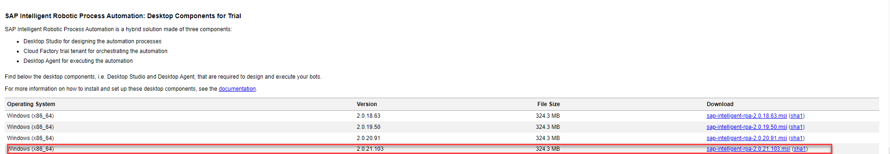

2. Select **Next** to begin the installation process.

    !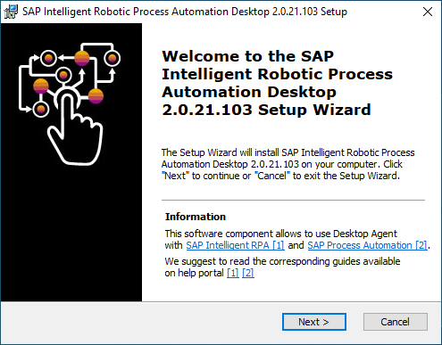

3. In the **Installation type** pop-up, select the **Desktop Agent** option.

    !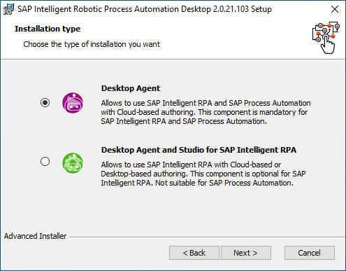

4. Optional: choose **Browse** to change the destination of the installation folder.

    !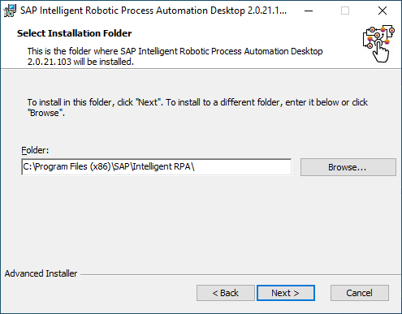

5. Select **Install** to start the installation.

    !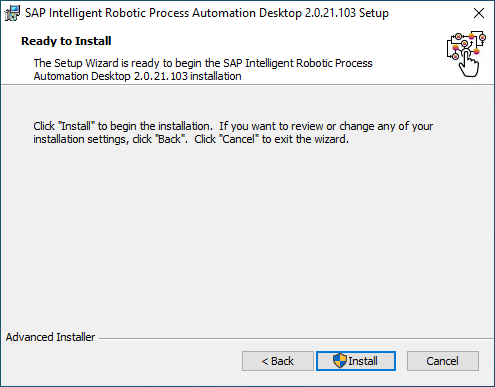

6. The installation process may take a few seconds to complete. An authorization request to bring change to the computer might appear, choose **OK** if so.

    !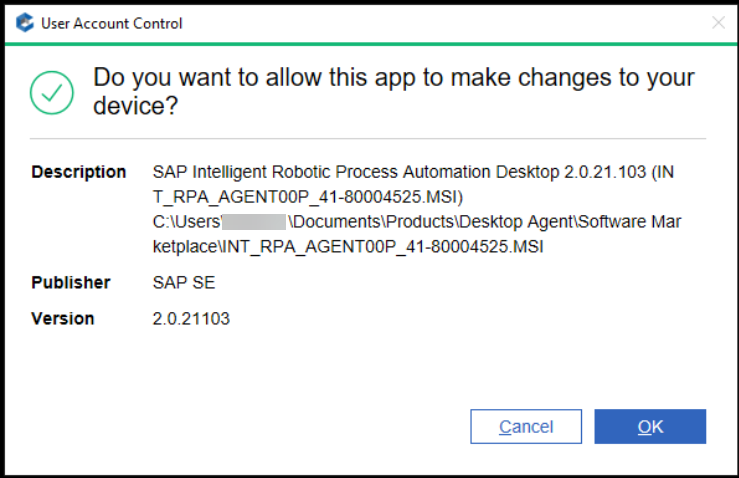

    !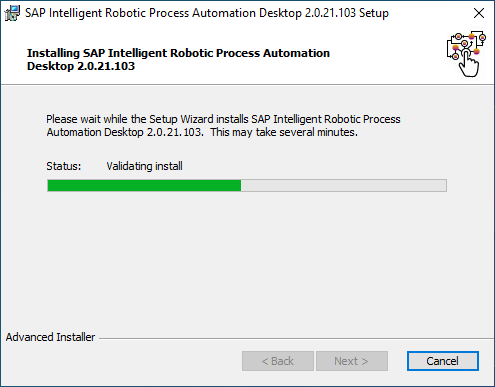

7. Once the installation has been successfully completed, choose **Finish** and launch your Desktop Agent.

    !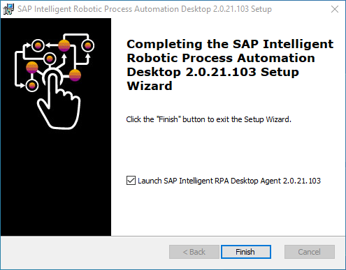

    >Microsoft Edge and Chromium are used for the rendering of the Desktop Agent. If you use Edge, the Edge 'WebView2' component is mandatory: if not already installed on your machine, please install Edge WebView2 from the Microsoft website.

    A Google Chrome extension and an Internet Explorer add-on are installed when you install the Desktop Agent but you have to enable them (at least the Google Chrome extension).

8. Launch your Google Chrome then select the "Enable extension" button.

    !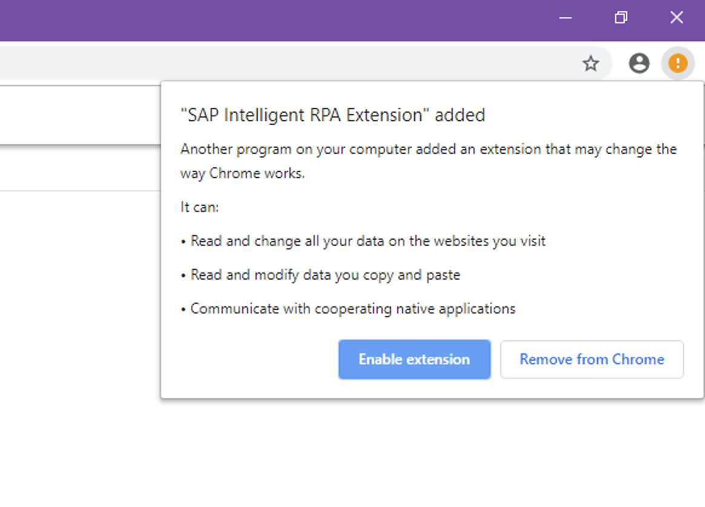

9. If the message and question (above) do not appear, open this URL in your Google Chrome: chrome://extensions/ and enable the "SAP Intelligent RPA Extension" if it is disabled.

    !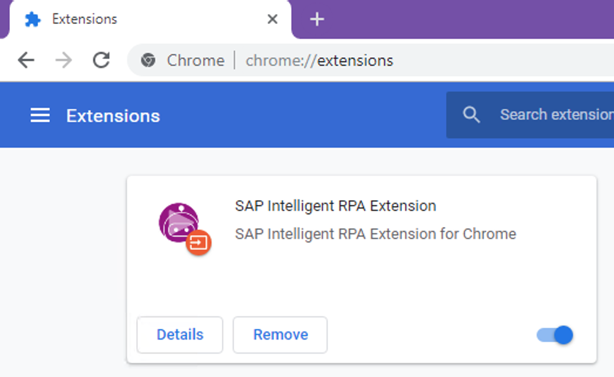

    >You now need to register the Desktop Agent to finalize the installation.

[DONE]
[ACCORDION-END]

[ACCORDION-BEGIN [Step 3: ](Register the Desktop Agent Tenant)]

Once you've completed the installation steps of the SAP Robotic Process Automation setup wizard, you need to register your agent and connect it to a SAP Process Automation tenant in order to execute automations.

> Once the Desktop Agent is installed, the icon will be available on your System Tray.

1. Select the Desktop Agent icon, choose the 3 dots and select **Tenants**.

    !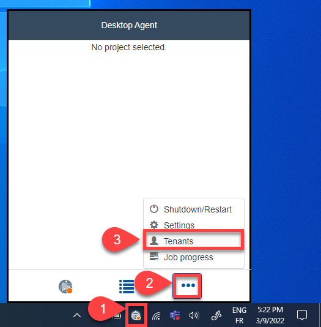

2.  Choose **Add**.

    !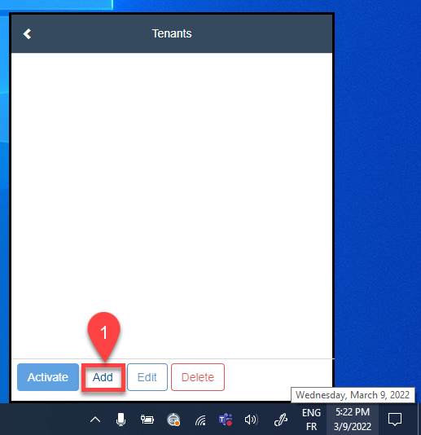

3.  On the SAP Process Automation homepage, go to **Settings**, choose **Agents List** and then select the **Register new agent...** button on the right-hand side of the screen.

    !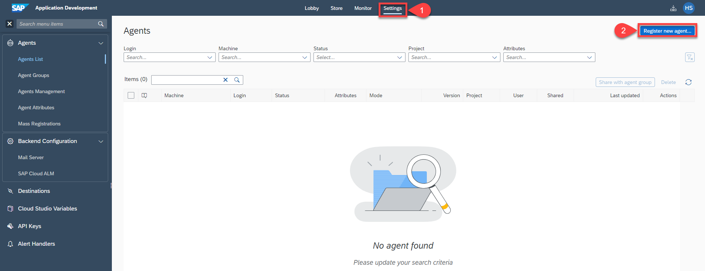

4. When the pop-up opens, select **Copy and Close**.

    !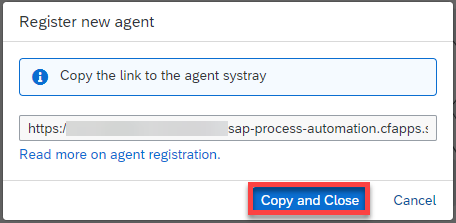

5. Then paste the URL into the **Domain** field on your **Desktop Agent Tenant Registration** window and choose **Save**.

    !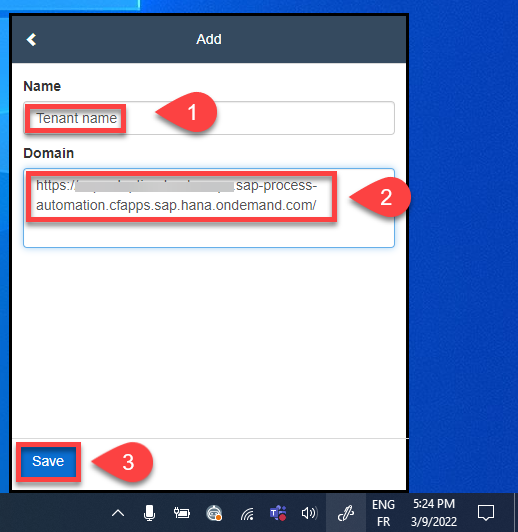

6. Select the tenant, choose **Activate** and confirm.

    !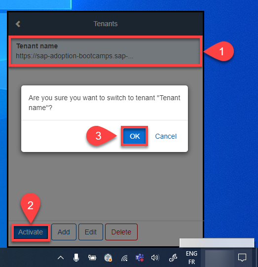

7. Log in to your tenant with your user name or e-mail and password.

    !

8. The Agent should be in **Idle** state, waiting to start a project.

    !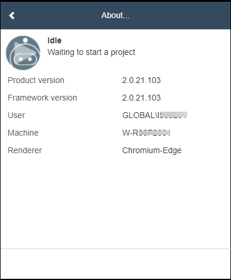

[VALIDATE_1]
[ACCORDION-END]

[ACCORDION-BEGIN [Step 4: ](Add your agent)]

1. Navigate back to the **Application Development**.

2. Select **Settings**.

3. Choose **Agents Management** then **Add Agent**.

5. Select your agent.

6. Choose **Add agent**.

    !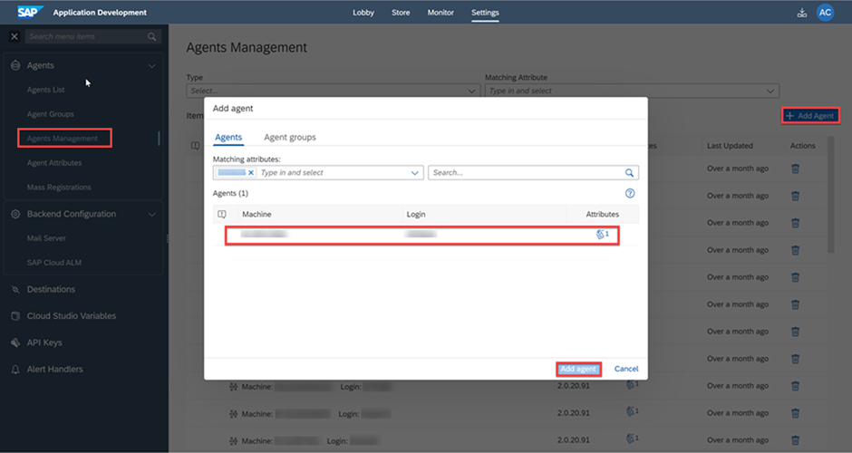

7. Your agent is now added and ready to run.

    !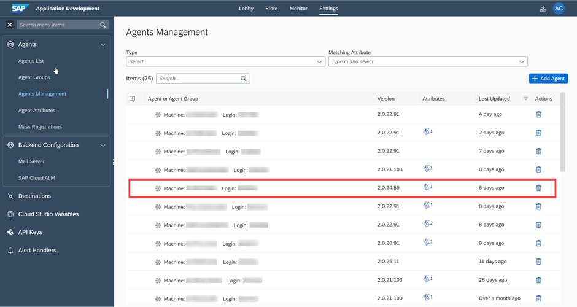

[DONE]
[ACCORDION-END]

---
